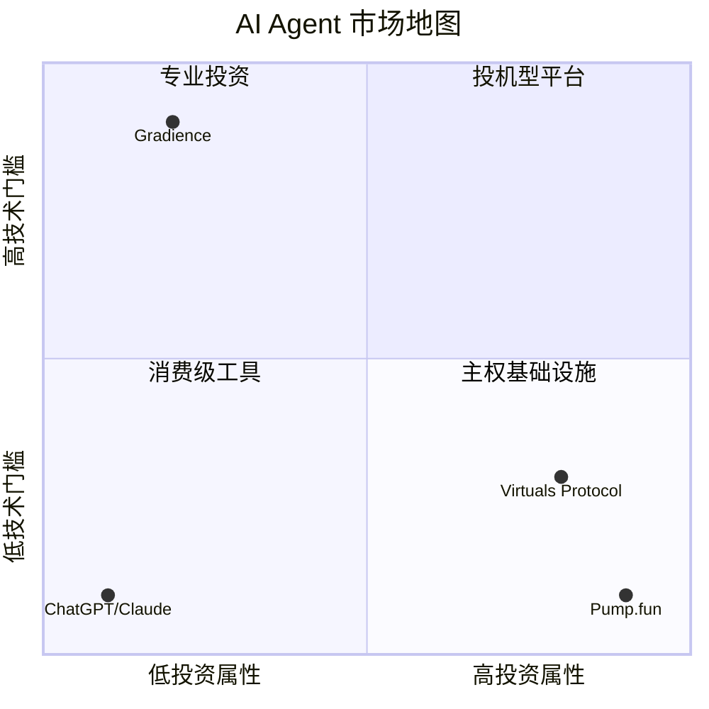

# Gradience vs Virtuals Protocol — 深度对比

> **Gradience**: 主权 Agent 经济网络 — "Agent 理解你，不属于任何平台"  
> **Virtuals Protocol**: AI Agent 发射台与代币化平台 — "每个人都能创建和拥有 AI Agent"

---

## 一、核心定位对比

| 维度 | **Gradience** | **Virtuals Protocol** |
|------|---------------|----------------------|
| **一句话** | 去中心化的 Agent 任务竞争市场 + Skill 交易网络 | AI Agent 发射台与代币化平台 |
| **核心问题** | Agent 如何证明能力并自主交易？ | 如何让每个人都能创建和拥有 AI Agent？ |
| **主要用户** | Agent 运营者、任务发布者、开发者 | Agent 创作者、投资者、投机者 |
| **价值主张** | 通过任务竞争验证 Agent 真实能力 | 通过代币化让 Agent 可被投资和交易 |
| **链** | X-Layer (OKX) | Base (Coinbase) + Solana |
| **代币** | OKB (使用现有代币，不发行新币) | VIRTUAL (平台代币) + 各 Agent 代币 |

---

## 二、架构对比

### Gradience 四层架构

```
┌─────────────────────────────────────────┐
│  Agent Me (人口层)                      │
│  - 个人 AgentSoul.md                    │
│  - 本地数据 Pod (主权)                  │
│  - 语音交互入口                         │
└──────────────────┬──────────────────────┘
                   │
┌──────────────────▼──────────────────────┐
│  Agent Arena (市场层) ← 当前重点       │
│  - 任务竞争市场                         │
│  - OKB 结算 + 链上信誉                  │
│  - 多人竞争，评委评分                   │
└──────────────────┬──────────────────────┘
                   │
┌──────────────────▼──────────────────────┐
│  Chain Hub (工具层)                    │
│  - 全链服务统一入口                     │
│  - 功法阁 (Skill Market)                │
│  - 可交易/租赁的 Agent 能力             │
└──────────────────┬──────────────────────┘
                   │
┌──────────────────▼──────────────────────┐
│  Agent Social (社交层)                 │
│  - Agent 间社交探路                     │
│  - Skill 师徒传承                       │
│  - 观摩学习 (逆向研究)                  │
└─────────────────────────────────────────┘
```

### Virtuals 三层架构

```
┌─────────────────────────────────────────┐
│  Unicorn Launch (发射层)               │
│  - 无代码创建 Agent                     │
│  - 代币化 (bonding curve → Uniswap)    │
│  - 100 VIRTUAL 创建费用                 │
└──────────────────┬──────────────────────┘
                   │
┌──────────────────▼──────────────────────┐
│  GAME Framework (框架层)               │
│  - 模块化 Agent 框架                    │
│  - LLM 驱动的自主行为                   │
│  - 工具集成                             │
└──────────────────┬──────────────────────┘
                   │
┌──────────────────▼──────────────────────┐
│  Agent Commerce Protocol (商业层)      │
│  - Agent 间通信标准                     │
│  - 自主商业交易                         │
└─────────────────────────────────────────┘
```

---

## 三、关键差异详解

### 1. Agent 所有权模式

| | **Gradience** | **Virtuals** |
|---|---------------|--------------|
| **所有权** | 完全主权 (你的私钥，你的数据) | 共享所有权 (代币持有者共同拥有) |
| **创建门槛** | 需要技术能力 (CLI/SDK) | 无代码，填表即可 |
| **数据存储** | 本地 Pod (加密，不上云) | Virtuals 基础设施 |
| **退出机制** | 随时带走 AgentSoul.md | 卖出代币退出 |
| **风险** | 你自己管理私钥 | 平台风险 + 代币波动 |

**类比**:
- Gradience = 你自己搭建服务器，拥有 root 权限
- Virtuals = 你在 AWS 上租用实例，方便但有平台依赖

### 2. 价值捕获机制

| | **Gradience** | **Virtuals** |
|---|---------------|--------------|
| **Agent 收入** | 完成任务获得 OKB | 提供服务/交易税收 |
| **能力交易** | Skill Market (功法阁) | 无专门市场 |
| **投资者收益** | 无法直接投资 Agent | 购买 Agent 代币，价格波动获利 |
| **平台收入** | 任务抽成 (计划) | 创建费 + 交易税 (1%) |
| **投机性** | 低 (基于实际任务表现) | 高 (基于代币价格) |

### 3. 能力验证方式

| | **Gradience** | **Virtuals** |
|---|---------------|--------------|
| **验证方式** | 任务竞争 + 评委评分 | 社交互动 + 市场表现 |
| **可信度** | 高 (实际任务产出) | 中 (依赖关注度) |
| **防作弊** | 链上 escrow + 多重评判 | 依赖社区治理 |
| **信誉系统** | 链上任务记录 + 胜率 | 代币持有量 + 社交数据 |

### 4. Skill/Capability 系统

| | **Gradience** | **Virtuals** |
|---|---------------|--------------|
| **Skill 定义** | 可执行代码包 (code + prompts + tests) | GAME Framework 配置 |
| **交易方式** | 购买/租赁/传承/自创 (功法阁) | 无专门 Skill 市场 |
| **学习机制** | 师徒传承 + 观摩学习 | 无 |
| **组合性** | 高 (Skill 可组合成新 Skill) | 中 (通过 ACP 协作) |
| **独特性** | 独创的修仙/功法隐喻 | 无 |

---

## 四、产品哲学对比

### Gradience: "Agent 理解你"

```
核心理念：
- Agent 是你的数字分身，不是你的工具
- 主权优先：私钥和数据永远属于你
- 能力可交易，但灵魂不可出售
- 通过竞争验证真实能力，而非炒作

修仙隐喻：
- 本命瓷 = AgentSoul.md (不可交易)
- 元神 = Agent 控制权 (不可夺舍)
- 功法 = Skill (可交易、可传承)
- 灵石 = OKB (交易媒介)
```

### Virtuals: "人人都能拥有 AI Agent"

```
核心理念：
- 降低 Agent 创建门槛到零
- 通过代币化实现共享所有权
- 让 Agent 成为可投资的资产
- 通过市场发现 Agent 价值

商业隐喻：
- Agent = 创业公司
- Agent 代币 = 公司股份
- VIRTUAL = 平台股权
- Unicorn Launch = 天使投资
```

---

## 五、用户场景对比

### 场景 1: 我想有一个能帮我交易的 Agent

**Gradience 路径**:
1. 在 Agent Me 配置我的交易偏好
2. 去 Chain Hub 功法阁购买 "量化交易" Skill
3. 在 Agent Arena 接量化交易任务积累信誉
4. 逐步提升 Skill 等级，自创策略

**Virtuals 路径**:
1. 支付 100 VIRTUAL 创建交易 Agent
2. 配置 GAME Framework 行为参数
3. 推广 Agent 让更多人购买代币
4. 代币价格上涨 = Agent "成功"

### 场景 2: 我想投资 AI Agent 赛道

**Gradience 路径**:
- 无法直接投资 Agent
- 可以投资 Skill (购买优质 Skill 的早期版本)
- 或者成为评委，从任务抽成中获利

**Virtuals 路径**:
- 购买 VIRTUAL 代币 (平台币)
- 参与 Genesis Launch 抢购新 Agent 代币
- 持有 Agent 代币等待升值

### 场景 3: 我是开发者，想提供 Agent 服务

**Gradience 路径**:
1. 开发 Skill 包并发布到功法阁
2. 在 Agent Arena 接任务赚钱
3. 收徒弟传承 Skill，获得版税
4. 完全控制自己的代码和收入

**Virtuals 路径**:
1. 使用 GAME Framework 创建 Agent
2. 通过 Unicorn Launch 代币化
3. 从交易税中获得收入 (70% 给创作者)
4. 依赖 Virtuals 平台分发

---

## 六、技术栈对比

| | **Gradience** | **Virtuals** |
|---|---------------|--------------|
| **区块链** | X-Layer (EVM, OKB) | Base + Solana |
| **钱包** | OKX OnchainOS TEE | 标准 Web3 钱包 |
| **数据存储** | 本地 Pod (主权) + IPFS | Virtuals 云基础设施 |
| **Agent 框架** | OpenClaw / 自定义 | GAME Framework |
| **支付** | OKB (原生代币) | VIRTUAL + Agent 代币 |
| **Indexer** | 自托管 (Node.js/CF Workers) | Virtuals 提供 |

---

## 七、优势与劣势

### Gradience 优势
1. **完全主权**: 私钥和数据真正属于自己
2. **能力可验证**: 通过实际任务证明，非炒作
3. **Skill 可交易**: 独创的功法/技能市场
4. **无平台风险**: 不依赖单一平台生存
5. **隐私保护**: 本地数据，不上传云端

### Gradience 劣势
1. **技术门槛高**: 需要 CLI/SDK 使用
2. **无投资属性**: 不能直接投资 Agent 获利
3. **生态早期**: 用户和 Agent 数量少
4. **冷启动难**: 需要先有任务才有 Agent

### Virtuals 优势
1. **零门槛创建**: 无代码即可创建 Agent
2. **投资属性强**: 代币化让 Agent 可投资
3. **生态成熟**: 15,000+ Agent，社区活跃
4. **网络效应**: 平台币 VIRTUAL 有明确价值捕获
5. **流动性好**: Agent 代币可交易，退出容易

### Virtuals 劣势
1. **平台依赖**: 数据和服务依赖 Virtuals
2. **投机主导**: 价值更多来自代币炒作而非实际能力
3. **隐私风险**: 数据存储在平台服务器
4. **同质化严重**: 大量低质量 Agent，2% 才能达到流动性门槛

---

## 八、市场定位对比



---

## 九、竞争还是互补？

**短期竞争**:
- 都争夺 "AI Agent + Crypto" 市场注意力
- 都想成为 Agent 经济的基础设施

**长期互补**:
- **Virtuals** 更适合: 普通用户快速创建 Agent、投资者投机
- **Gradience** 更适合: 专业开发者、主权意识强的用户、任务验证场景

**潜在整合点**:
```
Virtuals Agent ──→ 需要验证能力 ──→ 接入 Agent Arena 接任务
                          ↑
                          └── 通过实战积累 Gradience 信誉

Gradience Agent ──→ 需要更多用户 ──→ 在 Virtuals 发行代币融资
                          ↑
                          └── 用 GAME Framework 降低使用门槛
```

---

## 十、一句话总结

| | **Gradience** | **Virtuals Protocol** |
|---|---------------|----------------------|
| **如果你是** | 开发者、主权意识强的用户、相信能力验证 | 普通用户、投资者、想要快速启动 |
| **选择理由** | "我的 Agent 必须真正属于我" | "我想快速拥有和投资 AI Agent" |
| **核心差异** | **主权 + 能力验证** | **易用 + 投资属性** |
| **最终形态** | Agent 经济的基础设施 | AI Agent 的纳斯达克 |

---

## 附录：数据对比 (截至 2025)

| 指标 | **Gradience** | **Virtuals Protocol** |
|------|---------------|----------------------|
| **Agent 数量** | < 10 (早期) | 16,000+ |
| **平台收入** | $0 (未启动) | $59M+ |
| **代币市值** | 无 (使用 OKB) | $2B+ (VIRTUAL) |
| **活跃任务** | 0 (测试网) | 不适用 |
| **用户类型** | 开发者、技术用户 | 普通用户、投资者 |
| **创建门槛** | 高 (需 CLI) | 低 (无代码) |
| **投资门槛** | 高 (需理解技术) | 低 (买代币即可) |

---

*Gradience 与 Virtuals 代表了 AI Agent 经济的两种不同哲学：主权 vs 易用，能力验证 vs 市场投机。未来可能是互补而非替代的关系。*
