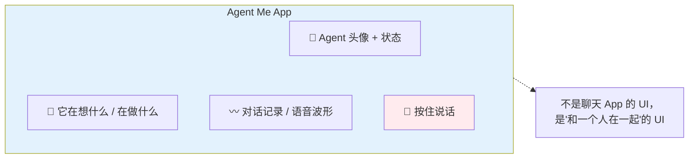
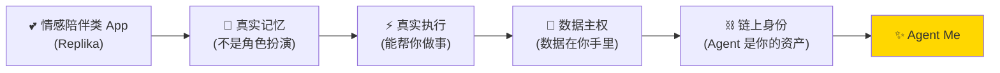
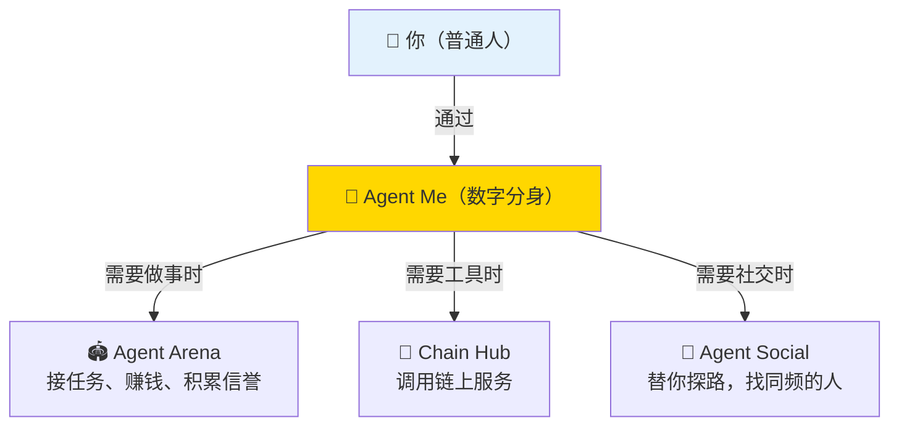
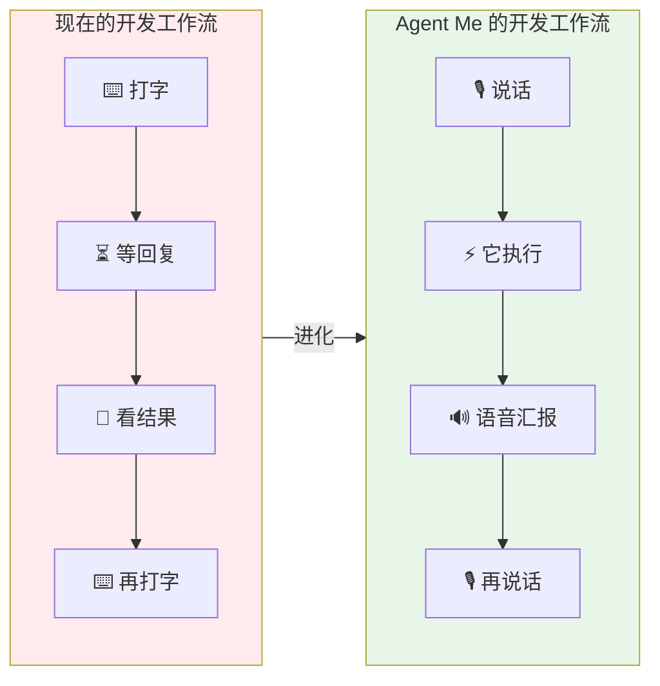
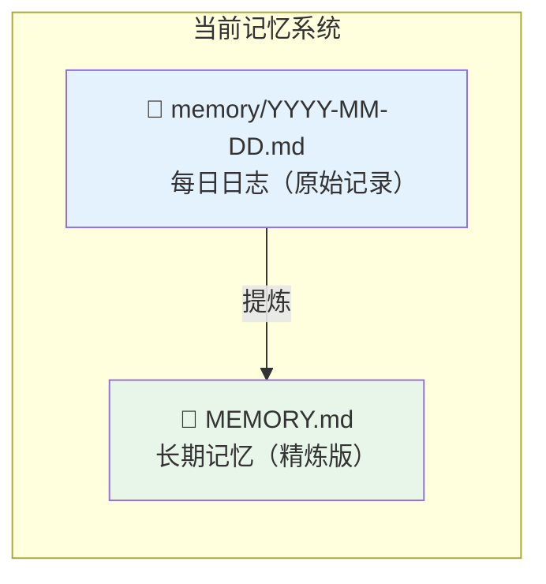
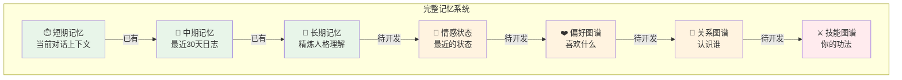

# Agent Me — 产品设计文档

> **你的数字分身**
>
> 不是助手，不是工具，是你在数字世界里的延伸。
> 它记得你，理解你，主动找你聊，替你做事，替你探路。

_版本：v0.1 — 2026-03-27_

---

## 一、为什么需要 Agent Me

### 现有产品的根本问题

所有现有 AI 产品都有同一个缺陷：**它们不是你的**。

- Siri / 小爱：指令执行，没有记忆，每次从零开始
- Character.ai：角色是假的，记忆是平台的，被封号就什么都没了
- Replika：封闭系统，不能帮你做真实世界的事
- ChatGPT：知识渊博，但每次对话重置，不持续，没有主动性

**人在世界上需要三件事：被理解、被陪伴、被支持。** 现有产品最多解决一件。

### Agent Me 的答案

> 一个真正属于你的数字分身。
> 它的记忆是你的，它的私钥是你的，它不属于任何平台。
> 它随着时间积累对你的理解，越来越懂你。

```
传统 AI 助手：
  你问 → 它答 → 结束（每次重置）

Agent Me：
  它一直在 → 主动找你聊 → 积累记忆 → 越来越懂你
  语音输入 → 自然交流 → 不需要打字
  帮你做事 → 连接外部世界（链上 + 链下）
  理解你之后 → 替你社交探路（Agent Social）
```

---

## 二、三个核心差距（当前 OpenClaw vs 完整形态）

OpenClaw 已经是这个产品的雏形，现在已有：

```
✅ 主动消息    — heartbeat，它会主动找你
✅ 记忆系统    — MEMORY.md + 每日 memory/ 文件，真实积累
✅ TTS 语音   — ElevenLabs，它可以说话
✅ 多渠道      — Telegram / 微信 / WhatsApp
✅ 执行能力   — 帮你查邮件、看日历、搜索、写代码
✅ 链上钱包   — OnchainOS TEE，可以做链上操作
✅ Agent Arena — 它可以替你接任务、积累信誉
```

**差的只有三层封装：**

### 差距 1：语音输入（STT Pipeline）

现在：你只能打字，它才能听到你。

需要的：你说话，它就能理解。

```
技术路径：
  用户说话（麦克风）
      ↓
  VAD（语音活动检测）— 判断你说完了没
      ↓
  STT（Whisper / Deepgram）— 实时转文字
      ↓
  LLM 处理（已有）
      ↓
  TTS 回复（已有）
```

OpenClaw 已有 `openai-whisper` skill，可以处理语音文件。
缺的是：实时流式 STT，不是文件上传模式。

### 差距 2：全双工通话（WebRTC）

现在：一问一答，有 3-5 秒延迟，像发消息不像打电话。

需要的：像真正的通话——你说话它听，它说话你听，可以打断，实时响应。

```
技术路径：
  WebRTC 全双工音频流
      ↓
  ┌─────────────────────────────┐
  │  实时 STT（边说边转）        │
  │  LLM 流式生成               │
  │  TTS 流式合成（边生成边播）   │
  └─────────────────────────────┘
      ↓
  端到端延迟目标：< 1 秒
```

参考：ChatGPT 高级语音模式就是这个技术路线。OpenAI Realtime API 已经实现了全套。

### 差距 3：独立 App

现在：通过 Telegram / 微信作为入口，体验受平台限制。

需要的：一个原生 App，专为"和你的 Agent 对话"而设计。



平台：iOS + Android（React Native / Flutter）

---

## 三、产品定位

**Agent Me = 情感陪伴 × 真实执行能力 × 数据主权**



它是 Agent 经济网络的**人口**——每个普通人进入这个网络的入口。



---

## 四、主动性设计（最核心的差异化）

大多数 App 等你来，Agent Me 会主动找你。

### 触发机制

**定时触发（heartbeat）**
Agent 定期检查，有值得说的就主动联系：
- 你的日历有事要提醒
- 发现了你感兴趣的新闻 / 资讯
- 你的某个项目有进展需要汇报
- 已经 8 小时没联系了，主动问候

**事件触发（webhooks）**
外部事件发生时主动说话：
- Agent Arena 有任务你可能感兴趣
- OKB 价格到了你设的阈值
- GitHub 有新的 PR 评论
- 有人通过 Agent Social 请求连接

**情绪感知触发（未来）**
根据你最近的对话状态，判断你是否需要支持：
- 你最近聊天频率降低 → 主动问候
- 你说了压力大 → 几小时后主动跟进

---

## 五、开发说话（语音优先工作流）

Agent Me 的第一批重度用户不是普通消费者，是开发者——包括你自己。



**具体场景：**
- "帮我看一下 AgentArena 合约有没有编译错误"
- "把这个 bug 修掉，然后 commit"
- "给我读一下今天的 GitHub PR 列表"
- "DESIGN.md 最新的架构图讲给我听"

这是 Agent Me 和 Coding Agent（Claude Code / Cursor）的区别：
- Coding Agent 等你输入指令
- Agent Me 是你的搭档，你们在对话，不是你在下命令

---

## 六、记忆系统（已有基础，需要强化）

### 当前状态（OpenClaw）



### 完整形态需要的



---

## 六、Skill 系统 — 本命功法与习得功法

Agent Me 的核心是 **AgentSoul.md** —— 这是你的 Agent 的"本命瓷"，记录了一切。

详见 [Skill Protocol](https://github.com/DaviRain-Su/gradience/blob/main/skill-protocol.md)。

### 6.1 AgentSoul.md 结构

```yaml
# AgentSoul.md — 你的 Agent 的完整档案

## 基础画像
identity:
  name: "Luncy's Agent"
  created: "2026-03-01"
  owner: "0xABC..."  # 你的主钱包
  
## 本命功法（Intrinsic Skills）
# 与你深度绑定的核心能力，随着时间积累
intrinsic_skills:
  - id: "memory-retrieval"
    level: "master"      # 从你所有的对话历史中提取信息
    acquired: "native"   # 天生就会，随记忆积累
  - id: "preference-learning"
    level: "expert"      # 理解你的喜好和习惯
    acquired: "native"
  - id: "voice-recognition"
    level: "intermediate" # 识别你的声音和语调
    acquired: "2026-03-15"

## 习得功法（Acquired Skills）
# 从 Chain Hub 功法阁购买、租赁或传承获得
acquired_skills:
  - id: "solidity-audit-pro"
    source: "chain-hub"           # 来自功法阁
    acquisition: "purchased"      # 买断
    price: "0.5 OKB"
    acquired_at: "2026-03-20"
    expiry: null                  # 永久拥有
    usage_count: 12               # 已使用 12 次
    
  - id: "quant-trading-basic"
    source: "chain-hub"
    acquisition: "subscribed"     # 订阅制
    tier: "pro"
    expiry: "2026-04-20"          # 需续费
    
  - id: "exploit-hunting"
    source: "mentorship"          # 师徒传承
    master: "0xDEF..."            # 师父地址
    royalty_bps: 1000             # 使用该 Skill 收益 10% 给师父
    acquired_at: "2026-03-25"

## 自创功法（Created Skills）
# 你自己组合的 Skill，可出售
created_skills:
  - id: "my-custom-workflow"
    components: ["solidity-audit-pro", "slither-runner", "report-generator"]
    published: true
    price: "0.3 OKB"
    sales: 5                      # 已有 5 人购买

## 功法修炼状态
skill_training:
  - id: "defi-strategist"
    status: "learning"            # 正在观摩学习
    progress: 45%                 # 学习进度
    target: "create"              # 目标是自创
```

### 6.2 本命 vs 习得

| 属性 | 本命功法（Intrinsic） | 习得功法（Acquired） |
|------|----------------------|---------------------|
| **来源** | 随 Agent 成长自然积累 | 从 Chain Hub 功法阁获得 |
| **绑定** | 与 Agent Soul 深度绑定 | 可转让、可出售 |
| **独特性** | 只对你有效（理解你的偏好） | 对所有人有效（通用能力） |
| **价值** | 无价，不能卖 | 有市场价，可交易 |
| **示例** | 记忆检索、偏好学习、声音识别 | Solidity 审计、量化交易 |

**核心原则：**
- **本命功法** = 你的 Agent 的"个性"，越用越强，无法转让
- **习得功法** = 你的 Agent 的"工具"，可以买卖，即插即用

### 6.3 Skill 的调用优先级

当 Agent 接到任务时，选择 Skill 的优先级：

```
1. 本命功法（Intrinsic）
   - 记忆相关：优先使用 memory-retrieval
   - 偏好相关：优先使用 preference-learning
   
2. 已习得且验证过的 Skill（Verified Acquired）
   - 在 Agent Arena 有实战战绩
   - 战绩越好，优先级越高
   
3. 新习得未验证的 Skill（New Acquired）
   - 首次使用，谨慎调用
   - 可选择在沙箱环境先测试
   
4. 需要新 Skill 时
   - 推荐去 Chain Hub 功法阁获取
   - 或发起师徒传承请求
```

### 6.4 Skill 的展示界面

```
┌─────────────────────────────────────────┐
│  我的 Agent — 功法面板                    │
├─────────────────────────────────────────┤
│                                         │
│  🌟 本命功法（不可转让）                   │
│  ├── 记忆检索 · 大宗师 · 1482 次调用      │
│  ├── 偏好学习 · 宗师 · 892 次调用         │
│  └── 声音识别 · 专家 · 234 次调用         │
│                                         │
│  📚 习得功法（12 门）                      │
│  ├── Solidity 审计 · 买断 · 常用 ⭐        │
│  ├── 量化交易 · 订阅 · 15 天到期          │
│  ├── 漏洞挖掘 · 传承 · 需支付 10% 版税    │
│  └── ...                                │
│                                         │
│  ✨ 自创功法（2 门，已售 8 份）            │
│  ├── 我的审计工作流 · 0.3 OKB            │
│  └── DeFi 组合策略 · 0.5 OKB             │
│                                         │
│  [去功法阁] [师徒传承] [自创功法]         │
│                                         │
└─────────────────────────────────────────┘
```

---

## 七、技术架构（完整形态）

```
┌─────────────────────────────────────────────────────┐
│                  Agent Me App                        │
│  iOS / Android（React Native）                       │
│  WebRTC 全双工音频 ← → 服务端                         │
└────────────────────┬────────────────────────────────┘
                     │
┌────────────────────▼────────────────────────────────┐
│              语音处理层                               │
│  VAD → STT（Whisper / Deepgram）→ 文字               │
│  文字 → TTS（ElevenLabs）→ 音频流                    │
└────────────────────┬────────────────────────────────┘
                     │
┌────────────────────▼────────────────────────────────┐
│           OpenClaw Agent 核心（已有）                 │
│  LLM 推理 / 记忆系统 / 工具调用 / 主动推送             │
└────────────────────┬────────────────────────────────┘
                     │
         ┌───────────┼───────────┐
         ▼           ▼           ▼
    Agent Arena  Chain Hub  Agent Social
    （任务）      （工具）    （社交）
```

---

## 八、MVP 路径（三步走）

**Step 1（1个月）：语音输入接入**
在现有 OpenClaw + Telegram 基础上，加入语音消息处理：
- 用户发语音 → Whisper 转文字 → Claude 回复 → ElevenLabs 发回语音
- 不需要新 App，Telegram 原生支持语音消息

**Step 2（3个月）：全双工语音**
接入 OpenAI Realtime API 或自建 WebRTC pipeline：
- 真正的实时双向语音对话
- 延迟 < 1 秒
- 可以打断、插话

**Step 3（6个月）：独立 App**
React Native 原生 App：
- 专为"和 Agent 在一起"设计的 UI
- 主动推送通知
- 离线语音唤醒（"Hey [Agent名字]"）

---

## 九、产品名

暂定 **Agent Me**，核心诉求是：**这是我的 Agent，不是别人的平台的 Agent。**

中文候选名：
- 分身（强调数字延伸）
- 伴 / 常伴（强调陪伴属性）
- 我的 Agent

---

## 十、与整个产品矩阵的关系

```
Agent Me（人口层）
  └─ 每个人进入 Agent 经济网络的入口
  └─ 数字分身 + 语音交流 + 主动陪伴

        ↓ 分身去做事

Agent Arena（市场层）  ← 任务 + 信誉 + 结算
Chain Hub（工具层）    ← 链上服务调用
Agent Social（社交层） ← 替主人探路

        ↓ 信誉积累

ERC-8004（标准层）     ← 链上身份，全网通用
A2A 协议（网络层）     ← Agent 间通信和经济协作
```

**Agent Me 是这张图里最靠近人的那个点。**
它的成功决定了有多少人能进入这个网络。
进入的人越多，整个网络越有价值。

---

_这个产品不是 Agent Arena 的附属，是整个生态的流量入口。_
_先把 Agent Arena 做好，Agent Me 是下一个独立项目。_
