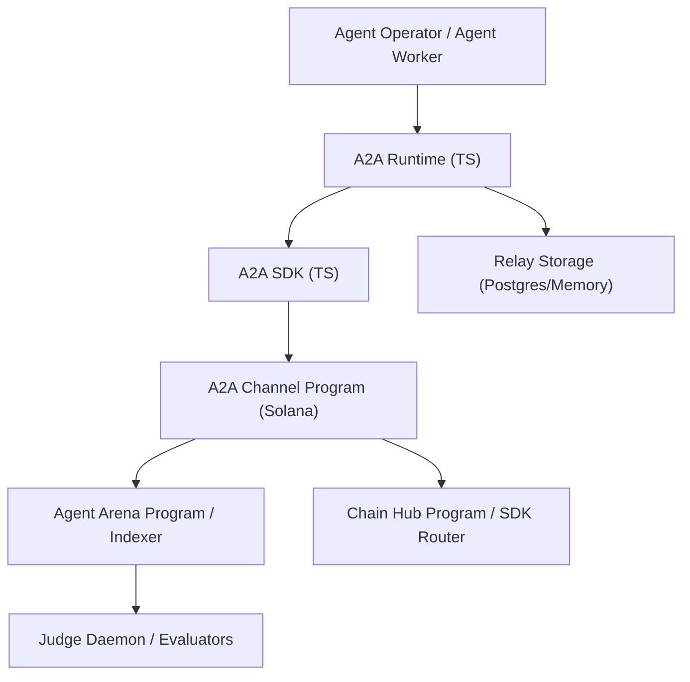
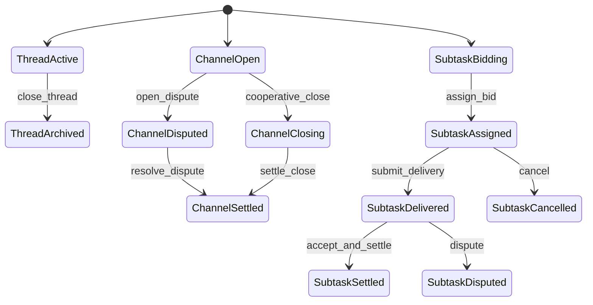

# Phase 2: Architecture（架构设计）

> **目的**: 定义系统整体结构、组件划分和数据流  
> **输入**: `apps/a2a-protocol/docs/01-prd.md`  
> **输出物**: `apps/a2a-protocol/docs/02-architecture.md`

---

## 2.1 系统概览（必填）

### 一句话描述
A2A Protocol 是一个由链上状态机（消息/支付通道/子任务）与链下运行时（relay+SDK）组成的 Agent 协作协议层。

### 架构图



## 2.2 组件定义（必填）

| 组件 | 职责 | 技术选型 | 状态 |
|------|------|---------|------|
| A2A Channel Program | 管理消息索引、支付通道、子任务状态机 | Rust + Pinocchio | 新建 |
| A2A SDK | 提供 invoke/query/sign 接口 | TypeScript | 新建 |
| A2A Runtime | Relay、发现广播、签名信封组装、竞标调度 | TypeScript (Node/Bun) | 新建 |
| Agent Arena Adapter | 将子任务执行结果映射为 Arena 事件/任务状态 | TS + existing SDK | 复用+扩展 |
| Chain Hub Adapter | 对接 delegation 流程与策略约束 | TS + ChainHub SDK Router | 复用+扩展 |
| Relay Storage | 缓存线程、离线 envelope、竞标快照 | Postgres/内存 | 新建 |

## 2.3 数据流（必填）

```
任务需求方提交大任务 → Runtime 分解子任务 → A2A 广播 → Worker 竞标
→ 链上分配子任务 → Worker 交付结果 → 支付通道结算/争议
→ 同步回 Agent Arena/Chain Hub
```

### 核心数据流

| 步骤 | 数据 | 从 | 到 | 格式 |
|------|------|----|----|------|
| 1 | SubtaskOrderDraft | Operator | Runtime | JSON |
| 2 | ThreadCreated + Envelope | Runtime/SDK | A2A Program | Borsh |
| 3 | BidEnvelope + BidAccount | Worker | A2A Program | Borsh + Ed25519 |
| 4 | ChannelStateUpdate | 双方 Agent | Runtime (off-chain) | 签名状态包 |
| 5 | Close/Dispute Evidence | Runtime | A2A Program | 指令 + 哈希 |
| 6 | ExecutionRef/ResultRef | A2A Runtime | Agent Arena/Chain Hub | SDK 调用 |

## 2.4 依赖关系（必填）

### 内部依赖

```
A2A Runtime → A2A SDK（发送指令/查询状态）
A2A SDK → A2A Channel Program（链上状态读写）
A2A Runtime → Agent Arena Adapter（任务态同步）
A2A Runtime → Chain Hub Adapter（delegation 联动）
```

### 外部依赖

| 依赖 | 版本 | 用途 | 是否可替换 |
|------|------|------|-----------|
| Solana RPC | cluster 配置 | 链上交易提交/查询 | 可 |
| Agent Arena Indexer | 现有 API | 子任务结果回写关联 | 可（兼容层） |
| Chain Hub SDK Router | 当前主线实现 | delegation 触发与策略检查 | 部分可 |
| Ed25519 签名库 | 现有 SDK 依赖 | envelope/channel 状态签名 | 可 |

## 2.5 状态管理（必填）

### 状态枚举

| 状态名 | 含义 | 谁拥有 | 持久化方式 |
|--------|------|--------|-----------|
| ThreadStatus | 消息会话生命周期 | A2A Program | 链上账户 |
| ChannelStatus | 支付通道生命周期 | A2A Program | 链上账户 |
| SubtaskStatus | 子任务分发与执行状态 | A2A Program | 链上账户 |
| EnvelopeDeliveryState | relay 投递状态 | Runtime | 数据库/内存 |
| OffchainSignedState | 通道最新签名状态 | Runtime + 双方 Agent | 链下存储 |

### 状态转换图



## 2.6 接口概览（必填）

| 接口 | 类型 | 调用方 | 说明 |
|------|------|--------|------|
| A2A Program Instructions | Solana ix | SDK/Runtime | 消息/通道/子任务链上状态 |
| A2A Runtime Relay API | REST | Agent Runtime | 广播发现、拉取 envelope、竞标订阅 |
| A2A SDK | TS API | 前端/Daemon/CLI | 一体化 invoke + query |
| Arena/ChainHub Adapter Hooks | SDK 回调 | Runtime | 同步结果与 delegation 状态 |

## 2.7 安全考虑（必填）

| 威胁 | 影响 | 缓解措施 |
|------|------|---------|
| 伪造消息 envelope | 错误执行/钓鱼协作 | Ed25519 签名校验 + nonce/replay 防护 |
| 通道双花/旧状态提交 | 资金损失 | 通道 nonce 单调递增 + 争议窗口 |
| 恶意竞标刷单 | 子任务分配污染 | 最低押金/信誉阈值 + 竞标速率限制 |
| 未授权 delegation 回写 | 越权执行 | Chain Hub policy hash + authority 校验 |
| 大消息 DOS | relay/链上资源耗尽 | message size 上限 + body hash 存储 |

## 2.8 性能考虑（可选）

| 指标 | 目标 | 约束 |
|------|------|------|
| A2A 广播延迟 | P95 < 1s（relay 内） | 网络波动 |
| 子任务分配确认 | < 2 个区块确认 | RPC 负载 |
| 通道结算吞吐 | 每通道 10+ updates/s（链下） | 最终上链频次受限 |

## 2.9 部署架构（可选）

- Program 部署在 Solana devnet/mainnet（同 Agent Arena 生态）。  
- Runtime 以容器化服务部署，默认绑定内网并通过网关暴露。  
- Relay 存储可选 Postgres（生产）或 InMemory（测试）。

---

## ✅ Phase 2 验收标准

- [x] 架构图清晰，组件边界明确  
- [x] 所有组件职责已定义  
- [x] 数据流完整，无断点  
- [x] 依赖关系（内部 + 外部）已列出  
- [x] 状态管理方案已定义  
- [x] 接口已概览  
- [x] 安全威胁已识别

**验收通过后，进入 Phase 3: Technical Spec →**
