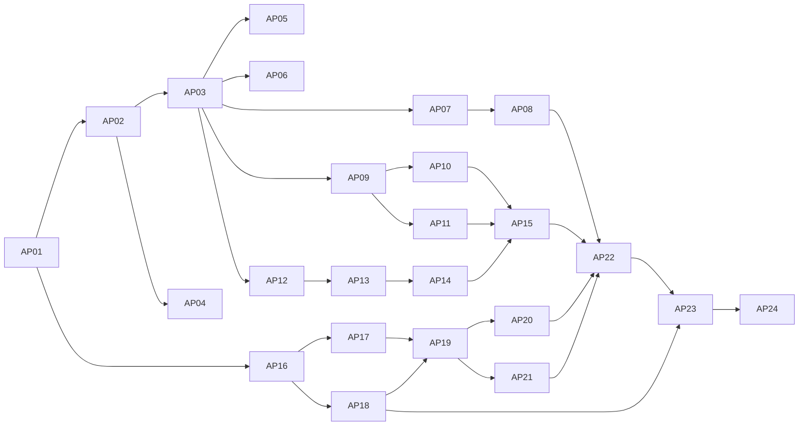

# Phase 4: Task Breakdown — A2A Protocol v0.1

> **输入**: `apps/a2a-protocol/docs/03-technical-spec.md`

---

## 4.1 拆解原则

1. 每个任务 ≤ 4 小时  
2. 每个任务可独立验收（Done 定义可测试）  
3. 先链上基础（状态+指令）再链下运行时，再跨模块联调  
4. 安全任务与功能任务并行跟进，不后置

## 4.2 任务列表

| # | 任务名称 | 描述 | 依赖 | 预估时间 | 优先级 | Done 定义 |
|---|---------|------|------|---------|--------|----------|
| AP01 | Program 工程骨架 | 新建 `apps/a2a-protocol/program`（Pinocchio/no_std）与 workspace 配置 | 无 | 2h | P0 | `cargo test` 可运行 |
| AP02 | 常量/错误码/枚举 | 实现 seeds、discriminator、error(8100+) 与状态枚举 | AP01 | 2h | P0 | 常量和错误码与 spec 对齐 |
| AP03 | 链上状态结构体 | 实现 NetworkConfig/AgentProfile/Thread/Envelope/Channel/Subtask/Bid + 长度常量 | AP02 | 4h | P0 | 长度单测全通过 |
| AP04 | 工具层 | 实现 read/write_borsh（含 version 校验）、PDA create、owner/signer/writable 校验 | AP02 | 3h | P0 | 工具单测覆盖版本与权限校验 |
| AP05 | 指令：initialize_network_config | 配置账户初始化与参数校验 | AP03, AP04 | 3h | P0 | 初始化成功 + 重复初始化失败 |
| AP06 | 指令：upsert_agent_profile | Agent profile 创建/更新与 heartbeat 更新 | AP03, AP04 | 3h | P0 | 非授权更新失败 |
| AP07 | 指令：create_thread/archive_thread | 线程生命周期创建与归档 | AP03, AP04 | 3h | P0 | archived 后不能继续 post_message |
| AP08 | 指令：post_message | Envelope 上链索引、nonce 防重放、message size/hash 校验 | AP03, AP04, AP07 | 4h | P0 | 重放消息被拒绝 |
| AP09 | 指令：open_channel | 通道开设、押金锁定、初始状态写入 | AP03, AP04 | 4h | P0 | 押金不足/参数非法失败 |
| AP10 | 指令：cooperative_close_channel | 双签名关闭流程（nonce/spent 校验） | AP09 | 4h | P0 | 正常结算分账正确 |
| AP11 | 指令：open_channel_dispute/resolve | 争议开启、窗口控制、仲裁结算 | AP09 | 4h | P0 | 非仲裁方 resolve 失败 |
| AP12 | 指令：create_subtask_order | 子任务创建与 deadline/budget 校验 | AP03, AP04 | 3h | P0 | 状态进入 bidding |
| AP13 | 指令：submit_subtask_bid | 竞标写入、押金阈值、窗口约束 | AP12 | 3h | P0 | 截止后竞标失败 |
| AP14 | 指令：assign_bid/submit_delivery | 分配中标与交付哈希回写 | AP12, AP13 | 4h | P0 | 非 selected_agent 交付失败 |
| AP15 | 指令：settle_subtask/cancel | 子任务结算与取消路径，联动通道结算字段 | AP10, AP11, AP14 | 4h | P0 | settled/cancelled 状态闭环 |
| AP16 | SDK 工程骨架 | 新建 `apps/a2a-protocol/sdk`，定义类型、错误映射、RPC 客户端 | AP01 | 2h | P1 | SDK 可编译并发布基础类型 |
| AP17 | SDK 调用方法 | 实现 thread/channel/subtask 指令组装与 query API | AP05-AP15, AP16 | 4h | P0 | 覆盖全部 on-chain 指令 |
| AP18 | Runtime Relay 服务 | 新建 runtime（REST: discovery/publish/pull）和存储模型 | AP16 | 4h | P1 | relay API 集成测试通过 |
| AP19 | Runtime 协作编排 | 子任务广播→竞标→分配→交付→结算编排器 | AP17, AP18 | 4h | P0 | E2E 流程自动推进 |
| AP20 | Agent Arena 适配器 | 子任务结果回写 Agent Arena task/submission 语义 | AP19 | 3h | P1 | Arena 状态映射正确 |
| AP21 | Chain Hub 适配器 | delegation 触发与 policy_hash 校验联动 | AP19 | 3h | P1 | policy mismatch 被拒绝 |
| AP22 | 安全加固 | replay、防越权、异常输入、payload 限制等补强 | AP08-AP21 | 4h | P0 | 安全测试全绿 |
| AP23 | 性能与观测 | relay 指标、分页拉取、限流与重试策略 | AP18-AP22 | 3h | P1 | 压测达标且无丢单 |
| AP24 | 回归与发布准备 | 全量测试、lint/typecheck/build、发布 checklist | AP01-AP23 | 3h | P0 | 所有验证命令通过 |

## 4.3 任务依赖图

## 4.4 里程碑划分

### Milestone 1: Program Core（A2A-0/1/2 链上状态机）
**预计完成**: Day 1-2  
**交付物**: AP01-AP15（Program 可完成消息、通道、子任务生命周期）

### Milestone 2: SDK + Runtime 协议层
**预计完成**: Day 3  
**交付物**: AP16-AP19（可通过 SDK/Relay 驱动 A2A 协作）

### Milestone 3: 生态集成与安全收敛
**预计完成**: Day 4  
**交付物**: AP20-AP24（Arena/ChainHub 联动 + 安全与性能达标）

## 4.5 风险识别

| 风险 | 概率 | 影响 | 缓解措施 |
|------|------|------|---------|
| Program 状态机复杂导致分支遗漏 | 中 | 高 | 先按状态转换表写测试，再实现 |
| 通道签名验证实现错误 | 中 | 高 | 增加双签/nonce/replay 专项测试与交叉校验 |
| Runtime 与链上状态不一致 | 中 | 高 | 以链上状态为准，relay 仅缓存，加入幂等恢复 |
| Arena/ChainHub 接口变更 | 中 | 中 | 通过 adapter 层封装协议版本 |
| 高并发竞标导致丢单 | 中 | 中 | 分页+游标+高水位拉取与重试机制 |

---

## ✅ Phase 4 验收标准

- [x] 每个任务 ≤ 4 小时  
- [x] 每个任务有 Done 定义  
- [x] 依赖关系已标明，无循环依赖  
- [x] 划分为 3 个里程碑  
- [x] 风险已识别并有缓解措施

**验收通过后，进入 Phase 5: Test Spec →**
