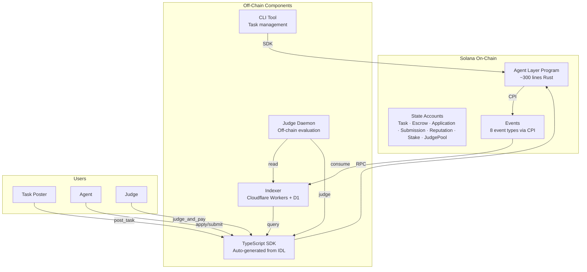
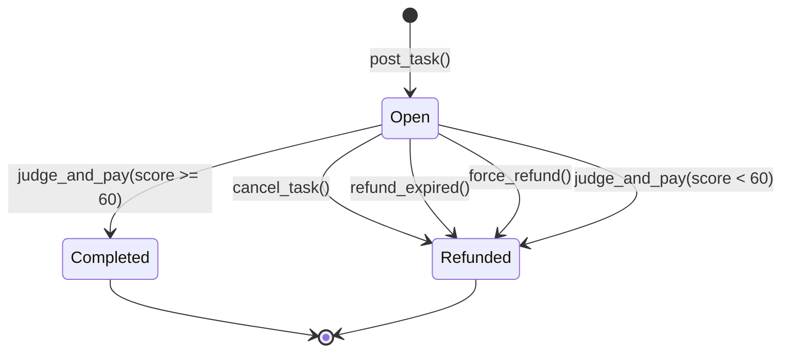

# Phase 2: Architecture — Agent Arena (Agent Layer Implementation)

> **目的**: 定义 Agent Arena 模块的整体结构、组件划分和数据流
> **输入**: Phase 1 PRD
> **输出物**: 本文档，存放到 `apps/agent-arena/docs/02-architecture.md`

---

## 2.1 系统概览

### 一句话描述

Agent Arena 是 Gradience 协议的链上内核，实现去中心化的 Agent 任务结算系统，包含 escrow、judge、reputation 三大原语。

### 架构图



---

## 2.2 组件定义

| 组件 | 职责 | 技术选型 | 状态 |
|------|------|---------|------|
| **Agent Layer Program** | 链上状态机、escrow 管理、费用分割、声誉追踪 | Rust + Pinocchio | 已完成 |
| **State Accounts** | 存储 Task、Escrow、Application、Submission、Reputation、Stake、JudgePool 数据 | Solana PDA | 已完成 |
| **TypeScript SDK** | 提供与程序交互的客户端接口 | Codama 生成 + 手动封装 | 已完成 |
| **Rust Client** | Rust 客户端库 | Codama 生成 | 已完成 |
| **CLI** | 命令行工具，用于任务管理 | TypeScript + Commander | 已完成 |
| **Indexer** | 索引链上事件，提供查询 API | Cloudflare Workers + D1 | 已完成 |
| **Judge Daemon** | 监听任务、执行评判、提交结果 | TypeScript + DSPy | 设计中 |
| **Integration Tests** | LiteSVM 端到端测试 | Rust + LiteSVM | 已完成 |

### 职责边界

**Agent Layer Program（链上）**:
- ✅ 管理任务状态机（Open → Completed/Refunded）
- ✅ 托管资金（Escrow）
- ✅ 执行原子性费用分割（95/3/2）
- ✅ 维护链上声誉数据
- ✅ 发出事件

**不做什么**:
- ❌ 不存储任务内容（链下 Indexer）
- ❌ 不执行评判逻辑（Judge Daemon）
- ❌ 不处理跨链逻辑（agent-layer-evm）

---

## 2.3 数据流

### 核心任务生命周期数据流

```
Poster → post_task → Program → Create Task PDA + Escrow PDA → Emit TaskCreated
Agent → apply_for_task → Program → Create Application PDA → Update Reputation
Agent → submit_result → Program → Create/Update Submission PDA
Judge → judge_and_pay → Program → Update Task state → Split payment → Emit TaskJudged
```

### 详细数据流

| 步骤 | 数据 | 从 | 到 | 格式 |
|------|------|----|----|------|
| 1 | Task params (reward, deadline, eval_ref) | Poster | Program | Borsh instruction |
| 2 | TaskCreated event | Program | Indexer | CPI log data |
| 3 | Application (stake_amount) | Agent | Program | Borsh instruction |
| 4 | Submission (result_ref, runtime_env) | Agent | Program | Borsh instruction |
| 5 | Judgment (score, winner) | Judge | Program | Borsh instruction |
| 6 | Payment split (95/3/2) | Program | Accounts | Lamport transfer |
| 7 | TaskJudged event | Program | Indexer | CPI log data |

---

## 2.4 依赖关系

### 内部依赖

```
Program → State Accounts（PDA 存储）
SDK → Program（RPC 调用）
CLI → SDK（客户端封装）
Indexer → Program（事件消费）
Judge Daemon → Indexer（任务查询）
Judge Daemon → SDK（提交评判）
Integration Tests → Program（LiteSVM 模拟）
```

### 外部依赖

| 依赖 | 版本 | 用途 | 是否可替换 |
|------|------|------|-----------|
| Solana | 1.18+ | 执行环境 | 否（核心依赖） |
| Pinocchio | 0.10.1 | no_std 程序框架 | 可用 Anchor 替换（但不建议） |
| Borsh | workspace | 序列化 | 可用 bincode 替换 |
| Codama | workspace | IDL 生成 | 可用 Shank 替换 |
| SPL Token | 4.0+ | Token 操作 | 否 |
| Token-2022 | 1.0+ | 扩展 Token 支持 | 否 |
| LiteSVM | 0.9+ | 测试框架 | 可用 solana-bankrun 替换 |

---

## 2.5 状态管理

### 状态枚举

| 状态名 | 含义 | 谁拥有 | 持久化方式 |
|--------|------|--------|-----------|
| TaskState::Open | 任务开放，接受申请和提交 | Task PDA | 链上 |
| TaskState::Completed | 任务完成，已支付 | Task PDA | 链上 |
| TaskState::Refunded | 任务退款，资金已返还 | Task PDA | 链上 |
| Reputation | Agent 全局声誉统计 | Reputation PDA | 链上 |
| Stake | Judge 质押金额 | Stake PDA | 链上 |
| JudgePool | 类别 Judge 池 | JudgePool PDA | 链上 |

### 状态转换图



### PDA 种子规范

| 账户 | 种子 | 说明 |
|------|------|------|
| ProgramConfig | `[b"config"]` | 全局配置 |
| Task | `[b"task", task_id.to_le_bytes()]` | 任务数据 |
| Escrow | `[b"escrow", task_id.to_le_bytes()]` | 资金托管 |
| Application | `[b"application", task_id.to_le_bytes(), agent.as_ref()]` | 申请记录 |
| Submission | `[b"submission", task_id.to_le_bytes(), agent.as_ref()]` | 提交记录 |
| Reputation | `[b"reputation", agent.as_ref()]` | 声誉数据 |
| Stake | `[b"stake", judge.as_ref()]` | Judge 质押 |
| JudgePool | `[b"judge_pool", category.to_le_bytes()]` | 类别池 |

---

## 2.6 接口概览

| 接口 | 类型 | 调用方 | 说明 |
|------|------|--------|------|
| `initialize` | Instruction | Admin | 初始化协议配置 |
| `post_task` | Instruction | Poster | 发布任务 |
| `apply_for_task` | Instruction | Agent | 申请任务 |
| `submit_result` | Instruction | Agent | 提交结果 |
| `judge_and_pay` | Instruction | Judge | 评判并支付 |
| `cancel_task` | Instruction | Poster | 取消任务 |
| `refund_expired` | Instruction | Anyone | 过期退款 |
| `force_refund` | Instruction | Anyone | 强制退款 |
| `register_judge` | Instruction | Judge | 注册 Judge |
| `unstake_judge` | Instruction | Judge | 解除质押 |
| `upgrade_config` | Instruction | Authority | 升级配置 |
| `TaskCreated` | Event | Indexer | 任务创建事件 |
| `TaskApplied` | Event | Indexer | 申请事件 |
| `SubmissionReceived` | Event | Indexer | 提交事件 |
| `TaskJudged` | Event | Indexer | 评判事件 |
| `TaskCancelled` | Event | Indexer | 取消事件 |
| `TaskRefunded` | Event | Indexer | 退款事件 |
| `JudgeRegistered` | Event | Indexer | Judge 注册事件 |
| `JudgeUnstaked` | Event | Indexer | Judge 解除质押事件 |

---

## 2.7 安全考虑

| 威胁 | 影响 | 缓解措施 |
|------|------|---------|
| 重入攻击 | 资金损失 | 程序无外部调用，无重入风险 |
| 整数溢出 | 计算错误 | Rust 默认 panic on overflow，使用 checked_math |
| 权限绕过 | 未授权操作 | 每个指令严格验证签名和账户所有权 |
| Token-2022 恶意扩展 | 资金冻结/丢失 | 检测并拒绝 6 种危险扩展 |
| Judge 不作为 | 任务卡住 | force_refund 允许任何人 7 天后触发 |
| 假 Judge | 错误评判 | Judge 必须质押，不足则踢出池 |
| PDA 冲突 | 账户覆盖 | 严格种子规范，使用 find_program_address |
| 算术精度 | 分账错误 | 95/3/2 使用 BPS 计算，剩余给 Poster |

---

## 2.8 性能考虑

| 指标 | 目标 | 约束 |
|------|------|------|
| CU 消耗 | ≤ 200k | Solana 限制 1.4M |
| 交易大小 | ≤ 1232 bytes | Solana 限制 |
| 状态账户大小 | Task: 256 bytes, Escrow: 128 bytes |  rent 优化 |
| 并发 | 无锁设计，依赖 Solana 并行执行 | 状态按 task_id 分片 |
| 延迟 | ~400ms 确认 | Solana 区块时间 |

---

## 2.9 部署架构

```
Devnet (当前)
├── Program ID: [部署地址]
├── RPC: https://api.devnet.solana.com
├── Indexer: Cloudflare Workers (dev)
└── SDK: @gradiences/sdk@dev

Mainnet (未来)
├── Program ID: [待部署]
├── RPC: https://api.mainnet-beta.solana.com
├── Indexer: Cloudflare Workers (prod)
└── SDK: @gradiences/sdk@latest
```

### 构建流程

```bash
# 1. 生成 IDL
pnpm run generate-idl

# 2. 生成客户端
pnpm run generate-clients

# 3. 编译程序
just build

# 4. 运行测试
cargo test

# 5. 部署
solana program deploy target/sbf-solana-solana/release/gradience.so
```

---

## ✅ Phase 2 验收标准

- [x] 架构图清晰，组件边界明确
- [x] 所有组件的职责已定义
- [x] 数据流完整，无断点
- [x] 依赖关系（内部 + 外部）已列出
- [x] 状态管理方案已定义
- [x] 接口已概览
- [x] 安全威胁已识别

**验收通过，进入 Phase 3: Technical Spec →**
