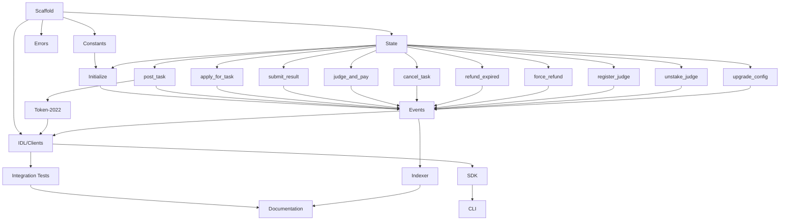

# Phase 4: Task Breakdown — Agent Arena (Agent Layer Implementation)

> **目的**: 将技术规格拆解为可执行、可分配、可验收的独立任务
> **输入**: Phase 3 技术规格
> **输出物**: 本文档，存放到 `apps/agent-arena/docs/04-task-breakdown.md`

---

## 4.1 拆解原则

1. **每个任务 ≤ 4 小时**（如果超过，继续拆）
2. **每个任务有明确的 Done 定义**（可验证）
3. **任务之间的依赖关系必须标明**
4. **先基础后上层**（按依赖顺序排列）

---

## 4.2 任务列表

| # | 任务名称 | 描述 | 依赖 | 预估时间 | 优先级 | Done 定义 | 状态 |
|---|---------|------|------|---------|--------|----------|------|
| T01 | Scaffold program structure | 创建 Pinocchio 程序骨架，定义模块结构 | 无 | 2h | P0 | 程序编译通过，目录结构符合规范 | ✅ |
| T02 | Define constants | 定义所有不可变常量（费用率、时间锁、限制等） | T01 | 1h | P0 | constants.rs 完整，所有常量有文档 | ✅ |
| T03 | Define error codes | 定义 42 个错误码（6000-6041），含单元测试 | T01 | 2h | P0 | errors.rs 完整，测试通过 | ✅ |
| T04 | Define state structures | 定义所有 PDA 数据结构（Task, Escrow, Application 等） | T01 | 3h | P0 | state.rs 完整，字段有文档 | ✅ |
| T05 | Implement initialize | 实现初始化指令，创建 ProgramConfig | T02, T04 | 2h | P0 | 测试通过，配置正确存储 | ✅ |
| T06 | Implement post_task | 实现发布任务指令，创建 Task + Escrow | T04 | 3h | P0 | 测试通过，资金正确锁定 | ✅ |
| T07 | Implement apply_for_task | 实现申请任务指令，创建 Application | T04 | 2h | P0 | 测试通过，质押正确 | ✅ |
| T08 | Implement submit_result | 实现提交结果指令，创建/更新 Submission | T04 | 2h | P0 | 测试通过，提交数正确 | ✅ |
| T09 | Implement judge_and_pay | 实现评判支付指令，费用分割 | T04 | 4h | P0 | 测试通过，95/3/2 分割精确 | ✅ |
| T10 | Implement cancel_task | 实现取消任务指令，2% 费用 | T04 | 2h | P0 | 测试通过，资金正确返还 | ✅ |
| T11 | Implement refund_expired | 实现过期退款指令 | T04 | 2h | P0 | 测试通过，状态正确更新 | ✅ |
| T12 | Implement force_refund | 实现强制退款指令，Judge slash | T04 | 3h | P0 | 测试通过，slash 逻辑正确 | ✅ |
| T13 | Implement register_judge | 实现 Judge 注册指令，质押 | T04 | 2h | P0 | 测试通过，池更新正确 | ✅ |
| T14 | Implement unstake_judge | 实现解除质押指令，冷却期 | T04 | 2h | P0 | 测试通过，冷却期正确 | ✅ |
| T15 | Implement upgrade_config | 实现配置升级指令 | T04 | 1h | P1 | 测试通过，权限检查正确 | ✅ |
| T16 | Implement events | 实现 8 种事件定义和 CPI 发射 | T05-T15 | 3h | P0 | 所有事件正确发射 | ✅ |
| T17 | Token-2022 safety | 实现 Token-2022 扩展检测 | T06 | 2h | P0 | 6 种扩展正确拒绝 | ✅ |
| T18 | Generate IDL and clients | 使用 Codama 生成 IDL 和客户端 | T01-T17 | 2h | P0 | IDL 和客户端生成成功 | ✅ |
| T19 | Integration tests | LiteSVM 端到端测试（T19a-d） | T01-T18 | 12h | P0 | 55 个测试全部通过 | ✅ |
| T20 | TypeScript SDK | 完善 TypeScript SDK 封装 | T18 | 4h | P1 | SDK 可用，有类型定义 | ✅ |
| T21 | CLI tool | 实现命令行工具 | T20 | 4h | P1 | CLI 可用，核心功能完整 | ✅ |
| T22 | Indexer | 实现 Cloudflare Workers 索引器 | T16 | 6h | P1 | 事件正确索引，API 可用 | ✅ |
| T23 | Documentation | 编写 7-Phase 文档 | T01-T22 | 8h | P1 | 所有 Phase 文档完整 | 🔄 |

---

## 4.3 任务依赖图

---

## 4.4 里程碑划分

### Milestone 1: Program Core (W1)
**预计完成**: 2026-04-07
**交付物**: Solana 程序完整实现，所有指令可用

包含任务: T01-T18
- 程序骨架和基础结构
- 所有 11 条指令实现
- Token-2022 安全检测
- IDL 和客户端生成

**验收标准**:
- [x] 程序编译通过
- [x] 所有单元测试通过
- [x] IDL 生成成功

### Milestone 2: Testing & Integration (W1)
**预计完成**: 2026-04-07
**交付物**: 完整的集成测试套件

包含任务: T19
- LiteSVM 端到端测试
- T19a: initialize + post_task 全路径
- T19b: apply + submit + total_applied 验证
- T19c: judge_and_pay + cancel + refund
- T19d: force_refund + slash + 安全测试

**验收标准**:
- [x] 55 个集成测试全部通过
- [x] CU 消耗 ≤ 200k
- [x] 费用分割精确到 lamport

### Milestone 3: Tooling & Infrastructure (W2)
**预计完成**: 2026-04-14
**交付物**: SDK、CLI、Indexer 可用

包含任务: T20-T22
- TypeScript SDK 完善
- CLI 工具实现
- Cloudflare Workers 索引器

**验收标准**:
- [ ] SDK 发布到 npm
- [ ] CLI 可用
- [ ] Indexer API 响应 < 500ms

### Milestone 4: Documentation (W2-W3)
**预计完成**: 2026-04-21
**交付物**: 完整的 7-Phase 文档

包含任务: T23
- Phase 1: PRD
- Phase 2: Architecture
- Phase 4: Task Breakdown (本文档)
- Phase 6: Implementation Log
- Phase 7: Review Report

**验收标准**:
- [ ] 所有 Phase 文档完整
- [ ] 文档通过团队 review

---

## 4.5 风险识别

| 风险 | 概率 | 影响 | 缓解措施 |
|------|------|------|---------|
| Pinocchio 框架不成熟 | 中 | 高 | 已验证核心功能，有备选 Anchor 方案 |
| Token-2022 扩展复杂性 | 中 | 中 | 已实施 6 种扩展检测，持续监控新扩展 |
| Solana 网络拥堵 | 低 | 中 | 设计已优化 CU 消耗，使用优先费用 |
| Judge 质量不稳定 | 中 | 高 | 设计 reputation 系统，低分 Judge 踢出池 |
| 跨链集成延迟 | 中 | 低 | Agent Layer 先专注 Solana，EVM 后续迭代 |

---

## ✅ Phase 4 验收标准

- [x] 每个任务 ≤ 4 小时（T19, T22, T23 为聚合任务）
- [x] 每个任务有 Done 定义
- [x] 依赖关系已标明，无循环依赖
- [x] 划分为 4 个里程碑
- [x] 风险已识别

**验收通过，进入 Phase 5: Test Spec →**
