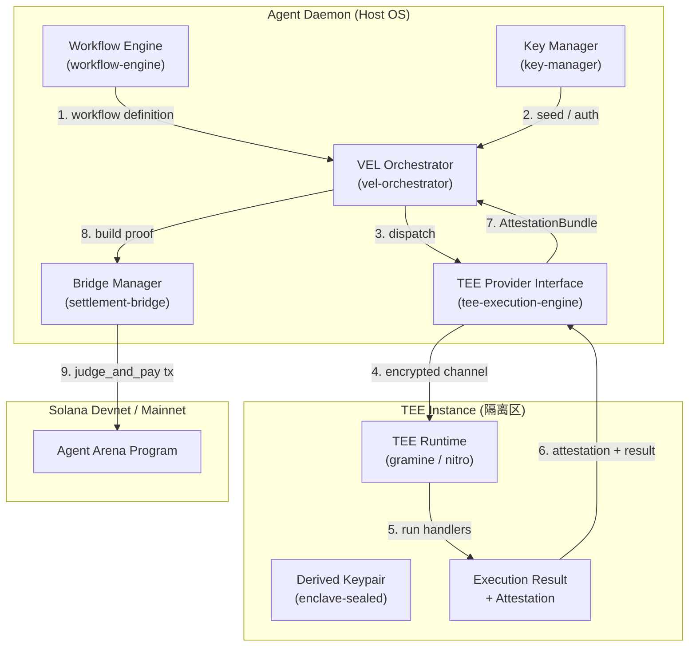
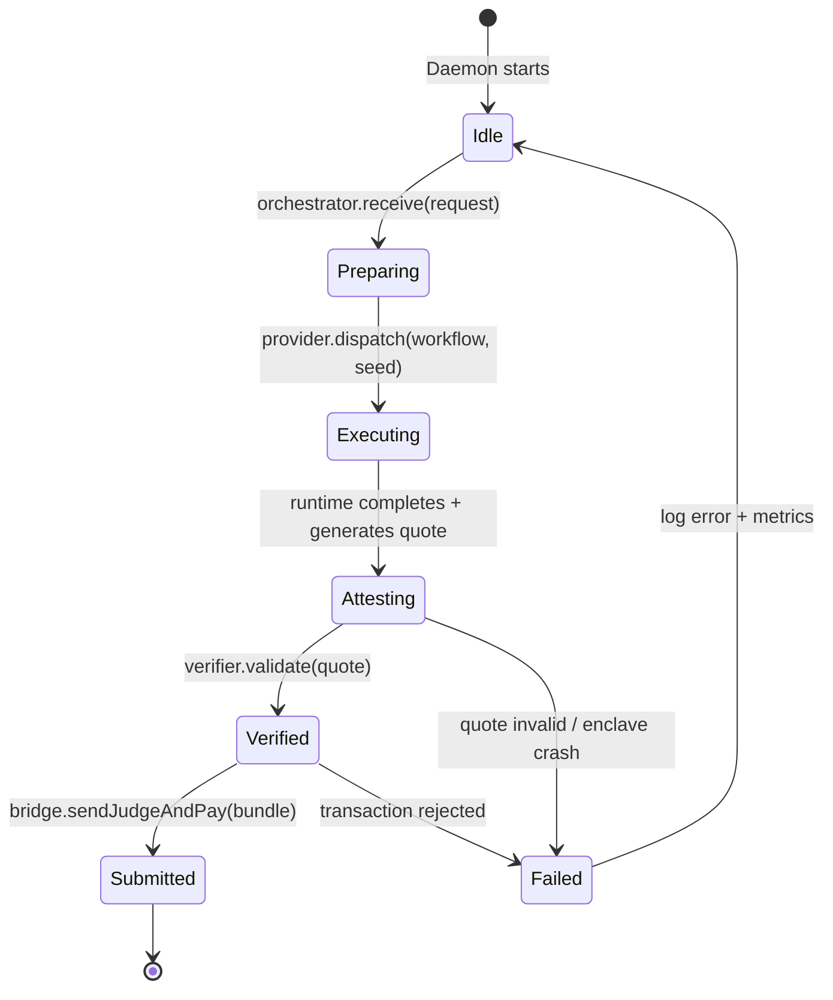

# Phase 2: Architecture — Verifiable Execution Layer (VEL)

> **输入**: `apps/agent-daemon/docs/01-prd-vel.md`  
> **日期**: 2026-04-07  

---

## 2.1 系统概览

### 一句话描述

VEL 是 `agent-daemon` 内部的可信执行扩展层，负责将 workflow 调度到 TEE（可信执行环境）中运行，并把运行结果与硬件级 attestation report 绑定后提交到 Agent Arena 进行结算。

### 架构图



---

## 2.2 组件定义

| 组件 | 职责 | 技术选型 | 状态 |
|------|------|---------|------|
| **VEL Orchestrator** | 接收 workflow 执行任务，选择 TEE provider，组装 AttestationBundle，调用 Bridge 提交结算 | TypeScript (`src/vel/orchestrator.ts`) | 新建 |
| **TEE Provider Interface** | 抽象层：定义 `execute()` 和 `verifyAttestation()` 接口，屏蔽底层 TEE 差异 | TypeScript Interface + Factory (`src/vel/tee-execution-engine.ts`) | 新建 |
| **Gramine Provider** | 第一个 provider 实现：通过本地 Gramine 运行 TEE 模拟环境（Slate/SGX simulation 模式） | TypeScript + Gramine SDK + Docker | 新建 |
| **Nitro Provider (stub)** | 第二个 provider 的接口 stub：预留 AWS Nitro Enclave 接入点 | TypeScript stub (`src/vel/providers/nitro-provider.ts`) | 新建 |
| **Attestation Verifier** | 校验 attestation report 的密码学签名、PCR 一致性、时间有效性 | TypeScript (`src/vel/attestation-verifier.ts`) | 新建 |
| **TEE Key Deriver** | 在 TEE 内部从 daemon 提供的 seed 派生出 Solana keypair，保证私钥不出 enclave | Rust/TS (enclave runtime) | 新建 |
| **Bridge Manager** | 将 AttestationBundle 编码为 `judge_and_pay` 的 proof payload 并签名 transaction | 已有 `src/bridge/settlement-bridge.ts`，扩展 | 扩展 |
| **Workflow Engine** | 提供 workflow 定义和 handler 注册表 | 已有 `packages/workflow-engine/` | 已有 |

### 组件边界声明

- **VEL Orchestrator 不直接操作私钥**：它只把 auth seed 丢给 TEE provider，真正的 keypair 在 TEE 内部派生。
- **TEE Provider 不操作链上 transaction**：它只返回 execution result 和 attestation report，transaction 组装由 Bridge Manager 负责。
- **Bridge Manager 不解析 workflow 业务逻辑**：它只把 AttestationBundle 当作 opaque proof data，打包进 transaction。

---

## 2.3 数据流

### 核心流程：Workflow TEE Execution → Arena Settlement

```
User/Task Poster
  → Daemon receives task request
    → VEL Orchestrator fetches workflow definition from Workflow Engine
      → VEL Orchestrator requests ephemeral auth seed from Key Manager
        → TEE Provider Interface selects Gramine Provider
          → Gramine spins up enclave / enters existing enclave
            → TEE Runtime derives keypair from seed
              → TEE Runtime executes workflow handlers
                → TEE Runtime hashes result + logs
                  → TEE Runtime requestslocal attestation (Gramine RA-TLS quote)
                    → Attestation + result returned to TEE Provider Interface
                      → VEL Orchestrator builds AttestationBundle
                        → Bridge Manager encodes bundle as judge_and_pay proof
                          → Transaction signed and sent to Solana
                            → Agent Arena Program processes judge_and_pay
```

### 核心数据流表

| 步骤 | 数据 | 从 | 到 | 格式 |
|------|------|----|----|------|
| 1 | workflow JSON + inputs | Workflow Engine | VEL Orchestrator | `WorkflowExecutionRequest` |
| 2 | auth seed (32 bytes) | Key Manager | VEL Orchestrator | `Uint8Array` |
| 3 | encrypted execution payload | TEE Provider Interface | TEE Runtime | protobuf / JSON over local unix socket |
| 4 | attestation report + execution hash + logs | TEE Runtime | TEE Provider Interface | Gramine quote / Nitro attestation doc |
| 5 | `AttestationBundle` | TEE Provider Interface | VEL Orchestrator | `AttestationBundle { report, pcrValues, resultHash, timestamp }` |
| 6 | `judge_and_pay` proof bytes | Bridge Manager | Agent Arena Program | borsh-serialized transaction data |

---

## 2.4 依赖关系

### 内部依赖

```
VEL Orchestrator
  → TEE Provider Interface (抽象工厂 + interface)
  → Workflow Engine (读取 workflow 定义)
  → Key Manager (获取 seed / auth token)
  → Bridge Manager (提交链上结算)

TEE Provider Interface
  → Gramine Provider (具体实现 1)
  → Nitro Provider (具体实现 2，stub)

Attestation Verifier
  → TEE Provider Interface (每个 provider 提供自己的 verify 策略)
```

### 外部依赖

| 依赖 | 版本/说明 | 用途 | 是否可替换 |
|------|----------|------|-----------|
| Gramine SDK | v1.x | 本地 SGX/模拟 TEE 运行 | 是 → Nitro / Phala |
| AWS Nitro SDK | aws-nitro-enclaves-sdk | 未来云上部署 | 是 → Gramine / Phala |
| `borsh` | ^2.0.0 | proof payload 序列化 | 否（链上协议已定） |
| `@solana/web3.js` | ^1.98.4 | transaction 构建与发送 | 是 → `@solana/kit` |

---

## 2.5 状态管理

### 状态枚举

| 状态名 | 含义 | 谁拥有 | 持久化方式 |
|--------|------|--------|-----------|
| `workflow_request` | 用户/任务系统发起的 workflow 执行请求 | VEL Orchestrator | 内存 (request-scoped) |
| `enclave_session` | 当前与 TEE runtime 的通信会话 | TEE Provider | 内存 (unix socket / vsock) |
| `attestation_bundle` | 执行完成后聚合的 attestation + result + metadata | VEL Orchestrator | 内存 → proof payload (链上 transaction) |
| `tee_provider_config` | 使用哪个 provider、enclave 镜像路径、PCR 白名单 | Daemon Config (`config.yaml`) | 文件 |
| `derived_keypair` | TEE 内部从 seed 派生的 Solana keypair | TEE Runtime | enclave sealed memory (不可导出) |

### 状态转换图



---

## 2.6 接口概览

| 接口 | 类型 | 调用方 | 说明 |
|------|------|--------|------|
| `TeeExecutionEngine.execute(request)` | 内部 TS 方法 | VEL Orchestrator | 核心入口：workflow → { result, attestation } |
| `TeeExecutionEngine.verifyAttestation(bundle)` | 内部 TS 方法 | Bridge / Judge | 验证 attestation 的签名和内容 |
| `TeeProviderFactory.create(providerName)` | 工厂方法 | VEL Orchestrator | 根据配置返回 Gramine / Nitro provider |
| `VelOrchestrator.runAndSettle(request)` | 内部编排方法 | Daemon Event Loop | 一键跑通 execute + build proof + bridge settlement |
| `AttestationBundle.toProofBytes()` | 内部序列化方法 | Bridge Manager | 把 attestation 编码为 borsh-compatible bytes |

---

## 2.7 安全考虑

| 威胁 | 影响 | 缓解措施 |
|------|------|---------|
| Host OS 窃取私钥 | 高：攻击者获得 daemon 所在机器的 root 权限后偷取 keypair | 私钥在 TEE 内部派生，**永远不出 enclave**。Host 只传递 seed，但 seed 本身也是一次性的或经过 enclave 认证的密钥协商后传递。 |
| Host OS 篡改 workflow 执行结果 | 中：恶意 host 拦截并修改 execution result | execution result 被包含在 attestation report 的 hash 中，任何篡改都会导致 attestation 验证失败。 |
| Fake TEE provider (冒充 enclave) | 高：攻击者用一个假的 provider 返回伪造的 attestation | verifier 会校验 attestation report 的签名（如 AWS PCA 证书链或 Intel SGX quote 签名）。 |
| Replay attack (旧的 attestation 被复用) | 中：攻击者把之前某次合法执行的结果和 attestation 再次提交 | AttestationBundle 包含唯一的 `taskId` + `submissionId` + 时间戳，链上 program 或 verifier 拒绝重复的 proof。 |
| Judge 与 Agent 串通 | 中：judge 即使拿到合法 attestation，仍可能给低分或不公正评分 | 这是 TEE 无法完全解决的层面，但 TEE 将 judge 的职责从"评估质量"降级为"验证环境"。后续可以引入多 judge + dispute 机制。 |

---

## 2.8 性能考虑

| 指标 | 目标 | 约束 |
|------|------|------|
| TEE 启动时间 | < 5s (本地 Gramine 模拟) | 云上 Nitro 启动可能更慢（10-30s），需要预温热 enclave |
| Workflow 执行延迟 | 取决于 handlers（swap API 调用占大头） | TEE 内部网络请求要经过代理或 Restricted egress，可能增加 100-300ms |
| Attestation 验证时间 | < 500ms | 主要是密码学签名验证，可离线并行 |
| 并发执行 | 1-5 个 workflow 同时运行 | 本地开发环境资源有限；生产通过 enclave pool 扩展 |

---

## 2.9 部署架构

### 开发环境

```
Developer Laptop
  ├── Docker / Gramine 直接运行
  │     └── gramine-sgx (simulation mode)
  └── Agent Daemon (Node.js)
        └── connects to Gramine via local unix socket
```

### 生产预研架构（Phase 7 再细化）

```
AWS EC2 (Host)
  ├── Nitro Enclave (isolated VM)
  │     └── TEE Runtime + workflow engine
  └── Agent Daemon (Node.js on Host)
        └── connects via vsock
```

---

## ✅ Phase 2 验收标准

- [x] 架构图清晰，组件边界明确
- [x] 所有组件的职责已定义
- [x] 数据流完整，无断点
- [x] 依赖关系（内部 + 外部）已列出
- [x] 状态管理方案已定义
- [x] 接口已概览
- [x] 安全威胁已识别

**验收通过后，进入 Phase 3: Technical Spec →**
