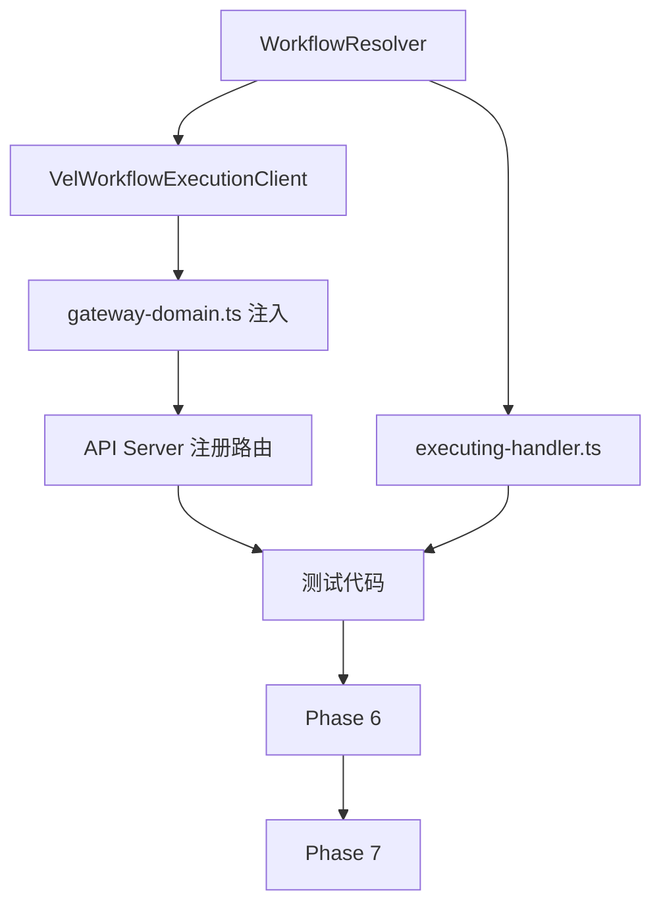

# Phase 4: Task Breakdown — Gateway Execution Layer

> **输入**: `03-technical-spec-gateway-execution.md`
> **输出**: 本任务拆解文档

---

## 4.1 任务列表

| # | 任务名称 | 描述 | 依赖 | 预估时间 | 优先级 | Done 定义 |
|---|---------|------|------|----------|--------|-----------|
| T1 | WorkflowResolver 实现 | 创建 `LocalWorkflowResolver`，能从 workflowId 映射到完整定义 | 无 | 1h | P0 | 可成功解析测试 workflow |
| T2 | VelWorkflowExecutionClient | 新建 `execution-client.ts`，包装 `DefaultVelOrchestrator` | T1 | 2h | P0 | 将 Gateway `ExecutionClient` 请求转成 `TeeExecutionRequest` 并调用 orchestrator |
| T3 | 修改 `gateway-domain.ts` | 用 `WorkflowEngine` + `VelOrchestrator` 替换 stub `executionClient` | T2 | 2h | P0 | daemon 启动时 Gateway 使用真实 executionClient |
| T4 | 修改 `executing-handler.ts` | 调用 resolver 读取真实 workflow，传入 `executionClient` | T1 | 1h | P0 | 不再硬编码 swap step |
| T5 | API Server 注册 Gateway 路由 | 修改 `api/server.ts`，传入 `gateway` 并调用 `registerGatewayRoutes` | T3 | 1h | P0 | `/api/v1/gateway/*` 可访问 |
| T6 | Phase 5 Test Spec | 编写 `05-test-spec-gateway-execution.md` | T1-T5 | 1h | P0 | 文档完成 |
| T7 | 编写测试代码 | Gateway 集成测试、ExecutionClient 单元测试、路由测试 | T1-T5 | 3h | P0 | 全部通过 |
| T8 | Phase 6 Implementation Log | 编写 `06-implementation-gateway-execution.md` | T7 | 1h | P0 | 文档完成 |
| T9 | Phase 7 Review Report | 编写 `07-review-report-gateway-execution.md` | T8 | 1h | P0 | 文档完成 |

---

## 4.2 依赖图

---

## 4.3 里程碑

### Milestone 1: 核心执行层（T1-T4）
- **交付物**: Gateway 内部走通真实 workflow 执行
- **时间**: 6h

### Milestone 2: API + 测试 + 文档（T5-T9）
- **交付物**: 可外部访问、有测试覆盖、文档完整
- **时间**: 7h

---

## ✅ Phase 4 验收标准

- [x] 每个任务 ≤ 4 小时
- [x] 每个任务有 Done 定义
- [x] 依赖关系已标明
- [x] 至少划分为 2 个里程碑
