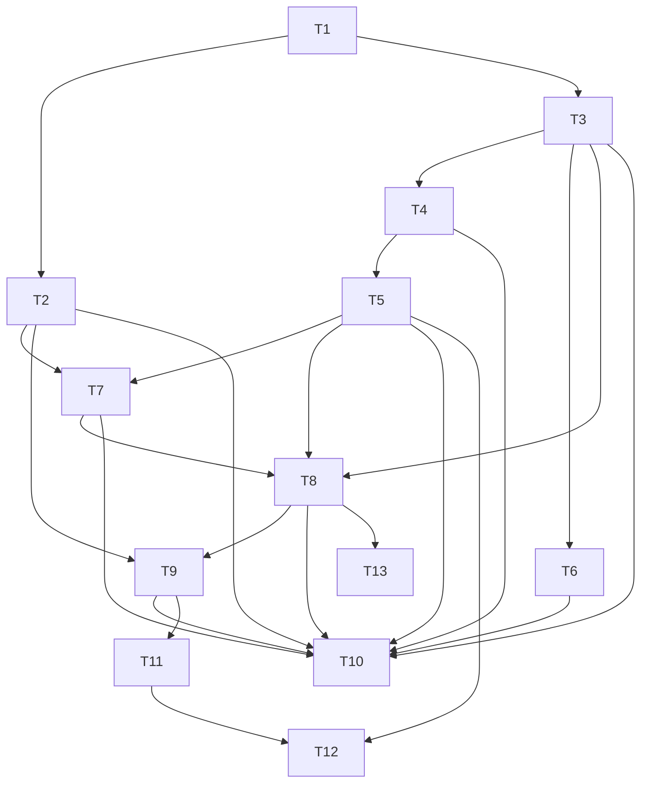

# Phase 4: Task Breakdown — Verifiable Execution Layer (VEL)

> **输入**: `apps/agent-daemon/docs/03-technical-spec-vel.md`  
> **日期**: 2026-04-07

---

## 4.1 拆解原则

1. **每个任务 ≤ 4 小时**
2. **每个任务有明确的 Done 定义**
3. **先基础类型/错误 → 抽象层 → provider → orchestrator → bridge → E2E**
4. **核心路径优先，文档和风险项并行**

---

## 4.2 任务列表

| # | 任务名称 | 描述 | 依赖 | 预估 | 优先级 | Done 定义 |
|---|---------|------|------|------|--------|-----------|
| T1 | 创建 VEL 类型与错误码系统 | 实现 `types.ts` + `errors.ts`，包含所有接口、错误类、常量 | 无 | 2h | P0 | `tsc` 无报错，Vitest 能 import 所有类型 |
| T2 | 实现通用工具函数 | `utils.ts`：resultHash / logHash / bundleHash / reasonRef encode | T1 | 2h | P0 | 所有 hash 函数单测通过，边界条件（空数组、超大对象）覆盖 |
| T3 | 实现 `TeeExecutionEngine` 抽象 + 工厂 | `tee-execution-engine.ts` + `providers/index.ts` + `TeeProviderFactory` | T1 | 2h | P0 | 工厂能根据配置返回对应 provider，未知 provider 抛 `VEL_0008` |
| T4 | 实现 `BaseTeeProvider` | `providers/base-provider.ts`：socket 通信、payload serialization、session 隔离 | T3 | 3h | P0 | 单测覆盖 session map 管理和 payload encode/decode |
| T5 | 实现 `GramineLocalProvider` | `providers/gramine-local-provider.ts`：启动 gramine 进程、unix socket 通信、handshake | T4 | 4h | P0 | 本地能成功启动模拟 enclave 并返回 mock attestation |
| T6 | 实现 `NitroStubProvider` | `providers/nitro-stub-provider.ts`：预留接口 stub，返回未实现错误 | T3 | 1h | P1 | `initialize()` 返回友好错误信息，不破坏编译 |
| T7 | 实现 `AttestationVerifier` | `attestation-verifier.ts`：解析 Gramine quote、验证 user-data、PCR 白名单比对 | T2, T5 | 3h | P0 | 本地 mock quote 验证通过，篡改 quote 后验证失败 |
| T8 | 实现 `VelOrchestrator` | `orchestrator.ts`：`runAndSettle()` 完整编排，状态机转换正确 | T3, T5, T7 | 3h | P0 | 单测覆盖 Idle→Preparing→...→Submitted 全流程 |
| T9 | 扩展 `settlement-bridge` 支持 VEL proof | 修改 `settlement-bridge.ts`，让 `judgeAndPay` 接受 `AttestationBundle` 并编码 `reasonRef` | T2, T8 | 3h | P0 | bridge 单测通过，reasonRef 格式符合 Technical Spec |
| T10 | 编写 VEL 单元测试套件 | `src/vel/__tests__/`：providers、verifier、orchestrator、utils 的单测 | T2-T9 | 4h | P0 | 覆盖率 ≥ 80%，全部通过 |
| T11 | 编写 Devnet E2E 脚本 | `scripts/e2e-vel-devnet.mjs`：post task → run TEE → submit → judge_and_pay | T9 | 4h | P0 | devnet 上至少 1 笔成功的 `judge_and_pay` transaction |
| T12 | 编写 `TEE_INTEGRATION.md` | 说明如何启动 Gramine、验证 attestation、排查问题 | T5, T11 | 2h | P1 | 另一位开发者按文档能在本地跑通模拟环境 |
| T13 | 清理 `src/vel/index.ts` 导出 + 集成到 daemon 入口 | 让 daemon 启动时读取 `config.useVel` 并初始化 orchestrator | T8 | 2h | P1 | `pnpm run typecheck` 全绿，无循环依赖 |

---

## 4.3 任务依赖图

---

## 4.4 里程碑划分

### Milestone 1: VEL Core Infrastructure
**预计完成**: 2026-04-08  
**交付物**: `src/vel/` 目录完整，TeeExecutionEngine + Gramine provider + AttestationVerifier + Orchestrator 全部实现并通过单测。

包含任务: **T1, T2, T3, T4, T5, T6, T7, T8, T10**

### Milestone 2: Bridge Integration & Devnet E2E
**预计完成**: 2026-04-09  
**交付物**: `settlement-bridge` 能编码 VEL proof，devnet 上跑通完整的 `post → TEE execute → submit → judge_and_pay` 流程，并有技术文档。

包含任务: **T9, T11, T12, T13**

---

## 4.5 风险识别

| 风险 | 概率 | 影响 | 缓解措施 |
|------|------|------|---------|
| Gramine 安装复杂导致开发环境搭建失败 | 中 | 高 | 提供 Docker 镜像封装 Gramine 模拟环境，并允许纯 mock provider 运行单测 |
| Solana transaction data 限制导致 attestation 无法链上引用 | 低 | 高 | 从一开始就不把 attestation 塞入 instruction data，而是通过 `reasonRef` 链下引用 |
| `judge_and_pay` 必须指定 winner，但 workflow 执行可能没有明确的单一 winner | 中 | 中 | 本次 vel-orchestrator 只处理 single-executor task；多 winner / pool 模式留待后续 |
| 本地 Gramine simulation 的 attestation 没有真实签名， verifier 只能做结构校验 | 高 | 低 | 这是预期行为；生产技术路径会用真实 SGX/Nitro 证书链验证 |

---

## ✅ Phase 4 验收标准

- [x] 每个任务 ≤ 4 小时
- [x] 每个任务有 Done 定义
- [x] 依赖关系已标明，无循环依赖
- [x] 至少划分为 2 个里程碑
- [x] 风险已识别

**验收通过后，进入 Phase 5: Test Spec →**
