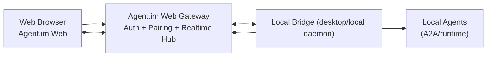
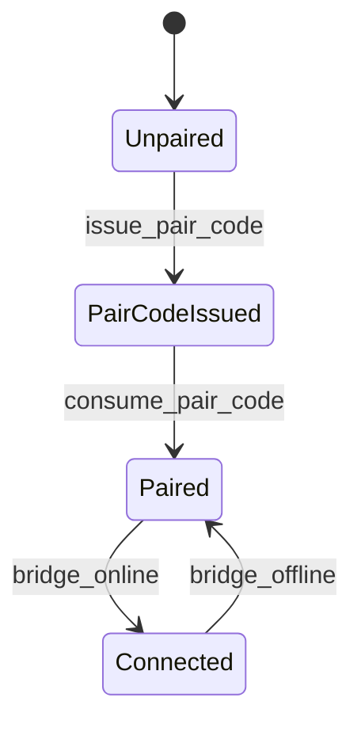

# Phase 2: Architecture — Agent.im Web Entry + Local Agent Voice

> **目的**: 定义 Web 入口与本地 Agent Bridge 的架构、边界、数据流  
> **输入**: `web-entry/01-prd.md`  
> **输出物**: 本文档

---

## 2.1 系统概览（必填）

### 一句话描述

Agent.im Web 通过“云端会话网关 + 本地出站 Bridge”连接本机 Agent，实现网页文本/语音对话。

### 架构图



## 2.2 组件定义（必填）

| 组件 | 职责 | 技术选型 | 状态 |
|------|------|---------|------|
| Web UI | 登录、配对、Agent 列表、文本/语音会话 | React + Vite（复用 Agent.im UI） | 新建 |
| Web Gateway | 会话鉴权、配对码、实时转发、状态聚合 | Node/Bun HTTP + WS | 新建 |
| Local Bridge | 与网关建立出站长连接，代理本地 Agent | TypeScript（复用 agent-im main 能力） | 新建 |
| Local Agent Adapter | 统一调用本地 A2A/任务接口 | 复用 `api-server.ts`/A2A 客户端 | 已有扩展 |
| Voice Pipeline | Web 音频采集/播放 + 语音事件协议 | Web APIs + 实时事件通道 | 新建 |

## 2.3 数据流（必填）

### 核心流程 A：Web 登录 + 配对

1. Web 用户登录（Privy 会话）
2. Web 请求 `POST /web/session/pair` 获取一次性配对码
3. 本地 Bridge 输入配对码并调用 `POST /local/bridge/attach`
4. 网关建立 `userSession ↔ bridgeId` 绑定
5. Web 获取 `GET /web/agents` 展示在线本地 Agent

### 核心流程 B：文本对话

1. Web 与网关建立 `WS /web/chat/:agentId`
2. Web 发送 `chat.message.send`
3. 网关转发给 Bridge
4. Bridge 调用本地 Agent 并回推 `chat.message.delta/final`
5. Web 实时渲染响应

### 核心流程 C：语音对话（MVP）

1. Web 发送 `voice.start`
2. 浏览器采集语音并以 `voice.chunk` 推送
3. Bridge/本地引擎处理并返回 `voice.transcript.partial/final`
4. 生成 Agent 回复后，回传 `voice.tts.chunk`（或文本 + Web TTS 播放）

## 2.4 依赖关系（必填）

### 内部依赖

```text
Web UI -> Web Gateway
Web Gateway -> Local Bridge
Local Bridge -> Local Agent Adapter
Local Agent Adapter -> Existing agent-im APIs / A2A
```

### 外部依赖

| 依赖 | 版本 | 用途 | 是否可替换 |
|------|------|------|-----------|
| Privy Auth | existing | Web 身份认证 | 否（当前阶段） |
| WebSocket | 标准协议 | 实时转发 | 是 |
| WebRTC（可选） | 标准协议 | 后续低延迟语音 | 是 |

## 2.5 状态管理（必填）

| 状态名 | 含义 | 谁拥有 | 持久化方式 |
|--------|------|--------|-----------|
| WebSessionState | Web 登录会话 | Gateway | 内存 + 会话存储 |
| PairingState | 配对码与消费状态 | Gateway | 内存/Redis（后续） |
| BridgePresence | Bridge 在线状态 | Gateway | 内存（心跳） |
| AgentPresence | 本地 Agent 在线/忙闲 | Bridge | 内存（上报） |
| ChatSessionState | 文本/语音会话状态 | Web UI + Gateway | 内存 |

状态流转（简化）：



## 2.6 接口概览（必填）

| 接口 | 类型 | 调用方 | 说明 |
|------|------|--------|------|
| `POST /web/session/pair` | REST | Web UI | 申请配对码 |
| `POST /local/bridge/attach` | REST | Local Bridge | 消费配对码并绑定 |
| `GET /web/agents` | REST | Web UI | 查询可连接 Agent |
| `WS /web/chat/:agentId` | WS | Web UI | 文本/语音事件双向流 |
| `WS /bridge/realtime` | WS | Local Bridge | Bridge 主连接 |

## 2.7 安全考虑（必填）

| 威胁 | 影响 | 缓解措施 |
|------|------|---------|
| 配对码泄露 | 他人劫持本地 Bridge | 一次性+短 TTL（120s）+消费即失效 |
| 会话冒用 | 越权访问本地 Agent | Web Session 与 Bridge 强绑定，服务端鉴权 |
| 重放攻击 | 重复执行敏感动作 | 事件 `nonce + timestamp`，幂等校验 |
| 长连接劫持 | 数据泄露/伪造 | WSS + token 校验 + 心跳踢出 |

## 2.8 性能考虑（可选）

| 指标 | 目标 | 约束 |
|------|------|------|
| Chat RTT | < 800ms | 取决于网络与 Agent 推理时长 |
| 首次配对 | < 2 min | 含人工输入配对码 |
| Bridge 心跳 | 10s 周期 | 30s 超时判离线 |

## 2.9 部署架构（可选）

- `Gateway` 部署在受控云环境（开发先单实例）
- `Web UI` 静态部署（同域调用 Gateway）
- `Bridge` 跑在用户本机（由桌面 Agent.im 或独立本地进程托管）

---

## ✅ Phase 2 验收标准

- [x] 架构图清晰、组件边界明确
- [x] 核心数据流完整（登录/配对/文本/语音）
- [x] 依赖与状态管理定义完成
- [x] 接口概览给出
- [x] 安全威胁与缓解措施列出

**验收通过后，进入 Phase 3: Technical Spec →**
