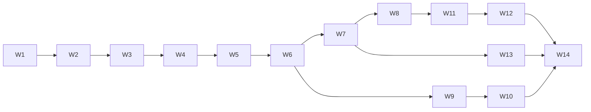

# Phase 4: Task Breakdown — Agent.im Web Entry + Local Agent Voice

> **目的**: 将 Web 入口专项规格拆成可执行任务  
> **输入**: `web-entry/03-technical-spec.md`  
> **输出物**: 本文档

---

## 4.1 拆解原则

1. 每个任务控制在 0.5h ~ 4h  
2. 每个任务具备明确 Done 定义  
3. 先身份与安全，再实时链路，再语音闭环  
4. 先文本 MVP，再语音增强

## 4.2 任务列表（必填）

| # | 任务名称 | 描述 | 依赖 | 预估时间 | 优先级 | Done 定义 |
|---|---------|------|------|---------|--------|----------|
| W1 | 新增 web-entry 模块骨架 | 增加 gateway/bridge/web 目录与基础配置 | 无 | 2h | P0 | 模块可编译，空服务可启动 |
| W2 | 实现 `POST /web/session/pair` | 配对码签发、TTL、频率限制 | W1 | 2h | P0 | 返回 pairCode+expiresAt，错误码正确 |
| W3 | 实现 `POST /local/bridge/attach` | 配对码消费与 bridge token 下发 | W2 | 3h | P0 | 一次性消费生效，重复消费返回 409 |
| W4 | Bridge WS 主连接 | `WS /bridge/realtime` 鉴权、心跳、在线状态 | W3 | 3h | P0 | 心跳正常更新在线；超时离线 |
| W5 | Agent presence 上报链路 | Bridge 上报本地 agents，gateway 聚合 | W4 | 2h | P0 | `/web/agents` 可读到在线 agent |
| W6 | 实现 `GET /web/agents` | Web 查询可连接 agent 列表 | W5 | 1h | P0 | 登录态返回 agent 列表；未登录 401 |
| W7 | Web chat WS 通道 | `WS /web/chat/:agentId` 文本收发事件 | W6 | 4h | P0 | 文本 send/ack/delta/final 完整 |
| W8 | Bridge chat adapter | 网关请求转本地 agent，再回传结果 | W7 | 3h | P0 | Web 可收到本地 agent 回复 |
| W9 | Web UI 配对与 Agent 选择 | 前端增加“配对码 + agent 列表 + 连接状态” | W6 | 3h | P1 | 页面可操作并显示状态 |
| W10 | Web UI 文本会话页 | 对话窗口接入 WS 文本事件 | W7,W9 | 3h | P1 | 文本对话稳定可用 |
| W11 | 语音事件协议实现 | `voice.start/chunk/stop` 与 transcript 事件 | W8 | 4h | P1 | 可回传 partial/final transcript |
| W12 | Web 语音 UI MVP | 浏览器录音与播放接入语音事件 | W11 | 3h | P1 | 语音单轮对话可跑通 |
| W13 | 监控与错误码埋点 | 关键接口状态、错误码、延迟指标 | W7,W11 | 2h | P1 | `/status` 含 web-entry 指标 |
| W14 | 发布前回归脚本 | 登录→配对→文本→语音 smoke 命令 | W10,W12,W13 | 2h | P0 | 一键脚本可重复通过 |

## 4.3 任务依赖图（必填）

## 4.4 里程碑划分（必填）

### Milestone 1: 配对与在线可见（P0）
**预计完成**: Sprint 1  
**交付物**: Web 登录后可配对并看到本机 Agent 在线列表  
包含任务: W1~W6

### Milestone 2: 文本对话闭环（P0）
**预计完成**: Sprint 2  
**交付物**: Web 与本地 Agent 文本双向对话  
包含任务: W7~W10

### Milestone 3: 语音 MVP + 发布门槛（P1）
**预计完成**: Sprint 3  
**交付物**: Web 语音单轮对话 + 指标与 smoke  
包含任务: W11~W14

## 4.5 风险识别（必填）

| 风险 | 概率 | 影响 | 缓解措施 |
|------|------|------|---------|
| 配对码被暴力尝试 | 中 | 高 | 频率限制 + TTL + 一次性消费 |
| Bridge 网络不稳定 | 高 | 中 | 心跳重连 + 会话恢复 |
| 语音实时延迟波动 | 中 | 中 | 先文本优先，语音分片与降级策略 |
| 双端状态不一致 | 中 | 高 | 统一事件协议与幂等 nonce |
| 实施跨度大 | 中 | 中 | 里程碑拆分，先 P0 再 P1 |

---

## ✅ Phase 4 验收标准

- [x] 每个任务 ≤ 4h
- [x] 每个任务有 Done 定义
- [x] 依赖关系清晰，无循环依赖
- [x] 至少 2 个里程碑（共 3 个）
- [x] 风险识别完成

**验收通过后，进入 Phase 5: Test Spec →**
