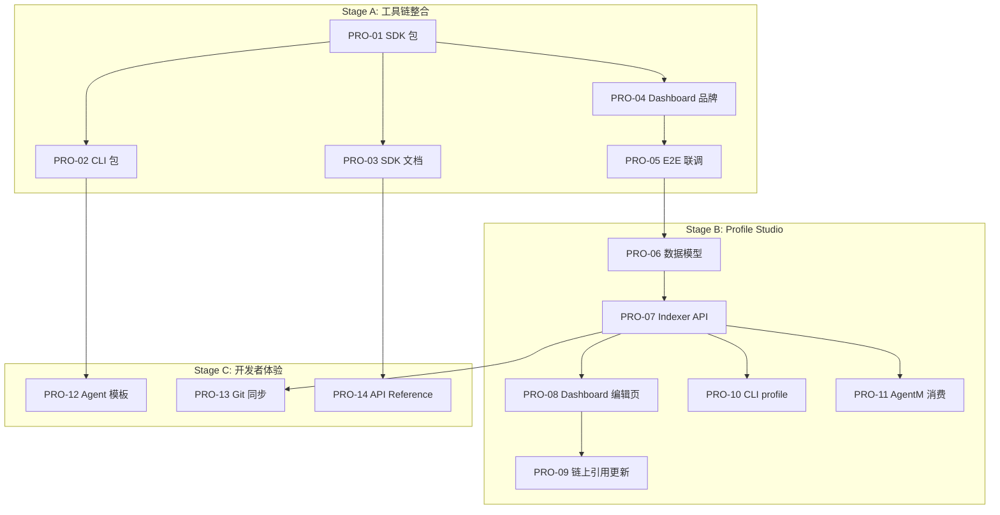

# Phase 4: Task Breakdown — AgentM Pro

> **目的**: 将技术规格拆解为可执行、可分配、可验收的独立任务
> **输入**: `03-technical-spec.md` + `02-architecture.md`
> **输出物**: 本文档
> **日期**: 2026-04-03

---

## 4.1 拆解原则

1. **每个任务 ≤ 4 小时**
2. **每个任务有明确的 Done 定义**
3. **依赖关系必须标明**
4. **先基础后上层**

---

## 4.2 关键路径

```
Stage A（现有代码整合，已部分完成）:
  SDK 验证 → CLI 验证 → Dashboard 验证 → 端到端联调
    ↓
Stage B（Profile Studio，新功能）:
  Profile 数据模型 → Indexer API → Dashboard UI → CLI 命令 → AgentM 消费
    ↓
Stage C（开发者体验，P1）:
  Agent 模板系统 → SDK 文档 → Git 同步发布
```

---

## 4.3 任务列表

### Stage A — 现有工具链验证与整合

> 目标：确保 SDK / CLI / Dashboard / Indexer 作为 AgentM Pro 的组件可协同工作
> 大部分代码已存在，此阶段主要是验证 + 补缺 + 品牌对齐

| # | 任务名称 | 描述 | 依赖 | 时间 | 优先级 | Done 定义 |
|---|---------|------|------|------|--------|----------|
| PRO-01 | SDK npm 包发布准备 | 确认 `@gradience/sdk` 的 `package.json` 字段（name/main/types/exports/peerDependencies）符合发布规范；添加 `build` 脚本生成 `dist/` | 无 | 2h | P0 | `npm pack` 生成合规 tarball；`import { GradienceSDK }` 在外部项目编译通过 |
| PRO-02 | CLI npm 包发布准备 | 确认 `@gradience/cli` 的 `bin` 字段指向正确入口；添加 `#!/usr/bin/env bun` shebang | PRO-01 | 1h | P0 | `npx @gradience/cli --help` 显示所有命令 |
| PRO-03 | SDK Quick Start 文档 | 在 SDK 目录写 `README.md`：安装 → 初始化 → 查询声誉 → 发布任务，3 行代码示例 | PRO-01 | 2h | P0 | 新用户按 README 5 分钟内跑通第一个查询 |
| PRO-04 | Dashboard 品牌对齐 | 页面标题/Logo 改为 "AgentM Pro"；首页集成 Agent Overview 组件（已有） | PRO-01 | 1h | P0 | 页面显示 "AgentM Pro"，Agent Overview 数据正确 |
| PRO-05 | 端到端联调验证 | 运行 `scripts/e2e-w2-integration.ts`（已有）确认 Indexer → SDK → Dashboard 数据通路 | PRO-04 | 1h | P0 | 12/12 E2E 测试全绿 |

### Stage B — Profile Studio（新功能）

> 目标：开发者能编辑并发布 Agent Profile（身份/简介/链接），AgentM 能读取展示

| # | 任务名称 | 描述 | 依赖 | 时间 | 优先级 | Done 定义 |
|---|---------|------|------|------|--------|----------|
| PRO-06 | Profile 数据模型定义 | MVP 先定义基础字段（display_name, bio, links）；区分链上引用（metadata_uri_hash）和链下扩展（JSON） | PRO-05 | 2h | P0 | TypeScript type 定义在 SDK 中导出；JSON Schema 文档化 |
| PRO-07 | Indexer Profile API | 新增 `GET /api/agents/{pubkey}/profile` 和 `PUT /api/agents/{pubkey}/profile`（认证写入）；返回合并后的链上+链下 Profile | PRO-06 | 3h | P0 | curl GET 返回 Profile JSON；PUT 需要签名认证 |
| PRO-08 | Dashboard Profile 编辑页 | 新增 `/profile` 页面：表单编辑 display_name / bio / links；提交调用 Indexer PUT API | PRO-07 | 3h | P0 | 编辑后保存，刷新页面数据不丢失 |
| PRO-09 | 链上 Profile 引用更新 | Profile 保存后，计算 JSON hash，调用 SDK `upsertAgentProfile()` 更新链上 `metadata_uri_hash` | PRO-08 | 2h | P0 | 链上 AgentProfile.metadata_uri_hash 与链下 JSON 的 sha256 一致 |
| PRO-10 | CLI profile 命令 | `gradience profile show` / `gradience profile update --name "..." --bio "..."` | PRO-07 | 2h | P1 | CLI 可读取和更新 Profile；NO_DNA 输出 JSON |
| PRO-11 | AgentM Profile 消费 | AgentM DiscoverView Agent 详情 Modal 读取 Indexer Profile API，展示 display_name / bio / links | PRO-07 | 2h | P0 | 详情 Modal 显示 Profile 信息而非纯 pubkey |

### Stage C — 开发者体验（P1）

| # | 任务名称 | 描述 | 依赖 | 时间 | 优先级 | Done 定义 |
|---|---------|------|------|------|--------|----------|
| PRO-12 | Agent 模板系统 | `gradience create-agent [name] [--template basic]`；生成包含 SDK 依赖的项目骨架 | PRO-02 | 3h | P1 | 生成的项目 `npm install && npm start` 成功运行 |
| PRO-13 | Git 同步发布 | Webhook endpoint 接收 Git push 事件 → 拉取 profile.json → 更新 Indexer | PRO-07 | 3h | P1 | GitHub webhook → Profile 自动更新 |
| PRO-14 | SDK API Reference 生成 | 用 TypeDoc 生成 API 文档站；CI 自动构建 | PRO-03 | 2h | P1 | `npx typedoc` 输出 HTML 文档；所有公共 API 有文档 |

---

## 4.4 任务依赖图



---

## 4.5 里程碑

### M-A: 工具链就绪（~7h）
**交付物**: SDK/CLI 可发布，Dashboard 品牌对齐，E2E 通过
**验收**: PRO-01 ~ PRO-05 全部完成

### M-B: Profile Studio 可用（~14h）
**交付物**: Profile 编辑/发布/消费完整闭环
**验收**: PRO-06 ~ PRO-11 全部完成；开发者能编辑 Profile，AgentM 用户能看到

### M-C: 开发者体验完善（~8h）
**交付物**: Agent 模板、Git 同步、API 文档
**验收**: PRO-12 ~ PRO-14 全部完成

---

## ✅ Phase 4 验收标准

- [x] 任务均 ≤ 4h
- [x] 每项任务有清晰 Done 定义
- [x] 依赖关系明确
- [x] Stage A/B/C 分层清晰
- [x] 与 PRD v0.2（Profile Studio）对齐
- [x] 与 AgentM 的集成点（PRO-11）已标明
