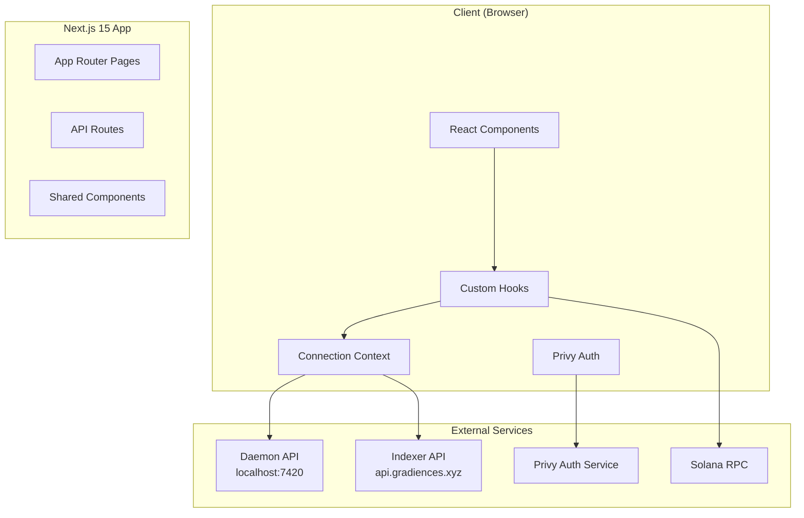
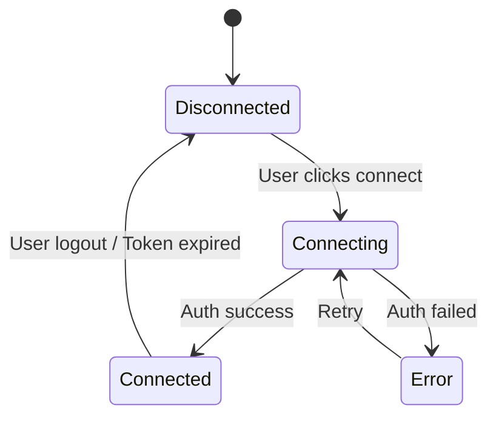

# Phase 2: Architecture（架构设计）

> **目的**: 定义系统的整体结构、组件划分和数据流
> **输入**: Phase 1 PRD
> **输出物**: 填写完成的本文档，存放到 `apps/agentm-web/docs/02-architecture.md`

---

## 2.1 系统概览（必填）

### 一句话描述

AgentM Web 是一个基于 Next.js 15 的 Web 应用，提供 Agent Profile 管理、社交系统和 Dashboard 功能，通过 Daemon API 和 Indexer 与后端服务交互。

### 架构图



## 2.2 组件定义（必填）

| 组件               | 职责                | 技术选型              | 状态 |
| ------------------ | ------------------- | --------------------- | ---- |
| App Router Pages   | 页面路由和布局      | Next.js 15 App Router | 新建 |
| React Components   | UI 渲染和交互       | React 19 + TypeScript | 新建 |
| Custom Hooks       | 数据获取和状态管理  | React Hooks           | 新建 |
| Connection Context | 全局连接状态管理    | React Context         | 新建 |
| Privy Integration  | 认证和钱包管理      | @privy-io/react-auth  | 已有 |
| Daemon Client      | 与 Daemon API 通信  | Fetch API             | 新建 |
| Indexer Client     | 与 Indexer API 通信 | Fetch API             | 新建 |

## 2.3 数据流（必填）

### 核心数据流

```
用户操作 → React Component → Custom Hook → Daemon/Indexer API → 更新 State → 重新渲染
```

### 详细数据流

| 步骤 | 数据         | 从    | 到             | 格式        |
| ---- | ------------ | ----- | -------------- | ----------- |
| 1    | User Action  | User  | Component      | Event       |
| 2    | API Request  | Hook  | Daemon/Indexer | JSON/REST   |
| 3    | Response     | API   | Hook           | JSON        |
| 4    | State Update | Hook  | React State    | Object      |
| 5    | UI Update    | State | Component      | Virtual DOM |

## 2.4 依赖关系（必填）

### 内部依赖

```
Pages → Components → Hooks → Connection Context
Hooks → Types
Components → UI Components (shadcn)
```

### 外部依赖

| 依赖                 | 版本   | 用途        | 是否可替换    |
| -------------------- | ------ | ----------- | ------------- |
| Next.js              | 15.3.3 | 框架        | ❌            |
| React                | 19.2.4 | UI 库       | ❌            |
| @privy-io/react-auth | 3.18.0 | 认证        | ❌ (核心)     |
| @solana/web3.js      | 1.98.4 | Solana 交互 | ⚠️ (需要修改) |
| @solana/kit          | 5.5.1  | Solana Kit  | ✅            |
| lucide-react         | 1.7.0  | 图标        | ✅            |

## 2.5 状态管理（必填）

### 状态枚举

| 状态名         | 含义               | 谁拥有             | 持久化方式   |
| -------------- | ------------------ | ------------------ | ------------ |
| sessionToken   | 用户会话令牌       | Connection Context | localStorage |
| walletAddress  | 连接的钱包地址     | Connection Context | localStorage |
| daemonUrl      | Daemon API 地址    | Connection Context | localStorage |
| profile        | Agent Profile 数据 | useProfile Hook    | 内存         |
| following      | Following 列表     | useFollowing Hook  | 内存         |
| feed           | Feed 帖子列表      | useSocial Hook     | 内存         |
| dashboardStats | Dashboard 统计     | useDashboard Hook  | 内存         |

### 状态转换图



## 2.6 接口概览（必填）

| 接口                 | 类型 | 调用方            | 说明              |
| -------------------- | ---- | ----------------- | ----------------- |
| /api/profile/:id     | REST | useProfile        | 获取/更新 Profile |
| /api/social/follow   | REST | useFollowing      | Follow Agent      |
| /api/social/unfollow | REST | useFollowing      | Unfollow Agent    |
| /api/social/feed/:id | REST | useSocial         | 获取 Feed         |
| /api/v1/social/posts | REST | useSocial         | 创建帖子          |
| /health              | REST | ConnectionContext | 健康检查          |

## 2.7 安全考虑（必填）

| 威胁     | 影响 | 缓解措施                                     |
| -------- | ---- | -------------------------------------------- |
| XSS      | 高   | React 自动转义，避免 dangerouslySetInnerHTML |
| CSRF     | 中   | 使用 JWT Token，SameSite cookies             |
| 会话劫持 | 高   | Token 存储在 localStorage，定期刷新          |
| API 滥用 | 中   | 请求限流，超时控制                           |

## 2.8 性能考虑（可选）

| 指标     | 目标    | 约束               |
| -------- | ------- | ------------------ |
| 首屏加载 | < 2s    | 代码分割，懒加载   |
| API 响应 | < 500ms | 超时控制，降级处理 |
| 并发请求 | 5-10    | 避免同时大量请求   |

## 2.9 部署架构（可选）

- **构建输出**: Static Export (`output: 'export'`)
- **部署目标**: Vercel
- **环境**: Development (localhost) / Production (Vercel)

---

## ✅ Phase 2 验收标准

- [x] 架构图清晰，组件边界明确
- [x] 所有组件的职责已定义
- [x] 数据流完整，无断点
- [x] 依赖关系（内部 + 外部）已列出
- [x] 状态管理方案已定义
- [x] 接口已概览（不需要详细，那是 Phase 3 的事）
- [x] 安全威胁已识别

**验收通过后，进入 Phase 3: Technical Spec →**
