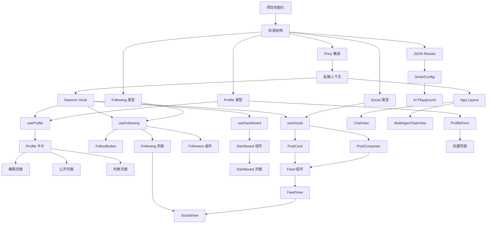

# Phase 4: Task Breakdown（任务拆解）

> **目的**: 将技术规格拆解为可执行、可分配、可验收的独立任务
> **输入**: Phase 3 技术规格
> **输出物**: 任务列表，存放到 `apps/agentm-web/docs/04-task-breakdown.md`

---

## 4.1 拆解原则

1. **每个任务 ≤ 4 小时**（如果超过，继续拆）
2. **每个任务有明确的 Done 定义**（可验证）
3. **任务之间的依赖关系必须标明**
4. **先基础后上层**（按依赖顺序排列）

## 4.2 任务列表（必填）

### 基础架构任务

| #   | 任务名称         | 描述                                      | 依赖 | 预估时间 | 优先级 | Done 定义                 |
| --- | ---------------- | ----------------------------------------- | ---- | -------- | ------ | ------------------------- |
| T1  | 项目初始化       | 创建 Next.js 15 项目，配置 TypeScript     | 无   | 2h       | P0     | 项目可运行，tsconfig 正确 |
| T2  | 目录结构搭建     | 创建 src/{app,components,hooks,lib,types} | T1   | 1h       | P0     | 目录结构符合规范          |
| T3  | Privy 集成       | 配置 Privy Provider，实现登录/登出        | T2   | 3h       | P0     | 可正常登录，获取 wallet   |
| T4  | 连接上下文       | 实现 ConnectionContext，管理 session      | T3   | 3h       | P0     | 全局可访问连接状态        |
| T5  | Daemon 连接 Hook | 实现 useDaemonConnection                  | T4   | 2h       | P0     | 可检测 daemon 状态        |
| T6  | 错误边界         | 实现 ErrorBoundary 组件                   | T2   | 1h       | P1     | 捕获渲染错误              |

### Profile 功能任务

| #   | 任务名称         | 描述                                 | 依赖   | 预估时间 | 优先级 | Done 定义            |
| --- | ---------------- | ------------------------------------ | ------ | -------- | ------ | -------------------- |
| T7  | Profile 类型定义 | 定义 AgentProfile, Capability 等类型 | T2     | 1h       | P0     | 类型文件完整         |
| T8  | useProfile Hook  | 实现获取/更新 Profile 的 hook        | T5, T7 | 3h       | P0     | 可获取和更新 profile |
| T9  | Profile 展示组件 | 实现 ProfileCard, SoulProfileCard    | T8     | 3h       | P0     | 展示 profile 信息    |
| T10 | Profile 编辑页   | 实现 /profile/edit 页面              | T9     | 4h       | P0     | 可编辑并保存 profile |
| T11 | 公开 Profile 页  | 实现 /profile/[id] 页面              | T9     | 2h       | P0     | 可查看他人 profile   |
| T12 | Profile 列表页   | 实现 /profiles 页面                  | T9     | 2h       | P1     | 可浏览所有 profiles  |

### Following 功能任务

| #   | 任务名称           | 描述                            | 依赖     | 预估时间 | 优先级 | Done 定义           |
| --- | ------------------ | ------------------------------- | -------- | -------- | ------ | ------------------- |
| T13 | Following 类型定义 | 定义 Following, Follower 类型   | T2       | 1h       | P0     | 类型文件完整        |
| T14 | useFollowing Hook  | 实现 follow/unfollow/check 功能 | T5, T13  | 4h       | P0     | 可完成 follow 操作  |
| T15 | FollowButton 组件  | 实现 Follow/Unfollow 按钮       | T14      | 2h       | P0     | 按钮状态正确变化    |
| T16 | Following 列表页   | 实现 /following 页面            | T14, T15 | 3h       | P0     | 展示 following 列表 |
| T17 | Followers 组件     | 实现 FollowersList 组件         | T14      | 2h       | P0     | 展示 followers 列表 |

### Feed 功能任务

| #   | 任务名称          | 描述                               | 依赖     | 预估时间 | 优先级 | Done 定义         |
| --- | ----------------- | ---------------------------------- | -------- | -------- | ------ | ----------------- |
| T18 | Social 类型定义   | 定义 SocialPost, Notification 类型 | T2       | 1h       | P0     | 类型文件完整      |
| T19 | useSocial Hook    | 实现帖子 CRUD 和 Feed 获取         | T5, T18  | 4h       | P0     | 可发帖和获取 feed |
| T20 | PostCard 组件     | 实现帖子展示组件                   | T19      | 3h       | P0     | 展示帖子内容      |
| T21 | PostComposer 组件 | 实现发帖输入框                     | T19      | 2h       | P0     | 可输入并提交帖子  |
| T22 | Feed 组件         | 实现 Feed 流展示                   | T20, T21 | 3h       | P0     | 滚动加载 feed     |
| T23 | FeedView          | 实现 FeedView 视图                 | T22      | 2h       | P0     | 集成到 /app       |

### Dashboard 功能任务

| #   | 任务名称          | 描述                    | 依赖 | 预估时间 | 优先级 | Done 定义        |
| --- | ----------------- | ----------------------- | ---- | -------- | ------ | ---------------- |
| T24 | useDashboard Hook | 实现 Dashboard 数据获取 | T5   | 3h       | P0     | 获取所有统计数据 |
| T25 | DynamicDashboard  | 实现 Dashboard 组件     | T24  | 4h       | P0     | 展示所有统计卡片 |
| T26 | Dashboard 页面    | 实现 /dashboard 页面    | T25  | 2h       | P0     | 页面渲染正确     |

### AI Playground 任务

| #   | 任务名称           | 描述                     | 依赖 | 预估时间 | 优先级 | Done 定义        |
| --- | ------------------ | ------------------------ | ---- | -------- | ------ | ---------------- |
| T27 | JSON Render 核心   | 实现 JsonRender 组件系统 | T2   | 4h       | P1     | 可渲染 JSON 配置 |
| T28 | SmartConfig 组件   | 实现动态配置界面         | T27  | 3h       | P1     | 可动态配置 Agent |
| T29 | AI Playground 页面 | 实现 /ai-playground      | T28  | 3h       | P1     | 可测试 Agent     |

### 应用集成任务

| #   | 任务名称           | 描述                  | 依赖     | 预估时间 | 优先级 | Done 定义     |
| --- | ------------------ | --------------------- | -------- | -------- | ------ | ------------- |
| T30 | App Layout         | 实现 /app 布局        | T4       | 2h       | P0     | 含导航和状态  |
| T31 | SocialView         | 实现社交视图          | T16, T23 | 3h       | P0     | 集成社交功能  |
| T32 | ChatView           | 实现聊天视图          | T30      | 3h       | P0     | 可聊天交互    |
| T33 | MultiAgentTaskView | 实现多 Agent 任务视图 | T30      | 4h       | P0     | 可分配任务    |
| T34 | 首页实现           | 实现 / 首页           | T3       | 3h       | P0     | 登录/进入应用 |

### 创建 Agent 任务

| #   | 任务名称         | 描述                | 依赖 | 预估时间 | 优先级 | Done 定义      |
| --- | ---------------- | ------------------- | ---- | -------- | ------ | -------------- |
| T35 | ProfileForm 组件 | 实现 Profile 表单   | T7   | 4h       | P0     | 可创建 profile |
| T36 | 创建 Agent 页面  | 实现 /agents/create | T35  | 2h       | P0     | 可提交创建     |

## 4.3 任务依赖图（必填）

## 4.4 里程碑划分（必填）

### Milestone 1: 基础架构

**预计完成**: Day 1-2
**交付物**: 项目可运行，认证可用，连接状态管理完成

包含任务: T1, T2, T3, T4, T5, T6

### Milestone 2: Profile 系统

**预计完成**: Day 3-5
**交付物**: 可创建、编辑、查看 Profile

包含任务: T7, T8, T9, T10, T11, T12, T35, T36

### Milestone 3: 社交系统

**预计完成**: Day 6-8
**交付物**: 可 Follow/Unfollow，查看 Feed

包含任务: T13, T14, T15, T16, T17, T18, T19, T20, T21, T22, T23, T31

### Milestone 4: Dashboard & AI Playground

**预计完成**: Day 9-10
**交付物**: Dashboard 统计可用，AI Playground 可用

包含任务: T24, T25, T26, T27, T28, T29, T30, T32, T33, T34

## 4.5 风险识别（必填）

| 风险           | 概率 | 影响 | 缓解措施                |
| -------------- | ---- | ---- | ----------------------- |
| Privy 集成复杂 | 中   | 高   | 提前测试，准备 fallback |
| API 不稳定     | 高   | 高   | 实现降级逻辑，本地缓存  |
| 性能问题       | 中   | 中   | 虚拟列表，懒加载        |
| 浏览器兼容     | 低   | 中   | 测试主流浏览器          |

---

## ✅ Phase 4 验收标准

- [x] 每个任务 ≤ 4 小时
- [x] 每个任务有 Done 定义
- [x] 依赖关系已标明，无循环依赖
- [x] 至少划分为 2 个里程碑
- [x] 风险已识别

**验收通过后，进入 Phase 5: Test Spec →**
