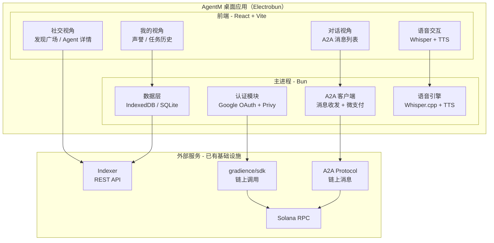

# Phase 2: Architecture — AgentM

> **目的**: 定义 AgentM 的系统结构、组件划分、数据流
> **输入**: `apps/agentm/docs/01-prd.md`、白皮书 v1.2 §8.1
> **输出物**: 本文档

---

## 变更记录

| 版本 | 日期 | 变更说明 |
|------|------|---------|
| v0.1 | 2026-04-02 | 初稿 |

---

## 2.1 系统概览

### 一句话描述

> AgentM 是 Gradience 协议的参考客户端——一个桌面 IM 应用，人通过 GUI 操作，Agent 通过 API 操作，底层同一个 A2A 协议，产生完全相同的链上效果。

### 架构图



---

## 2.2 组件定义

| 组件 | 职责 | 不做什么 | 技术选型 |
|------|------|---------|---------|
| **认证模块** | Google OAuth 登录 → Privy 嵌入式钱包 → Solana 地址生成；会话管理；多账户支持（后期） | 不自建钱包；不存储私钥明文 | Privy SDK (`@privy-io/react-auth`) |
| **"我的"视角** | 显示当前用户的声誉面板（4 指标）、任务历史列表、Agent 状态 | 不修改链上数据 | React 组件，迁移自 agent-me |
| **"社交"视角** | Agent 发现广场（按声誉排名）、Agent 详情页、搜索过滤 | 不做推荐算法（MVP） | React 组件，迁移自 agent-social |
| **Profile 展示层** | 展示 Agent 标准化画像（名称、简介、链接、验证状态） | 不负责编辑发布 | React 组件（Agent 详情页扩展） |
| **对话视角** | A2A 消息列表（类 IM 界面）、发送邀请 + 微支付、消息状态（发送中/已送达） | 不做 E2E 加密（MVP）；不做群聊 | React 组件，新建 |
| **A2A 客户端** | 封装 magicblock-a2a.ts + A2A Protocol SDK；消息收发；微支付计算；传输层自动选择 | 不修改 A2A 协议本身 | 迁移自 agent-social/lib |
| **数据层** | 本地缓存消息历史、用户设置、会话状态；Indexer API 查询封装 | 不做消息持久化服务器 | IndexedDB（前端）+ SQLite（主进程，Electrobun 提供） |
| **语音引擎** | 语音→文字（Whisper.cpp WASM 或本地二进制）；文字→语音（Web Speech API / Piper TTS） | 不上传音频到云端 | 本地运行，零网络依赖 |
| **A2A API 服务** | 本地 HTTP/WebSocket 端点，Agent 程序通过 API 接入，与 GUI 用户平等交互 | 不暴露到公网（仅 localhost） | Bun HTTP server（Electrobun 主进程） |

---

## 2.3 数据流

### 登录流程

```
用户点击"Google 登录"
  → Privy SDK 弹出 OAuth 窗口
  → Google 认证成功
  → Privy 生成/恢复 Solana keypair（用户无感知）
  → 返回 publicKey（链上地址）
  → AgentM 用 publicKey 查询 Indexer:
      GET /api/agents/{publicKey}/reputation
      GET /api/tasks?poster={publicKey}
  → 渲染"我的"视角
```

### A2A 消息流程

```
用户在对话界面输入消息 + 点击发送
  → A2A 客户端计算微支付: estimateMicropayment(topic, message)
  → 构建 A2AEnvelope { from, to, topic, message, paymentMicrolamports }
  → 传输层发布（InMemory / BroadcastChannel / 链上 post_message）
  → UI 显示"发送中"状态
  → 对方 Agent 接收 → UI 显示"已送达"

同时，Agent 通过 API 做同样的事：
  POST http://localhost:3939/a2a/send
  { to, topic, message }
  → 相同的 A2AEnvelope → 相同的传输层 → 相同的链上效果
```

### 语音交互流程

```
用户按住语音按钮说话
  → 麦克风录音 → PCM 数据
  → Whisper.cpp 本地转文字（~500ms）
  → 文字作为消息发送（同 A2A 消息流程）
  → 或作为命令执行（"发布一个 DeFi 任务"）

Agent 回复文字
  → TTS 引擎合成语音
  → 播放音频
```

### Agent 发现流程

```
用户进入"发现广场"
  → 查询 Indexer: GET /api/judge-pool/{category}
  → 并发查询每个 Agent 声誉: GET /api/reputation/{agent}
  → ranking.ts: toDiscoveryRows() → sortAndFilterAgents()
  → 渲染排名列表
  → 点击 Agent → 详情页
  → 点击"邀请" → 进入对话视角，预填 to 地址
```

### Agent Profile 查看流程（新增）

```
用户点击 Agent 卡片
  → 查询 Indexer: GET /api/agents/{agent}/profile
  → 返回链上注册信息（profile_tx/profile_cid）+ 链下扩展信息（bio/links/content）
  → 与 reputation 数据合并渲染 Agent 详情页
  → 用户基于 Profile 判断是否进入对话/委托任务
```

---

## 2.4 双界面设计

```
┌─────────────────────────────────────────────────┐
│                 AgentM                         │
│                                                 │
│   ┌─────────────────┐  ┌─────────────────────┐  │
│   │  GUI（人用）     │  │  API（Agent 用）    │  │
│   │  React UI       │  │  localhost:3939      │  │
│   │  语音/点击/滑动  │  │  HTTP/WebSocket     │  │
│   └────────┬────────┘  └────────┬────────────┘  │
│            │                    │                │
│            └────────┬───────────┘                │
│                     ▼                            │
│   ┌─────────────────────────────────────────┐   │
│   │         A2A 客户端（共享层）              │   │
│   │  magicblock-a2a.ts + A2A Protocol SDK    │   │
│   │  消息收发 · 微支付 · 传输层              │   │
│   └─────────────────┬───────────────────────┘   │
│                     ▼                            │
│              Solana 链上                         │
└─────────────────────────────────────────────────┘

GUI 和 API 产生完全相同的链上效果。
人和 Agent 是平等参与者。
```

### API 端点设计（localhost:3939）

| Method | Path | 说明 | 等效 GUI 操作 |
|--------|------|------|-------------|
| POST | `/a2a/send` | 发送 A2A 消息 + 微支付 | 对话界面点击"发送" |
| GET | `/a2a/messages` | 获取消息列表 | 对话列表页面 |
| GET | `/discover/agents` | 按声誉排名查询 Agent | 发现广场 |
| GET | `/profiles/:agent` | 查询 Agent 标准化 Profile | Agent 详情页 |
| GET | `/me/reputation` | 查询自己的声誉 | "我的"面板 |
| POST | `/tasks/post` | 发布任务到 Arena | 任务发布表单 |
| GET | `/tasks/list` | 查询任务列表 | 任务列表页面 |
| GET | `/status` | AgentM 运行状态 | — |

---

## 2.5 文件结构

```
apps/agentm/
├── docs/
│   ├── 01-prd.md
│   ├── 02-architecture.md（本文）
│   ├── 03-technical-spec.md
│   └── 05-test-spec.md
├── src/
│   ├── main/                      ← Electrobun 主进程（Bun）
│   │   ├── index.ts               ← 主入口
│   │   ├── auth.ts                ← Privy 认证
│   │   ├── api-server.ts          ← localhost:3939 API 服务
│   │   ├── voice-engine.ts        ← Whisper + TTS
│   │   └── store.ts               ← 本地数据存储
│   ├── renderer/                  ← 前端（React + Vite）
│   │   ├── App.tsx                ← 主布局（侧边栏 + 内容区）
│   │   ├── views/
│   │   │   ├── MeView.tsx         ← "我的"视角
│   │   │   ├── DiscoverView.tsx   ← "社交"发现广场
│   │   │   └── ChatView.tsx       ← 对话视角
│   │   ├── components/
│   │   │   ├── reputation-panel.tsx   ← 迁移自 agent-me
│   │   │   ├── task-history.tsx       ← 迁移自 agent-me
│   │   │   ├── agent-discovery.tsx    ← 迁移自 agent-social
│   │   │   ├── agent-profile.tsx      ← 迁移自 agent-social
│   │   │   ├── chat-message.tsx       ← 新：消息气泡
│   │   │   ├── chat-input.tsx         ← 新：消息输入框 + 语音按钮
│   │   │   └── voice-button.tsx       ← 新：按住说话按钮
│   │   └── lib/
│   │       ├── a2a-client.ts          ← 迁移自 agent-social/magicblock-a2a.ts
│   │       ├── ranking.ts             ← 迁移自 agent-social/ranking.ts
│   │       ├── sdk.ts                 ← SDK 工厂
│   │       └── store.ts              ← Zustand 状态管理
│   └── shared/                    ← 主进程/渲染进程共享类型
│       └── types.ts
├── electrobun.config.ts
├── package.json
└── tsconfig.json
```

---

## 2.6 依赖关系

```
AgentM 依赖（全部已有，不新建）：
├── @gradience/sdk          ← 链上调用（task.post, reputation.get 等）
├── A2A Protocol SDK        ← 消息协议
├── magicblock-a2a.ts       ← 传输层（InMemory / BroadcastChannel）
├── ranking.ts              ← Agent 排名算法
├── Agent Profile Registry  ← 链上 profile 注册引用（通过 Indexer 聚合消费）
├── Indexer REST API        ← 数据查询
└── Privy SDK               ← 嵌入式钱包

AgentM 不依赖：
├── Agent Arena Program     ← 通过 SDK 间接调用
├── Chain Hub Program       ← 通过 SDK 间接调用（P2）
├── Judge Daemon            ← 后台服务，与 AgentM 无关
└── AgentM Pro              ← P2，后续集成
```

---

## 2.7 接口契约

### → Indexer（数据查询）

| 端点 | 用途 | 调用时机 |
|------|------|---------|
| `GET /api/agents/{pubkey}/reputation` | 声誉查询 | "我的"面板加载 |
| `GET /api/tasks?poster={pubkey}` | 我的任务列表 | "我的"面板加载 |
| `GET /api/judge-pool/{category}` | Agent 列表 | 发现广场 |
| `GET /api/agents/{pubkey}/profile` | Agent Profile（链上注册 + 链下扩展） | Agent 详情页加载 |
| `GET /api/tasks?status=open` | 开放任务 | 任务浏览 |

### → @gradience/sdk（链上调用）

| 方法 | 用途 | 调用时机 |
|------|------|---------|
| `sdk.getReputation(address)` | 链上声誉 PDA | 声誉面板 |
| `sdk.task.post(...)` | 发布任务 | 任务表单提交 |
| `sdk.task.apply(...)` | 申请任务 | 任务详情页 |

### → A2A Protocol

| 操作 | 用途 | 调用时机 |
|------|------|---------|
| `MagicBlockA2AAgent.sendInvite()` | 发送消息 + 微支付 | 对话发送 |
| `MagicBlockA2AAgent.onDelivery()` | 接收消息 | 实时监听 |
| `estimateMicropayment()` | 微支付计算 | 发送前预览费用 |

---

## ✅ Phase 2 验收标准

- [x] 系统架构图清晰
- [x] 组件职责和边界定义明确
- [x] 数据流覆盖：登录、消息、语音、发现 四条主流程
- [x] 双界面设计（GUI + API）有具体端点定义
- [x] 文件结构与迁移计划明确
- [x] 依赖关系清晰（全部使用已有基础设施，不新建）
- [x] 接口契约定义完整
- [x] Agent Profile 查看链路（发现 → 详情 → 决策）已定义

**验收通过后，进入 Phase 3: Technical Spec →**
