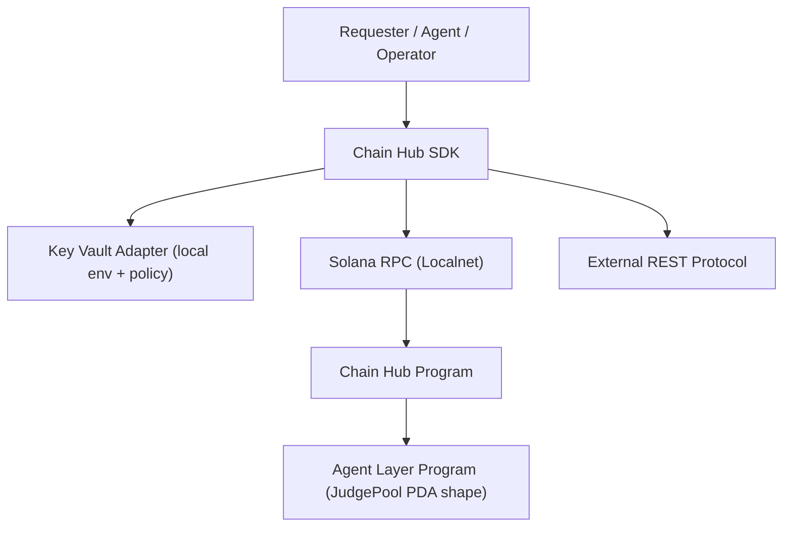
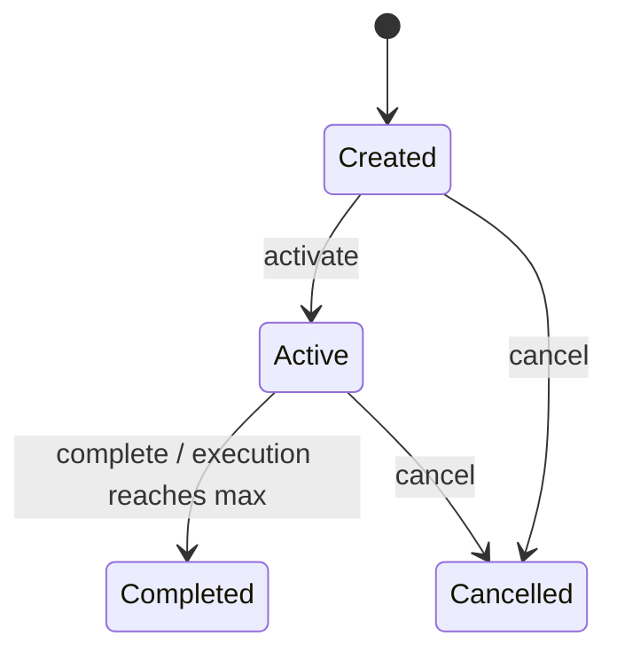

# Phase 2: Architecture — Chain Hub Full v1

> **目的**: 设计 Chain Hub 完整形态（Program + SDK + Key Vault Adapter）的组件边界与数据流。

---

## 2.1 系统概览

### 一句话描述
Chain Hub Full v1 是一个持续委托与协议路由中枢：链上负责可验证状态机，链下 SDK 负责统一调用路由与凭证注入。

### 架构图



## 2.2 组件定义

| 组件 | 职责 | 技术选型 | 状态 |
|------|------|---------|------|
| Chain Hub Program | Skill/Protocol/Delegation 账户与状态机；权限与过期校验 | Rust + Pinocchio | 迭代 |
| Chain Hub SDK | 统一 `invoke(protocol, capability, payload)`；路由 REST/CPI | TypeScript | 新建 |
| Key Vault Adapter | 读取 env 凭证并按策略注入请求；拒绝越权调用 | TypeScript | 新建 |
| Integration Tests | Localnet/LiteSVM 测试全生命周期与负例 | Rust + tsx test | 迭代 |

## 2.3 数据流

### 核心数据流

| 步骤 | 数据 | 从 | 到 | 格式 |
|------|------|----|----|------|
| 1 | skill/protocol 注册参数 | Operator | Chain Hub Program | Borsh |
| 2 | delegation 参数 + policy_hash | Requester | Chain Hub Program | Borsh |
| 3 | execution invoke 请求 | Agent/Daemon | Chain Hub SDK | JSON/TS object |
| 4 | 协议元信息读取 | SDK | Chain Hub Program PDA | account decode |
| 5A | REST 请求 + 凭证注入 | SDK + Key Vault | REST Protocol | HTTP |
| 5B | CPI 调用请求 | SDK | Solana RPC | Tx / instruction |
| 6 | 执行记录 | Agent | Chain Hub Program | Borsh |

## 2.4 依赖关系

### 内部依赖
```
ProgramConfig -> SkillRegistry / ProtocolRegistry / DelegationTask counters
DelegationTask -> SkillEntry + ProtocolEntry + Agent Layer JudgePool seed shape
SDK invoke -> ProtocolEntry metadata + KeyVault policy guard
```

### 外部依赖

| 依赖 | 版本 | 用途 | 是否可替换 |
|------|------|------|-----------|
| pinocchio | ^0.10.1 | on-chain runtime 抽象 | 否 |
| borsh | ^1.6 | 账户与指令序列化 | 否 |
| litesvm | 当前仓库版本 | 本地集成测试 | 可 |
| @solana/kit | 当前仓库版本 | SDK 构造与签名 | 可 |
| fetch API | Node/Bun 内置 | REST 协议调用 | 可 |

## 2.5 状态管理

| 状态名 | 含义 | 谁拥有 | 持久化方式 |
|--------|------|--------|-----------|
| SkillStatus | Skill 是否可被引用 | Program | 链上 PDA |
| ProtocolStatus | Protocol 是否可路由调用 | Program | 链上 PDA |
| DelegationTaskStatus | 持续委托生命周期 | Program | 链上 PDA |
| VaultPolicyCheck | 请求是否满足策略 | SDK | 内存 |

### 状态转换图（DelegationTask）



## 2.6 接口概览

| 接口 | 类型 | 调用方 | 说明 |
|------|------|--------|------|
| initialize/register_skill/set_skill_status | Program ix | Operator | Skill 体系管理 |
| register_protocol/update_protocol_status | Program ix | Operator/Provider | Protocol Registry 双轨 |
| create/activate/record/complete/cancel delegation | Program ix | Requester/Agent/Judge | Delegation 生命周期 |
| upgrade_config | Program ix | upgrade_authority | 配置升级 |
| invoke() | SDK | Agent/Daemon | REST/CPI 统一路由 |
| KeyVaultAdapter.resolveSecret() | SDK内部 | invoke | 凭证注入 |

## 2.7 安全考虑

| 威胁 | 影响 | 缓解措施 |
|------|------|---------|
| 未授权修改配置 | 高 | 所有配置型指令校验 `upgrade_authority` |
| 未授权执行记录 | 高 | `record_delegation_execution` 仅允许 selected_agent signer |
| 过期后继续执行 | 中 | 执行前读取 clock 并拒绝，返回 DelegationExpired |
| Protocol 路由到停用协议 | 中 | SDK 与 Program 双重 status 检查 |
| REST 凭证泄露 | 高 | KeyVault 仅按请求解析注入，不回传原始 secret |
| 策略绕过 | 高 | invoke 前统一 policy guard（method/capability/额度） |

## 2.8 性能考虑

| 指标 | 目标 | 约束 |
|------|------|------|
| Delegation 执行记录 | 单次 tx < 200k CU | Localnet 基线 |
| SDK invoke 路由延迟 | REST 路由开销 < 20ms（不含网络） | 本地进程 |
| 账户读取 | 单次 invoke ≤ 2 次 PDA 读取 | 降低 RPC 往返 |

## 2.9 部署架构

- 链上：Localnet（Surfpool）部署 Chain Hub Program
- 链下：Node/Bun 运行 SDK 与 Key Vault Adapter
- 验证：Rust 集成测试 + TS SDK 单元测试

---

## ✅ Phase 2 验收标准

- [x] 架构图清晰，组件边界明确
- [x] 组件职责已定义（做什么/不做什么）
- [x] 核心数据流覆盖完整
- [x] 依赖关系与状态机已定义
- [x] 接口概览已覆盖 Program + SDK + Key Vault
- [x] 安全威胁映射到可实现措施
