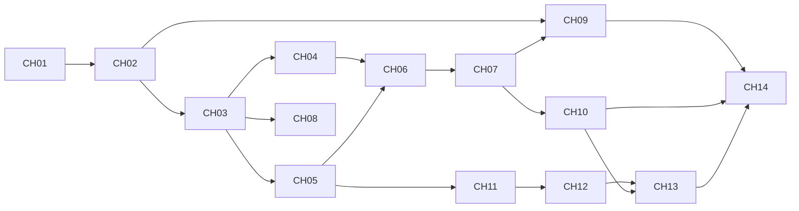

# Phase 4: Task Breakdown — Chain Hub Full v1

> **输入**: `apps/chain-hub/docs/03-technical-spec.md`

---

## 4.1 拆解原则

1. 每个任务 ≤ 4 小时
2. 每个任务有明确 Done 定义
3. 明确依赖关系
4. 先 Program 基础，再 SDK/KeyVault，再联调

## 4.2 任务列表

| # | 任务名称 | 描述 | 依赖 | 预估时间 | 优先级 | Done 定义 |
|---|---------|------|------|---------|--------|----------|
| CH01 | 常量/枚举/错误码扩展 | 增加 protocol/delegation 完整常量、枚举、错误码 | 无 | 2h | P0 | 编译通过，错误码覆盖 spec |
| CH02 | 状态结构体扩展 | ProgramConfig/Registry/Skill/Protocol/Delegation 结构体与长度常量更新 | CH01 | 3h | P0 | 长度单测与 spec 一致 |
| CH03 | initialize 升级 | 新增 ProtocolRegistry 初始化 | CH02 | 1h | P0 | initialize 后 3 个基础 PDA 可读 |
| CH04 | Skill 生命周期 | `register_skill` + `set_skill_status` | CH03 | 2h | P0 | Skill active/paused 可切换 |
| CH05 | Protocol Registry | `register_protocol` + `update_protocol_status` | CH03 | 3h | P0 | REST/CPI 注册校验全部生效 |
| CH06 | Delegation 创建 | `create_delegation_task`（skill/protocol/judge_pool 校验） | CH04, CH05 | 3h | P0 | Created 状态任务可落链 |
| CH07 | Delegation 状态机 | `activate/record/complete/cancel` + 过期拒绝（DelegationExpired） | CH06 | 4h | P0 | 生命周期转换与权限符合 spec |
| CH08 | upgrade_config | 支持升级 authority 与 agent_layer_program | CH03 | 1h | P1 | 权限正确，字段更新生效 |
| CH09 | Program 单测 | 覆盖长度、枚举转换、错误映射 | CH02, CH07 | 2h | P1 | `cargo test -p chain-hub` 全绿 |
| CH10 | 集成测试重写 | LiteSVM 覆盖 Skill/Protocol/Delegation 全流程+负例 | CH07, CH08 | 4h | P0 | 关键 happy/boundary/error 全绿 |
| CH11 | SDK 核心 | 新建 `apps/chain-hub/sdk`，实现 `invoke`/`invokeRest`/`invokeCpi` | CH05 | 3h | P0 | 单测验证双路由 |
| CH12 | Key Vault Adapter | env secret 解析、policy guard、header 注入 | CH11 | 2h | P0 | 非法策略调用被拒绝 |
| CH13 | SDK+Program 联调 | SDK 调用链上 protocol 信息并执行路由 | CH10, CH12 | 3h | P1 | Localnet 端到端可复现 |
| CH14 | 验证与回归 | 运行 build/test，输出本地验收结果 | CH09, CH10, CH13 | 2h | P0 | 所有校验命令通过 |

## 4.3 任务依赖图

## 4.4 里程碑划分

### Milestone 1: Program Full State Machine
**预计完成**: Day 1  
**交付物**: 链上完整账户与生命周期指令（CH01-CH08）

### Milestone 2: 测试与 SDK/KeyVault
**预计完成**: Day 2  
**交付物**: 测试全绿 + invoke 路由 + 凭证策略（CH09-CH13）

### Milestone 3: Localnet 验收
**预计完成**: Day 2  
**交付物**: 可重放验证命令与结果（CH14）

## 4.5 风险识别

| 风险 | 概率 | 影响 | 缓解措施 |
|------|------|------|---------|
| 账户长度与 Borsh 不一致 | 中 | 高 | 先写长度单测，再接入指令 |
| Protocol 双轨校验遗漏 | 中 | 高 | 分类型单测（REST/CPI） |
| Delegation 状态机分支遗漏 | 中 | 高 | 状态转换表逐条对应用例 |
| SDK CPI 路由依赖链上编码 | 中 | 中 | 先做 route 选择单测，CPI 先 mock |
| KeyVault 策略覆盖不足 | 低 | 高 | 增加 capability/method/amount 负例 |

---

## ✅ Phase 4 验收标准

- [x] 每个任务 ≤ 4 小时
- [x] 每个任务有 Done 定义
- [x] 依赖关系明确
- [x] 里程碑 >= 2
- [x] 风险与缓解措施已定义
