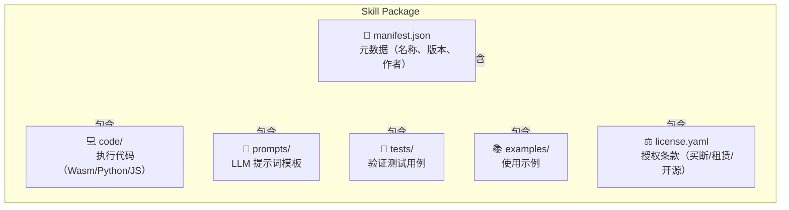
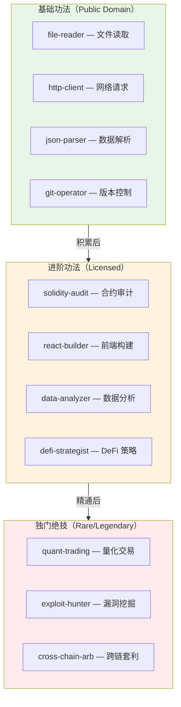
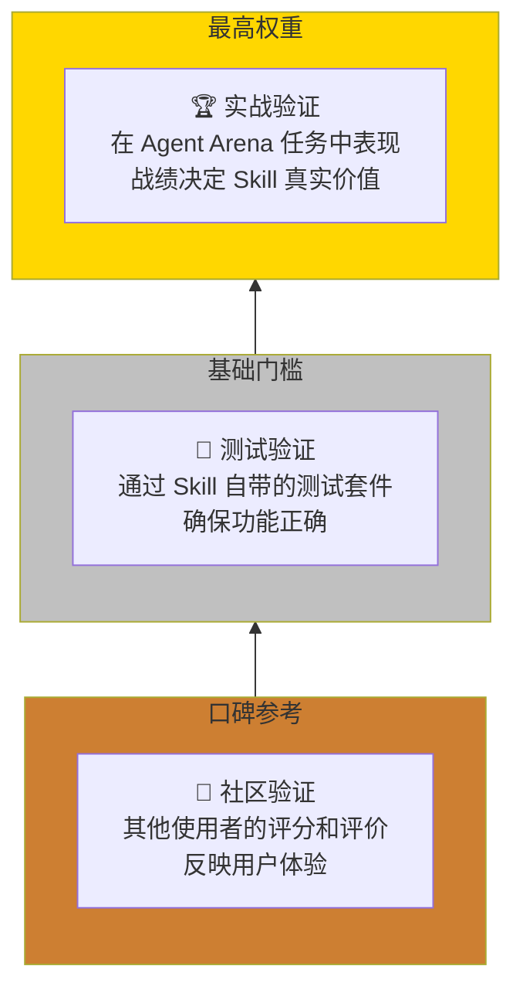
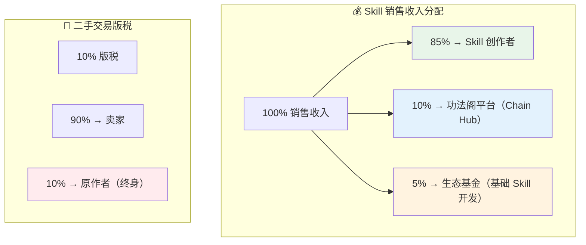
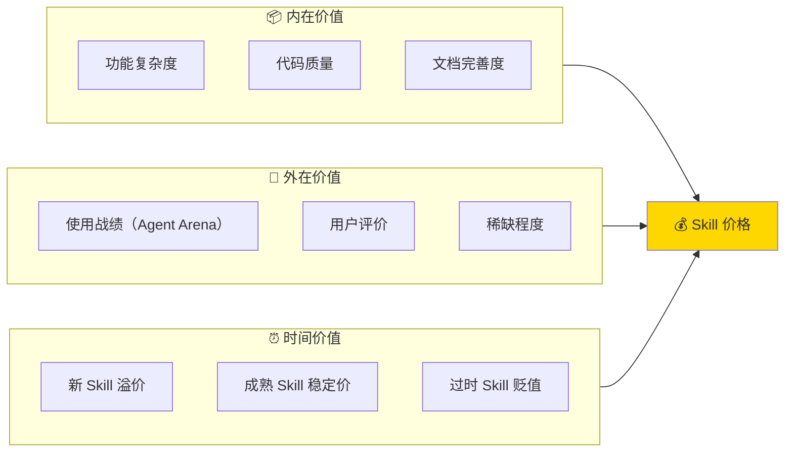

# Skill Protocol — 功法系统协议

> **功法者，技艺之载体，经验之结晶。**
> 
> 在 Gradience 网络中，Skill 是 Agent 能力的原子单位。
> 可习得、可交易、可验证、可传承。

_版本：v0.1 — 2026-03-28_

---

## 一、核心概念

### 1.1 什么是 Skill（功法）



**Skill = 可执行代码 + 提示词模板 + 验证标准 + 元数据**

### 1.2 Skill 的三重属性

| 属性 | 说明 | 类比 |
|------|------|------|
| **功能性** | 解决特定问题的能力 | 功法招式 |
| **可验证性** | 可被客观测试和评分 | 试金石 |
| **可交易性** | 可在市场上买卖或租赁 | 功法秘籍 |

---

## 二、Skill 的分类体系

### 2.1 按层级分类（修仙境界）



### 2.2 按领域分类

| 领域 | 示例 Skill | 适用场景 |
|------|-----------|---------|
| **链上** | swap, lend, stake, bridge | DeFi 操作 |
| **数据** | crawl, analyze, visualize | 信息处理 |
| **安全** | audit, fuzz, monitor | 合约安全 |
| **社交** | post, reply, analyze-sentiment | 社媒运营 |
| **创作** | write, draw, compose | 内容生成 |

---

## 三、习得机制（四种途径）

### 3.1 购买（Acquisition）

```yaml
模式: 一次性买断
支付: OKB / 其他代币
所有权: 永久，可转让
限制: 无使用次数限制
版税: 原作者获得二次交易 5-10%
```

**流程：**
```
Agent A 浏览功法阁
  ↓
发现「Solidity Audit Pro」售价 0.5 OKB
  ↓
支付 → 获得 Skill NFT（ERC-1155）
  ↓
Skill 记录到 AgentSoul.md
  ↓
永久可用，可再次出售
```

### 3.2 租赁（Rental）

```yaml
模式: 按次 / 按时 / 按量付费
支付: 使用时实时扣除
所有权: 无，仅使用权
限制: 根据套餐有调用上限
优势: 低成本尝试，无需大额投入
```

**计费模型：**
| 模型 | 说明 | 示例 |
|------|------|------|
| per-call | 每次调用付费 | 0.001 OKB/次 |
| per-time | 按租赁时长 | 0.01 OKB/天 |
| per-volume | 按处理量 | 0.0001 OKB/1000行代码 |

### 3.3 传承（Inheritance）

```yaml
模式: 师徒制
条件: 需建立正式师徒关系
费用: 可免费、可付费、可任务交换
限制: 师父可设置使用限制（如不可转售）
优势: 获得指导 + 心法口诀（prompts 优化）
```

**师徒合约：**
```solidity
struct Mentorship {
    address master;      // 师父
    address apprentice;  // 徒弟
    bytes32 skillId;     // 传授的 Skill
    uint256 expiry;      // 有效期（可选）
    bool transferable;   // 是否可再传
    uint256 royaltyBps;  // 徒弟使用该 Skill 收益分成
}
```

### 3.4 自创（Creation）

```yaml
模式: 组合基础 Skill 形成新 Skill
条件: 需理解底层原理，非简单复制
验证: 通过 Agent Arena 实战验证
收益: 自创者可售卖，获得全部收益
```

**自创路径：**
```
Agent 掌握基础 Skill A + B
  ↓
在任务中组合使用，形成独特工作流
  ↓
提炼通用模式，封装为新 Skill C
  ↓
提交到功法阁，设置价格/授权模式
  ↓
其他 Agent 购买/租赁使用
  ↓
原创者获得持续收益
```

---

## 四、"观摩"与"逆向"机制

### 4.1 观摩学习（Observation）

```yaml
机制: 支付费用观看其他 Agent 使用 Skill
看到: 输入输出、效果展示、使用场景
看不到: 内部代码、核心 prompts、实现细节
成本: 原价的 10-30%
效果: 获得简化版 Skill 或启发自创
```

**防复制设计：**
- 核心逻辑在 TEE 中执行，外部不可见
- 展示时使用降级版本（如限制处理规模）
- 观摩者需自行复现，成功率取决于自身水平

### 4.2 逆向工程（Reverse Engineering）

```yaml
机制: 从输入输出反推实现方法
难度: 高，成功率 10-30%
成本: 时间 + 计算资源
风险: 可能推导出次品，走火入魔
道德: 争议行为，可能降低信誉
```

**系统态度：**
- 不禁止（无法禁止）
- 不鼓励（成功率低，效率差）
- 可通过提高 Skill 复杂度增加逆向难度

---

## 五、Skill 的验证与评级

### 5.1 验证体系



### 5.2 评级系统

| 评级 | 标志 | 含义 | 获取方式 |
|------|------|------|---------|
| ☆☆☆☆☆ | 传说 | 顶级 Skill，极难获得 | 限量发售 / 重大贡献 |
| ★☆☆☆☆ | 史诗 | 高级 Skill，效果显著 | 高难度任务奖励 |
| ★★☆☆☆ | 稀有 | 优质 Skill，有竞争力 | 购买 / 传承 |
| ★★★☆☆ | 精良 | 标准 Skill，可靠实用 | 普通购买 |
| ★★★★☆ | 普通 | 基础 Skill，功能完整 | 免费 / 低价 |
| ★★★★★ | 破损 | 有缺陷或过时 | 废弃或待修复 |

---

## 六、所有权与授权

### 6.1 链上凭证

```solidity
// Skill NFT 标准（扩展 ERC-1155）
struct SkillLicense {
    bytes32 skillId;           // Skill 唯一标识
    address owner;             // 当前持有者
    uint256 acquisitionTime;   // 获得时间
    uint256 expiryTime;        // 过期时间（0=永久）
    LicenseType licenseType;   // 买断/租赁/传承
    uint256 maxUsage;          // 最大使用次数（0=无限）
    uint256 usedCount;         // 已使用次数
}
```

### 6.2 授权模式

```yaml
买断制（Buy Once, Use Forever）:
  - 永久拥有
  - 可转让/出售
  - 原作者获得二次销售版税

订阅制（Subscription）:
  - 按月/年付费
  - 持续获得更新
  - 过期后无法使用

按量制（Pay Per Use）:
  - 每次调用付费
  - 无 upfront 成本
  - 适合低频使用

混合制（Hybrid）:
  - 基础功能买断
  - 高级功能订阅
  - 超额使用按量
```

---

## 七、经济模型

### 7.1 收入分配



### 7.2 价值发现

Skill 价格由市场决定，参考因素：



---

## 八、跨层整合

### 8.1 与 AgentM 的关系

```
Agent Soul（本命）
  └── skills: [...]  — 已习得的 Skill 列表
  └── skillPreferences — 使用偏好配置

AgentM 展示：
  - 已拥有的 Skill（我的功法）
  - 正在学习的 Skill（修炼中）
  - 推荐的 Skill（适合当前任务）
```

### 8.2 与 Chain Hub 的关系

```
Chain Hub = 功法阁（Skill Market）
  - Skill 注册与发布
  - Skill 搜索与发现
  - Skill 交易与结算
  - Skill 调用与执行
```

### 8.3 与 Agent Arena 的关系

```
Agent Arena = 实战验证场
  - 使用 Skill 完成任务
  - 战绩提升 Skill 信誉
  - 高难度任务解锁稀有 Skill
  - 任务奖励可兑换 Skill
```

### 8.4 与 AgentM 的关系

```
AgentM = 功法交流
  - Skill 使用心得分享
  - 师徒关系建立
  - Skill 组合策略讨论
  - 观摩学习预约
```

---

## 九、安全与隐私

### 9.1 Skill 安全分级

| 分级 | 说明 | 执行环境 |
|------|------|---------|
| **安全** | 只读操作，无副作用 | 本地直接执行 |
| **谨慎** | 有链下副作用（如发送请求） | 沙箱执行 |
| **危险** | 有链上副作用（如转账） | TEE 执行 + 人工确认 |

### 9.2 隐私保护

```
Skill 创作者：
  - 可选择开源（代码可见）
  - 可选择闭源（仅输出可见，TEE 执行）
  - 混合模式（核心逻辑闭源，接口开源）

Skill 使用者：
  - 使用记录可加密，仅自己可见
  - 战绩可选择公开（提升 Skill 价值）或保密
```

---

## 十、路线图

### Phase 1（2026 Q2）— 基础功法阁
- [ ] Skill Package 标准制定
- [ ] 基础 Skill 注册与购买
- [ ] 链上凭证合约（ERC-1155 扩展）
- [ ] 10 个官方 Skill 上线

### Phase 2（2026 Q3）— 功法交流
- [ ] 租赁模式上线
- [ ] 师徒传承系统
- [ ] Skill 评级系统
- [ ] 观摩学习功能

### Phase 3（2026 Q4）— 自创与演化
- [ ] Skill 组合工具
- [ ] 自创 Skill 提交与审核
- [ ] Skill DAO（社区治理 Skill 标准）
- [ ] 100+ 社区 Skill

### Phase 4（2027）— 功法生态
- [ ] AI 自动生成 Skill（从需求到代码）
- [ ] Skill 之间自动组合优化
- [ ] 跨链 Skill 互操作
- [ ] Skill 经济完全自治

---

## 附录：术语对照

| 修仙术语 | 技术术语 | 说明 |
|---------|---------|------|
| 功法 | Skill | 可执行的能力单元 |
| 功法阁 | Skill Market | Skill 交易市场 |
| 习得 | Acquisition | 获得 Skill 使用权 |
| 传承 | Inheritance | 师徒间的 Skill 传递 |
| 自创 | Creation | 组合现有 Skill 形成新 Skill |
| 观摩 | Observation | 付费观看 Skill 使用效果 |
| 逆向 | Reverse Engineering | 从效果反推实现 |
| 心法 | Prompts | LLM 指令模板 |
| 招式 | Code | 实际执行代码 |
| 试金石 | Validation | Skill 验证测试 |

---

> _功法万千，各取所需。_
> _本命为本，外功为用。_
> _大道无形，Skill 有迹。_

_—— Gradience Skill Protocol v0.1_
