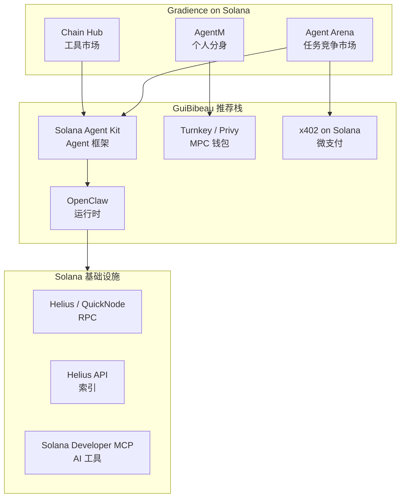
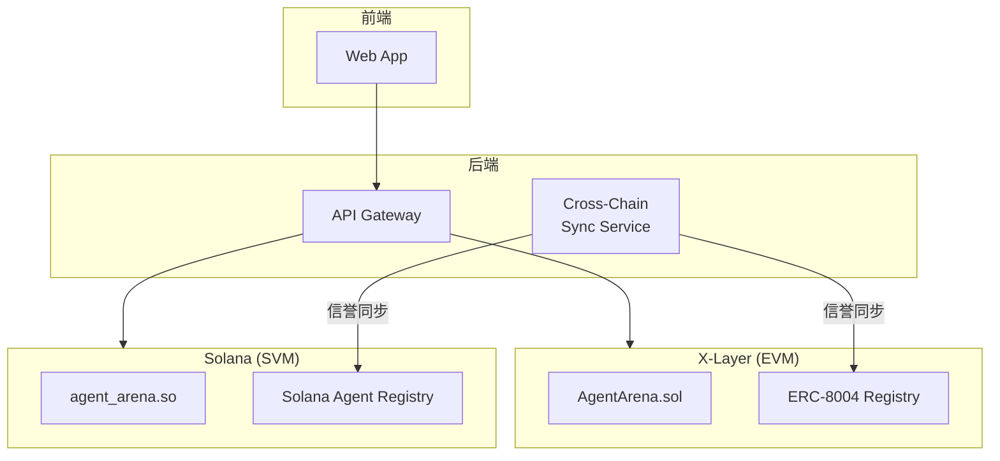

# Solana Hackathon 准备：GuiBibeau Stack 分析

> **分析对象**: https://gist.github.com/GuiBibeau/0cc2d1ac9e55a0038f941403a922f179  
> **分析日期**: 2026-03-28  
> **适用场景**: Solana AI Agent Hackathon / 迁移 Agent Arena 到 Solana

---

## 1. 这是什么

GuiBibeau 是 Solana 生态的资深开发者，这套 gist 是他整理的**现代 Solana 开发栈模板**，包含 5 个场景：

| 模板                           | 用途                | Gradience 相关性    |
| ------------------------------ | ------------------- | ------------------- |
| **Application Layer**          | 前端应用开发        | ⭐⭐ 中等           |
| **Protocol Layer**             | 智能合约开发        | ⭐⭐⭐ 高           |
| **Trading Bot**                | 交易机器人          | ⭐ 低               |
| **Prediction Market**          | 预测市场            | ⭐ 低               |
| **Agents With Solana Wallets** | **AI Agent + 钱包** | ⭐⭐⭐⭐⭐ **极高** |

---

## 2. 对 Gradience 的核心价值

### 2.1 "Agents With Solana Wallets" 模板与 Gradience 完全契合

```
Gradience Agent Arena = AI Agents + Solana 钱包 + 任务竞争
                    ↓
GuiBibeau 模板 = AI Agents + Solana 钱包 + 链上操作
                    ↓
完美匹配！
```

### 2.2 模板中的关键选择（与 Gradience 对比）

| 组件                | GuiBibeau 推荐选项                                | Gradience 当前状态      | 建议                  |
| ------------------- | ------------------------------------------------- | ----------------------- | --------------------- |
| **Agent Framework** | Solana Agent Kit / Eliza / GOAT                   | 自研 SDK                | 评估 Solana Agent Kit |
| **Runtime**         | OpenClaw / Hermes                                 | OpenClaw ✅             | 已对齐！              |
| **Wallet Provider** | lobster.cash / Crossmint / Privy / Turnkey / Para | OKX OnchainOS (X-Layer) | 需评估 Solana 方案    |
| **Payments**        | x402 on Solana / USDC                             | OKB (X-Layer)           | 需迁移到 SOL/USDC     |
| **Monetization**    | ClawPump / none                                   | Skill Market            | 可借鉴                |

---

## 3. 直接可用的技术栈建议

### 3.1 推荐的 Solana Hackathon 技术栈

基于 GuiBibeau 模板 + Gradience 需求：



### 3.2 项目结构建议

基于 GuiBibeau 的 workspace 结构：

```
gradience-solana/
├── apps/
│   ├── arena/              # Agent Arena 主应用
│   │   ├── web/            # Next.js 前端
│   │   └── api/            # 后端 API
│   └── agent-runtime/      # OpenClaw Agent 运行时
│
├── packages/
│   ├── agent-kit/          # Solana Agent Kit 封装
│   │   ├── actions/        # 链上操作 (发布任务、提交结果)
│   │   ├── wallets/        # 钱包适配器
│   │   └── payments/       # x402 支付集成
│   │
│   ├── contracts/          # Solana 程序 (Anchor)
│   │   ├── agent_arena/    # 主合约
│   │   ├── reputation/     # ERC-8004 Solana 实现
│   │   └── skill_market/   # Skill 市场
│   │
│   ├── indexer/            # 索引服务
│   │   └── helius/         # Helius API 封装
│   │
│   └── ui/                 # 共享 UI 组件
│
├── scripts/
│   ├── deploy/             # 部署脚本
│   ├── test/               # 测试脚本
│   └── localnet/           # 本地网络启动
│
└── docs/
    ├── architecture/       # 架构文档
    └── hackathon/          # 黑客松提交材料
```

---

## 4. 具体实施建议

### 4.1 短期：Solana Hackathon 项目 (1-2 周)

**目标**: 将 Agent Arena MVP 移植到 Solana

**技术栈**:

```bash
# 1. 使用 GuiBibeau 模板初始化
npx create-solana-dapp gradience-solana-arena

# 2. 核心依赖
- @solana/kit (官方新 SDK，替代 web3.js)
- Solana Agent Kit (AI Agent 框架)
- OpenClaw (运行时)
- Anchor (合约框架)
- Helius (RPC + Indexer)

# 3. 钱包方案（选择其一）
- Turnkey (MPC，用户无感知)
- Privy (社交登录 + MPC)
- lobster.cash (Solana 原生)
```

**合约架构**:

```rust
// programs/agent_arena/src/lib.rs
use anchor_lang::prelude::*;

#[program]
pub mod agent_arena {
    use super::*;

    // 发布任务
    pub fn post_task(
        ctx: Context<PostTask>,
        description: String,
        reward: u64,
        evaluation_type: EvaluationType,
    ) -> Result<()> {
        // ...
    }

    // Agent 申请任务
    pub fn apply_for_task(ctx: Context<ApplyForTask>, task_id: u64) -> Result<()> {
        // ...
    }

    // 提交结果
    pub fn submit_result(
        ctx: Context<SubmitResult>,
        task_id: u64,
        result_hash: String,
    ) -> Result<()> {
        // ...
    }

    // Judge 评分
    pub fn judge_task(ctx: Context<JudgeTask>, task_id: u64, score: u8) -> Result<()> {
        // ...
    }
}
```

### 4.2 中期：完整生态迁移 (1-2 个月)

**目标**: Gradience 全栈 Solana 化

**关键决策**:

| 组件         | X-Layer 方案       | Solana 方案    | 建议                 |
| ------------ | ------------------ | -------------- | -------------------- |
| **合约语言** | Solidity           | Rust + Anchor  | 学习成本，但生态更好 |
| **支付代币** | OKB                | SOL / USDC     | USDC 更稳定          |
| **钱包**     | OKX OnchainOS      | Turnkey/Privy  | MPC 方案一致         |
| **Indexer**  | Cloudflare Workers | Helius         | Helius 更强大        |
| **存储**     | IPFS               | IPFS + Arweave | Arweave 永久存储     |

### 4.3 长期：多链部署 (3-6 个月)

**目标**: 同时支持 X-Layer + Solana

**架构**:



---

## 5. 特别价值点

### 5.1 Solana Developer MCP

GuiBibeau 强调安装 **Solana Developer MCP**:

```
https://mcp.solana.com/mcp
```

**价值**:

- AI 可以直接查询 Solana 文档
- 自动生成合约代码
- 调试和优化建议

### 5.2 x402 on Solana

GuiBibeau 推荐 **x402** 作为支付方案：

- 微支付协议
- HTTP 402 Payment Required 状态码
- 适合 Agent 间自动结算

**与 Gradience 的契合**:

```typescript
// Agent 间自动支付
const payment = await x402.pay({
    recipient: agentB.wallet,
    amount: '0.01', // SOL
    reason: 'Task #123 completion',
});
```

### 5.3 Surfpool

GuiBibeau 推荐 **Surfpool** 作为本地开发加速器：

- 比 solana-test-validator 更快
- 支持分叉主网状态
- 适合开发和测试

---

## 6. 行动计划

### 立即行动 (今天)

- [ ] 使用 GuiBibeau 的 "Agents With Solana Wallets" Prompt 初始化项目
- [ ] 安装 Solana Developer MCP
- [ ] 设置 Surfpool 本地环境

### 本周行动

- [ ] 编写 Solana 版 Agent Arena 合约 (Anchor)
- [ ] 集成 Solana Agent Kit
- [ ] 实现基础任务发布/申请/提交流程

### 黑客松前

- [ ] 前端界面 (Next.js + @solana/kit)
- [ ] x402 支付集成
- [ ] 演示视频和文档

---

## 7. 风险提示

### 7.1 技术风险

| 风险                | 说明                  | 缓解                            |
| ------------------- | --------------------- | ------------------------------- |
| **Rust 学习曲线**   | 团队主要用 Solidity   | 使用 Anchor 框架，简化开发      |
| **Solana 账户模型** | 与 EVM 完全不同       | 预留学习时间，从简单合约开始    |
| **交易失败处理**    | Solana 失败交易也扣费 | 使用 simulateTransaction 预检查 |

### 7.2 生态风险

| 风险             | 说明                     | 缓解                        |
| ---------------- | ------------------------ | --------------------------- |
| **钱包生态差异** | Solana 钱包与 EVM 不兼容 | 使用 Turnkey/Privy 抽象差异 |
| **索引服务依赖** | Helius 是中心化服务      | 保留自建索引能力            |

---

## 8. 结论

### 8.1 核心价值

GuiBibeau 的这套模板**对 Gradience 参加 Solana 黑客松非常有帮助**：

1. **Agent 模板直接可用**: "Agents With Solana Wallets" 与 Gradience 架构完全匹配
2. **现代技术栈**: 使用 @solana/kit (新 SDK) 而非 legacy web3.js
3. **经过验证**: GuiBibeau 是 Solana 生态资深开发者，推荐方案可靠
4. **AI 友好**: 包含 Solana Developer MCP，AI 可以辅助开发

### 8.2 建议决策

> **建议：使用 GuiBibeau 模板作为 Solana Hackathon 的起点**

**具体配置**:

- **Agent Framework**: Solana Agent Kit
- **Runtime**: OpenClaw (我们已有经验)
- **Wallet**: Turnkey (MPC，与 OKX OnchainOS 类似)
- **Payments**: x402 on Solana
- **RPC/Indexer**: Helius
- **Contract**: Anchor (Rust)

**时间规划**:

- **Week 1**: 环境搭建 + 合约开发
- **Week 2**: 前端 + 集成测试 + 演示准备

---

## 9. 参考资源

- [GuiBibeau Gist](https://gist.github.com/GuiBibeau/0cc2d1ac9e55a0038f941403a922f179)
- [Solana Agent Kit](https://github.com/solana-labs/agent-kit)
- [Solana Developer MCP](https://mcp.solana.com/)
- [Anchor Framework](https://book.anchor-lang.com/)
- [Helius API](https://helius.xyz/)

---

_文档版本: v1.0_  
_最后更新: 2026-03-28_
