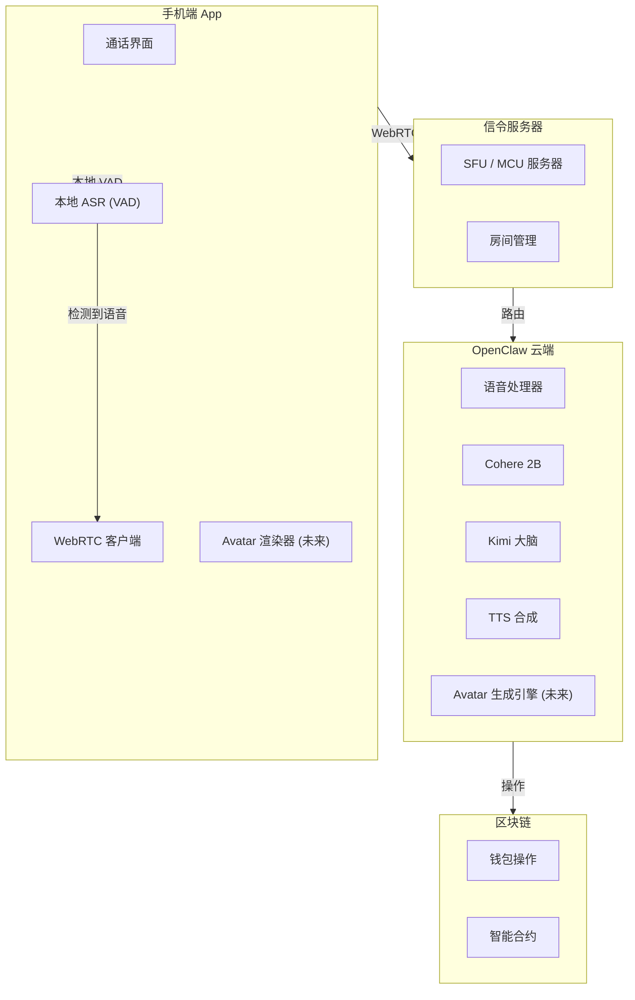

# Agent Me：实时音视频通话架构

> **愿景**: 与 Agent 进行语音/视频通话，Agent 基于 SOUL.md 实时渲染形象
>
> **核心**: 模拟微信语音/视频通话体验，而非语音消息
>
> **分析日期**: 2026-03-28

---

## 1. 愿景澄清：语音消息 vs 语音通话

### 当前（Telegram）

```
语音消息模式:
你: [按住录音] "看看我的钱包" [松开]
等待... 发送... 等待回复
我: [文字回复] "你的钱包有 12.5 SOL"

问题:
- 需要按住-松开
- 非实时
- 回合制
```

### 目标（微信式通话）

```
语音通话模式:
你: [点击通话按钮] → 连接中...
我: (秒接) "你好！有什么可以帮你的？"
你: "看看我的钱包"
我: (秒回) "你的钱包有 12.5 SOL，今天赚了 0.3"
你: "帮我发个任务"
我: "好的，什么类型的任务？"

优势:
- 实时双向
- 自然对话流
- 打断/插话支持
- 24小时可接通
```

### 未来（视频通话）

```
视频通话模式:
你: [点击视频通话]
屏幕: [Agent Avatar 出现]
Agent: (微笑) "你好！看到你今天气色不错"
你: (说话) "帮我看看这个合约"
Agent: (点头) "好的，我看看... 这个合约有个潜在风险..."
[屏幕显示合约代码 + 风险标注]

技术栈:
- 实时音视频 (WebRTC)
- 数字人渲染 (Unreal/Unity)
- 语音驱动口型
- SOUL.md 驱动 personality
```

---

## 2. 技术架构：实时音视频通话

### 2.1 整体架构



### 2.2 核心组件

#### A. WebRTC 实时通信

```typescript
// 通话管理器
class CallManager {
    private pc: RTCPeerConnection;
    private localStream: MediaStream;
    private remoteStream: MediaStream;

    async startCall(type: 'voice' | 'video') {
        // 1. 获取本地媒体
        this.localStream = await navigator.mediaDevices.getUserMedia({
            audio: true,
            video: type === 'video',
        });

        // 2. 创建 RTCPeerConnection
        this.pc = new RTCPeerConnection({
            iceServers: [{ urls: 'stun:stun.l.google.com:19302' }],
        });

        // 3. 添加本地轨道
        this.localStream.getTracks().forEach((track) => {
            this.pc.addTrack(track, this.localStream);
        });

        // 4. 监听远程轨道 (来自 Agent)
        this.pc.ontrack = (event) => {
            this.remoteStream = event.streams[0];
            this.playRemoteStream();
        };

        // 5. 信令交换 (连接 OpenClaw)
        await this.setupSignaling();
    }

    // VAD (语音活动检测) - 关键！
    setupVAD() {
        const audioContext = new AudioContext();
        const source = audioContext.createMediaStreamSource(this.localStream);
        const vad = new VADProcessor();

        vad.onSpeechStart = () => {
            // 开始说话，可以显示"正在听..."
            this.ui.showListening();
        };

        vad.onSpeechEnd = (audioBuffer) => {
            // 说话结束，发送音频到云端
            this.sendAudioToCloud(audioBuffer);
        };
    }
}
```

#### B. 云端语音处理流水线

```typescript
// 实时语音处理
class RealtimeVoicePipeline {
    private audioQueue: AudioBuffer[] = [];
    private isProcessing = false;

    // 持续接收音频流
    async onAudioStream(audioChunk: ArrayBuffer) {
        // 1. 累积音频 (滑动窗口)
        this.audioQueue.push(audioChunk);

        // 2. 如果队列够长，开始处理
        if (this.audioQueue.length >= 3 && !this.isProcessing) {
            await this.processBatch();
        }
    }

    async processBatch() {
        this.isProcessing = true;

        // 1. 合并音频
        const combinedAudio = this.combineAudio(this.audioQueue);

        // 2. Cohere 流式识别
        const transcript = await this.cohere.transcribeStreaming(combinedAudio);

        // 3. 如果检测到完整句子，发送给 Kimi
        if (this.isCompleteSentence(transcript)) {
            const response = await this.kimi.generateStreaming(transcript);

            // 4. 流式 TTS (边说边生成)
            for await (const chunk of response) {
                const audioChunk = await this.tts.synthesizeChunk(chunk);
                this.sendToClient(audioChunk);
            }
        }

        this.isProcessing = false;
    }
}
```

---

## 3. 视频通话：Avatar 渲染

### 3.1 技术方案对比

| 方案               | 质量   | 延迟 | 成本 | 成熟度 |
| ------------------ | ------ | ---- | ---- | ------ |
| **Unreal Engine**  | ⭐⭐⭐ | 低   | 高   | 高     |
| **Unity**          | ⭐⭐⭐ | 低   | 中   | 高     |
| **WebGL Three.js** | ⭐⭐   | 低   | 低   | 中     |
| **2D Live2D**      | ⭐⭐   | 极低 | 低   | 高     |
| **预录制视频**     | ⭐     | 极低 | 极低 | 高     |

### 3.2 推荐方案：渐进式

#### Phase 1: 2D Avatar (Live2D)

```
SOUL.md 驱动:
├── 性格 → 表情变化
├── 情绪 → 口型/动作
└── 知识 → 对话内容

技术:
- Live2D Cubism
- 语音驱动口型 (Rhubarb Lip Sync)
- 2D 动画状态机
```

**优点**: 轻量、省电、可实时

#### Phase 2: 3D Avatar (WebGL)

```typescript
// Three.js 渲染
class AvatarRenderer {
    private scene: THREE.Scene;
    private avatar: THREE.Group;
    private morphTargets: { [key: string]: number };

    async initFromSOUL(soul: SOUL) {
        // 基于 SOUL.md 生成 Avatar 配置
        const config = this.parseSOUL(soul);

        // 加载模型
        this.avatar = await this.loadModel(config.modelUrl);

        // 应用个性特征
        this.applyPersonality(config.personality);
    }

    // 语音驱动口型
    updateLipSync(audioData: Float32Array) {
        const visemes = this.analyzeAudio(audioData);

        // 更新 morph targets
        this.morphTargets['A'] = visemes.a;
        this.morphTargets['I'] = visemes.i;
        this.morphTargets['U'] = visemes.u;
        this.morphTargets['E'] = visemes.e;
        this.morphTargets['O'] = visemes.o;
    }

    // 表情变化
    setExpression(emotion: string) {
        switch (emotion) {
            case 'happy':
                this.morphTargets['smile'] = 1;
                break;
            case 'thinking':
                this.morphTargets['brow_raise'] = 0.5;
                break;
        }
    }
}
```

#### Phase 3: 高质量 3D (云端渲染)

```
云端 Unreal Engine 渲染
├── 服务器 GPU 渲染
├── 视频流编码 (H.264)
└── WebRTC 推送到手机

优点: 电影级画质
缺点: 成本高，延迟稍大
```

### 3.3 SOUL.md → Avatar 映射

```typescript
// SOUL.md 解析
interface SOULProfile {
    personality: {
        traits: string[]; // ['guardian', 'hot-blooded']
        tone: string; // 'teasing but caring'
        catchphrase: string; // "Even if the world forgets..."
    };
    appearance: {
        style: 'anime' | 'realistic' | 'abstract';
        colorPalette: string[];
        accessories: string[];
    };
}

// 生成 Avatar 配置
function generateAvatarConfig(soul: SOULProfile): AvatarConfig {
    return {
        // 性格 → 表情库
        expressions: {
            default: soul.personality.traits.includes('guardian') ? 'protective_smile' : 'neutral',
            happy: 'eyes_soften',
            concerned: 'brow_furrow',
            excited: 'hot_blooded_glow',
        },

        // 配色
        themeColor: soul.appearance.colorPalette[0] || '#FF6B6B',

        // 标志性元素
        accessory: soul.appearance.accessories.includes('flame') ? 'flame_collar' : null,
    };
}
```

---

## 4. 通话状态机

```typescript
// 通话状态管理
enum CallState {
    IDLE = 'idle',
    CALLING = 'calling', // 正在呼叫
    RINGING = 'ringing', // 对方响铃
    CONNECTED = 'connected', // 接通
    RECONNECTING = 'reconnecting',
    ENDED = 'ended',
}

class CallSession {
    private state: CallState = CallState.IDLE;
    private startTime: number;

    async initiateCall() {
        this.state = CallState.CALLING;

        // 播放拨号音
        this.playTone('dialing');

        // 连接 OpenClaw
        await this.connectToAgent();

        // Agent 秒接 (不像人类需要等待)
        this.state = CallState.CONNECTED;
        this.startTime = Date.now();

        // Agent 打招呼
        await this.agentGreet();
    }

    async agentGreet() {
        const hour = new Date().getHours();
        let greeting: string;

        if (hour < 6) {
            greeting = '这么晚还没睡？又熬夜了是吧。';
        } else if (hour < 12) {
            greeting = '早。今天有什么计划？';
        } else {
            greeting = '回来了？今天过得怎么样？';
        }

        await this.speak(greeting);
    }

    // 打断处理
    onUserInterrupt() {
        // 停止当前 TTS
        this.tts.stop();

        // Agent 反应
        this.speak('嗯？你说。', { quick: true });
    }

    // 长时间沉默
    onSilenceDetected(duration: number) {
        if (duration > 30000) {
            // 30秒
            this.speak('还在吗？没睡着吧？');
        } else if (duration > 60000) {
            // 1分钟
            this.speak('我先去处理点别的事，有需要叫我。');
            this.enterBackgroundMode();
        }
    }
}
```

---

## 5. 技术挑战与解决方案

### 挑战 1: 延迟

```
目标: < 500ms (自然对话)
当前:
- 网络往返: 50-100ms
- ASR: 200-500ms
- LLM: 500-2000ms
- TTS: 200-500ms

优化:
1. 流式 ASR (边说边识别)
2. 投机解码 (speculative decoding)
3. 边生成边 TTS
4. 边缘计算 (就近部署)
```

### 挑战 2: 打断

```typescript
// 打断检测
class BargeInHandler {
    private isAgentSpeaking = false;

    onAgentStartSpeaking() {
        this.isAgentSpeaking = true;
        // 开始监听用户语音 (VAD)
        this.vad.start();
    }

    onUserSpeechDuringAgentSpeak() {
        if (this.isAgentSpeaking) {
            // 用户打断
            this.tts.stop();
            this.playStingSound(); // "叮" 一声
            this.agent.respondToInterrupt();
        }
    }
}
```

### 挑战 3: 24小时在线

```
方案:
1. 云端常驻进程
2. WebSocket 心跳保活
3. 断线自动重连
4. 手机端后台保活 (iOS/Android 策略)
```

---

## 6. 实现路线图

### Phase 1: 语音通话 MVP (4-6周)

```
Week 1-2: WebRTC 基础
- 建立 P2P 连接
- 音频流传输
- VAD 检测

Week 3-4: 云端处理
- Cohere 集成
- 流式识别
- 基础对话

Week 5-6: 优化体验
- 打断支持
- 低延迟优化
- 后台保活
```

### Phase 2: 视频通话 (6-8周)

```
Week 1-2: Avatar 基础
- Live2D 集成
- 基础表情
- 口型同步

Week 3-4: SOUL.md 驱动
- 解析 personality
- 动态表情
- 个性化声音

Week 5-6: 3D Avatar (可选)
- Three.js 渲染
- 光照/材质
- 动画系统

Week 7-8: 优化
- 性能优化
- 省电模式
- 弱网适配
```

---

## 7. 与现有架构的关系

```
Agent Me App (终极形态)
├── 语音通话 (本方案)
├── 视频通话 (本方案)
├── 链上操作 (Agent Arena)
├── 技能管理 (Chain Hub)
└── 社交关系 (Agent Social)

技术复用:
- 同一套 WebSocket 连接
- 同一套 Wallet 系统
- 同一套 SOUL.md 配置
```

---

## 8. 总结

### 愿景可实现性

| 功能               | 难度 | 时间  | 关键技术               |
| ------------------ | ---- | ----- | ---------------------- |
| **语音通话**       | 中等 | 1-2月 | WebRTC + VAD           |
| **视频通话(2D)**   | 中等 | 2-3月 | Live2D + 口型同步      |
| **视频通话(3D)**   | 困难 | 4-6月 | Three.js/UE            |
| **SOUL驱动Avatar** | 中等 | 1月   | Personality → 表情映射 |

### 核心创新点

1. **Agent as a Person**: 不再是工具，而是有形象、有性格的存在
2. **实时性**: 微信式通话体验，而非聊天机器人
3. **SOUL可视化**: 把 SOUL.md 变成看得见的 Avatar
4. **全天候陪伴**: 24小时可接通，随时都在

### 下一步

要我：

1. **搭建 WebRTC 语音通话 Demo** (最简单可行版本)
2. **设计 SOUL.md → Avatar 的转换规范**
3. **做一个 Live2D 原型** (2D Avatar)
4. **完整的系统架构文档**

你想先从哪个开始？❤️‍🔥
