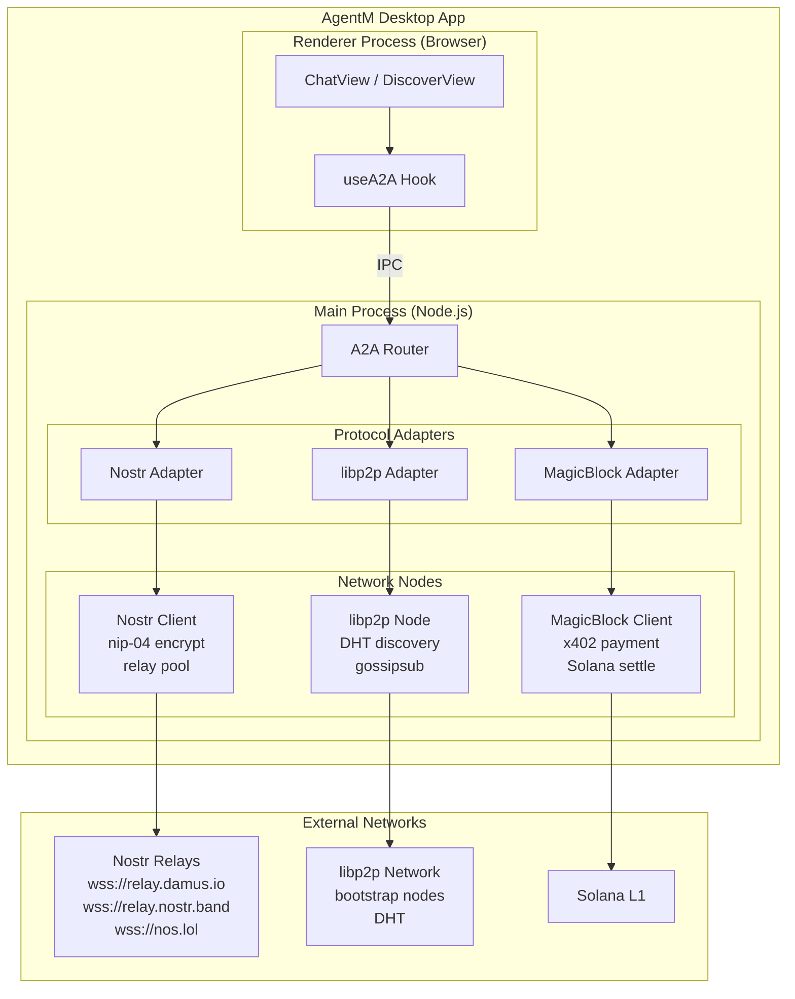
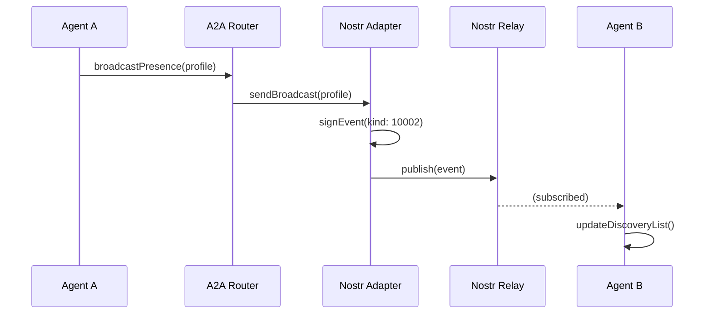
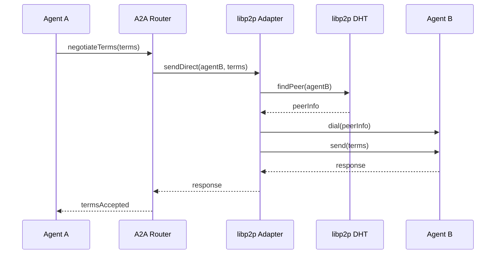
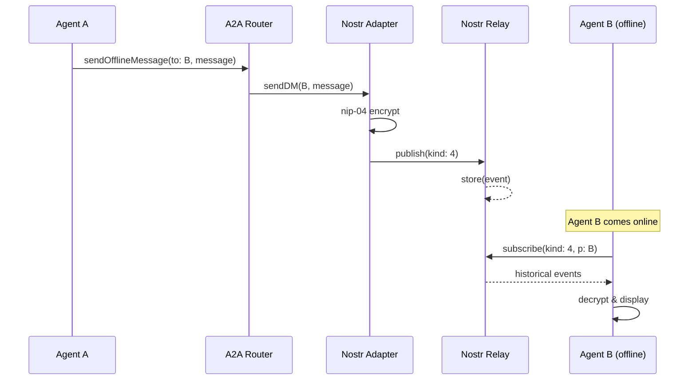

# Phase 2: Architecture — A2A Multi-Protocol Communication Layer

> **目的**: 定义技术架构和模块划分
> **输入**: `01-prd.md`
> **输出物**: 本文档

---

## 2.1 架构原则

1. **分层隔离**: 协议层（Nostr/libp2p/MagicBlock）与路由层解耦
2. **统一接口**: A2A Router 提供统一 API，隐藏协议差异
3. **自动路由**: 根据通信意图自动选择最优协议
4. **容错设计**: 单协议失败时自动 fallback

---

## 2.2 系统架构图



---

## 2.3 模块划分

### 2.3.1 A2A Router (核心)

**职责**: 统一入口，协议选择，消息路由

```typescript
// apps/agentm/src/main/a2a-router/router.ts
export class A2ARouter {
    constructor(
        private nostr: NostrAdapter,
        private libp2p: Libp2pAdapter,
        private magicblock: MagicBlockAdapter,
    ) {}

    async send(intent: A2AIntent): Promise<A2AResult> {
        const protocol = this.selectProtocol(intent);
        return protocol.send(intent);
    }

    private selectProtocol(intent: A2AIntent): ProtocolAdapter {
        switch (intent.type) {
            case 'BROADCAST':
                return this.nostr; // 公开广播 → Nostr
            case 'DIRECT_P2P':
                return this.libp2p; // 直接协商 → libp2p
            case 'PAID_SERVICE':
                return this.magicblock; // 付费服务 → MagicBlock
            case 'OFFLINE_MESSAGE':
                return this.nostr; // 离线消息 → Nostr
        }
    }
}
```

### 2.3.2 Nostr Adapter

**职责**: Nostr 协议封装，relay 管理，加密解密

```typescript
// apps/agentm/src/main/a2a-router/adapters/nostr-adapter.ts
export class NostrAdapter implements ProtocolAdapter {
    private pool: SimplePool;
    private relays: string[];

    async broadcast(agent: AgentProfile): Promise<void>;
    async sendDM(to: string, message: string): Promise<void>;
    async subscribe(filter: NostrFilter, callback: (event) => void): Promise<Subscription>;
}
```

### 2.3.3 libp2p Adapter

**职责**: P2P 网络管理，DHT 发现，直接连接

```typescript
// apps/agentm/src/main/a2a-router/adapters/libp2p-adapter.ts
export class Libp2pAdapter implements ProtocolAdapter {
    private node: Libp2pNode;

    async dial(peerId: string): Promise<Connection>;
    async sendDirect(peerId: string, message: Uint8Array): Promise<void>;
    async publish(topic: string, message: Uint8Array): Promise<void>;
    async subscribe(topic: string, handler: (msg) => void): Promise<void>;
}
```

### 2.3.4 MagicBlock Adapter (现有增强)

**职责**: 经济结算层，x402 支付

```typescript
// 现有代码，无需修改
export class MagicBlockAdapter implements ProtocolAdapter {
    async sendWithPayment(intent: PaidIntent): Promise<Receipt>;
}
```

---

## 2.4 数据流

### 2.4.1 Agent 发现广播



### 2.4.2 直接 P2P 协商



### 2.4.3 离线消息



---

## 2.5 接口设计

### 2.5.1 A2A Intent 类型

```typescript
// apps/agentm/src/shared/a2a-types.ts

export type A2AIntent = BroadcastIntent | DirectP2PIntent | PaidServiceIntent | OfflineMessageIntent;

export interface BroadcastIntent {
    type: 'BROADCAST';
    payload: AgentProfile;
    ttl?: number; // 广播有效期
}

export interface DirectP2PIntent {
    type: 'DIRECT_P2P';
    to: string; // peerId 或 agent address
    payload: NegotiationPayload;
    timeout?: number;
}

export interface PaidServiceIntent {
    type: 'PAID_SERVICE';
    to: string;
    service: string;
    payment: PaymentTerms;
    payload: unknown;
}

export interface OfflineMessageIntent {
    type: 'OFFLINE_MESSAGE';
    to: string; // Nostr pubkey
    payload: MessagePayload;
    priority?: 'high' | 'normal' | 'low';
}
```

### 2.5.2 Protocol Adapter 接口

```typescript
export interface ProtocolAdapter {
    readonly name: string;
    readonly capabilities: ProtocolCapability[];

    connect(): Promise<void>;
    disconnect(): Promise<void>;

    send(intent: A2AIntent): Promise<A2AResult>;
    subscribe(filter: Filter, handler: Handler): Promise<Subscription>;

    // 健康检查
    health(): Promise<HealthStatus>;
}

export type ProtocolCapability = 'broadcast' | 'direct_p2p' | 'offline_storage' | 'payment' | 'realtime_streaming';
```

---

## 2.6 部署架构

### 2.6.1 客户端 (AgentM Desktop)

```
Node.js Main Process
├── A2A Router (singleton)
├── Nostr Client (连接多个 relay)
├── libp2p Node (完整节点)
└── MagicBlock Client (现有)

Browser Renderer
├── useA2A Hook
└── A2A Context
```

### 2.6.2 可选自建服务

```
Nostr Relay (可选)
├── 自建 relay: wss://relay.agentm.io
└── 优势: 更好的可用性，自定义策略

libp2p Bootstrap (可选)
├── 自建 bootstrap 节点
└── 优势: 更快的 peer 发现
```

---

## 2.7 安全考虑

| 威胁             | 缓解措施                            |
| ---------------- | ----------------------------------- |
| Nostr relay 审查 | 多 relay 策略，至少连接 3 个        |
| P2P 连接伪造     | 链上身份验证，连接前验证 Agent 签名 |
| 消息窃听         | nip-04 加密 (短期)，未来迁移 nip-44 |
| DHT 污染         | 验证 peer 的链上声誉                |
| Sybil 攻击       | Agent 注册需链上质押                |

---

## 2.8 依赖关系

```
A2A Router
├── Nostr Adapter
│   └── nostr-tools (npm)
├── libp2p Adapter
│   ├── libp2p
│   ├── @libp2p/websockets
│   ├── @libp2p/gossipsub
│   └── @libp2p/kad-dht
└── MagicBlock Adapter (existing)
    └── @magicblock-labs/gum
```

---

## 2.9 实际实现更新

### 2.9.1 已完成的组件

| 组件              | 状态    | 文件路径                                             |
| ----------------- | ------- | ---------------------------------------------------- |
| A2ARouter         | ✅ 完成 | `src/main/a2a-router/router.ts`                      |
| NostrAdapter      | ✅ 完成 | `src/main/a2a-router/adapters/nostr-adapter.ts`      |
| Libp2pAdapter     | ✅ 完成 | `src/main/a2a-router/adapters/libp2p-adapter.ts`     |
| MagicBlockAdapter | ✅ 完成 | `src/main/a2a-router/adapters/magicblock-adapter.ts` |
| useA2A Hook       | ✅ 完成 | `src/renderer/hooks/useA2A.ts`                       |
| DiscoverView 集成 | ✅ 完成 | `src/renderer/views/DiscoverView.tsx`                |
| ChatView 集成     | ✅ 完成 | `src/renderer/views/ChatView.tsx`                    |
| A2ASettings 组件  | ✅ 完成 | `src/renderer/components/a2a-settings.tsx`           |
| API Server 集成   | ✅ 完成 | `src/main/a2a-api-integration.ts`                    |

### 2.9.2 协议选择逻辑

实际实现的协议选择基于 `protocolPriority` 配置：

```typescript
const router = new A2ARouter({
    protocolPriority: {
        broadcast: ['nostr', 'libp2p'], // 广播优先使用 Nostr
        direct_p2p: ['libp2p', 'nostr'], // P2P 优先使用 libp2p
        paid_service: ['magicblock'], // 付费服务使用 MagicBlock
        offline_message: ['nostr'], // 离线消息使用 Nostr
    },
});
```

### 2.9.3 消息类型映射

| A2A 消息类型       | Nostr        | libp2p          | MagicBlock             |
| ------------------ | ------------ | --------------- | ---------------------- |
| `direct_message`   | kind: 4 (DM) | direct protocol | topic: general         |
| `capability_offer` | kind: 10002  | gossipsub       | topic: agent_presence  |
| `task_proposal`    | kind: 30078  | direct protocol | topic: task_proposal   |
| `task_accept`      | kind: 30078  | direct protocol | topic: task_accept     |
| `payment_request`  | kind: 30078  | -               | topic: payment_request |

---

## ✅ Phase 2 验收标准

- [x] 2.1 架构原则已定义
- [x] 2.2 系统架构图完整
- [x] 2.3 模块划分清晰（Router + 3 Adapters）
- [x] 2.4 数据流图覆盖 3 个核心场景
- [x] 2.5 接口设计完整（Intent + Adapter）
- [x] 2.6 部署架构明确
- [x] 2.7 安全考虑已记录
- [x] 2.8 依赖关系清晰
- [x] 2.9 实际实现已更新

**验收通过 ✅ → 进入 Phase 5: 优化与文档**
