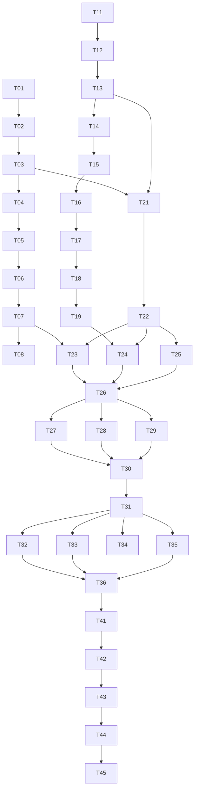

# Phase 4: Task Breakdown — A2A Multi-Protocol Communication Layer

> **目的**: 将技术规格拆解为可执行、可验收的独立任务
> **输入**: `03-technical-spec.md`
> **输出物**: 本文档

---

## 4.1 拆解原则

1. **每个任务 ≤ 4 小时**（超过则继续拆分）
2. **每个任务有明确的 Done 定义**（可验证）
3. **任务之间的依赖关系必须标明**
4. **先基础后上层**（按依赖顺序排列）

---

## 4.2 任务列表

### 🔴 Phase 1: Nostr 集成（Week 1）

> **目标**: 实现 Nostr 客户端，支持广播和离线消息

| #   | 任务名称             | 描述                                                                       | 依赖     | 时间 | 优先级 | Done 定义                                                                 |
| --- | -------------------- | -------------------------------------------------------------------------- | -------- | ---- | ------ | ------------------------------------------------------------------------- |
| T01 | Nostr 依赖安装       | `pnpm add nostr-tools`；配置 TypeScript 类型；更新 package.json            | 无       | 0.5h | P0     | `nostr-tools` 安装成功，`import { SimplePool } from 'nostr-tools'` 无报错 |
| T02 | Nostr 配置常量       | 创建 `constants.ts`；定义 DEFAULT_RELAYS、KINDS、TIMEOUTS、RETRY           | 无       | 0.5h | P0     | 常量文件创建，所有值与 §3.1.1 一致                                        |
| T03 | Nostr 类型定义       | 创建 `shared/nostr-types.ts`；定义 AgentPresenceEvent、EncryptedDMEvent 等 | T02      | 1h   | P0     | 类型定义与 §3.2.1 一致，TypeScript 编译通过                               |
| T04 | NostrClient 基础结构 | 创建 `nostr-client.ts`；实现 connect/disconnect/getPublicKey               | T03      | 2h   | P0     | 可连接/断开 relay，获取 pubkey                                            |
| T05 | Nostr 广播功能       | 实现 publishPresence、publishCapability；签名并发布到多个 relay            | T04      | 2h   | P0     | Agent 信息广播到 ≥3 个 relay，收到 ok 响应                                |
| T06 | Nostr 私信功能       | 实现 sendDM（nip-04 加密）；subscribeDMs 接收解密                          | T04      | 3h   | P0     | 可发送加密私信，接收方正确解密                                            |
| T07 | Nostr 发现功能       | 实现 subscribePresence、queryPresence；过滤和查询 Agent                    | T05      | 2h   | P0     | 可订阅 Agent 广播，按能力过滤查询                                         |
| T08 | NostrClient 测试     | 创建 `nostr-client.test.ts`；单元测试所有方法                              | T06, T07 | 2h   | P0     | 测试覆盖率 ≥80%，所有测试通过                                             |

**Phase 1 小计**: 13 小时

---

### 🟠 Phase 2: libp2p 集成（Week 1-2）

> **目标**: 实现 libp2p 节点，支持 P2P 直接通信

| #   | 任务名称            | 描述                                                                         | 依赖 | 时间 | 优先级 | Done 定义                                  |
| --- | ------------------- | ---------------------------------------------------------------------------- | ---- | ---- | ------ | ------------------------------------------ |
| T11 | libp2p 依赖安装     | `pnpm add libp2p @libp2p/websockets @libp2p/gossipsub @libp2p/kad-dht`       | 无   | 0.5h | P1     | 所有包安装成功，无版本冲突                 |
| T12 | libp2p 配置常量     | 创建 `constants.ts`；定义 BOOTSTRAP_LIST、TOPICS、DHT、CONNECTION            | T11  | 0.5h | P1     | 常量与 §3.1.2 一致                         |
| T13 | libp2p 类型定义     | 创建 `shared/libp2p-types.ts`；定义 Libp2pMessage、CapabilityOfferPayload 等 | T12  | 1h   | P1     | 类型与 §3.2.2 一致                         |
| T14 | Libp2pNode 基础结构 | 创建 `libp2p-node.ts`；实现 start/stop/getPeerId/getMultiaddrs               | T13  | 2h   | P1     | 节点可启动/停止，获取自身信息              |
| T15 | libp2p 连接管理     | 实现 dial/hangUp/getConnections；支持 peerId 和 multiaddr                    | T14  | 2h   | P1     | 可拨号连接其他节点，管理连接               |
| T16 | libp2p PubSub       | 实现 publish/subscribe/unsubscribe；加入 Gradience 主题                      | T14  | 2h   | P1     | 可发布/订阅消息，主题与常量一致            |
| T17 | libp2p DHT          | 实现 findPeer/provide/findProviders；Agent 声明存储                          | T16  | 3h   | P1     | 可通过 DHT 发现 peer，存储/查询 Agent 信息 |
| T18 | libp2p 身份验证     | 实现 verifyPeer；验证 Solana 签名                                            | T17  | 2h   | P1     | 可验证 peer 的链上身份                     |
| T19 | Libp2pNode 测试     | 创建 `libp2p-node.test.ts`；单元测试                                         | T18  | 2h   | P1     | 测试覆盖率 ≥70%，本地节点测试通过          |

**Phase 2 小计**: 15 小时

---

### 🟡 Phase 3: A2A Router 核心（Week 2）

> **目标**: 实现统一路由层，自动协议选择

| #   | 任务名称               | 描述                                                                       | 依赖          | 时间 | 优先级 | Done 定义                        |
| --- | ---------------------- | -------------------------------------------------------------------------- | ------------- | ---- | ------ | -------------------------------- |
| T21 | Router 类型定义        | 创建 `shared/a2a-router-types.ts`；定义 A2AIntent、A2AResult、RouterStatus | T03, T13      | 1h   | P0     | 类型与 §3.2.3 一致               |
| T22 | ProtocolAdapter 接口   | 定义 ProtocolAdapter 接口；所有协议适配器实现此接口                        | T21           | 1h   | P0     | 接口与 §3.3.3 一致               |
| T23 | NostrAdapter 实现      | 实现 ProtocolAdapter 接口；包装 NostrClient                                | T07, T22      | 2h   | P0     | NostrAdapter 通过接口测试        |
| T24 | Libp2pAdapter 实现     | 实现 ProtocolAdapter 接口；包装 Libp2pNode                                 | T19, T22      | 2h   | P0     | Libp2pAdapter 通过接口测试       |
| T25 | MagicBlockAdapter 适配 | 现有代码适配 ProtocolAdapter 接口                                          | T22           | 1h   | P0     | 现有功能不变，通过接口测试       |
| T26 | A2ARouter 核心         | 实现 Router；协议选择算法；initialize/shutdown/send                        | T23, T24, T25 | 3h   | P0     | 可初始化，发送消息到正确协议     |
| T27 | Router 发现功能        | 实现 discoverAgents；聚合多协议发现结果                                    | T26           | 2h   | P0     | 可发现 Nostr + libp2p 的 Agent   |
| T28 | Router 健康检查        | 实现 health check；协议状态监控                                            | T26           | 2h   | P1     | 每 30s 检查协议健康，状态可查询  |
| T29 | Router 错误处理        | 实现错误码；fallback 逻辑；重试机制                                        | T26           | 2h   | P0     | 错误处理符合 §3.5，fallback 工作 |
| T30 | Router 测试            | 创建 `router.test.ts`；单元测试 + 集成测试                                 | T27, T28, T29 | 3h   | P0     | 测试覆盖率 ≥80%，集成测试通过    |

**Phase 3 小计**: 19 小时

---

### 🟢 Phase 4: 产品集成（Week 3）

> **目标**: 集成到 AgentM，用户可用

| #   | 任务名称          | 描述                                   | 依赖          | 时间 | 优先级 | Done 定义                            |
| --- | ----------------- | -------------------------------------- | ------------- | ---- | ------ | ------------------------------------ |
| T31 | useA2A Hook       | 创建 React Hook；包装 A2ARouter        | T30           | 2h   | P0     | Hook 提供 send/receive/discover 方法 |
| T32 | DiscoverView 增强 | 集成 Nostr 广播；实时更新 Agent 列表   | T31           | 2h   | P0     | DiscoverView 显示 Nostr 发现的 Agent |
| T33 | ChatView 多协议   | 支持 Nostr DM 和 libp2p 消息；统一展示 | T31           | 3h   | P0     | ChatView 可收发两种协议消息          |
| T34 | MeView 设置       | 添加广播开关；协议偏好设置             | T31           | 1h   | P1     | 用户可控制广播行为和协议选择         |
| T35 | API Server 集成   | 在 api-server.ts 暴露 A2A Router 接口  | T31           | 2h   | P0     | API 可访问 A2A 功能                  |
| T36 | E2E 测试          | 端到端测试：发现 → 协商 → 结算         | T32, T33, T35 | 3h   | P0     | 完整流程测试通过                     |

**Phase 4 小计**: 13 小时

---

### 🔵 Phase 5: 优化与文档（Week 3-4）

> **目标**: 性能优化，文档完善，生产准备

| #   | 任务名称     | 描述                             | 依赖 | 时间 | 优先级 | Done 定义                  |
| --- | ------------ | -------------------------------- | ---- | ---- | ------ | -------------------------- |
| T41 | 性能优化     | 连接池优化；消息批处理；内存管理 | T36  | 3h   | P1     | 延迟指标达到 §3.7 目标     |
| T42 | 监控集成     | 添加 metrics；健康检查端点       | T41  | 2h   | P1     | /metrics 暴露关键指标      |
| T43 | 错误处理完善 | 边界条件处理；优雅降级           | T36  | 2h   | P1     | 所有 §3.6 边界条件处理正确 |
| T44 | 文档更新     | 更新 README；API 文档；使用示例  | T36  | 2h   | P1     | 文档完整，示例可运行       |
| T45 | 生产配置     | 自建 relay 配置；bootstrap 节点  | T43  | 2h   | P2     | 生产环境配置就绪           |

**Phase 5 小计**: 11 小时

---

## 4.3 任务依赖图

---

## 4.4 里程碑划分

### Milestone 1: Nostr 可用（Week 1 结束）

**交付物**: NostrClient 完整实现，可广播和接收离线消息
**包含任务**: T01-T08
**验收标准**:

- [ ] Agent 可广播到 ≥3 个 relay
- [ ] 可发送/接收加密私信
- [ ] 单元测试覆盖率 ≥80%

### Milestone 2: P2P 可用（Week 2 结束）

**交付物**: Libp2pNode 完整实现，支持 P2P 直接通信
**包含任务**: T11-T19
**验收标准**:

- [ ] 节点可启动并发现其他 peer
- [ ] 可通过 PubSub 发送消息
- [ ] 身份验证工作正常

### Milestone 3: Router 核心（Week 2 结束）

**交付物**: A2ARouter 统一路由层
**包含任务**: T21-T30
**验收标准**:

- [ ] 自动协议选择工作
- [ ] 健康检查和 fallback 正常
- [ ] 集成测试通过

### Milestone 4: 产品集成（Week 3 结束）

**交付物**: AgentM 完整 A2A 功能
**包含任务**: T31-T36
**验收标准**:

- [ ] DiscoverView 显示多协议 Agent
- [ ] ChatView 支持多协议消息
- [ ] E2E 测试通过

### Milestone 5: 生产就绪（Week 4 结束）

**交付物**: 优化完成，文档齐全
**包含任务**: T41-T45
**验收标准**:

- [ ] 性能指标达标
- [ ] 监控和告警就绪
- [ ] 文档完整

---

## 4.5 时间估算汇总

| Phase             | 任务数 | 时间    | 周期     |
| ----------------- | ------ | ------- | -------- |
| Phase 1: Nostr    | 8      | 13h     | Week 1   |
| Phase 2: libp2p   | 9      | 15h     | Week 1-2 |
| Phase 3: Router   | 10     | 19h     | Week 2   |
| Phase 4: 产品集成 | 6      | 13h     | Week 3   |
| Phase 5: 优化     | 5      | 11h     | Week 3-4 |
| **总计**          | **38** | **71h** | **4 周** |

---

## 4.6 风险与缓解

| 风险                 | 概率 | 影响 | 缓解措施                          |
| -------------------- | ---- | ---- | --------------------------------- |
| libp2p NAT 穿透困难  | 中   | 高   | 准备 relay 方案；优先实现 Nostr   |
| nostr-tools 版本兼容 | 低   | 中   | 锁定版本；及时更新测试            |
| 浏览器 libp2p 限制   | 高   | 中   | 明确 Node.js 主进程运行；文档说明 |
| 多协议状态同步复杂   | 中   | 中   | 详细测试；渐进式集成              |

---

## ✅ Phase 4 验收标准

- [x] 4.1 拆解原则已定义
- [x] 4.2 任务列表完整（38 个任务，每个 ≤4h）
- [x] 4.3 依赖图无循环依赖
- [x] 4.4 里程碑划分清晰（5 个里程碑）
- [x] 4.5 时间估算合理（71h / 4 周）
- [x] 4.6 风险已识别（4 项风险 + 缓解）

**验收通过后，进入 Phase 5: Test Spec →**
