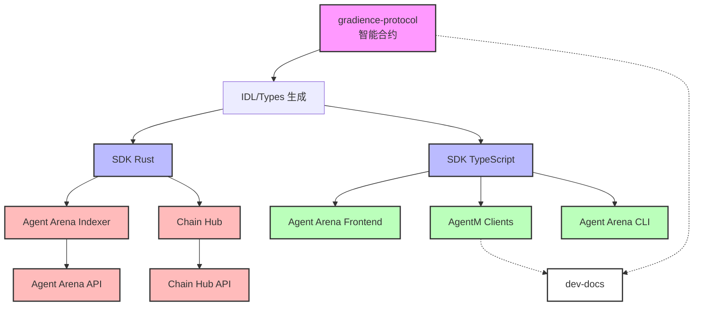

# 仓库依赖关系

## 依赖图



## 依赖版本矩阵

### 当前状态 (Monorepo)

| 依赖            | 版本   | 位置      | 说明        |
| --------------- | ------ | --------- | ----------- |
| pinocchio       | 0.10.1 | workspace | Solana 框架 |
| pinocchio-token | 0.5    | workspace | Token 程序  |
| borsh           | 1.6.0  | workspace | 序列化      |

### 目标状态 (Multi-Repo)

| 仓库               | 依赖                | 来源      | 版本策略 |
| ------------------ | ------------------- | --------- | -------- |
| gradience-protocol | pinocchio           | crates.io | ^0.10    |
| agent-arena        | @gradience/protocol | npm       | ^0.5.0   |
| agent-arena        | gradience-protocol  | crates.io | ^0.5.0   |
| chain-hub          | @gradience/protocol | npm       | ^0.5.0   |
| chain-hub          | gradience-protocol  | crates.io | ^0.5.0   |
| agentm             | @gradience/protocol | npm       | ^0.5.0   |

## 发布流程

### 1. 合约发布 (gradience-protocol)

```
1. PR 合并到 main
2. GitHub Action 自动:
   - 运行测试
   - 构建 release 版本
   - 生成 IDL
   - 发布到 GitHub Releases
   - (可选) 发布到 crates.io
3. 其他仓库通过 webhook 收到通知
```

### 2. SDK 发布

```
1. gradience-protocol 发布新版本
2. GitHub Action 自动生成:
   - @gradience/protocol (npm)
   - gradience-protocol-sdk (crate)
3. Dependabot 在其他仓库创建升级 PR
```

### 3. 应用部署

```
1. SDK 升级 PR 合并
2. 应用 CI/CD 运行:
   - 单元测试
   - 集成测试 (连接 devnet)
   - 构建 Docker 镜像
   - 部署到 staging
3. 人工确认后部署到 production
```

## 环境配置

### gradience-protocol

```yaml
# .env.example
RPC_URL=https://api.devnet.solana.com
ANCHOR_WALLET=~/.config/solana/id.json
PROGRAM_ID_A2A=...
PROGRAM_ID_ARENA=...
```

### agent-arena

```yaml
# .env.example
# Protocol
GRADIENCE_PROTOCOL_VERSION=0.5.0
PROGRAM_ID_ARENA=...

# Indexer
DATABASE_URL=postgres://localhost/agent_arena
REDIS_URL=redis://localhost:6379

# Frontend
NEXT_PUBLIC_API_URL=http://localhost:3001
NEXT_PUBLIC_PROGRAM_ID_ARENA=...
```

### chain-hub

```yaml
# .env.example
GRADIENCE_PROTOCOL_VERSION=0.5.0
PROGRAM_ID_CHAIN_HUB=...

# Indexer
DATABASE_URL=postgres://localhost/chain_hub
INDEXER_START_SLOT=...
```

### agentm

```yaml
# .env.example
GRADIENCE_PROTOCOL_VERSION=0.5.0
NEXT_PUBLIC_API_URL=...
```

## CI/CD 触发链

```
gradience-protocol:release
    ↓ (webhook)
agent-arena:sdk-update-pr
    ↓ (merge)
agent-arena:deploy-staging
    ↓ (approval)
agent-arena:deploy-production
```

## 回滚策略

### 合约回滚

- Solana 合约不可回滚，需要重新部署
- 使用 `anchor upgrade` 进行程序升级
- 保留旧版本程序地址供客户端回退

### SDK 回滚

```bash
# npm
npm unpublish @gradience/protocol@x.y.z
npm publish @gradience/protocol@x.y.z-1

# cargo
#  crates.io 不支持 unpublish，只能 yank
cargo yank --vers x.y.z
```

### 应用回滚

```bash
# Docker
docker pull agent-arena:v0.5.0-previous
docker-compose up -d

# 或使用 Kubernetes
kubectl rollout undo deployment/agent-arena
```

## 监控与告警

### 合约监控

- 程序账户余额
- 升级权限变更
- 异常交易模式

### 服务监控

- API 响应时间
- Indexer 同步延迟
- 数据库连接池

### SDK 监控

- 下载统计
- 版本采用率
- 错误报告
