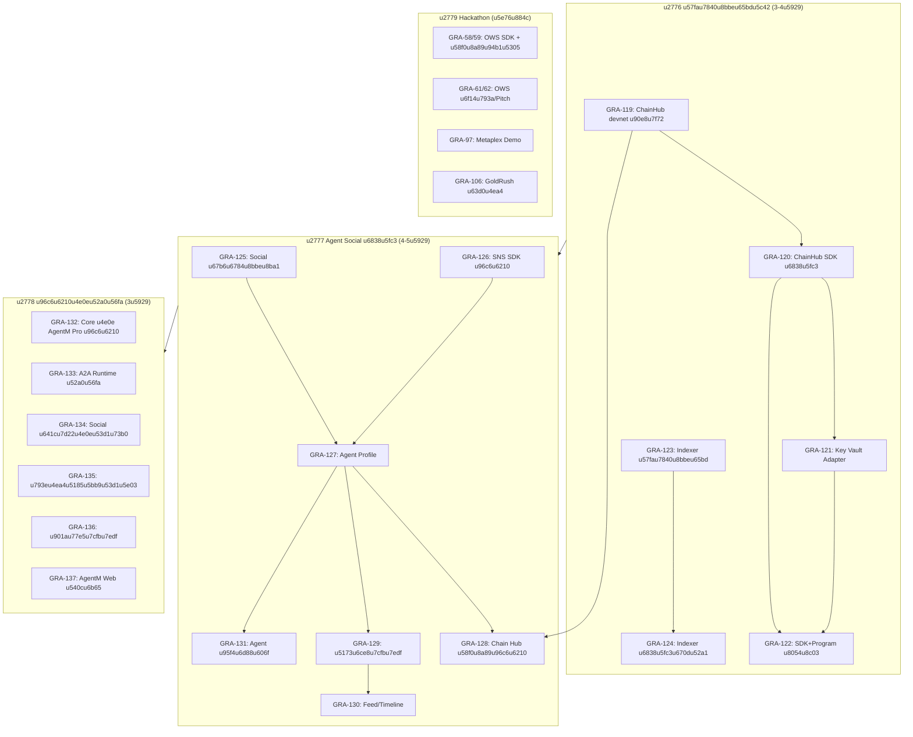

# Gradience Gap Closure u5b9eu65bdu89c4u5212

> **u65e5u671f**: 2026-04-03
> **u76eeu6807**: u5173u95edu9879u76eeu4e09u5927u6838u5fc3u7f3au53e3uff0cu5c06u6574u4f53u5b8cu6210u5ea6u4ece 80% u63a8u8fdbu5230 95%+
> **u9884u4f30u5de5u671f**: 10-12 u5de5u4f5cu65e5

---

## 1. u73b0u72b6u5ba1u8ba1

| u6a21u5757 | u62a5u544au5b8cu6210u5ea6 | u5b9eu9645u5b8cu6210u5ea6 | u8bf4u660e |
|--------|-----------|-----------|------|
| **ChainHub u5408u7ea6** | ~35% | **~85%** | 11 u6761u6307u4ee4u5168u90e8u5b9eu73b0uff0c8 u4e2au96c6u6210u6d4bu8bd5u5168u7effu3002u7f3a devnet u90e8u7f72 + SDK/KeyVault |
| **Indexer u670du52a1** | ~30% | **~30%** | u4ec5u6709u5185u5b58 Mock (Hono + seed data)uff0cu65e0 PostgreSQL/u771fu5b9eu57fau7840u8bbeu65bd |
| **Agent Social** | ~15% | **~15%** | AgentM Pro u6709u90e8u5206 social u4ee3u7801 (u5361u7247/u58f0u8a89/u57dfu540du89e3u6790)uff0cu6838u5fc3u529fu80fdu672au5efa |

### u5173u952eu53d1u73b0

1. **ChainHub u5408u7ea6u5b9eu9645u5b8cu6210u5ea6u8fdcu9ad8u4e8eu62a5u544a** u2014 11 u6761u6307u4ee4u5168u90e8u5b9eu73b0 (initialize, upgrade_config, register_skill, set_skill_status, register_protocol, update_protocol_status, delegation_task CRUD)uff0cu6d4bu8bd5u5168u7effu3002u4e3bu8981u7f3a devnet u90e8u7f72u548c SDK u5c42u3002
2. **Indexer u662fu6700u5927u963bu585e** u2014 Agent u53d1u73b0u548cu58f0u8a89u67e5u8be2u90fdu4f9du8d56u5b83uff0cu5e94u6700u4f18u5148u5904u7406u3002
3. **Agent Social u7684 A2A u6d88u606fu53efu590du7528** u2014 GRA-114 u53efu76f4u63a5u57fau4e8eu5df2u5b8cu6210u7684 A2A Protocol SDKu3002
4. **Hackathon u4efbu52a1u53efu4e0eu4e3bu7ebfu5e76u884c** u2014 u4e0du963bu585eu6838u5fc3u529fu80fdu5f00u53d1u3002

---

## 2. u4f9du8d56u5173u7cfbu56fe



---

## 3. Phase 1: u57fau7840u8bbeu65bdu5c42

**u76eeu6807**: u89e3u9664u4e0bu6e38u963bu585euff0cu8ba9 ChainHub u53efu88abu8c03u7528u3001Indexer u6709u771fu5b9eu6570u636eu5c42u3002

| u5e8fu53f7 | u4efbu52a1 ID | u4efbu52a1u540du79f0 | u4f18u5148u7ea7 | u9884u4f30 | u4f9du8d56 | Done u5b9au4e49 |
|------|---------|---------|--------|------|------|----------|
| 1.1 | GRA-119 | ChainHub devnet u90e8u7f72 | P0 | 4h | u65e0 | Program ID u8bb0u5f55uff0cdevnet u53efu8bbfu95ee |
| 1.2 | GRA-120 | ChainHub SDK u6838u5fc3 (invoke/invokeRest/invokeCpi) | P0 | 3h | GRA-119 | u5355u6d4bu9a8cu8bc1u53ccu8defu7531 |
| 1.3 | GRA-121 | Key Vault Adapter | P0 | 2h | GRA-120 | u975eu6cd5u7b56u7565u8c03u7528u88abu62d2u7edd |
| 1.4 | GRA-122 | SDK + Program u8054u8c03 | P1 | 3h | GRA-120, GRA-121 | Localnet u7aefu5230u7aefu53efu590du73b0 |
| 1.5 | GRA-123 | Indexer u57fau7840u8bbeu65bd (PostgreSQL + Docker) | P1 | 6h | u65e0 | docker-compose up u53efu8fd0u884cuff0cschema u5df2u8fc1u79fb |
| 1.6 | GRA-124 | Indexer u6838u5fc3u670du52a1 (u4ece Mock u5347u7ea7) | P1 | 8h | GRA-123 | u4fddu6301u76f8u540c API u5408u7ea6uff0cu6570u636eu6301u4e45u5316 |

**u91ccu7a0bu7891 1 u4ea7u51fa**: ChainHub u5df2u90e8u7f72 devnet + SDK u53efu7528 + Indexer u6709u771fu5b9eu6570u636eu5c42

### u5e76u884cu7b56u7565
- **u8defu5f84 A** (1.1 u2192 1.2 u2192 1.3 u2192 1.4): ChainHub u94feuff0cu4e32u884c
- **u8defu5f84 B** (1.5 u2192 1.6): Indexer u94feuff0cu4e32u884c
- A u4e0e B **u5b8cu5168u5e76u884c**

---

## 4. Phase 2: Agent Social u6838u5fc3

**u76eeu6807**: u5b9eu73b0 Agent Social MVP u2014 Profile + u5173u6ce8 + Feed + u6d88u606f + u94feu4e0au58f0u8a89u3002

| u5e8fu53f7 | u4efbu52a1 ID | u4efbu52a1u540du79f0 | u5bf9u5e94 GRA | u4f18u5148u7ea7 | u9884u4f30 | u4f9du8d56 | Done u5b9au4e49 |
|------|---------|---------|---------|--------|------|------|----------|
| 2.1 | GRA-125 | Agent Social u67b6u6784u8bbeu8ba1u5b8cu5584 | GRA-109 | P0 | 4h | u65e0 | 7-Phase u6587u6863 Phase 1-3 u5b8cu6210 |
| 2.2 | GRA-126 | SNS SDK u96c6u6210u5b8cu5584 | GRA-107,110 | P1 | 4h | u65e0 | u57dfu540du89e3u6790u53efu7528 |
| 2.3 | GRA-127 | Agent Profile + u57dfu540d | GRA-111 | P1 | 6h | GRA-125, GRA-126 | Profile CRUD + u57dfu540du7ed1u5b9a |
| 2.4 | GRA-128 | Chain Hub u58f0u8a89u96c6u6210 | GRA-116 | P1 | 4h | GRA-119, GRA-127 | u94feu4e0au58f0u8a89u5206u6570u5c55u793a |
| 2.5 | GRA-129 | Agent u5173u6ce8u7cfbu7edf | GRA-112 | P2 | 6h | GRA-127 | u5173u6ce8/u53d6u5173/u5217u8868 |
| 2.6 | GRA-130 | Agent Feed/Timeline | GRA-113 | P2 | 6h | GRA-129 | u5173u6ce8u52a8u6001u6d41 |
| 2.7 | GRA-131 | Agent u95f4u6d88u606f | GRA-114 | P2 | 4h | GRA-127 | u590du7528 A2A Protocol |

**u91ccu7a0bu7891 2 u4ea7u51fa**: Agent Social MVP u53efu7528

### u5e76u884cu7b56u7565
- 2.1 u548c 2.2 **u5e76u884cu5f00u59cb**
- 2.3 u7b49u5f85 2.1 + 2.2 u5b8cu6210
- 2.4 u7b49u5f85 Phase 1 u7684 GRA-119 + 2.3
- 2.5 u548c 2.7 u53ef**u5e76u884c** (u90fdu4ec5u4f9du8d56 2.3)
- 2.6 u4e32u884cu5728 2.5 u4e4bu540e

---

## 5. Phase 3: u96c6u6210u4e0eu52a0u56fa

**u76eeu6807**: u5168u5e73u53f0u96c6u6210 + u751fu4ea7u5c31u7eeau3002

| u5e8fu53f7 | u4efbu52a1 ID | u4efbu52a1u540du79f0 | u5bf9u5e94 GRA | u4f18u5148u7ea7 | u9884u4f30 | u4f9du8d56 |
|------|---------|---------|---------|--------|------|------|
| 3.1 | GRA-132 | Core u4e0e AgentM Pro u96c6u6210 | GRA-79 | P2 | 6h | Phase 2 |
| 3.2 | GRA-133 | A2A Runtime u751fu4ea7u52a0u56fa | GRA-84 | P2 | 4h | u65e0 |
| 3.3 | GRA-134 | Social u641cu7d22u4e0eu53d1u73b0 | GRA-115 | P2 | 4h | GRA-127 |
| 3.4 | GRA-135 | u793eu4ea4u5185u5bb9u53d1u5e03 | GRA-117 | P2 | 4h | GRA-130 |
| 3.5 | GRA-136 | u901au77e5u7cfbu7edf | GRA-118 | P3 | 4h | GRA-129 |
| 3.6 | GRA-137 | AgentM Web u529fu80fdu540cu6b65 | u65b0 | P2 | 8h | Phase 2 |

**u91ccu7a0bu7891 3 u4ea7u51fa**: u5168u5e73u53f0u96c6u6210u5b8cu6210uff0cu751fu4ea7u5c31u7eea

### u5e76u884cu7b56u7565
- 3.1, 3.2, 3.3 u53ef**u540cu65f6u5f00u59cb**
- 3.4 u4f9du8d56 3.3 (Feed u5b8cu6210u540e)
- 3.5, 3.6 u53efu5e76u884c

---

## 6. Phase 4: Hackathon u4ea4u4ed8 (u5168u7a0bu5e76u884c)

| u4efbu52a1 | u5bf9u5e94 GRA | u72b6u6001 | u8bf4u660e |
|------|---------|------|------|
| OWS SDK + u58f0u8a89u94b1u5305 MVP | GRA-58, 59 | in-progress | u9700u6536u5c3e |
| OWS u6f14u793a/Pitch | GRA-61, 62 | in-progress | u4f9du8d56 GRA-58/59 |
| Metaplex Demo | GRA-97 | todo | u72ecu7acbu5b8cu6210 |
| GoldRush u63d0u4ea4 | GRA-106 | todo | u72ecu7acbu5b8cu6210 |

---

## 7. u4f4eu4f18u5148u7ea7 (u5ef6u540e)

| u4efbu52a1 | u5bf9u5e94 GRA | u4f18u5148u7ea7 | u7406u7531 |
|------|---------|--------|------|
| Bitcoin u94feu96c6u6210u8bbeu8ba1 | GRA-89 | P3 | u8bbeu8ba1u9636u6bb5uff0cu4e0du5f71u54cd MVP |
| Move u94feu96c6u6210u8bbeu8ba1 | GRA-90 | P3 | u8bbeu8ba1u9636u6bb5uff0cu4e0du5f71u54cd MVP |
| ENS u7814u7a76 | GRA-108 | P2 | SNS u4f18u5148uff0cENS u540eu7eed |
| u6587u6863u6e05u7406 | GRA-51, 52 | P3 | u975eu529fu80fdu6027 |

---

## 8. u65f6u95f4u7ebf

```
Day 1-2:   Phase 1 u5e76u884cu542fu52a8
           u251cu2500 u8defu5f84 A: ChainHub Deploy u2192 SDK u2192 KeyVault
           u2514u2500 u8defu5f84 B: Indexer Infra u2192 Indexer Service

Day 3:     Phase 1 u6536u5c3e (SDK u8054u8c03 + Indexer u5b8cu5584)
           Phase 2 u5e76u884cu542fu52a8 (2.1 u67b6u6784 + 2.2 SNS)

Day 4-5:   Phase 2 u6838u5fc3 (Profile + u58f0u8a89u96c6u6210)

Day 6-7:   Phase 2 u793eu4ea4u529fu80fd (u5173u6ce8 + Feed + u6d88u606f)

Day 8-10:  Phase 3 u96c6u6210u4e0eu52a0u56fa

u5168u7a0bu5e76u884c: Phase 4 Hackathon u4ea4u4ed8
```

---

## 9. u98ceu9669u77e9u9635

| u98ceu9669 | u6982u7387 | u5f71u54cd | u7f13u89e3u63aau65bd |
|------|------|------|----------|
| Devnet u90e8u7f72u5931u8d25 (BPF u7f16u8bd1u95eeu9898) | u4e2d | u9ad8 | u5148u672cu5730 build-bpf u9a8cu8bc1uff0cu518du90e8u7f72 |
| Indexer PostgreSQL schema u8bbeu8ba1u4e0e Mock API u4e0du517cu5bb9 | u4e2d | u4e2d | u4fddu6301u76f8u540c API u5408u7ea6uff0cu4ec5u66ffu6362u5b58u50a8u5c42 |
| Agent Social u67b6u6784u8bbeu8ba1u5ef6u671f | u4f4e | u9ad8 | u5df2u6709 `social-platform-architecture.md` u53efu53c2u8003 |
| A2A u590du7528u4e0e Social u6d88u606fu9700u6c42u4e0du5339u914d | u4f4e | u4e2d | A2A SDK u5df2u7a33u5b9auff0cu5305u88c5u5c42u9002u914d |
| Hackathon u622au6b62u65e5u671fu538bu529b | u4e2d | u4e2d | Phase 4 u5e76u884cu6267u884cuff0cu4e0du963bu585eu4e3bu7ebf |

---

## 10. u4efbu52a1 ID u6620u5c04

| u65b0u4efbu52a1 ID | u5173u8054u65e7 GRA | Phase | u6a21u5757 |
|----------|-----------|-------|------|
| GRA-119 | -- | 1 | ChainHub |
| GRA-120 | CH11 | 1 | ChainHub SDK |
| GRA-121 | CH12 | 1 | ChainHub KeyVault |
| GRA-122 | CH13 | 1 | ChainHub u8054u8c03 |
| GRA-123 | GRA-65 (u5347u7ea7) | 1 | Indexer |
| GRA-124 | -- | 1 | Indexer |
| GRA-125 | GRA-109 (u5347u7ea7) | 2 | Social |
| GRA-126 | GRA-107,110 (u5408u5e76) | 2 | Social |
| GRA-127 | GRA-111 (u5347u7ea7) | 2 | Social |
| GRA-128 | GRA-116 (u5347u7ea7) | 2 | Social |
| GRA-129 | GRA-112 (u5347u7ea7) | 2 | Social |
| GRA-130 | GRA-113 (u5347u7ea7) | 2 | Social |
| GRA-131 | GRA-114 (u5347u7ea7) | 2 | Social |
| GRA-132 | GRA-79 (u5347u7ea7) | 3 | AgentM Pro |
| GRA-133 | GRA-84 (u5347u7ea7) | 3 | A2A |
| GRA-134 | GRA-115 (u5347u7ea7) | 3 | Social |
| GRA-135 | GRA-117 (u5347u7ea7) | 3 | Social |
| GRA-136 | GRA-118 (u5347u7ea7) | 3 | Social |
| GRA-137 | -- | 3 | AgentM Web |
