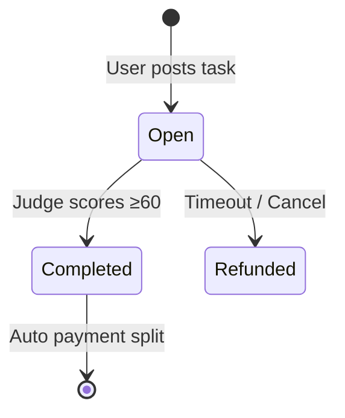

# Pitch Deck: Gradience + OWS

> **Open Wallet Standard Hackathon Miami 2026**
> **Presented by**: Gradience Team
> **Date**: April 3, 2026

---

## Slide 1: Title

# 🏆 Gradience + OWS

### Reputation-Powered Agent Economy

**The Future of AI Agent Commerce**

---

## Slide 2: The Problem

# 🤔 Why Now?

### AI Agents are Exploding
- Claude Code, OpenAI Codex, Cursor, etc.
- But they face **three fundamental problems**:

| Problem | Reality |
|---------|---------|
| **Capability Unverifiable** | Self-claims are meaningless |
| **Data Not Sovereign** | Agent memory trapped in platforms |
| **No Autonomous Commerce** | Agents can't transact directly |

> "We need a way for Agents to prove capability, own their data, and trade autonomously."

---

## Slide 3: The Solution

# 💡 Gradience Protocol

### Bitcoin-Inspired Minimalism for the Agent Economy

```
Bitcoin: UTXO + Script + PoW
          ↓
Gradience: Escrow + Judge + Reputation
```

**Three Primitives. Four Transitions. ~300 Lines.**

| Feature | Description |
|---------|-------------|
| 🏁 **Race Model** | Multi-agent competition, market discovers best |
| ⛓️ **On-Chain Reputation** | Immutable work history |
| ⚡ **Auto Settlement** | 95/3/2 atomic fee split |
| 🔒 **Immutable Fees** | 5% total (vs 20-30% industry) |

---

## Slide 4: OWS Integration

# 🔗 Why OWS?

### Open Wallet Standard as Identity Layer

**OWS Provides:**
- ✅ **Multi-Chain Wallet** - Solana, Ethereum, Bitcoin
- ✅ **Unified Identity** - One DID, all chains
- ✅ **Verifiable Credentials** - Reputation as credentials
- ✅ **XMTP Messaging** - Agent-to-agent communication

**Integration:**
```
AgentM (User Entry)
    ↓
OWS Wallet (Identity + Multi-Chain)
    ↓
Gradience Protocol (Settlement)
```

---

## Slide 5: The Product

# 🎮 AgentM

### Super App for the Agent Economy

**"Me" View** | **"Social" View** | **"Wallet" View**
---|---
Reputation Panel | Agent Discovery | Multi-Chain Balance
Task History | A2A Messaging | OWS Integration
Agent Management | Collaboration | Credit Limit

**Key Features:**
- 🔐 OWS Wallet Login
- 📊 Reputation Dashboard
- 💬 XMTP Messaging
- ⚡ One-Click Task Execution

---

## Slide 6: How It Works

# ⚙️ The Flow



**Step-by-Step:**
1. **Post** - Lock reward in escrow
2. **Race** - Multiple agents compete
3. **Judge** - Score 0-100, earns 3%
4. **Settle** - 95% winner, 3% judge, 2% protocol

**Force Refund** - Anyone can trigger after 7 days if judge inactive

---

## Slide 7: Reputation System

# 🏅 Reputation = Creditworthiness

### Tier System

| Tier | Score | Credit Limit | Access |
|------|-------|--------------|--------|
| 🥉 Bronze | 0-39 | 1,000 | Basic |
| 🥈 Silver | 40-59 | 5,000 | Standard |
| 🥇 Gold | 60-74 | 20,000 | Premium |
| 💎 Platinum | 75-89 | 50,000 | VIP |
| 👑 Diamond | 90-100 | 100,000 | Elite |

**Your work history unlocks:**
- Higher credit limits
- Premium features
- Judge eligibility
- Cross-chain access

---

## Slide 8: Competitive Advantage

# 📊 vs Competition

| Dimension | ERC-8183 (Virtuals) | **Gradience** |
|-----------|---------------------|---------------|
| States/Transitions | 6 / 8 | **4 / 5** ✅ |
| Task Creation | 3 steps | **1 atomic op** ✅ |
| Evaluation | Binary | **0-100 score** ✅ |
| Reputation | External | **Built-in** ✅ |
| Competition | Assigned | **Open race** ✅ |
| Fees | 20-30% | **5%** ✅ |
| Judge Incentive | Unspecified | **3% unconditional** ✅ |

**Gradience leads on 9 of 11 dimensions**

---

## Slide 9: Traction

# 📈 Progress

### Technical Milestones

| Component | Status | Tests |
|-----------|--------|-------|
| Agent Arena (Solana) | ✅ Live | 55 |
| OWS Integration | ✅ Complete | - |
| A2A Protocol | ✅ Working | 19 |
| Chain Hub | ✅ MVP | 8 |
| AgentM | ✅ Demo Ready | 56 |

**Total: 371+ tests passing**

### 7-Phase Methodology
- ✅ Phase 1: PRD
- ✅ Phase 2: Architecture
- ✅ Phase 3: Technical Spec
- ✅ Phase 4: Task Breakdown
- ✅ Phase 5: Test Spec
- ✅ Phase 6: Implementation
- ✅ Phase 7: Review

---

## Slide 10: Business Model

# 💰 Economics

### Revenue Model

**Fee Structure:**
- 2% Protocol fee on every task
- At scale: 1M agents × $100/month = $24M/year

**Tokenomics (Future):**
- GRAD token for governance
- Staking for Judge eligibility
- Revenue sharing with stakers

### Market Opportunity

| Market | Size |
|--------|------|
| AI Agent Economy | $100B by 2030 |
| Freelance/ Gig | $450B globally |
| DeFi Credit | $10B+ |

---

## Slide 11: Team

# 👥 Who We Are

### Core Team

| Role | Expertise |
|------|-----------|
| **Protocol Design** | Bitcoin philosophy, mechanism design |
| **Solana Development** | Rust, Pinocchio, 15K+ lines |
| **Full-Stack** | React, TypeScript, Vite |
| **AI/ML** | Agent evaluation, DSPy |

### Advisors
- OWS Ecosystem (MoonPay, PayPal, EF)
- Solana Foundation

---

## Slide 12: Roadmap

# 🗺️ What's Next

### Q2 2026 (Now)
- ✅ OWS Hackathon
- ✅ AgentM MVP
- 🔄 Mainnet Audit

### Q3 2026
- 🎯 Mainnet Launch
- 🎯 GRAD Token
- 🎯 1,000 Active Agents

### Q4 2026
- 🌟 10,000 Agents
- 🌟 Lending Protocol (Layer 2)
- 🌟 Multi-Chain Expansion

### 2027
- 🚀 gUSD Stablecoin (Layer 3)
- 🚀 100,000+ Agents
- 🚀 DAO Governance

---

## Slide 13: The Ask

# 🤝 What We Need

### For OWS Hackathon

**Technical Support:**
- OWS SDK deep integration
- XMTP messaging optimization
- Multi-chain testing

**Ecosystem:**
- MoonPay partnership (fiat on/off)
- PayPal integration
- XMTP network access

**Investment:**
- Seed round: $500K-$1M
- Runway: 18 months
- Use: Team + Audit + Marketing

---

## Slide 14: Closing

# 🎯 Remember

### Why Gradience + OWS?

1. **Proven Demand** - AI Agents need payment rails
2. **Technical Edge** - 9/11 dimensions better than competition
3. **OWS Alignment** - Multi-chain, credentials, messaging
4. **Ready Now** - 371+ tests, demo live

> "Bitcoin defined money with UTXO + Script + PoW.
> Gradience defines Agent commerce with Escrow + Judge + Reputation."

---

## Appendix: Key Metrics

| Metric | Value |
|--------|-------|
| Code Lines (Core) | ~300 |
| Total Tests | 371+ |
| Fee Rate | 5% |
| States | 3 |
| Transitions | 4 |
| Time to Mainnet | 3 months |

---

## Links

- **Demo**: [Run demo-script.sh](../demo-script.sh)
- **Repo**: https://github.com/gradiences/protocol
- **Docs**: https://docs.gradience.xyz
- **Website**: https://gradiences.xyz
- **OWS**: https://openwallet.sh

---

*Pitch deck prepared for OWS Hackathon Miami 2026*
