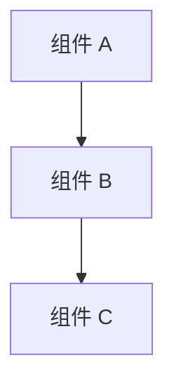
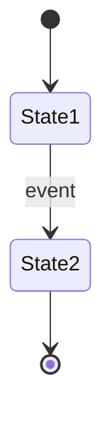

# Phase 2: Architecture（架构设计）

> **目的**: 定义系统的整体结构、组件划分和数据流
> **输入**: Phase 1 PRD
> **输出物**: 填写完成的本文档，存放到 `<project>/docs/02-architecture.md`

---

## 2.1 系统概览（必填）

### 一句话描述
> 这个系统是什么？

### 架构图
> 用 mermaid 或 ASCII 画出组件关系图



## 2.2 组件定义（必填）

> 列出所有组件，明确每个组件的职责边界

| 组件 | 职责 | 技术选型 | 状态 |
|------|------|---------|------|
| | 做什么 / 不做什么 | 语言/框架 | 新建/已有 |

## 2.3 数据流（必填）

> 描述核心数据从输入到输出的完整路径

```
用户操作 → 组件 A → 组件 B → 存储 → 组件 C → 用户看到结果
```

### 核心数据流

| 步骤 | 数据 | 从 | 到 | 格式 |
|------|------|----|----|------|
| 1 | | | | |
| 2 | | | | |

## 2.4 依赖关系（必填）

### 内部依赖
> 本项目组件之间的依赖

```
组件 A → 组件 B（调用 B 的 API）
组件 B → 组件 C（读取 C 的数据）
```

### 外部依赖
> 依赖的外部系统/库/服务

| 依赖 | 版本 | 用途 | 是否可替换 |
|------|------|------|-----------|
| | | | |

## 2.5 状态管理（必填）

> 系统中有哪些状态？谁拥有状态？状态如何变化？

### 状态枚举

| 状态名 | 含义 | 谁拥有 | 持久化方式 |
|--------|------|--------|-----------|
| | | | 链上/数据库/内存/文件 |

### 状态转换图（如适用）



## 2.6 接口概览（必填）

> 组件对外暴露的接口概览（详细定义在 Phase 3 技术规格）

| 接口 | 类型 | 调用方 | 说明 |
|------|------|--------|------|
| | RPC/REST/Event/SDK | | |

## 2.7 安全考虑（必填）

| 威胁 | 影响 | 缓解措施 |
|------|------|---------|
| | | |

## 2.8 性能考虑（可选）

| 指标 | 目标 | 约束 |
|------|------|------|
| 吞吐量 | | |
| 延迟 | | |
| 并发 | | |

## 2.9 部署架构（可选）

> 在什么环境运行？怎么部署？

---

## ✅ Phase 2 验收标准

- [ ] 架构图清晰，组件边界明确
- [ ] 所有组件的职责已定义
- [ ] 数据流完整，无断点
- [ ] 依赖关系（内部 + 外部）已列出
- [ ] 状态管理方案已定义
- [ ] 接口已概览（不需要详细，那是 Phase 3 的事）
- [ ] 安全威胁已识别

**验收通过后，进入 Phase 3: Technical Spec →**
