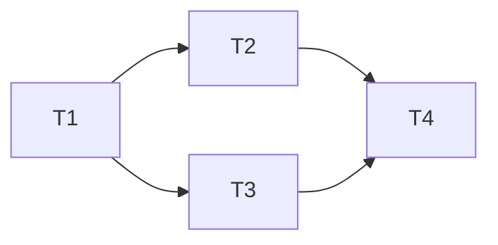

# Phase 4: Task Breakdown（任务拆解）

> **目的**: 将技术规格拆解为可执行、可分配、可验收的独立任务
> **输入**: Phase 3 技术规格
> **输出物**: 任务列表，存放到 `<project>/docs/04-task-breakdown.md`

---

## 4.1 拆解原则

1. **每个任务 ≤ 4 小时**（如果超过，继续拆）
2. **每个任务有明确的 Done 定义**（可验证）
3. **任务之间的依赖关系必须标明**
4. **先基础后上层**（按依赖顺序排列）

## 4.2 任务列表（必填）

| # | 任务名称 | 描述 | 依赖 | 预估时间 | 优先级 | Done 定义 |
|---|---------|------|------|---------|--------|----------|
| T1 | | | 无 | h | P0 | 当 X 时，Y 成立 |
| T2 | | | T1 | h | P0 | |
| T3 | | | T1 | h | P1 | |

## 4.3 任务依赖图（必填）

## 4.4 里程碑划分（必填）

> 将任务分组为里程碑。每个里程碑是一个可演示的交付物。

### Milestone 1: [名称]
**预计完成**: 日期
**交付物**: 什么可以演示

包含任务: T1, T2, T3

### Milestone 2: [名称]
...

## 4.5 风险识别（必填）

| 风险 | 概率 | 影响 | 缓解措施 |
|------|------|------|---------|
| | 高/中/低 | 高/中/低 | |

---

## ✅ Phase 4 验收标准

- [ ] 每个任务 ≤ 4 小时
- [ ] 每个任务有 Done 定义
- [ ] 依赖关系已标明，无循环依赖
- [ ] 至少划分为 2 个里程碑
- [ ] 风险已识别

**验收通过后，进入 Phase 5: Test Spec →**
