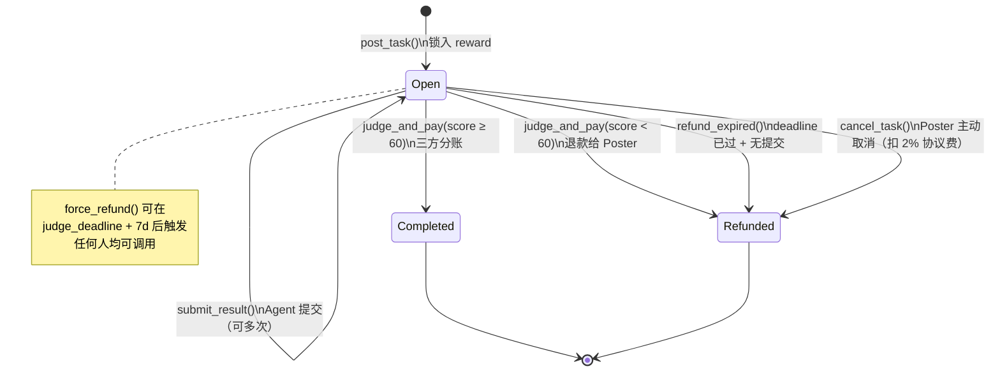

# Phase 2: Architecture — Agent Layer v2

> **目的**: 定义系统整体结构、组件划分、数据流、状态机
> **输入**: `docs/01-prd.md`
> **输出物**: `docs/02-architecture.md`

---

## 变更记录

| 版本 | 日期 | 变更说明 |
|------|------|---------|
| v0.1 | 2026-03-30 | 初稿 |
| v0.2 | 2026-04-02 | 产品架构更新；补充开发者侧运行时规划 |
| v0.3 | 2026-04-02 | AgentM 合并为 AgentM；双界面设计（GUI + API）；架构图更新；组件定义表更新 |
| v0.4 | 2026-04-04 | 新增 §2.2 Agent-First Design Philosophy；整合 Sequoia Capital "Services is the New Software" 框架；添加 Sequoia Matrix 四象限分析 |

---

## 2.1 系统概览

### 一句话描述

> Gradience 是一个 **去中心化 AI Agent 能力信用协议**：任何 Agent 通过完成真实任务、接受可验证评判，在链上积累不可伪造的能力信誉——这是 Web3 世界的蚂蚁信用，但完全开放、无需许可、任何人可验证。链上 Program 提供无需许可的竞争结算内核，可插拔的三层评判体系（测试用例 / DSPy 标准化 LLM 评分 / 链上确定性验证）覆盖所有任务类型，SAS 链上凭证提供每任务可验证的 Attestation，EVM 合约（Week 4）提供跨链信誉验证。信用层之上可构建 Agent 借贷协议——有了可验证的工作历史，无需超额抵押即可获得贷款。

### 长期愿景：三层价值堆栈

Gradience 的边界不止于凭证协议。核心信用层之上，可以生长出整套 Agent 金融体系：

```
Layer 3（远期）  gUSD — 信用背书稳定币
                 由 Agent 集体工作能力铸造，无需超额锁定资本
                 Web3 的第一种"信用货币"

Layer 2（独立协议）  Agent 借贷协议
                 低抵押率贷款（高信誉 Agent 40-60% 抵押率 vs DeFi 的 150%+）
                 信誉定价利率 / 动态信用额度 / 违约 Slash 链上执行

Layer 1（本协议核心）  去中心化 AI Agent 能力信用协议
                 竞争结算 + SAS Attestation + ReputationAccount PDA
                 → 建立可验证的链上工作历史
```

**类比**：
- 蚂蚁金服路径：支付宝（交易流水）→ 芝麻信用（信用评分）→ 花呗/借呗（消费信贷）→ 货币基金（理财）
- Gradience 路径：Agent 任务结算（链上流水）→ Reputation PDA（信用评分）→ Agent 借贷（信贷）→ gUSD（信用货币）
- 核心差异：**完全开放、无需许可、密码学可验证**——不是黑箱评分，任何人可独立审计

Layer 2 和 Layer 3 是基于本协议的**未来独立协议**，不在 W1-W4 范围内。但它们的基础设施（ReputationAccount 数据结构、SAS Attestation CPI 接口）在本协议设计阶段即需考虑可组合性。

---

### 全栈架构图

```mermaid
flowchart TB
    subgraph Users["用户 / 开发者"]
        Human["人类用户"]
        DevAgent["自主 Agent"]
        Dev["开发者"]
    end

    subgraph Toolchain["工具链层（链下）"]
        Frontend["产品前端<br/>gradiences.xyz"]
        SDK["gradience/sdk<br/>TypeScript SDK"]
        CLI["gradience CLI"]
        JudgeDaemon["Judge Daemon<br/>AI Judge / Oracle Judge"]
    end

    subgraph Kernel["内核层（Solana）"]
        AgentLayer["Agent Layer Program<br/>Escrow / Judge / Reputation / Staking / Slash"]
        IJudge["IJudge CPI 接口<br/>合约 Judge 标准"]
    end

    subgraph Products["产品层（用户可见，W3+）"]
        AgentIM["AgentM<br/>用户入口应用<br/>GUI + API<br/>Google OAuth / 语音原生"]
        AgentM Pro["AgentM Pro<br/>开发者控制台/运行时配套<br/>本地 / 云端"]
    end

    subgraph Modules["模块层（上层，W3+）"]
        ChainHub["Chain Hub<br/>Skill 市场 / Key Vault / Delegation Task"]
    end

    subgraph EVMLayer["EVM 层（Week 4）"]
        EVMContract["Agent Layer EVM<br/>Base / Arbitrum"]
        ReputationBridge["信誉证明验证<br/>签名验证 无桥"]
    end

    subgraph Infra["基础设施"]
        Solana["Solana 主网"]
        Indexer2["Indexer<br/>Cloudflare Workers + D1"]
        Storage["Arweave / Avail<br/>evaluationCID / resultRef"]
    end

    Human -->|"Google OAuth"| AgentIM
    Human --> CLI
    DevAgent -->|"A2A API"| AgentIM
    Dev --> SDK
    Dev --> CLI

    AgentIM --> SDK
    AgentIM --> AgentM Pro

    Frontend --> SDK
    CLI --> SDK
    JudgeDaemon --> SDK

    SDK --> AgentLayer
    SDK --> ChainHub
    AgentLayer --> IJudge
    ChainHub -->|"读取信誉"| AgentLayer

    AgentLayer --> Solana
    AgentLayer -->|"Program 事件"| Indexer
    AgentLayer -->|"CID 引用"| Storage

    Indexer -->|"REST / WebSocket"| SDK
    Indexer -->|"REST / WebSocket"| AgentIM

    EVMContract --> ReputationBridge
    ReputationBridge -.->|"Solana 签名证明"| AgentLayer
```

---

### 协议层次 → 实现组件映射

白皮书 §8 定义三层价值堆栈（Layer 1/2/3）。下表说明这些**价值层**与**实现组件**之间的对应关系：

| 协议层 | 定位 | 实现组件 | 时间线 |
|--------|------|---------|--------|
| **Layer 0** | 外部基础设施（依赖，非 Gradience 自身） | Solana、Token-2022、Wormhole/LI.FI、MPL Agent Registry（可选 W4）、**SDP（Chain Hub 金融原语层，W2–W3）** | 已有 |
| **Layer 1** | 核心协议（本协议，当前实现目标） | Agent Layer Program + Chain Hub + SDK + Daemon + Indexer + Frontend | W1–W3 |
| **Layer 2** | Agent 借贷协议（独立协议，只读 CPI 调用 Layer 1 的 `ReputationAccount`） | Lending Program（独立部署） | W4+ |
| **Layer 3** | gUSD 信用背书稳定币（独立协议，依赖 Layer 2 信用额度） | gUSD Program（独立部署） | 远期 |

**关键澄清**：
- **Chain Hub 属于 Layer 1**，不是独立层级 — 它是核心协议的扩展组件，处理内核不做的持续委托（Delegation Task）
- **Layer 0 是外部依赖**，Gradience 协议选择是否集成，就像选择是否用 Wormhole；MPL Agent Registry 是 W4 可选集成（见 §2.15）
- **Layer 2/3 是未来独立协议**，与本协议通过 CPI 接口交互，不影响 Layer 1 的实现

---

## 2.2 Agent-First Design Philosophy

> **设计哲学来源**: Sequoia Capital "Services is the New Software" (2025)
> 
> 核心洞察："Sell the work, not the tool" —— 从为人类设计界面，转向为自主执行设计协议

### 2.2.1 范式转变：Human-Centric → Agent-Centric

传统软件设计 vs Agent-First 设计的根本差异：

| 维度 | 传统软件 (Human-Centric) | Agent-First (Agent-Centric) | Gradience 实现 |
|------|-------------------------|----------------------------|----------------|
| **Identity** | 用户名/密码 | 质押参与 | 链上地址 + Reputation PDA |
| **Discovery** | 浏览市场 | 竞赛证明 | Race Model + JudgePool |
| **Quality** | 人工评估 | 加密验证 | IJudge CPI + SAS Attestation |
| **Payment** | 账单周期 | 原子结算 | Escrow 三方分账 (95/3/2) |
| **Reputation** | 星级评分 | 链上历史 | ReputationAccount 累积 |
| **Trust** | 平台担保 | 经济激励 | Staking + Slash 机制 |

**核心转变**：不再是"人类使用工具"，而是"Agent 自主完成工作"。

### 2.2.2 The Sequoia Matrix：四象限服务映射

Sequoia Capital 提出的服务市场分析框架，将服务按两个维度分类：

```
                    INTELLIGENCE RATIO
                         High │ Low
                    ┌─────────┼─────────┐
         High       │  ZONE A │  ZONE B │
   OUTSOURCING      │Autopilot│ Copilot │
    MATURITY        │ Ready   │ Helper  │
                    ├─────────┼─────────┤
         Low        │  ZONE C │  ZONE D │
                    │  Wedge  │ Future  │
                    └─────────┴─────────┘
```

**维度定义**：
- **Intelligence Ratio**：服务可被 AI 自动化的程度
- **Outsourcing Maturity**：市场现有的外包接受度

**Gradience 在各象限的策略**：

| 区域 | 典型服务 | Gradience 适配 | 优先级 |
|------|---------|---------------|--------|
| **Zone A** (Autopilot Ready) | 保险理赔、医疗计费、会计记账、合规审计 | Race Model + 原子结算 + IJudge 自动评判 | **Phase 3** (Q4 2026) |
| **Zone B** (Copilot Helper) | 法律咨询、猎头招聘、财务顾问、内容审核 | 质押参与 + 渐进自主 + 人类 Judge 介入 | **Phase 2** (Q3 2026) |
| **Zone C** (The Wedge) | 内部 IT 支持、数据标注、基础客服、供应链跟踪 | **首发垂直领域** — 外包成熟但智能比低，易切入 | **Phase 1** (Q2 2026) |
| **Zone D** (Future) | 战略规划、创意设计、高管决策、情感陪伴 | 暂不进入 — 智能比高但外包接受度低 | **2027+** |

**The Wedge 战略**：从 Zone C 切入的理由
1. 外包市场已验证需求（Upwork/Fiverr 年 GMV $10B+）
2. 评判标准客观可量化（响应时间、解决率、满意度）
3. 低智能比意味着人类 Judge 负担轻，易启动

### 2.2.3 Protocol as Agent Runtime

将 Gradience 视为 Agent 的 "Economic OS"：

```
┌─────────────────────────────────────────────────────────────┐
│                    Agent Lifecycle                           │
├─────────────────────────────────────────────────────────────┤
│                                                              │
│   ┌──────────┐    ┌──────────┐    ┌──────────┐             │
│   │ Discover │───→│ Compete  │───→│ Execute  │             │
│   └──────────┘    └──────────┘    └──────────┘             │
│        ↑                               │                     │
│        └───────────────────────────────┘                     │
│                     Settle                                   │
│        ↑                               ↓                     │
│   ┌──────────┐    ┌──────────┐    ┌──────────┐             │
│   │ Improve  │←───│  Learn   │←───│  Verify  │             │
│   └──────────┘    └──────────┘    └──────────┘             │
│                                                              │
└─────────────────────────────────────────────────────────────┘
```

**各阶段 Gradience 支持**：

| 阶段 | 协议功能 | Agent 能力成长 |
|------|---------|---------------|
| **Discover** | Indexer 查询开放任务；Category-based 匹配 | Agent 学会识别适合自己技能的任务 |
| **Compete** | Race Model：多 Agent 并行提交 | Agent 学会在压力下优化输出质量 |
| **Execute** | Absurd 轨迹持久化；MPP 支付外部服务 | Agent 学会记录决策过程，调用工具链 |
| **Settle** | Escrow 自动分账；Reputation 更新 | Agent 获得即时经济反馈 |
| **Verify** | IJudge 评分；SAS Attestation | Agent 获得可验证的能力凭证 |
| **Learn** | trace_ref 重放分析；DSPy 评分维度 | Agent 分析失败原因，优化策略 |
| **Improve** | 声誉累积 → 更多任务邀请 | Agent 进入正向循环 |

### 2.2.4 Agent-First 设计原则

基于 Whitepaper v1.2 §4.5，Gradience 遵循五项核心设计原则：

**1. Autonomy by Default（默认自主）**
- 任务发布后可无人值守运行
- Judge 评判可完全自动化（IJudge CPI）
- 资金结算无需人工确认

**2. Verifiable Over Explainable（可验证优于可解释）**
- 不追求"AI 为什么这样决定"
- 追求"AI 确实这样执行了"（trace_ref 上链）
- 评判基于可复现的结果，而非可解释的推理

**3. Composability is Key（可组合性是关键）**
- 任何 Program 可实现 IJudge 接口
- 任何 Agent 可调用任何 Skill
- 任何协议可读取 SAS Attestation

**4. Economic Alignment（经济激励对齐）**
- Agent 收益与任务质量直接挂钩（95% 给赢家）
- Judge 收益与评判质量脱钩（固定 3%，避免 bias）
- Protocol 收益与生态规模挂钩（2% 手续费）

**5. Fail Fast, Recover Gracefully（快速失败，优雅恢复）**
- Race Model：失败无惩罚，只损失机会成本
- 超时退款：7 天后任何人可触发 force_refund
- 信誉衰减：长期不活跃逐渐降低权重

### 2.2.5 Gradience as "HTTP for Agent Services"

类比框架：

| 类比对象 | HTTP (Web) | Gradience (Agent Services) |
|---------|-----------|---------------------------|
| **核心问题** | 如何标准化 Web 请求/响应 | 如何标准化 Agent 服务提供/消费 |
| **协议层** | TCP/IP + HTTP | Solana + Agent Layer Program |
| **身份** | IP + DNS | Wallet Address + Reputation PDA |
| **请求** | HTTP Request | post_task() |
| **响应** | HTTP Response | submit_result() |
| **验证** | TLS Certificate | SAS Attestation |
| **支付** | 信用卡/订阅 | Escrow 原子结算 |
| **错误处理** | HTTP Status Code | Task State Machine |

**基础设施层定位**：
Gradience 不做垂直应用，只做协议基础设施 —— 就像 HTTP 不决定网站内容，只决定内容如何传输。

---

## 2.3 组件定义

| 组件 | 职责 | 不做什么 | 技术选型 | 状态 |
|------|------|---------|---------|------|
| **Agent Layer Program** | 链上结算内核：Escrow、Judge、Reputation、Staking、Slash，仅支持 Race Task | 不知道 Chain Hub / AgentM / A2A 的存在；不做持续委托（Delegation Task） | Rust + Pinocchio（no_std，无 Anchor） | 新建 |
| **IJudge CPI 接口** | 定义合约 Judge 标准，任意 Solana Program 实现后可充当 Judge；**三层可插拔评判架构**：① **TestCasesEvaluator**（链下测试用例跑分，客观确定性，适合代码/算法/DeFi验证）；② **LLMScoreEvaluator**（DSPy 标准化 LLM 打分，结构化 I/O + 跨模型可移植 + 可用历史数据优化，适合报告/策略分析/创作类任务）；③ **OnChainEvaluator**（链上/链下确定性验证，含 oracle_hash / wasm_exec / zk_proof，适合量化回测/DeFi计算/zkML证明/隐私计算）；W4 扩展 zkML（RISC Zero / EZKL 集成），可密码学确定性验证 Agent 使用了声明的 AI 模型 | 不内嵌 AI 逻辑；不托管资金 | Pinocchio CPI + DSPy（Python，Judge Daemon 侧） | 新建 |
| **Judge Daemon** | 链下持久化评测工作流：通过 **gRPC 事件流**超低延迟监听任务事件，下载 result_ref + trace_ref，回放 Agent 执行轨迹（白盒评测），综合评分后提交 judge_and_pay；**基于 Absurd 实现**，崩溃可续跑，完整评测历史存 PostgreSQL；Type B 评分通过 **DSPy LLMScoreEvaluator** 实现（结构化评分、跨模型可移植、可用历史数据用 MIPROv2 自动优化）；**gRPC 事件流支持两个提供商**：① **Helius LaserStream**（默认，DX 优，MCP 集成）；② **Triton Dragon's Mouth**（Geyser-fed gRPC，多节点可用，备选） | 不持有资金；不修改链上状态（只提交 judgeAndPay 指令） | TypeScript + Absurd + **Helius LaserStream 或 Triton Dragon's Mouth** + **DSPy（Python 微服务 / RPC）** | 新建 |
| **Agent 执行运行时** | Agent 用 Absurd 包裹每一步 LLM 调用（ctx.step），自动将 prompt 序列 + 中间推理 + 决策事件存入 PostgreSQL checkpoint；执行完成后导出为 trace_ref 上传 Arweave；内置 **MPP/x402 客户端**（`@solana/kit`），Agent 调用外部付费 API（LLM / 数据 / 搜索）时自动处理 HTTP 402 挑战，用 Solana 钱包按需付款，无需管理 API Key | 不是链上组件；trace 内容不上链，只有 CID 引用上链；MPP 仅用于调用外部服务，不影响任务悬赏结算 | TypeScript + Absurd + LLM SDK + **@solana/kit**；x402 参考：`gh:solana-foundation/templates/community/kit-node-solanax402`（Facilitator + Server 完整实现）；AI Agent + x402 集成参考：`gh:solana-foundation/templates/community/solana-chatgpt-kit`（MCP + Jupiter + 自然语言调用模式） | 新建 |
| **@gradiences/sdk** | 所有 Program 指令的 TypeScript 封装，统一入口 | 不内嵌业务逻辑 | TypeScript + **@solana/kit** + Codama 生成客户端（无 Anchor SDK，无旧版 @solana/web3.js） | 新建 |
| **gradience CLI** | 命令行工具，支持完整任务生命周期操作和节点启动；**原生支持 `NO_DNA` 标准**（`no-dna.org`）：检测 `NO_DNA=1` 环境变量，切换为 Agent 模式——所有输出为 JSON、不交互式提示、绝对时间戳、stderr 机器可解析错误；与 Anchor / Surfpool 等 Solana 工具链统一约定，使 AI Agent 可直接调用 CLI 无需人工干预 | 不提供 GUI | TypeScript / Commander.js | 新建 |
| **产品前端** | 任务浏览、发布、竞争状态、评判触发；Agent 能力凭证展示（SAS Attestations） | 不存储链下私有数据 | Next.js + Tailwind + **@solana/kit** + Cloudflare Pages；脚手架：`gh:solana-foundation/templates/kit/nextjs`（与 Codama 生成客户端天然匹配，非旧 wallet-adapter 体系）；**Kora gasless**（`@solana/kora` + `createKitKoraClient`，用户用 USDC 支付 Gas，无需持有 SOL） | 新建 |
| **Indexer** | 接收 Program 事件推送（延迟 <200ms），提供 REST API + WebSocket；支持两种部署模式：**Managed**（Cloudflare Workers + D1，零运维）和 **Self-hosted**（Docker + PostgreSQL，任何人可运行）；若需对高级 API 端点收费，可用 x402 保护；**事件源支持两个提供商**：① **Helius Webhooks**（默认，Managed 模式首选，开箱即用）；② **Triton Fumarole**（Self-hosted 生产级首选——多节点 HA、断线自动重连、Consumer Group 水平扩展，不丢事件）；历史数据查询（信誉回溯）可接入 **Triton Old Faithful**（Solana 全历史，创世区块至今）；JudgePool 查询加速可用 **Triton Steamboat**（getProgramAccounts 自定义索引，~30ms vs ~1700ms） | 不是共识的一部分，宕机不影响协议；链上数据是唯一真相，Indexer 只是链上状态的可查询视图 | Rust（自托管核心）/ TypeScript（CF Workers 适配层）+ PostgreSQL / D1 + **Helius Webhooks（Managed）或 Triton Fumarole（Self-hosted）**；Rust x402 服务端参考：`gh:solana-foundation/templates/community/x402-solana-rust`（Axum/Actix/Rocket） | 已有（重构） |
| **钱包抽象层（Wallet Adapter）** | SDK 内置钱包适配器接口，屏蔽底层钱包实现，Agent 只调用统一的 `sign / sendTx` 接口；支持五种适配器：OpenWallet、OKX Agentic Wallet、Privy、Kite Passport、原始 Keypair（开发测试） | 不托管资产；不决定用户用哪种钱包 | TypeScript 接口 + 各 SDK 适配器 | 新建 |
| **OpenWallet (OWS) 适配器** | 开放标准，本地自托管；Key 存 `~/.ows/`，AES-256 加密；Policy Engine 控制签名权限；scoped token；MCP 支持；适合个人用户和开发者 | 不支持 TEE 硬件隔离 | OpenWallet SDK（Node.js / Rust） | 外部集成 |
| **OKX Agentic Wallet 适配器** | 企业级 TEE 托管钱包；私钥在 TEE 内生成和签名，OKX 自身也无法访问；支持最多 50 个子钱包并行策略；内置异常检测；原生 x402 微支付协议；适合高安全场景和 OKX 生态 | 依赖 OKX 基础设施（非完全去中心化） | OKX OnchainOS SDK | 外部集成 |
| **Privy 适配器** | 开发者基础设施级 Agent 钱包 Fleet：TEE 保护，Policy Engine（转账上限 / 合约白名单 / 时间窗口），Authorization Key 控制，无限子钱包；原生支持 Solana + EVM；内置 MPP/x402 支持；两种控制模型：开发者全控（Model 1）/ 用户持有授权 Agent 签名（Model 2）；适合开发者运营多 Agent 并行策略 | 依赖 Privy 基础设施 | Privy Node SDK (`@privy-io/node`) | 外部集成 |
| **Kite Agent Passport 适配器** | Kite AI 链原生三层身份体系（User → Agent → Session 派生）；ERC-4337 账户抽象，programmable spending constraints；x402 支持；适合部署在 Kite AI 链上的任务和 Kite 生态 Agent | 依赖 Kite AI 链（Avalanche Subnet） | Kite AA SDK（gokite-aa-sdk） | 外部集成（Week 4） |
| **Chain Hub** | Delegation Task、Skill 市场、**Protocol Registry（双轨注册）**、Key Vault；Protocol Registry 支持两条接入路径：**① 中心化服务（REST API）**——服务方提供 endpoint + 能力声明，API Key 由 Key Vault 自动注入，Agent 无感调用，典型例：SDP（首个注册协议）、Helius、第三方 AI 服务；**② 链上 Solana Program（CPI）**——项目方提供 Program ID + IDL，Agent 直接 CPI 调用，无需 API Key，完全无需信任，典型例：Orca、Kamino、任何自建合约的开发者；两条路径对 Agent 暴露统一接口 `chainHub.invoke(skillId, params)`，底层自动路由；Key Vault 由 OpenWallet Policy Engine 实现，Poster 设定执行参数（滑点/频率上限），Agent 物理上无法超出；底层金融原语由 SDP 提供 | 不修改 Agent Layer 内核；不自建支付/托管基础设施；不强迫链上 Program 做任何改造（只需提供 Program ID + IDL） | Rust + Pinocchio + TS + OpenWallet + **SDP REST API** | 新建（Week 3） |
| **AgentM** | **用户唯一入口应用**（由历史 Me/Social 体验收敛而来）。Google OAuth 登录 → 嵌入式钱包（Privy）。"我的"视角（声誉/任务历史）+ "社交"视角（发现广场/A2A 通讯）。**双界面设计**：人通过 GUI（对话/语音），Agent 通过 API（JSON/链上），同一 A2A 协议产生完全相同的链上效果。所有协议交互都通过 AgentM 完成。开放基础设施，任何人可贡献或构建替代客户端 | 不上传用户私有记忆和私钥；不做链上合约修改；不做移动端（MVP） | Electrobun（TypeScript + Bun）+ React + Vite + Privy SDK + @gradiences/sdk + A2A Protocol | 新建（Week 3） |
| **AgentM Pro** | **开发者侧控制台与运行时配套**。开发者在 AgentM 侧配置完成后，通过 AgentM Pro 进行 Profile 发布、自动化运维和运行时管理。**MVP（本地模式）**：连接开发者本地 Agent 进程；**后期（云端模式）**：一键部署到云服务器 | 不参与链上结算；不托管用户私钥（仅托管 Agent 进程） | TypeScript + Docker（云端模式）；MVP 阶段为本地进程连接 | 新建（Week 3 本地 / 后期云端） |
| **Agent Layer EVM** | EVM 链上的协议移植，含信誉证明验证（Week 4）；支持三条 EVM 链：Base、Arbitrum（通用流动性）、Kite AI（AI Agent 原生受众，x402 + Agent Passport 生态）；多链扩展分两层：**跨链价值流**（LI.FI：reward token 桥接、Agent 执行资金跨链准备）+ **跨链信息流**（Wormhole VAA / LayerZero：EVM 执行结果传递到 Solana、信誉证明跨链广播）；详见 §2.11 | 不是 Solana 内核的替代，不做通用跨链桥 | Solidity ^0.8.20 + Hardhat；`@lifi/sdk`；Wormhole SDK / LayerZero SDK | 新建（Week 4） |

---

## 2.4 数据流

### 核心：Race Task 生命周期

```
1. 发布任务
   Poster → SDK.task.post(desc, evalRef, deadline, judge, mint, minStake, category)
         → judge 字段两种模式：
             指定模式：judge = <Pubkey>（Poster 信任特定 Judge）
             Pool 模式：judge = null → 链上从 JudgePool[category] 按质押量加权随机抽选
                        随机源：sha256(recent_blockhash ‖ task_id ‖ clock.slot)（MVP 链上伪随机，无外部依赖；后续可升级为 Switchboard VRF）
         → Agent Layer Program: post_task 指令
         → 链上：创建 Task PDA，锁入 SOL/SPL Token 到 Escrow PDA
         → Indexer 捕获 TaskCreated 事件
         → evaluationCID 写入 Arweave

2. Agent 发现 & 申请
   Agent → Indexer REST API（查开放任务列表）
         → SDK.task.apply(taskId)
         → Agent Layer Program: apply_for_task 指令
         → 链上：Agent 质押 minStake，创建 Application PDA
         → 首次参与自动创建 Reputation PDA

3. Agent 提交结果（白盒提交）
   Agent → SDK.task.submit(taskId, resultRef, traceRef, runtimeEnv)
         → Agent Layer Program: submit_result 指令
         → 链上：更新 Submission PDA（可多次覆盖），记录：
             result_ref   — 最终产出的 CID（Arweave）
             trace_ref    — 完整执行轨迹 CID（Prompt 序列 + 中间推理 + 决策事件）
             runtime_env  — Agent 运行时环境声明（provider / model / runtime / version），
                            Judge 凭此复现相同环境重放 trace，验证有无作恶
         → trace 内容存入 Arweave（内容寻址，防篡改）

4. Judge 评判（三种方式 / 六类标准，评判标准由 evaluationCID 定义）

   赢家判定规则：① 所有提交按 evaluationCID 评分 → ② 过滤 score < minScore → ③ 最高分胜
   同分平局：取最早 Solana slot（链上客观时间戳）

   方式 A（人工）— 适合创意/主观/治理类任务
     Judge → 前端/CLI 查看 result_ref + trace_ref → SDK.task.judge(taskId, winner, score, reasonRef)
     评判标准：Judge 主观打分（evaluationCID 定义加权维度），结算最慢（小时～天）

   方式 B（AI白盒 + DSPy 标准化评分）— 适合推理密集型/过程验证类/主观创作类任务
     Judge Daemon 监听到 SubmissionReceived（Triton Dragon's Mouth gRPC）
     → 下载 result_ref + trace_ref + runtime_env
     → 按 runtime_env 起相同环境，重放 Agent 执行轨迹
     → 通过 DSPy LLMScoreEvaluator 评判（标准化 Signature，可跨模型复用，可用历史数据优化）
     → 评判维度：trace 重放一致性 + 产出质量 → 结构化输出（score: int, reasoning: str, dimensions: dict）→ 自动提交
     评判标准：DSPy Signature 即评判契约，Poster 在 evaluationCID 中定义评分维度权重，结算分钟级
     **与裸 Claude API 的区别**：① 结构化输出保证格式稳定；② 换模型无需改逻辑；③ 积累数据后可用 MIPROv2 自动优化评分质量

   方式 C（合约/IJudge CPI）— 适合确定性可验证任务，结算秒级
     IJudge Program → CPI 调用 judge_and_pay，score 由合约代码计算，无人干预

     C-1 test_cases（算法竞技 / 代码实现）
       评判标准：测试用例通过率 × 100 = score
       业务：排序算法、动态规划、合约功能实现

     C-2 oracle_hash（数据转换 / ETL）
       评判标准：输出哈希匹配 = 100，不匹配 = 0
       业务：数据清洗、格式转换、确定性数据处理

     C-3 wasm_exec（确定性重现计算）— W2
       评判标准：链下 WASM 沙箱重跑相同程序，对比执行结果
       业务场景：
         · 量化回测：给定历史数据 + 策略逻辑，对比收益曲线
         · DeFi 计算：给定池子状态，验证最优 LP 再平衡方案
         · 游戏 AI：给定棋局，验证最优解步数
         · 科学模拟：物理/金融模拟确定性输出验证
       特点：输入数据公开，任何节点可独立验证，无需信任 Agent

     C-4 zk_proof（零知识证明验证）— W4
       评判标准：链上验证 ZK proof，valid = 100，invalid = 0
       业务场景：
         · zkML 模型身份：Agent 证明推理由指定模型产生（无法伪造），
                          将方式 B 的"概率性验证"升级为"密码学确定性"
         · 隐私数据分析：分析医疗/金融私有数据，只证明"分析正确"，不暴露原始数据
         · 外包大规模计算：ML 训练 / 渲染 / 科学模拟，计算量太大无法重跑，
                           ZK proof 提供轻量链上验证（O(1) 验证成本）
         · 专有算法保护：私有交易策略执行，不暴露算法，只证明结果正确
         · 合规证明：证明操作满足监管条件，不暴露具体数据
       基础设施：RISC Zero（通用 zkVM）/ EZKL（zkML）/ Light Protocol（Solana ZK 压缩）
         → Agent Layer Program: judge_and_pay 指令
         → 链上三方分账：
             Agent(winner)  95% of reward
             Judge          3%  of reward（与任务同 mint）
             Protocol       2%  of reward → Treasury PDA
         → 信誉更新：winner.avgScore、winRate、completed
         → Indexer 捕获 TaskJudged 事件
         → **（仅 score ≥ MIN_SCORE）Judge Daemon 链上确认后调用 SAS `create_attestation`：
             为 winner 颁发 TaskCompletion Attestation
             字段：taskId / taskCategory / judgeMethod / score / rewardAmount / completedAt
             expiry = 0（永不过期）
             → Attestation 存储在 Solana，任何外部协议可独立验证 Agent 能力**

5. 超时退款（任何人触发）
   任何人 → SDK.task.forceRefund(taskId)   （judge_deadline + 7d 后）
         → Agent Layer Program: force_refund 指令
         → 链上：95% → Poster，3% → 提交最多的 Agent，2% → Protocol
         → Judge 信誉衰减
```

### 核心数据流映射

| 步骤 | 数据 | 从 | 到 | 格式 |
|------|------|----|----|------|
| 1 | 任务参数 + 锁仓 | Poster | Agent Layer PDA | Pinocchio PDA（Borsh 序列化） |
| 1 | evaluationCID | Poster | Arweave | Content-addressed |
| 2 | 质押 + 申请 | Agent | Agent Layer PDA | Pinocchio PDA（Borsh 序列化） |
| 3 | result_ref（最终产出 CID）+ trace_ref（执行轨迹 CID）+ runtime_env（环境声明） | Agent | Agent Layer PDA + Arweave | Content-addressed |
| 4 | score(0-100) + winner | Judge / Daemon / Contract | Agent Layer | Pinocchio Instruction（手动构建 TransactionInstruction） |
| 4 | 分账转账 | Escrow PDA | Agent / Judge / Treasury | SOL lamport / SPL Token |
| 4 | 信誉更新 | Agent Layer | Reputation PDA | Pinocchio PDA（Borsh 序列化） |
| 4 | 能力凭证（score ≥ MIN_SCORE） | Judge Daemon → SAS Program | Attestation PDA（Solana） | SAS TaskCompletion Schema（U64/U8/I64） |
| * | 所有事件 | Agent Layer | Indexer | Program Event Log |

---

## 2.5 依赖关系

### 内部依赖

```
产品前端      → SDK（所有链上操作）
CLI           → SDK（所有链上操作）
Judge Daemon  → SDK（提交 judge_and_pay）
SDK           → Agent Layer Program（核心 Program 指令）
SDK           → Indexer API（查询事件、任务列表）
Chain Hub     → Agent Layer Program（读取信誉 PDA）
AgentM  → Indexer API（读取 Agent 信誉排行）
EVM 合约      → Solana 信誉证明（链下签名验证，无 RPC 依赖）

依赖方向规则：
  ✅ 模块 → 内核（单向）
  ❌ 内核 → 模块（禁止）
```

### 外部依赖

| 依赖 | 版本 | 用途 | 可替换 |
|------|------|------|--------|
| Solana | mainnet-beta | 链上共识 + 结算 | 否（核心约束） |
| Pinocchio | 0.10.2 | Solana Program 框架（no_std，零外部依赖，替代 Anchor） | 否 |
| @solana/web3.js | ^2.0 | RPC 交互 | 否 |
| @solana/spl-token | ^0.4 | SPL Token + Token2022 转账 CPI | 否 |
| Triton One | — | **默认 RPC 提供商**（[docs.triton.one](https://docs.triton.one)，Solana 生态新项目主流选择）；**Project Yellowstone**：Dragon's Mouth gRPC（Geyser-fed，Judge Daemon 事件流主选）、Fumarole 可靠流（多节点 HA + 断线重连 + Consumer Group 水平扩展，生产 Indexer 不丢事件）、Old Faithful 历史存档（Solana 创世至今全量）、Steamboat 自定义索引（getProgramAccounts ~30ms vs ~1700ms，JudgePool 查询加速）、Whirligig WebSocket；**Trading APIs**：Metis Swap API（Jupiter 路由引擎自托管，20+ DEX，支持 ExactOut，Chain Hub Swap Skill 直接复用）、Titan Swap API（实时 WebSocket 价格流，meta-aggregator，最低滑点）、Pyth Hermes（价格预言机，Oracle Judge 数据源）、Bundle simulation with Jito（MEV 保护） | 否（Solana RPC 核心依赖） |
| Helius | — | **备选 RPC 提供商**；Webhooks 推送（Managed Indexer 模式备用）；LaserStream gRPC（Dragon's Mouth 不可用时 fallback）；MCP Server（60+ 工具，与 Claude Code 集成，开发调试阶段价值高）；TypeScript + Rust SDK | 是（Triton 为默认，Helius 作 fallback） |
| Cloudflare Workers | — | Indexer Managed 模式运行时 | 是（Self-hosted 模式不需要） |
| Cloudflare D1 | — | Indexer Managed 模式数据库 | 是（Self-hosted 用 PostgreSQL） |
| PostgreSQL | ≥ 15 | Indexer Self-hosted 模式数据库 | 是（Managed 模式用 D1） |
| Docker | — | Self-hosted Indexer 容器化部署 | 是（可直接跑二进制） |
| Arweave | — | evaluationCID 永久存储 | 是（Avail 可替换） |
| OpenWallet (OWS) | — | 个人/开发者 Agent 钱包（本地自托管） | 是（钱包抽象层可替换） |
| OKX Agentic Wallet | — | 企业级 Agent 钱包（TEE 托管，50 子钱包，x402 支持） | 是（钱包抽象层可替换） |
| Privy | — | 开发者 Agent 钱包 Fleet（TEE + Policy Engine + 无限子钱包，Solana 原生，MPP/x402 支持） | 是（钱包抽象层可替换） |
| MPP (`@solana/mpp`) | — | Machine Payments Protocol：Agent 执行时调用外部付费 API 的 HTTP 402 支付客户端；Solana 原生（SOL/SPL/Token-2022）；无需 API Key，按需链上付款；IETF 提案开放标准 | 是（Agent 可不调用外部 MPP 服务） |
| Kite AI (GoKite) | Chain ID 2366 (mainnet) / 2368 (testnet) | EVM 部署目标（AI Agent 原生链）；Agent Passport 身份；x402；ERC-4337 AA | 是（W4 可选链） |
| Absurd | — | Agent 执行轨迹持久化 + Judge Daemon 工作流引擎（仅需 PostgreSQL） | 是（可替换为其他持久化引擎） |
| Claude API / OpenAI | — | Judge Daemon AI 评分 | 是（任意 LLM） |
| Next.js | 14+ | 前端框架 | 是 |
| Hardhat | ^2 | EVM 合约（Week 4） | 是 |
| LI.FI | — | 跨链价值流：reward token 桥接（Poster 跨链资金）+ Agent 执行资金跨链准备（SOL/USDC → EVM 目标链资产）；覆盖 20+ 链；`@lifi/sdk` 前端/Agent 集成 | 是（仅 W4+ 多链场景需要） |
| Wormhole | — | 跨链消息流：EVM 执行结果 VAA → Solana 验证（W4 路径）；将 EVM 任务结果的"trusted oracle 模式"升级为链上可验证 | 是（MVP 用链下签名替代，W4 升级） |
| LayerZero | — | 跨链消息流（备选）：Reputation PDA 状态推送到 EVM，信誉证明无需信任签名者；与 Wormhole 二选一 | 是（远期路线图） |
| @solana-program/program-metadata | — | 部署工具：上传 Codama IDL 和 security.txt 到链上，Solana Explorer 自动展示程序信息；一次性部署操作 | 是（不影响协议逻辑） |

---

## 2.6 状态管理

### 链上账户（PDA）枚举

| 账户 | seeds | 含义 | 所有者 |
|------|-------|------|--------|
| `Task` | `["task", task_id]` | 任务主体：状态、奖励、Judge（指定或 Pool 随机）、deadline、category（约 323 bytes） | Agent Layer Program |
| `Escrow` | `["escrow", task_id]` | 锁仓资金（SOL）或 ATA（SPL Token） | Agent Layer Program |
| `Application` | `["application", task_id, agent]` | Agent 申请记录 + 质押 | Agent Layer Program |
| `Submission` | `["submission", task_id, agent]` | 最新提交：result_ref + trace_ref + runtime_env（可覆盖） | Agent Layer Program |
| `Reputation` | `["reputation", agent]` | 信誉数据（全局 + 按 category），按需创建 | Agent Layer Program |
| `Stake` | `["stake", agent]` | Judge 质押记录：质押量、注册 category、加权随机权重 | Agent Layer Program |
| `JudgePool` | `["judge_pool", category]` | 各 category 的合格 Judge 列表（stake ≥ minJudgeStake） | Agent Layer Program |
| `Treasury` | `["treasury"]` | 协议收入账户 | Agent Layer Program |
| `ProgramConfig` | `["config"]` | treasury 地址、upgrade_authority、minJudgeStake | Agent Layer Program |

### Task 状态机



### 状态转换规则

| 指令 | 前置状态 | 调用方 | 后置状态 | 副作用 |
|------|---------|--------|---------|--------|
| `post_task` | — | 任何人 | Open | 创建 Task PDA，锁仓；judge 字段可指定地址或留空（留空则从 JudgePool 随机抽选） |
| `apply_for_task` | Open | 任何人（质押 ≥ minStake） | Open | 创建 Application PDA，按需创建 Reputation PDA |
| `submit_result` | Open | 已申请的 Agent | Open | 更新 Submission PDA |
| `judge_and_pay` | Open | Task.judge | Completed / Refunded | 三方分账，信誉更新，Application 质押退回 |
| `cancel_task` | Open（无提交） | Task.poster | Refunded | 扣 2% 协议费，退 98% 给 Poster |
| `refund_expired` | Open（deadline 过） | 任何人 | Refunded | 全额退 Poster |
| `force_refund` | Open（judge_deadline+7d 过） | 任何人 | Refunded | 95%→Poster，3%→活跃 Agent，2%→Protocol，Judge 质押 Slash |

---

## 2.7 接口概览

### Agent Layer Program 指令（详细定义在 Phase 3）

| 指令 | 类型 | 调用方 | 说明 |
|------|------|--------|------|
| `post_task` | Pinocchio Instruction | 任何人 | 发布任务，锁入奖励 |
| `apply_for_task` | Pinocchio Instruction | 任何 Agent | 申请任务，质押 minStake |
| `submit_result` | Pinocchio Instruction | 已申请 Agent | 提交/更新结果引用（runtime_env 各字段长度在指令中验证，超限返回 InvalidRuntimeEnv） |
| `judge_and_pay` | Pinocchio Instruction | Task.judge | 评判并触发三方结算 |
| `cancel_task` | Pinocchio Instruction | Task.poster | 主动取消任务 |
| `refund_expired` | Pinocchio Instruction | 任何人 | 超时退款 |
| `force_refund` | Pinocchio Instruction | 任何人 | Judge 超时强制退款 |
| `register_judge` | Pinocchio Instruction | 任何人 | 质押 ≥ minJudgeStake，声明擅长 category，加入对应 JudgePool |
| `unstake_judge` | Pinocchio Instruction | Judge | 解质押（冷却期），退出 JudgePool |
| `initialize` | Pinocchio Instruction | 部署者（一次性） | 初始化 ProgramConfig |
| `upgrade_config` | Pinocchio Instruction | upgrade_authority | 更新 treasury 地址 |

### IJudge CPI 接口

```rust
// 合约 Judge 必须实现的 CPI 接口
// 由 Judge Program 在收到调用时返回 score
pub trait IJudge {
    fn evaluate(
        task_id: u64,
        submissions: Vec<SubmissionRef>,  // [(agent_pubkey, result_ref)]
        evaluation_cid: String,
    ) -> Result<JudgeResult>;             // { winner: Pubkey, score: u8, reason_ref: String }
}
```

### SDK 接口概览

```typescript
// @gradiences/sdk — 主要接口（详细在 Phase 3）
grad.task.post(params)           // 发布任务
grad.task.apply(taskId)          // 申请任务
grad.task.submit(taskId, ref)    // 提交结果
grad.task.judge(taskId, ...)     // 人工评判
grad.task.forceRefund(taskId)    // 强制退款
grad.reputation.get(pubkey)      // 查询信誉
grad.task.list(filter)           // 查询任务列表（走 Indexer）
grad.task.submissions(taskId)    // 查询提交列表（走 Indexer，按信誉排序）
grad.indexer.endpoint(url)       // 切换 Indexer 端点（Managed / Self-hosted）
// 钱包抽象层 — 三种适配器，接口统一
grad.wallet.use(new OpenWalletAdapter(owsToken))      // 个人/开发者：本地自托管
grad.wallet.use(new OKXAgentWalletAdapter(config))    // 企业：TEE 托管，50 子钱包，x402
grad.wallet.use(new KeypairAdapter(keypair))          // 开发测试用
grad.wallet.use(new KitePassportAdapter(config))      // Kite AI 链：三层身份 + ERC-4337 + x402

// CLI 命令（gradience CLI，底层集成 Absurd）
// gradience agent start   — 启动 Agent 执行 worker（Absurd task，自动捕获 trace）
// gradience judge start   — 启动 Judge Daemon worker（Absurd task，白盒回放评测）
// gradience trace dump <taskId>  — 查看 Agent 完整执行轨迹（prompt/response/决策事件）
// gradience indexer start — 启动自托管 Indexer（Cloudflare Workers 替代方案）
// gradience judge ai      — 以 AI 白盒模式评判一个任务
// gradience judge oracle  — 以 Oracle 模式评判一个任务（test_cases 类型）
```

### Judge Daemon 接口

```typescript
// Judge Daemon — 白盒评测模式
// API Key 由用户自己在 AI 云（Open Cloud）中配置，协议不管模型凭据
// Daemon 通过本地 AI 运行时（用户自己的 Claude / OpenAI / 本地模型）进行评测

daemon.ai.start({
  taskFilter: { category: 'code' },
  // 无 apiKey 字段 — 用户自行配置 AI 运行时（环境变量 / 本地模型 / Open Cloud）
  judgeWallet: keypair,
  evalMode: 'whitebox',  // 'whitebox'（回放 trace）| 'blackbox'（只看结果）
})

// 白盒评测流程：
// 1. 监听到 SubmissionReceived 事件
// 2. 下载 submission.result_ref（最终产出）
// 3. 下载 submission.trace_ref（执行 Prompt + 推理日志 + 声明的模型）
// 4. 将完整 trace 回放给 Judge 的本地 AI 运行时，验证推理一致性
// 5. 综合评分（产出质量 + 推理过程）→ 提交 judge_and_pay

daemon.oracle.start({
  taskFilter: { evalType: 'test_cases' },
  runner: 'node',        // node | docker | wasm
  judgeWallet: keypair,
})
```

### Indexer REST API

```
GET  /api/tasks?status=Open&mint=SOL     任务列表（支持筛选）
GET  /api/tasks/:id                       任务详情
GET  /api/tasks/:id/submissions?sort=score  提交列表（按评分排序）
GET  /api/agents/:pubkey/reputation       Agent 信誉
GET  /api/leaderboard                     信誉排行榜
GET  /api/stats                           协议全局统计
WS   /ws                                  实时事件订阅
```

---

## 2.8 安全考虑

| 威胁 | 影响 | 缓解措施 |
|------|------|---------|
| 重入攻击 | 重复提取资金 | 手动 PDA seeds 验证 + CEI 模式（状态变更先于转账） |
| Sybil 攻击 | 刷信誉 | Agent 申请需质押 minStake；自评任务链上标记 `self_evaluated=true` |
| Judge 串通 | Agent+Judge 合谋刷高分 | Poster 指定 Judge（不是 Agent 选）；Judge 信誉公开可查；evaluationCID 公开可审计 |
| Judge 超时 | 资金永久锁死 | force_refund（7 天后任何人可触发）；Judge 质押 Slash |
| 价格操纵（SPL Token） | 任务奖励缩水 | 协议只处理数量，不依赖价格；奖励在发布时锁定 |
| Token2022 Transfer Hook | 恶意 Hook 干扰结算 | 只支持标准 transfer，不支持 Transfer Hook 扩展 |
| Program 升级滥用 | 管理员修改费率 | 费率为常量，不受 upgrade 影响；upgrade_authority = 多签 DAO，操作公开 |
| PDA 碰撞 | 账户混淆 | seeds 包含 task_id + agent pubkey，确保唯一性 |
| 信誉证明伪造（EVM） | 跨链信誉造假 | EVM 合约验证 Solana 签名，需 Program 私钥签名，不可伪造 |

---

## 2.9 性能考虑

| 指标 | 目标 | 约束 |
|------|------|------|
| 单指令 Compute Units | ≤ 200,000 CU | Solana 单交易上限 1,400,000 CU |
| `post_task` 延迟 | ≤ 500ms（确认） | Solana 出块 ~400ms |
| `judge_and_pay` 延迟 | ≤ 500ms（确认） | 含三路转账，需测量 |
| Indexer API 延迟 | ≤ 100ms | Cloudflare 边缘节点 |
| Judge Daemon AI 延迟 | ≤ 30s（端到端） | LLM API 延迟为主 |
| 并发任务容量 | 10,000+ 并发 | ≈ 100 TPS，< Solana 3% 容量 |

---

## 2.10 部署架构

### 组件部署图

```
┌──────────────────────────────────────────────────────────┐
│                     Solana 主网                           │
│  ┌─────────────────┐  ┌──────────────┐  ┌─────────────┐  │
│  │ Agent Layer     │  │ IJudge       │  │ Chain Hub   │  │
│  │ Program (Week 1)│  │ Program(s)   │  │ Program(Week3)│ │
│  └─────────────────┘  └──────────────┘  └─────────────┘  │
└───────────────────────────┬──────────────────────────────┘
                            │ Program 事件（gRPC / WebSocket）
              ┌─────────────┴──────────────────────────┐
              ▼                                         ▼
┌────────────────────────────────┐   ┌───────────────────────────┐
│ Indexer — Managed 模式          │   │ Arweave / Avail           │
│ Cloudflare Workers             │   │ evaluationCID             │
│ D1 (SQLite)                    │   │ resultRef                 │
│ Cloudflare Pages (前端)         │   │ judgeReasonRef            │
└───────────────┬────────────────┘   └───────────────────────────┘
                │
┌───────────────┴────────────────┐
│ Indexer — Self-hosted 模式      │  ← 任何人都可以运行
│ Docker 容器 / 裸二进制          │
│ PostgreSQL                     │
│ 暴露相同的 REST / WebSocket API │
└───────────────┬────────────────┘
                │ REST / WebSocket（接口完全一致）
┌───────────────┴──────────────────────────────────────┐
│              客户端层                                  │
│  gradiences.xyz (前端)  @gradiences/sdk  gradience CLI │
│  Judge Daemon (AI + Oracle)                           │
└───────────────────────────────────────────────────────┘

EVM 层（Week 4）:
┌──────────────────────────────────────────────────┐
│  Base / Arbitrum                                  │
│  Agent Layer EVM Contract                         │
│  Reputation Proof Verifier（验 Solana 签名）       │
└──────────────────────────────────────────────────┘
```

**Indexer 设计原则**：
- 两种模式暴露**完全相同的 REST / WebSocket API**，SDK 和前端无感知切换
- 链上数据是唯一真相，Indexer 是可重建的只读视图——任何 Indexer 随时可从创世块重新同步
- 官方运行 Managed 模式（Cloudflare）作为默认端点；社区可运行 Self-hosted 作为备用或独立服务
- `gradience indexer start` CLI 命令一键启动 Self-hosted 节点

### 按周上线计划

```
W1 (04-01 ~ 04-14, 2 周): 内核
  ✅ Agent Layer Program (Solana devnet → mainnet)
  ✅ cargo test-sbf + bankrun 测试套件（全状态路径覆盖）
  （W1 延长为 2 周以保证充分的集成测试缓冲）

W2 (04-15 ~ 04-21): 工具链
  ✅ @gradiences/sdk
  ✅ gradience CLI
  ✅ Judge Daemon（AI + Oracle 两种模式）
  ✅ 产品前端（Cloudflare Pages）
  ✅ Indexer 升级（支持 Staking / Slash 事件）

W3 (04-22 ~ 04-26): 模块层
  ✅ Chain Hub MVP（Skill 市场 + Key Vault 基础）
  ✅ AgentM MVP（由历史 Me/Social 体验收敛而来）
  ✅ GRAD 创世 + 链上治理 DAO（多签 upgrade_authority）

W4 (04-27 ~ 04-30, Stretch Goals): 全链
  ✅ Agent Layer EVM（Base Sepolia）
  ✅ 跨链信誉证明验证
  ✅ A2A 协议 MVP（MagicBlock ER）
```

---

## 2.11 多链扩展架构

### 总体原则

**主 Chain Hub 完全基于 Solana**——Pinocchio no_std、400ms 确定性出块、SPL Token 原生支持、SAS/Squads/Triton 生态、multi-delegator 官方参考实现，都在 Solana 体系内。EVM Chain Hub 迁移代价高且意义有限，不在 MVP 范围内。

**多链扩展分两个独立层**，分别解决不同问题：

```
                     Solana（核心结算层）
               ┌──────────────────────────┐
               │  Agent Layer Program      │
               │  Chain Hub（Delegation）  │
               │  SAS 能力凭证            │
               │  Reputation PDA          │
               │  Staking / JudgePool     │
               └──────────┬───────────────┘
                          │
          ┌───────────────┼──────────────────────┐
          ▼               ▼                       ▼
    EVM 执行层      跨链价值层                跨链消息层
  （Agent 本地     LI.FI                    Wormhole / LayerZero
   持多链钱包       reward token 桥接         结果验证跨链传递
   直接执行）       Agent 执行资金准备         信誉证明跨链广播
```

---

### Layer 1：跨链价值流（LI.FI）

LI.FI 是跨链 token 转移 + DEX 聚合器（覆盖 20+ 链，路由 Wormhole / Hop / Stargate 等多条桥）。在 Gradience 中承担两个场景：

**场景 A：Poster 跨链资金**

Poster 在 Arbitrum 上持有 USDC，想发 Solana 上的任务。前端集成 `@lifi/sdk`，在 `post_task` 表单中自动检测钱包链，若资金在 EVM 链则触发 LI.FI 桥接流程：

```
Poster（Arbitrum USDC）
  → LI.FI bridgeTokens(Arbitrum USDC → Solana USDC)
  → Kora gasless post_task（Poster 无需持 SOL）
  → Escrow PDA 锁仓
```

**场景 B：Agent 执行资金准备**

Agent 执行一个"在 Base 上做 DeFi"的任务，但资金在 Solana。Agent 执行运行时（Absurd workflow）集成 LI.FI SDK：

```
Agent 执行运行时
  → 检测目标链 = Base，当前资金 = Solana USDC
  → LI.FI routeTokens(Solana USDC → Base ETH)
  → 在 Base 上执行 DeFi 操作
  → 提交 result_ref（含 Base tx hash）到 Solana
```

LI.FI 仅处理 **token 流动**，不涉及程序执行授权或结果验证。

---

### Layer 2：跨链信息流（Wormhole / LayerZero）

跨链执行后，结果需要传递到 Solana 完成可信结算。分三种场景，按演进路径排列：

**场景 1：EVM 执行结果验证**

| 阶段 | 机制 | 信任模型 |
|------|------|---------|
| MVP（W4 初版） | Judge Daemon 链下验证 EVM tx receipt，再提交 `judge_and_pay` 到 Solana | Trusted oracle（信任 Judge Daemon） |
| W4 升级版 | Wormhole VAA（Verifiable Action Approval）将 EVM tx 状态传递到 Solana；Gradience 合约 CPI 到 Wormhole 验证 VAA | 链上可验证，无需信任 Daemon |
| 远期 | ZK 证明（RISC Zero）验证 EVM 执行；与 §2.4 C-4 zk_proof judge 类型统一 | 密码学确定性 |

**场景 2：信誉证明跨链广播**

Agent 在 Solana 积累的信誉需在 EVM 协议（DeFi、DAO）中被识别：

```
当前（W4）路径：携带签名证明（无桥）
  Gradience upgrade_authority 离线签名：
    { agent_pubkey, global_score, category_scores, chain="solana", timestamp }
  → Agent 在 EVM 链携带此签名
  → EVM ReputationVerifier 合约验证 ed25519 签名
  → 信任模型：信任 Gradience 协议权威（类似 OAuth 签发 JWT）

未来路径：LayerZero 链上同步
  LayerZero send() 将 Reputation PDA 状态推送到 EVM
  → EVM 端 OApp 接收并更新本地信誉快照
  → 无需信任签名者，链上可验证
  → 成本：每次信誉更新触发跨链消息（按需推送，非实时同步）
```

**场景 3：跨链任务结算（远期路线图）**

Poster 在 Solana 发任务 + 锁仓，Agent 在 EVM 执行，结算仍在 Solana：

```
Solana Escrow ──(Wormhole 双向消息)──→ EVM 任务执行
                                   ←── VAA 结果证明
Solana judge_and_pay 链上验证 VAA，触发分账
```

此场景超出 W4 范围，留作协议长期路线图。实现前提：Solana 端部署 Wormhole Guardian 验证逻辑。

---

### 为何多链信息流比价值流更难

| 维度 | 价值流（LI.FI） | 信息流（Wormhole/LayerZero） |
|------|----------------|------------------------------|
| 本质 | Token 从 A 链移到 B 链 | 程序执行结果或状态从 A 链证明到 B 链 |
| 现有解法 | 成熟，SDK 直接调用 | 需要消息协议 + 链上验证逻辑 |
| 信任模型 | 桥协议（多重签名/流动性）| 守护者网络或 ZK 证明 |
| 实现时间 | W4 可用 | W4 初版（trusted oracle）；链上验证留后期 |
| Gradience MVP 策略 | W4 前端/运行时集成 | W4 用链下 Judge Daemon 过渡，后续升级 Wormhole VAA |

---

### 多链扩展协议矩阵（完整版）

Gradience 支持的链取决于所依赖的跨链消息协议的覆盖范围。不同生态系有各自的原生协议，Wormhole/LayerZero 不能覆盖所有情况：

| 生态 | 原生跨链协议 | Wormhole | LayerZero | Gradience 支持路径 | 优先级 |
|------|------------|:---:|:---:|---|:---:|
| **EVM 全系**（Base/Arbitrum/Polygon/BNB/Avalanche…） | 无统一原生 | ✅ 50+ 链 | ✅ 50+ 链 | 直接集成 | W4 |
| **Tempo**（Paradigm+Stripe EVM L1） | EVM（Reth 实现）| ✅（EVM 兼容） | ✅（EVM 兼容） | EVM 全系路径直接覆盖；MPP 原生 + 稳定币 Gas，适合 Agent 付款场景 | W4 |
| **Sui** | Move VM 原生 | ✅ | ✅ v2 | 直接集成（两个协议均支持） | W4+ |
| **Aptos** | Move VM 原生 | ✅ | ✅ v2 | 直接集成（两个协议均支持） | W4+ |
| **Cosmos 生态**（Osmosis / Cosmos Hub / Celestia…） | **IBC**（Inter-Blockchain Communication） | ⚠️ Wormhole Gateway（桥接层，非原生） | ⚠️ 有限支持 | 需额外对接 **IBC** 作为第三消息层 | 远期 |
| **Polkadot/波卡**（原生平行链） | **XCM**（Cross-Consensus Message） | ❌ 不支持 Substrate | ❌ 不支持 Substrate | EVM 平行链（Moonbeam/Astar）可走 Wormhole；原生平行链需 XCM 适配 | 远期 |
| **Solana**（核心） | 原生 | ✅ | ✅ | — | 核心 |

**协议分层策略**：

```
主路径  Wormhole / LayerZero  → EVM 全系 + Sui + Aptos
补充层  IBC                   → Cosmos 生态（Osmosis, Celestia, dYdX Chain…）
远期    XCM                   → Polkadot 原生平行链
```

**Cosmos 的特殊性**：IBC 是 Cosmos 生态的"HTTP"级别基础设施，远比 Wormhole 桥接更原生可信。Gradience 扩展到 Cosmos 生态时，应直接对接 IBC，而非依赖 Wormhole Gateway 的间接桥接。这意味着需要在 Cosmos 链上部署一个 IBC 轻节点应用（IBC Light Client + ICS-20 + Gradience 消息格式）。

**Polkadot 的现实**：XCM 仅在 Polkadot/Kusama 平行链之间工作，Solana 不在这个网络内。除非波卡生态出现成熟的跨生态桥接方案，否则 Gradience 对 Polkadot 的支持仅限于其 EVM 兼容平行链。

---

### program-metadata：部署时 IDL 与 Security 注解

`solana-program/program-metadata` 是官方提供的链上程序注解工具，不影响协议逻辑，属于部署 runbook 的一次性操作：

```bash
# 上传 Codama 生成的 IDL（Solana Explorer 自动读取并展示程序接口）
npx @solana-program/program-metadata write idl <program-id> ./idl.json

# 上传 security.txt（程序名称、描述、审计方、安全联系方式）
npx @solana-program/program-metadata write security <program-id> ./security.json
```

security.json 包含：`name`, `description`, `auditors`, `contacts`, `source_code`, `version`。部署到 mainnet 后执行，之后通过 Squads 多签授权更新。

---

### 为何协议核心实现在 Solana（而非以太坊或其他链）

> **核心论点：在当前区块链发展阶段，Solana 的协议资本利用率最高。**

资本利用率定义：每单位资本（时间 + 资金 + 开发者注意力）在协议中产生的有效价值比例。

#### 1. 任务资本利用率：Gas 成本决定经济下限

对一个 AI Agent 任务市场，Gas 费用直接决定"最小可行任务规模"：

| 链 | 单笔复杂指令 Gas（2026 年均值） | 最小有意义任务规模 | 95% 奖励实际到账率（$10 任务） |
|---|---|---|---|
| Ethereum mainnet | $10 ~ $100 | >>$500 | ≈ 0%（Gas 吃光） |
| Ethereum L2（Arbitrum/Base） | $0.01 ~ $0.50 | ~$5+ | ~95%（但流动性分散） |
| **Solana** | $0.0002 ~ $0.001 | **$0.01+** | **≈ 99.99%** |
| BNB Chain | $0.05 ~ $0.20 | ~$2+ | ~98% |

**Solana 的 Gas 成本比以太坊低 5 个数量级**，这意味着：
- `judge_and_pay`（最复杂指令，含多账户转账）在 Solana 约 $0.0005
- 同等操作在以太坊 mainnet 约 $30-80（根据网络拥堵）
- 微任务（$0.1 ~ $5）在 Solana 完全可行；在以太坊 mainnet 经济不成立

#### 2. 时间资本利用率：结算速度决定 Agent 吞吐量

Agent 是软件，能并行执行大量任务。结算延迟直接限制 Agent 的资本周转率：

| 链 | 出块时间 | 最终确认 | Agent 每日可结算任务上限（单钱包） |
|---|---|---|---|
| Bitcoin | 10 分钟 | 60 分钟 | ~100 次 |
| Ethereum mainnet | 12 秒 | 3 分钟 | ~480 次 |
| **Solana** | **400ms** | **~2 秒** | **~43,200 次** |

400ms 出块意味着 Agent 提交结果到拿到奖励不超过 2 秒——这是 AI Agent 原生的节奏，不是人类等待的节奏。

#### 3. 生态资本利用率：2026 年 Solana 的开发者与用户密度

协议价值 = 用户数 × 任务密度 × 流动性深度。当前阶段：

- **USDC on Solana**：Circle 官方原生发行，流动性深度接近以太坊，无需 bridged USDC
- **DeFi 生态**：Jupiter（DEX 聚合）、Raydium、Kamino、MarginFi——AI Agent 的 DeFi 任务有真实的执行标的
- **开发者密度**：2025-2026 年 Solana 开发者活跃度超越所有 EVM L2，新协议首发率高
- **AI Agent 工具链**：x402、NO_DNA、Kora、Triton（Dragon's Mouth / Fumarole / Trading APIs）——全部 Solana-first 或 Solana-only
- **Pinocchio / LiteSVM / Codama**：Solana 官方维护的高质量开发工具，以太坊没有等价物

#### 4. 以太坊的结构性问题：流动性碎片化

以太坊 L2 生态（Base / Arbitrum / OP / ZKsync / Scroll / Linea…）虽然 Gas 便宜，但：

- **流动性分散**在 10+ 条链上，无单一统一市场
- **用户需要桥接**才能在不同 L2 之间移动资金，摩擦极大
- **AI Agent 需要同时维护多条链上的钱包和 Gas**——运营复杂度高
- **没有统一的 AI Agent 工具链**，每条 L2 生态独立，开发者需重复适配

Solana 作为**单一高性能链**，流动性集中，Agent 只需维护一个钱包即可访问整个生态。

#### 5. 比特币：为何完全不可能

Bitcoin Script 是**非图灵完备的**，无法实现：
- 条件多方转账（judge_and_pay 的 95/3/2 分账）
- PDA 账户（任务/质押/信誉状态存储）
- 任何有状态的智能合约逻辑

比特币唯一可能的路径是 **Ordinals/Runes + Layer 2**（如 Stacks），但这条路技术债极重、生态极小，不在考虑范围。

#### 6. 总结：为何 Solana 是 AI Agent 协议的最优底层

```
选择 Solana 的本质原因：
  极低 Gas（$0.0001 级）    → 微任务经济成立，资本不被摩耗
  400ms 出块               → Agent 吞吐量与 AI 决策速度匹配
  统一流动性               → 不分散，Agent 单钱包覆盖全生态
  AI Agent 原生工具链      → x402 / Kora / NO_DNA / Triton Solana-first
  SPL Token 生态           → USDC + DeFi 标的原生支持
  开发者活跃度峰值期       → 2025-2026 年是 Solana 生态最活跃阶段

以太坊的问题不是技术，而是结构：
  Gas 太贵（mainnet）      → 微任务经济不成立
  L2 碎片化               → 流动性分散，Agent 运营复杂
  无统一 AI 工具链         → 每条 L2 独立适配
```

**协议资本利用率 = 奖励到达率 × 结算速度 × 生态可达规模**。在 2026 年的当前阶段，Solana 在这三个维度上的综合得分显著领先所有其他选项。

---

## 2.12 信用应用层：去中心化 Agent 借贷

### 核心洞察：信用 = 可验证工作历史

Gradience 协议的核心产出是**链上不可伪造的工作历史**：每个 Agent 完成多少任务、哪些类别、得分如何、累计奖励多少——全部通过 SAS Attestation + ReputationAccount PDA 公开存储，任何合约可以 CPI 查询。

这与传统银行的信用评估本质相同：
- 银行信用卡额度 ← 工资流水 + 历史还款记录
- Gradience 借贷额度 ← 任务完成历史 + 链上信誉分 + 质押记录

区别在于：Gradience 信用是**完全公开、无需许可、任何人可独立验证**的——不依赖任何中心化机构的评分黑箱。

### 借贷协议架构（未来独立协议）

```
                Gradience 信用层（基础设施）
                     ↓ CPI 读取信誉数据
         ┌───────────────────────────────────┐
         │    Agent Lending Protocol          │
         │                                   │
         │  ReputationAccount PDA            │
         │   └─ global_score ≥ 阈值          │
         │   └─ 历史任务完成数 ≥ N            │
         │   └─ 质押存在（Slash 风险）        │
         │       → 授信额度 = f(score, stake) │
         │       → 贷款 = USDC / SOL         │
         │       → 逾期 → 触发 Slash 惩罚    │
         └───────────────────────────────────┘
```

**三种借贷场景**：

| 场景 | 描述 | 价值 |
|------|------|------|
| **垫资任务** | Agent 先执行任务，任务完成后结算——但任务执行本身需要 Gas 或调用付费 API；贷款覆盖这部分垫资 | 让没有启动资金的 Agent 也能接高价任务 |
| **信用杠杆** | 高信誉 Agent 借贷放大自己的质押量，获得更高的 JudgePool 权重，增加被选中作 Judge 的概率 | 信誉 → 收益的正向飞轮 |
| **运营资金桥** | Agent 运营商（管理多个 Agent 的开发者）在任务结算前需要支付 LLM API 费用；短期借贷覆盖时间差 | 解决 Agent 经营的现金流问题 |

### 为何传统 DeFi 无法做到这件事

传统 DeFi 借贷（Aave / Compound / MarginFi）的困境：

```
传统 DeFi 模型：
  借 100 USDC → 必须抵押 ≥ 150 USDC 等价资产
  清算线通常在 120%，超额抵押率 ≥ 150%

问题根源：无信用历史 → 只能靠抵押物保护贷款方
结果：资本效率极低，借贷行为被迫低杠杆
```

Gradience 信用层提供了 DeFi 缺失的那一层：
- Agent 的质押（Staking）= 最基础的抵押物
- Agent 的链上工作历史 = 还款意愿与能力的证明
- Slash 机制 = 违约的链上惩罚

这使得**低抵押率甚至无抵押贷款**在协议层面首次变得可行（对于高信誉 Agent）。

### 市场规模分析

**类比：蚂蚁金服 / 花呗信用借贷体系**

蚂蚁信用（芝麻信用）最终支撑了超过 ¥3 万亿（约 $4000 亿）的消费信贷规模。其核心资产就是：基于支付宝行为数据的信用模型。

Gradience 的差异与潜在优势：
- 蚂蚁信用是**中心化**的，Gradience 是**链上可验证**的
- 蚂蚁信用服务人，Gradience 信用服务 **AI Agent**（数量可以是人的 100-10,000 倍）
- AI Agent 数量随 AI 能力增长呈指数级增加；每个 Agent 都需要运营资金

**Agent 借贷市场规模的结构性驱动力**：

| 驱动因素 | 当前（2026） | 未来（2030） |
|---------|-------------|-------------|
| 活跃 AI Agent 数量 | ~百万量级 | ~十亿量级（每人多个 Agent） |
| 人均 Agent 运营资金需求 | $10 ~ $1,000/月 | 随任务复杂度线性增长 |
| 信用借贷渗透率 | 0%（市场空白） | 目标 10-30% |
| 估算可寻址市场 | $100M ~ $1B | $100B+ |

**保守估计**：若 Gradience 协议承载 100 万活跃 Agent，每个 Agent 平均有 $100 的信用额度使用，对应 $1 亿的 TVL（Total Value Locked）——这已经是 DeFi 中一个中型协议的规模。

**重要边界**：Agent 借贷协议是基于 Gradience 信用层的**上层应用**，不在 Gradience 核心协议的 W1-W4 范围内。Gradience 作为信用基础设施，以数据和 CPI 接口方式向上层协议开放；借贷协议是未来独立的第二层协议。

---

## 关键架构决策

| 决策 | 选择 | 理由 |
|------|------|------|
| 任务模型 | 仅 Race Task（离散竞争） | 持续委托与竞争并行不兼容；Delegation Task 归 Chain Hub |
| 链选择 | **Solana 核心永久**，EVM/Sui/Cosmos W4+ 扩展 | 协议资本利用率最高：Gas 低 5 个数量级（$0.0001 vs $30-80）、400ms 出块、统一流动性（无 L2 碎片化）、AI Agent 原生工具链（x402/Kora/NO_DNA/Helius）全部 Solana-first；以太坊 mainnet 微任务经济不成立，L2 碎片化流动性；Bitcoin 不可能（非图灵完备）；见 §2.11 |
| Program 可升级 | 是，**Squads v4（3/5 多签）**控制 upgrade_authority | 开发阶段需迭代；费率常量不受 upgrade 影响 |
| 费率 | 95/3/2 硬编码常量 | 协议承诺，不可被治理/升级修改 |
| 支付 | SOL + SPL + Token-2022 | 内核无业务偏好，支持所有 Solana 原生资产；**标准 transfer only**，不支持 Transfer Hook / Confidential Transfer（避免恶意 Hook 拦截结算） |
| Judge 激励 | 3% 无条件 | 消除结果偏见，比特币矿工类比 |
| Judge 选取机制 | JudgePool + 加权随机（sha256 伪随机，MVP） | 任何人质押 ≥ minJudgeStake + 声明 category → 进入 JudgePool；Poster 可指定 Judge 或留空由协议随机抽选；按质押量×信誉加权，质押越多被抽中概率越高——与比特币算力正比出块完全类比；VRF 保证链上随机不可预测、不可操控；**Pool 满员（MAX_JUDGES_PER_POOL=200）后新 Judge 注册返回 JudgePoolFull 错误，需等待现有 Judge unstake 后方可加入** |
| Judge 领域匹配 | category 字段过滤 Pool | Poster 发任务时声明 category（defi/code/research/…）；JudgePool 按 category 分桶；只从匹配 category 的 Judge 中抽选，保证专业性 |
| 角色流动性 | 同一地址可切换角色 | 任何人在不同任务中可以是 Poster、Agent 或 Judge；无许可无注册；经济激励对齐行为（Slash 惩罚作恶）|
| 信誉存储 | 链上 PDA，按需创建 | 无需注册门槛，首次参与自动初始化 |
| 跨链信誉（MVP） | 离线签名证明（无桥） | 桥是最大安全隐患；upgrade_authority 签名 `{agent, score, chain=solana}` → EVM ReputationVerifier 验证 ed25519；携带证明零成本，信任模型类 OAuth |
| 跨链信誉（升级） | LayerZero OApp 链上同步 | 消除签名者信任假设；Reputation PDA 状态变更触发 LayerZero 跨链消息推送到 EVM；远期路线图 |
| 多链扩展策略 | 价值流（LI.FI）+ 信息流（Wormhole/LayerZero）两层分离 | LI.FI 解决 token 桥接（Poster 资金、Agent 执行资金）；Wormhole VAA 解决结果验证跨链传递（MVP 用 trusted oracle 过渡）；两层职责不同，不能互相替代；见 §2.11 |
| Indexer 事件来源 | Triton Dragon's Mouth gRPC（主）/ Helius Webhooks（备）| 主：Triton Fumarole 可靠流，多节点 HA + 断线自动重连，生产环境不丢事件；备：Helius Webhooks HTTP 推送，<200ms 延迟，Managed 模式（CF Workers）开箱即用 |
| Indexer 部署 | Cloudflare Workers + D1（Managed）/ Docker + PostgreSQL（Self-hosted）| 零运维全球边缘；宕机不影响协议；社区可独立运行 Self-hosted 节点 |
| 链下存储 | Arweave（永久）| evaluationCID 必须永久可用，否则任务无法评判 |
| Agent 钱包 | 钱包抽象层（五种适配器） | 个人/本地：OpenWallet（自托管 + Policy Engine + MCP）；企业/OKX 生态：OKX Agentic Wallet（TEE + 50 子钱包 + x402）；**开发者 Fleet**：Privy（TEE + 无限子钱包 + Policy Engine + Solana 原生 + MPP/x402，适合运营多 Agent 并行策略）；Kite 生态：Kite Passport（Week 4）；开发测试：Keypair；SDK 接口统一，协议不绑定 |
| AI Judge | Judge Daemon（链下） | 协议内核不嵌 AI，链下 Daemon 保持灵活可替换 |
| 评测模式 | 白盒（White-box）优先 | Agent 提交 result_ref + trace_ref（完整执行轨迹），Judge 可回放 Prompt 验证推理；协议不管理 API Key，用户自行配置 Open Cloud |
| 赢家判定标准 | 每任务独立，由 evaluationCID 定义 | 不同于比特币（单一全局哈希难度），Gradience 每个任务有独立评判规则；方式 A 主观打分，方式 B AI 重放评分，方式 C 合约确定性计算；同分平局取最早 Solana slot |
| WASM 执行验证 | IJudge wasm_exec（Week 2）| 链下 WASM 沙箱确定性重跑，输入公开、任何节点可验证；适合量化回测、DeFi计算、游戏AI、科学模拟等"公开可重现计算"任务；**确定性保证：禁用浮点运算（改用定点数）、使用确定性标准库（wasm32-wasi deterministic subset）；输入数据来源于任务 evaluationCID（Arweave 不可篡改）** |
| ZK 证明验证 | IJudge zk_proof（Week 4）| 链上验证 ZK proof，O(1) 验证成本；核心价值：zkML 将 runtime_env 的"概率性"声明升级为"密码学确定性"；同时支持隐私数据分析、外包大规模计算、专有算法保护、合规证明等场景 |
| 执行轨迹引擎 | Absurd（PostgreSQL 持久化工作流） | Agent 每步 LLM 调用用 ctx.step() 存 checkpoint，崩溃可续；Judge Daemon 也是 Absurd worker，评测过程可中断恢复；仅需 PostgreSQL，无额外基础设施 |
| 运行时透明 | runtime_env 链上公开 | Agent 提交时声明完整运行时环境（provider / model / runtime / version）；Judge 切换到 Judge 角色后，凭 runtime_env 起相同环境重放 trace_ref，验证结果真实性；trace 内容寻址防篡改，任何人可审计 |
| Kite AI 集成定位 | 基础设施层，不竞争 | Kite = 链层（支付+身份+PoAI）；Gradience = 协议层（竞争结算+能力信誉）；Kite AI 链作为 W4 第三条 EVM 部署目标，面向 AI Agent 原生受众 |
| Agent 外部服务付款 | MPP（Solana 侧）/ x402（EVM 侧） | MPP 是 IETF 提案开放标准，Solana 原生，支持 SOL/SPL/Token-2022，MCP transport；x402 是 Coinbase 方案，EVM 侧已由 OKX Agentic Wallet 和 Kite Passport 原生支持；两者定位不同，互补而非竞争；Gradience 协议内核的 95/3/2 结算仍在 Pinocchio 链上完成，MPP/x402 仅用于 Agent 调用外部付费服务 |

---

## 2.13 gUSD：信用背书稳定币

> **定位**：基于 Gradience 信用层的未来独立协议。本节作为愿景记录，不影响 W1-W4 实现范围。

### 核心命题：Web3 的第一种信用货币

现有稳定币的根本问题是**资本效率极低**：

| 稳定币类型 | 代表 | 铸造 $100 需要锁多少 | 本质 |
|-----------|------|-------------------|------|
| 法币背书 | USDC / USDT | $100 法币（中心化托管） | 数字化美元，不是新货币 |
| 超额抵押加密资产 | DAI / crvUSD | $150+ ETH/WBTC（150%+ 抵押率） | 金本位类比：用加密黄金换代金券 |
| 纯算法 | UST（已死亡） | $0（无真实背书） | 庞氏，无支撑 |
| **信用背书（gUSD）** | **gUSD（提案）** | **$40-60 质押 + 信誉历史** | **信用货币：由工作能力背书** |

**历史类比**：
- 1944 年布雷顿森林体系：美元锚定黄金（加密世界现状：超额抵押）
- 1971 年尼克松冲击：美元脱钩黄金，转为由"美国国家信用"背书（gUSD 的方向）
- gUSD 的信用来源：**全球 AI Agent 的链上可验证工作生产力**——比国家信用更透明、更可审计

---

### 铸造机制

```
铸造条件（提案参数，待正式协议确定）：
  ReputationAccount.global_score ≥ 700        → 信用 A 级及以上
  已完成任务数 ≥ 50                           → 足够的历史深度
  当前质押量 ≥ min_stake（部分抵押）          → 有皮在游戏中（Skin in the game）

授信额度公式：
  credit_limit = (score / 1000) × stake_usd_value × leverage_factor

  示例：score=800, stake=$500, leverage_factor=2.5
    → credit_limit = (800/1000) × 500 × 2.5 = $1,000 gUSD

铸造（mint）：
  Agent → 调用 gUSD 合约 mint(amount ≤ credit_limit)
  gUSD 合约 → CPI 读取 Gradience ReputationAccount（只读，无写权限）
  → 铸造 gUSD，记录 debt[agent] += amount

还款（repay）：
  Agent 完成任务获得奖励 → 自动或手动调用 repay(amount)
  → 销毁等额 gUSD，debt 减少
  → 债务清零后信用额度释放

违约处理：
  超过还款期限 → 触发 Gradience 协议 slash(agent, amount)
    → 销毁质押（偿还债务）
    → 信誉永久降级（未来额度缩减）
    → 超出质押的未偿债务记入黑名单（平仓）
```

---

### 与 DAI（MakerDAO）的本质差异

| 维度 | DAI | gUSD |
|------|-----|------|
| **背书物** | 加密资产（ETH/WBTC/stETH）| 可验证的链上工作历史 + 部分质押 |
| **抵押率** | ≥ 150%（清算线 ~120%）| 40-60%（信誉覆盖剩余风险）|
| **清算触发** | 抵押物价格下跌 | 还款逾期 + 信誉下降（行为清算，非价格清算）|
| **资本来源** | 锁死的死资本 | 未来的工作能力（动态）|
| **最大供应上限** | 受限于可锁定的加密资产总量 | 受限于全球 AI Agent 的总工作能力（无理论上限）|
| **信任模型** | 价格预言机（Chainlink）+ 治理（MKR）| Gradience 协议链上数据（无需预言机）|
| **Sybil 防护** | 无需（资产即身份）| 任务历史深度要求 + Slash 惩罚（刷任务成本高于收益）|

---

### 价格锚定机制

gUSD 的 $1 锚定通过三重机制维持：

```
1. 供给收缩（Deflation）：
   当 gUSD 价格 < $1
   → 套利者低价买入 gUSD → 还款销毁 → 减少供给 → 价格回升
   → 协议自动提高 score 阈值，收紧新铸造

2. 供给扩张（Inflation）：
   当 gUSD 价格 > $1
   → 高信誉 Agent 铸造更多 gUSD → 卖出 → 增加供给 → 价格回落
   → 套利收益激励主动维稳

3. 储备缓冲（Reserve Buffer）：
   协议收取 2% 铸造手续费 → 积累储备金池
   → 极端情况下用储备金回购稳定价格
   → 类比：央行外汇储备干预汇率
```

---

### 市场规模与战略意义

**供给侧**：gUSD 的铸造上限 = 全球 AI Agent 总信用额度之和

```
假设 2028 年：
  活跃 Gradience Agent 数量：100 万
  平均信用额度（score=750, stake=$200）：$400
  总潜在铸造量：$4 亿 gUSD

假设 2030 年：
  活跃 Agent：1000 万
  平均额度：$1,000
  总潜在铸造量：$100 亿 gUSD
```

**战略意义**：这是现有任何稳定币都无法进入的市场——AI Agent 的原生货币。USDC/USDT 是人类的钱，gUSD 是 Agent 的钱：
- Agent 接任务获得奖励 → 自动转换为 gUSD
- Agent 支付 API 费用 / 执行链上操作 → 用 gUSD
- Agent 借贷周转资金 → 以信誉为抵押借 gUSD
- 整个 Agent 经济闭环在 gUSD 内运转，无需频繁与法币兑换

**如果 Gradience 成为 AI Agent 信用的事实标准，gUSD 将成为 AI Agent 经济的基础货币。**

---

### 风险与前提条件

| 风险 | 严重程度 | 缓解措施 |
|------|---------|---------|
| **系统性违约**（大量 Agent 同时违约）| 高 | 铸造上限 + 品类分散化 + 储备金池 |
| **信誉 Sybil**（刷任务骗取额度）| 中 | 历史深度要求（≥50 任务）+ 刷任务成本 > 额度收益 |
| **智能合约漏洞** | 高 | 独立审计 + 渐进式铸造上限 |
| **监管合规** | 高（地区差异）| 早期定位为"协议内部结算单元"；Layer 2 协议层级的合规安排 |
| **依赖 Gradience 核心协议** | 中 | gUSD 合约只读 CPI，Gradience 升级不影响 gUSD 逻辑 |

**前提条件**（gUSD 独立协议启动的最低 Gradience 网络状态）：
- Gradience 主网活跃 Agent ≥ 10,000
- ReputationAccount 平均任务完成数 ≥ 20（网络有足够历史深度）
- Gradience 协议经过正式安全审计

---

## 2.14 外部 Agent 身份标准集成（W4 可选）

### Metaplex Agent Registry

[`@metaplex-foundation/mpl-agent-registry`](https://www.metaplex.com/docs/agents) 是 Solana 生态的 AI Agent 身份注册标准，基于 MPL Core NFT 资产 + ERC-8004 规范。

**它解决的问题**：Agent 身份发现 — "这个 Agent 在哪里、支持哪些调用协议、端点地址是什么"

**与 Gradience 的分工**：

| | Metaplex Agent Registry | Gradience |
|---|---|---|
| 核心问题 | Agent 在哪里、怎么调用 | Agent 能力好不好、信用怎么量化 |
| 链上数据 | 服务端点 + ERC-8004 身份文档 | 任务历史 + 评分 + 质押 |
| 信任机制 | 声明式（自报 reputation / crypto-economic） | 验证式（链上竞争 + Judge 评分） |
| 定位 | **Identity/Discovery 层** | **Credit/Reputation 层** |

两者不冲突，互补：Metaplex 解决 Agent 可发现性，Gradience 解决 Agent 能力可信度。

### W4 集成方案

1. **双向链接**：Gradience Agent 在 MPL Registry 注册后，`registrationDocument.supportedTrust` 字段填 `["reputation"]` 并附上 Gradience `ReputationAccount` PDA 地址 — 任何 A2A/MCP 兼容系统均可验证其信用分

2. **可选任务过滤条件**：`PostTask` 指令可选填 `require_mpl_identity: bool`，Poster 可要求应聘 Agent 必须持有有效的 MPL Agent 注册（确保 Agent 是真实可调用的服务，而非僵尸账户）

3. **跨协议可发现性**：注册了 MPL Registry 的 Gradience Agent 可被所有 ERC-8004 兼容的 Agent Marketplace 直接发现并调用，无需额外集成

### 当前阶段决策

**W1–W3 不实现**：Gradience 核心协议不依赖 MPL Registry，Agent 身份继续使用 wallet pubkey → `Stake` PDA 的原生方案。

**W4 可选扩展**：如果 MPL Agent Registry 在 W4 前已稳定，可在 `PostTask` 中加入 `require_mpl_identity` 字段，并在 SDK 层提供 `registerGradienceAgentIdentity()` 辅助函数，批量注册活跃 Agent 到 MPL Registry。

---

## 2.15 Solana Developer Platform (SDP) 与 Chain Hub 集成

### SDP 是什么

[Solana Developer Platform](https://platform.solana.com)（2026-03-24 发布）是 Solana Foundation 推出的**企业级一站式金融基础设施平台**，将 20+ 家基础设施提供商打包为统一 API：

| 模块 | 功能 | 相关服务商 |
|------|------|-----------|
| **Issuance** | 稳定币铸造、RWA 代币化 | Helius、Alchemy |
| **Payments** | 法币↔稳定币、on-ramp/off-ramp、B2B/B2C/P2P | MoonPay、Mastercard、Western Union、Worldpay |
| **Custody** | 企业级密钥托管 | Fireblocks、BitGo |
| **Compliance** | 链上合规检测 | Chainalysis |
| **Trading** | 原子互换、FX（2026 年晚些上线）| — |

定位：Solana 版的"Stripe + Plaid + Chainalysis 合体"。AI-ready 原生设计，API 技能可直接喂给 Claude / Codex 等 AI 编码 Agent。

### 与 Chain Hub 的协同关系

**Chain Hub 的愿景**：让 AI Agent 像调用 Stripe 一样简单地访问任意链上金融服务。
**SDP 的定位**：Solana 金融服务的统一 Stripe。

两者不是竞争关系，而是 **Chain Hub 把 SDP 当作底层金融原语层**：

```
Chain Hub (Layer 1 组件)
├── Protocol Registry ← SDP Adapter 注册为第一个重量级协议
├── Key Vault         ← 对接 Fireblocks/BitGo（via SDP Custody）
├── Skill Market      ← Agent 调用 SDP 金融 Skill 与普通 Skill 无差别
└── Delegation Task   ← Agent 执行需要支付/稳定币时透明调用 SDP

SDP (Layer 0 外部基础设施)
├── Issuance API  → gUSD Layer 3 未来铸造的金融原语储备
├── Payments API  → Agent 收到任务奖励后的 on-ramp / 跨境支付
└── Custody API   → Key Vault 企业级托管，Agent 永不持有裸私钥
```

### 具体集成方案（W2–W3）

**1. SDP Adapter — Protocol Registry 首个重量级协议**

```typescript
// apps/chain-hub/src/adapters/sdp.ts
export const SDP_ADAPTER = {
  id: "solana-developer-platform",
  name: "Solana Developer Platform",
  version: "1.0",
  trust: "centralized-enterprise",       // Protocol Registry 透明标注
  capabilities: ["issuance", "payments", "custody", "compliance"],
  // Agent 调用时通过 Key Vault 注入 SDP API Key，自身不持有
  invoke: async (skill: string, params: Record<string, unknown>) => {
    const apiKey = await keyVault.get("sdp-api-key");
    return fetch(`https://api.platform.solana.com/v1/${skill}`, {
      method: "POST",
      headers: { Authorization: `Bearer ${apiKey}` },
      body: JSON.stringify(params),
    });
  },
};
```

**2. Key Vault 对接 SDP Custody**

Chain Hub Key Vault 的托管后端可选接入 SDP 集成的 Fireblocks/BitGo，企业场景下 Agent 的执行钱包私钥在 HSM 内生成和签名，链下 Policy Engine（OpenWallet）+ 链上 Escrow 双重防线。

**3. Agent Arena 支付场景 demo（W2 验证目标）**

在 Agent Arena 里演示：任务奖励结算后，Agent 调用 Chain Hub 的 SDP Payments Skill，将 SOL/USDC 奖励通过 SDP on-ramp 换成法币，全程无需额外 API Key 配置。

**4. gUSD Layer 3 的金融原语储备**

SDP 的 Issuance 模块是未来 gUSD 独立协议铸造稳定币时可复用的金融原语。当 Gradience 主网满足 gUSD 启动条件时（活跃 Agent ≥ 10,000，见 §2.13），gUSD 协议可通过 SDP 的稳定币发行 API 快速完成合规侧的法律架构，而非从零对接交易所。

### 当前阶段决策

**W2 开始**：申请 SDP waitlist（https://platform.solana.com），sandbox 环境验证 Payments + Custody API；将 SDP Adapter 写入 Protocol Registry 框架

**W3**：SDP Adapter 生产就绪，Key Vault 对接 Fireblocks（via SDP）；完成"Agent Arena 任务奖励 → SDP 支付 demo"

**不依赖 SDP 的部分**：Agent Layer Program（链上内核）、Indexer、SDK 核心——这些完全 Solana 原生，SDP 故障不影响协议正常运行

---

## 2.16 Protocol Registry 双轨注册模型

Chain Hub 的 Protocol Registry 是整个体系的开放入口，支持两种截然不同的接入路径：

### 路径 A — 中心化服务接入（REST API）

**适用对象**：有 REST API 的服务商（SaaS、企业级基础设施、第三方 AI 服务等）

**注册内容**：服务 endpoint + 能力声明 + 认证方式

**调用机制**：HTTP 请求，API Key 由 Key Vault 自动注入，Agent 调用时**不持有任何凭证**

**信任模型**：`centralized-enterprise`（需信任服务商）或 `centralized-community`（社区审查）

```typescript
// Protocol Registry 注册格式 — 路径 A
{
  id: "solana-developer-platform",
  type: "rest-api",
  trust: "centralized-enterprise",
  endpoint: "https://api.platform.solana.com/v1",
  capabilities: ["issuance", "payments", "custody", "compliance"],
  authMethod: "key-vault",   // Key Vault 自动注入，Agent 无感
  docs: "https://platform.solana.com/docs",
}
```

**典型协议**：SDP（首个注册，金融原语层）、Triton Metis Swap API（Jupiter 路由，20+ DEX，Chain Hub Swap Skill）、Triton Titan API（实时价格流，meta-aggregator）、Triton Pyth Hermes（价格预言机）、Helius、Alchemy、Chainalysis、第三方 LLM/数据/搜索服务

---

### 路径 B — 链上 Solana Program 接入（CPI）

**适用对象**：任何在 Solana 上部署了合约的项目方或开发者

**注册内容**：Program ID + IDL（Anchor / Codama 格式均可）+ 能力声明

**调用机制**：直接 CPI，**无需 API Key，无需信任，代码即规则**

**信任模型**：`on-chain-verified`（链上代码可独立验证）

```typescript
// Protocol Registry 注册格式 — 路径 B
{
  id: "orca-whirlpool",
  type: "solana-program",
  trust: "on-chain-verified",
  programId: "whirLbMiicVdio4qvUfM5KAg6Ct8VwpYzGff3uctyCc",
  idl: { /* Anchor IDL or Codama-generated */ },
  capabilities: ["swap", "add-liquidity", "remove-liquidity"],
  docs: "https://docs.orca.so",
}
```

**典型协议**：Orca（DEX）、Kamino（借贷）、Jupiter（聚合交易）、Raydium、任何自建合约的 Solana 开发者

**对项目方的价值**：提交一次 PR（或调用 `registerProtocol()` 链上指令），立刻获得整个 Gradience Agent 网络的调用能力 — **接入 Chain Hub = 接入所有 Gradience Agent**。不需要改造合约，不需要集成 SDK，只需提供 Program ID + IDL。

**可组合性继承**：项目方不需要自己集成 SDP 或其他任何已注册协议。Agent 在调用第三方合约的同一工作流中，可以自由组合 Chain Hub 内所有已注册的能力（包括 SDP 的支付、托管、合规）：

```typescript
// Agent 工作流示例 —— 第三方合约与 SDP 在同一会话内自由组合
// 第三方开发者无需了解 SDP，Agent 自行编排

const swapResult = await chainHub.invoke("orca-whirlpool", "swap", {
  tokenIn: "SOL", tokenOut: "USDC", amount: 1.0,
});
// ↑ 路径 B：第三方合约，直接 CPI，无 API Key

const payment = await chainHub.invoke("sdp", "payments.on-ramp", {
  amount: swapResult.amountOut, destination: agentWallet,
});
// ↑ 路径 A：SDP，Key Vault 自动注入凭证

const position = await chainHub.invoke("kamino", "deposit", {
  amount: swapResult.amountOut, vault: "USDC-SOL",
});
// ↑ 路径 B：另一个第三方合约
```

**接入 Chain Hub 的协议，自动继承所有其他已注册协议的可组合性。** 这是 Chain Hub 区别于单点集成的核心价值：整个 Registry 是一个开放的乐高积木库，任何新注册的协议都加入了这个库，并立刻可以被 Agent 与其他所有积木自由组合。

---

### 两条路径的统一调用接口

对 Agent 来说，调用任何已注册协议的体验完全一致，Chain Hub 在底层自动路由：

```typescript
// Agent 调用 — 无需关心底层是 REST API 还是 CPI
const result = await chainHub.invoke("orca-whirlpool", "swap", {
  tokenIn: "SOL", tokenOut: "USDC", amount: 1.0, slippage: 0.5,
});

const payment = await chainHub.invoke("solana-developer-platform", "payments", {
  action: "on-ramp", amount: 100, currency: "USD", destination: agentWallet,
});
```

Chain Hub 内部处理：
- 路径 A → 从 Key Vault 取 API Key → HTTP 请求 → 返回结果
- 路径 B → 构造 CPI 账户 → 发送交易 → 解析返回

### 注册流程

| | 路径 A（REST API） | 路径 B（Solana Program） |
|---|---|---|
| **注册方式** | 提交 PR 到 Chain Hub Registry 仓库 | 提交 PR，或调用链上 `registerProtocol()` 指令 |
| **审查** | 社区审查 + trust 等级标注 | 自动验证 Program ID 存在性；IDL 合法性检查 |
| **上线时间** | PR 合并后即生效 | 链上注册即时生效 |
| **更新** | 服务方推 PR 更新 endpoint/能力 | 程序升级后更新 IDL |

---

## ✅ Phase 2 验收标准

- [x] 架构图清晰，全栈组件边界明确
- [x] 所有组件的职责和"不做什么"已定义
- [x] Task 状态机完整（6 个转换，含 force_refund）
- [x] 数据流完整覆盖任务全生命周期（5 个阶段）
- [x] 内部 + 外部依赖已列出
- [x] 链上账户（PDA）结构已定义
- [x] 接口已概览（Program 指令 + SDK + Daemon + Indexer）
- [x] 安全威胁已识别（9 条）
- [x] 部署架构按周排布，与 PRD 时间线一致
- [x] 关键架构决策已记录（含理由）

**验收通过后，进入 Phase 3: Technical Spec →**
