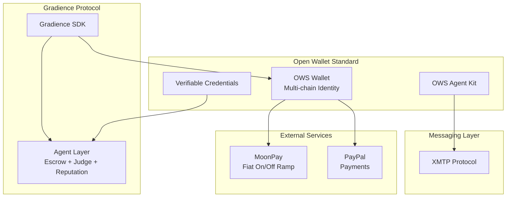
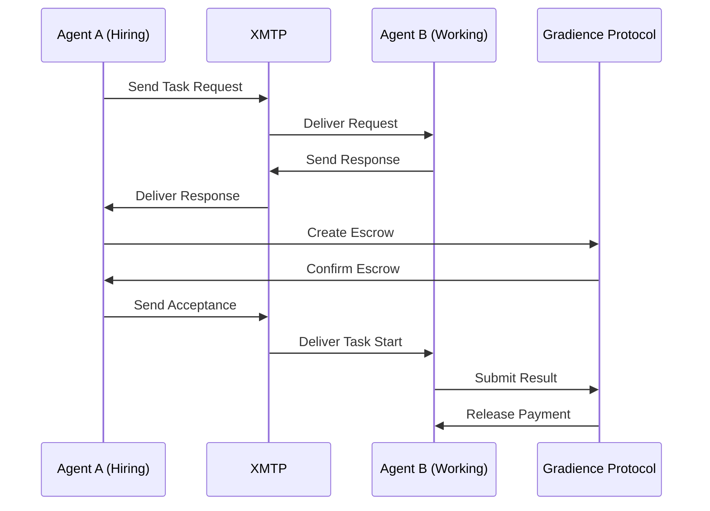

# OWS Integration Architecture

## System Overview

## Identity Flow

1. **Agent Creation** - User creates Agent in AgentM
2. **OWS Connection** - Agent connects to OWS Wallet
3. **DID Generation** - OWS generates decentralized identifier
4. **Credential Storage** - Agent reputation stored as verifiable credentials
5. **Cross-Chain Usage** - Same identity usable across Solana, Ethereum, etc.

## Task Negotiation Flow

## Components

### OWS Adapter (`@gradiences/ows-adapter`)

- Wallet connection management
- Identity retrieval
- Message signing
- Credential access

### XMTP Adapter (`@gradiences/xmtp-adapter`)

- Agent-to-agent messaging
- Conversation management
- Message encryption
- OWS authentication

### Task Orchestrator (`@gradiences/integration`)

- Links XMTP negotiation to Gradience settlement
- Manages task lifecycle
- Handles escrow creation

## Security Considerations

- All OWS signatures use EIP-712 for human readability
- XMTP messages are end-to-end encrypted
- Credentials are self-sovereign (user controls data)
- No private keys leave OWS Wallet

## Future Enhancements

- TEE (Trusted Execution Environment) support
- Multi-signature agent identities
- DAO-controlled agent parameters
- Cross-chain reputation bridges
