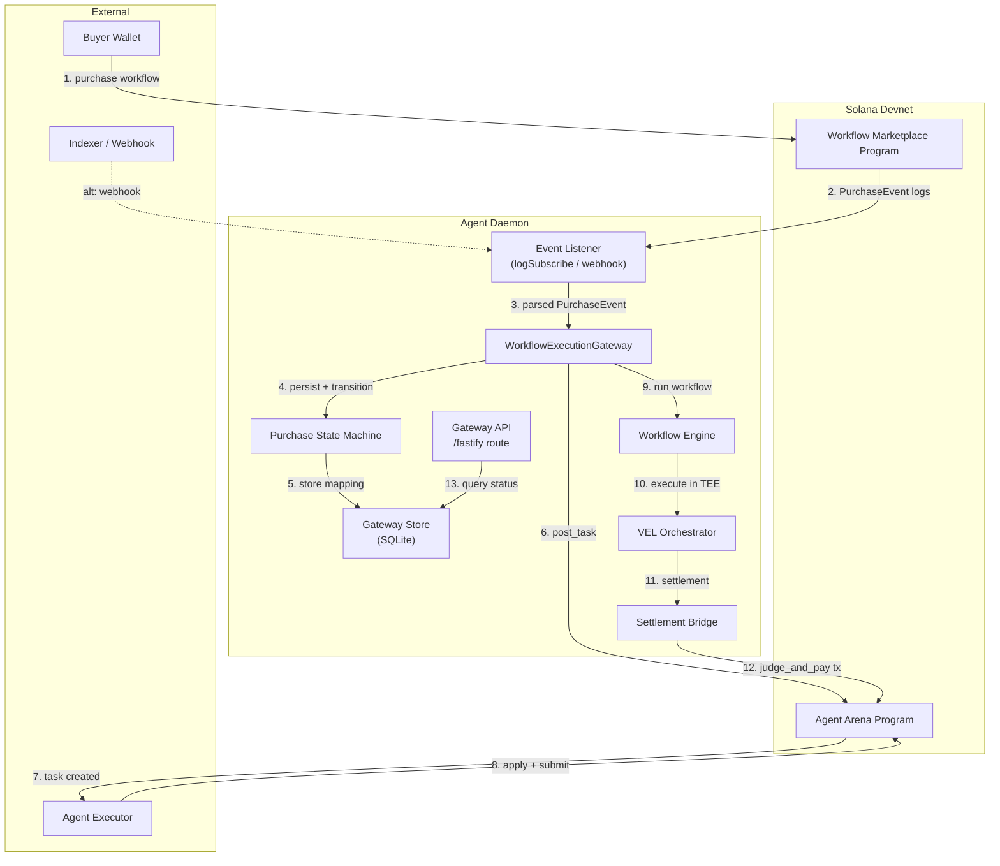
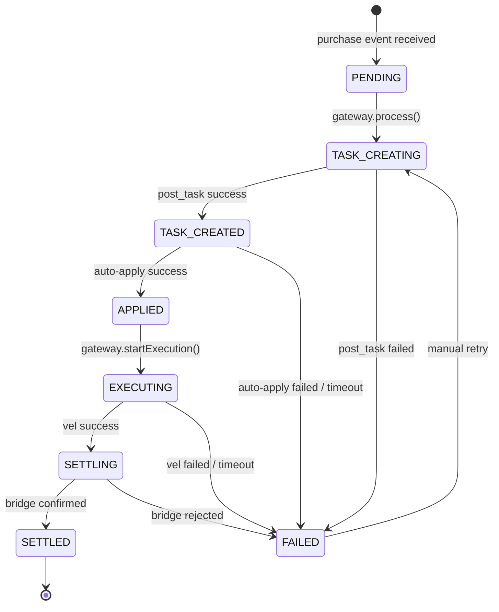

# Phase 2: Architecture — Workflow Execution Gateway

> **输入**: `docs/01-prd-workflow-execution-gateway.md`  
> **日期**: 2026-04-07

---

## 2.1 系统概览

### 一句话描述

Workflow Execution Gateway (WEG) 是 `agent-daemon` 内部的事件驱动编排层，负责把 Marketplace 的 `purchase` 事件自动转化为 Agent Arena 的 task 生命周期，并通过 VEL 执行 workflow 完成链上结算。

### 架构图



---

## 2.2 组件定义

| 组件 | 职责 | 技术选型 | 状态 |
|------|------|---------|------|
| **MarketplaceEventListener** | 监听 Marketplace Program 的日志/事件，解析 `purchase` 事件 | TypeScript (`src/gateway/event-listener.ts`) | 新建 |
| **WorkflowExecutionGateway** | 核心编排器：接收事件 → 创建 Arena task → 调度执行 → 结算 | TypeScript (`src/gateway/gateway.ts`) | 新建 |
| **PurchaseStateMachine** | 管理每个 purchase 的生命周期状态 | TypeScript (`src/gateway/state-machine.ts`) | 新建 |
| **GatewayStore** | 持久化 `purchase ↔ task ↔ settlement` 映射 | better-sqlite3 (`src/gateway/store.ts`) | 新建 |
| **GatewayAPI** | 暴露 REST endpoint 查询状态和手动触发 | fastify route (`src/api/routes/gateway.ts`) | 扩展 |
| **ArenaTaskFactory** | 把 purchase 数据转换为 `GradienceSDK.task.post()` 参数 | TypeScript (`src/gateway/arena-factory.ts`) | 新建 |
| **AgentAutoApplicant** | 自动监听新 task 并调用 `apply_for_task` | TypeScript (`src/gateway/auto-applicant.ts`) | 新建 |
| **WorkflowEngine** | 加载并运行 workflow handlers | 已有 `packages/workflow-engine/` | 已有 |
| **VEL Orchestrator** | 在 TEE/mock 中执行 workflow 并生成 attestation | 已有 `src/vel/orchestrator.ts` | 已有 |
| **SettlementBridge** | 提交 `judge_and_pay` transaction | 已有 `src/bridge/settlement-bridge.ts` | 已有 |

### 组件边界声明

- **Gateway 不直接操作 buyer 的私钥**：它使用 daemon 配置的 `evaluator key` 来 sign bridge settlement，而 Arena task 的 poster 可以是系统代理账户。
- **Gateway 不修改链上 program**：所有交互通过现有的 SDK/instruction 完成。
- **Event Listener 不保证 100% 实时**：允许短时间的延迟和去重（通过 transaction signature 去重）。

---

## 2.3 数据流

### 核心流程：Purchase → Task → Execution → Settlement

```
Marketplace purchase tx confirmed on-chain
  → EventListener detects PurchaseEvent log
    → WorkflowExecutionGateway receives PurchaseEvent
      → GatewayStore.insertPurchase(purchaseId, workflowId, buyer, amount)
      → PurchaseStateMachine transitions: PENDING → TASK_CREATING
        → ArenaTaskFactory.buildPostTaskParams(purchase)
          → GradienceSDK.task.post(systemWallet, params)
            → Agent AutoApplicant sees new task
              → GradienceSDK.task.apply(agentWallet, { taskId })
                → Gateway transitions: TASK_CREATING → EXECUTING
                  → WorkflowEngine.loadWorkflow(workflowId)
                    → VEL Orchestrator.runAndSettle(executionRequest)
                      → SettlementBridge.settleWithReasonRef()
                        → Arena judge_and_pay confirmed
                          → GatewayStore.updateSettlement(purchaseId, txSig)
                            → PurchaseStateMachine transitions: EXECUTING → SETTLED
```

### 核心数据流表

| 步骤 | 数据 | 从 | 到 | 格式 |
|------|------|----|----|------|
| 1 | `PurchaseEvent { purchaseId, buyer, workflowId, amount, timestamp }` | Solana logs | EventListener | Borsh decoded + parsed |
| 2 | `GatewayPurchaseRecord` | Gateway | GatewayStore | SQLite row |
| 3 | `PostTaskRequest { taskId, evalRef, reward, ... }` | ArenaTaskFactory | Arena SDK | SDK typed object |
| 4 | `TeeExecutionRequest { workflowDefinition, taskId, ... }` | Gateway | VEL Orchestrator | VEL typed object |
| 5 | `SettlementResult { txSignature, status, ... }` | SettlementBridge | Gateway | Bridge typed object |
| 6 | `PurchaseStatusResponse` | GatewayAPI | HTTP Client | JSON |

---

## 2.4 依赖关系

### 内部依赖

```
WorkflowExecutionGateway
  → MarketplaceEventListener (事件输入)
  → PurchaseStateMachine (状态管理)
  → GatewayStore (持久化)
  → ArenaTaskFactory (参数构造)
  → AgentAutoApplicant (可选的自动 apply)
  → WorkflowEngine (已有)
  → VEL Orchestrator (已有)
  → SettlementBridge (已有)

GatewayAPI
  → GatewayStore (读取状态)
  → WorkflowExecutionGateway (手动触发/重试)
```

### 外部依赖

| 依赖 | 版本 | 用途 | 是否可替换 |
|------|------|------|-----------|
| `@gradiences/arena-sdk` | workspace | post/apply/submit task | 否 |
| `@solana/web3.js` | ^1.98.4 | RPC connection, logSubscribe | 是 → `@solana/kit` |
| `better-sqlite3` | ^11.7.0 | Gateway local store | 是 → JSON file |
| `packages/workflow-engine` | workspace | workflow 执行 | 否 |
| `@gradiences/agent-daemon/vel` | workspace | TEE 执行与结算 | 否 |

---

## 2.5 状态管理

### 状态枚举

| 状态名 | 含义 | 谁拥有 | 持久化方式 |
|--------|------|--------|-----------|
| `PENDING` |  purchase 事件已收到，尚未创建 Arena task | Gateway | SQLite |
| `TASK_CREATING` | 正在调用 `post_task` | Gateway | SQLite |
| `TASK_CREATED` | Arena task 已创建，等待 agent apply | Gateway | SQLite |
| `APPLIED` | Agent 已 apply，等待 submit/execution | Gateway | SQLite |
| `EXECUTING` | VEL 正在执行 workflow | Gateway | SQLite |
| `SETTLING` | SettlementBridge 正在提交 judge_and_pay | Gateway | SQLite |
| `SETTLED` | judge_and_pay 已确认 | Gateway | SQLite |
| `FAILED` | 任意环节失败，可重试 | Gateway | SQLite |

### 状态转换图



---

## 2.6 接口概览

| 接口 | 类型 | 调用方 | 说明 |
|------|------|--------|------|
| `MarketplaceEventListener.start()` | 内部方法 | Daemon start | 启动日志监听循环 |
| `MarketplaceEventListener.stop()` | 内部方法 | Daemon stop | 停止监听 |
| `WorkflowExecutionGateway.processPurchase(event)` | 内部方法 | EventListener | 新 purchase 的入口 |
| `WorkflowExecutionGateway.retry(purchaseId)` | 内部方法 | GatewayAPI / manual | 重试失败的 purchase |
| `GatewayStore.insertPurchase(record)` | 内部方法 | Gateway | 插入新记录 |
| `GatewayStore.updateStatus(id, status, meta)` | 内部方法 | Gateway / StateMachine | 更新状态 |
| `GatewayStore.getByPurchaseId(id)` | 内部方法 | GatewayAPI | 查询单条记录 |
| `GET /gateway/purchases/:purchaseId` | REST API | Frontend / CLI | 返回完整链路状态 |
| `POST /gateway/purchases/:purchaseId/retry` | REST API | Frontend / CLI | 手动重试 |

---

## 2.7 安全考虑

| 威胁 | 影响 | 缓解措施 |
|------|------|---------|
| 恶意/伪造 purchase 事件 | 高：可能导致自动创建无效 task 并浪费 gas | EventListener 严格验证 transaction 的 program ID、discriminator 和Buyer 签名 |
| 同一 purchase 被重复处理 | 中：多次 post_task，多次扣费 | GatewayStore 以 `purchaseId` 为唯一主键，插入时忽略重复 |
| Agent 不 apply 导致 task 悬挂 | 中：buyer 付了钱但 workflow 永远不执行 | 配置 fallback agent + timeout 监控；超时可触发 refund 或重新分配 |
| Settlement 失败导致资金锁在 escrow | 高：buyer 和 agent 都拿不到钱 | Gateway 自动重试 bridge settlement；多次失败后进入 `FAILED` 状态供人工介入 |
| 本地 SQLite 被篡改 | 低：状态查询造假 | GatewayAPI 返回的状态包含链上可验证的 tx signature，客户端可独立核对 |

---

## 2.8 性能考虑

| 指标 | 目标 | 约束 |
|------|------|------|
| Event 检测延迟 | < 15s | Solana block time ~400ms + RPC 轮询间隔 |
| post_task 到 taskId 可用 | < 5s | 取决于 RPC 确认速度 |
| 端到端 (purchase → settled) | < 5 min | 主要受 Vel TEE 执行 + bridge retry 影响 |
| GatewayStore 吞吐量 | 100 events/min | SQLite 单机写入足够 |
| 并发执行 | 1-5 workflows 同时运行 | 本地 TEE/mock 资源限制 |

---

## 2.9 部署架构

### 开发环境

```
Local Laptop
  └── Agent Daemon (Node.js)
        ├── Gateway Event Listener (logSubscribe to devnet)
        ├── Gateway API (localhost:3000/gateway/...)
        ├── VEL (mock enclave)
        └── SQLite DB (~/.agentd/gateway.db)
```

### 生产预研架构

```
Cloud Host (AWS/GCP)
  └── Agent Daemon
        ├── Gateway Event Listener (webhook from Indexer)
        ├── Gateway API (behind reverse proxy)
        ├── VEL (Nitro Enclave or Gramine SGX)
        └── SQLite / PostgreSQL (managed DB)
```

---

## ✅ Phase 2 验收标准

- [x] 架构图清晰，组件边界明确
- [x] 所有组件的职责已定义
- [x] 数据流完整，无断点
- [x] 依赖关系（内部 + 外部）已列出
- [x] 状态管理方案已定义
- [x] 接口已概览
- [x] 安全威胁已识别

**验收通过后，进入 Phase 3: Technical Spec →**
