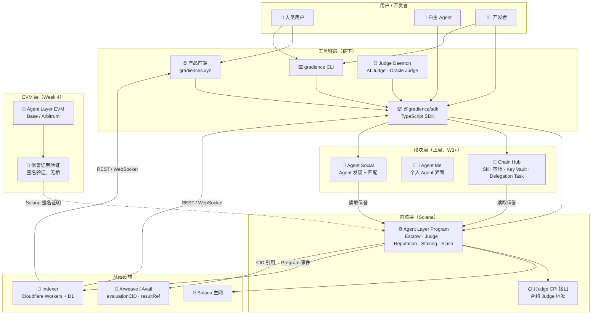
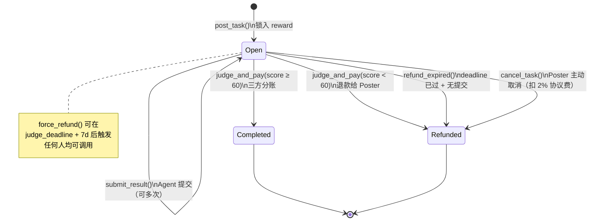

# Phase 2: Architecture — Agent Layer v2

> **目的**: 定义系统整体结构、组件划分、数据流、状态机
> **输入**: `docs/01-prd.md`
> **输出物**: `docs/02-architecture.md`

---

## 2.1 系统概览

### 一句话描述

> Agent Layer v2 是一个运行在 Solana 上的能力结算协议栈：链上 Program 提供无需许可的竞争结算内核，链下工具链（SDK / CLI / Judge Daemon / 前端）提供完整开发者体验，EVM 合约（Week 4）提供跨链信誉验证。

### 全栈架构图



---

## 2.2 组件定义

| 组件 | 职责 | 不做什么 | 技术选型 | 状态 |
|------|------|---------|---------|------|
| **Agent Layer Program** | 链上结算内核：Escrow、Judge、Reputation、Staking、Slash，仅支持 Race Task | 不知道 Chain Hub / Agent Me / A2A 的存在；不做持续委托（Delegation Task） | Rust + Anchor | 新建 |
| **IJudge CPI 接口** | 定义合约 Judge 标准，任意 Solana Program 实现后可充当 Judge；内置四种实现类型：**test_cases**（跑测试用例，通过率即分数，适合算法竞技/代码任务）、**oracle_hash**（输出哈希对比，适合数据转换/ETL）、**wasm_exec**（链下 WASM 沙箱执行，确定性重现，适合量化回测/DeFi计算/游戏AI）、**zk_proof**（链上零知识证明验证，适合隐私数据分析/zkML模型身份证明/外包大规模计算）；W4 扩展 zkML（RISC Zero / EZKL 集成），可密码学确定性验证 Agent 使用了声明的 AI 模型 | 不内嵌 AI 逻辑；不托管资金 | Anchor CPI | 新建 |
| **Judge Daemon** | 链下持久化评测工作流：通过 **Helius LaserStream gRPC** 超低延迟监听任务事件，下载 result_ref + trace_ref，回放 Agent 执行轨迹（白盒评测），综合评分后提交 judge_and_pay；**基于 Absurd 实现**，崩溃可续跑，完整评测历史存 PostgreSQL | 不持有资金；不修改链上状态（只提交 judgeAndPay 指令） | TypeScript + Absurd（PostgreSQL 持久化工作流引擎）+ Helius LaserStream | 新建 |
| **Agent 执行运行时** | Agent 用 Absurd 包裹每一步 LLM 调用（ctx.step），自动将 prompt 序列 + 中间推理 + 决策事件存入 PostgreSQL checkpoint；执行完成后导出为 trace_ref 上传 Arweave；内置 **MPP 客户端**（`@solana/mpp`），Agent 调用外部付费 API（LLM / 数据 / 搜索）时自动处理 HTTP 402 挑战，用 Solana 钱包按需付款，无需管理 API Key | 不是链上组件；trace 内容不上链，只有 CID 引用上链；MPP 仅用于调用外部服务，不影响任务悬赏结算 | TypeScript + Absurd + LLM SDK + @solana/mpp | 新建 |
| **@gradience/sdk** | 所有 Program 指令的 TypeScript 封装，统一入口 | 不内嵌业务逻辑 | TypeScript + @coral-xyz/anchor | 新建 |
| **gradience CLI** | 命令行工具，支持完整任务生命周期操作和节点启动 | 不提供 GUI | TypeScript / Commander.js | 新建 |
| **产品前端** | 任务浏览、发布、竞争状态、评判触发 | 不存储链下私有数据 | Next.js + Cloudflare Pages | 新建 |
| **Indexer** | 通过 **Helius Webhooks** 接收 Program 事件推送（替代自轮询，延迟 <200ms），提供 REST API + WebSocket；支持两种部署模式：**Managed**（Cloudflare Workers + D1，零运维）和 **Self-hosted**（Docker + PostgreSQL，任何人可运行） | 不是共识的一部分，宕机不影响协议；链上数据是唯一真相，Indexer 只是链上状态的可查询视图 | Rust（自托管核心）/ TypeScript（CF Workers 适配层）+ PostgreSQL / D1 + Helius Webhooks | 已有（重构） |
| **钱包抽象层（Wallet Adapter）** | SDK 内置钱包适配器接口，屏蔽底层钱包实现，Agent 只调用统一的 `sign / sendTx` 接口；支持五种适配器：OpenWallet、OKX Agentic Wallet、Privy、Kite Passport、原始 Keypair（开发测试） | 不托管资产；不决定用户用哪种钱包 | TypeScript 接口 + 各 SDK 适配器 | 新建 |
| **OpenWallet (OWS) 适配器** | 开放标准，本地自托管；Key 存 `~/.ows/`，AES-256 加密；Policy Engine 控制签名权限；scoped token；MCP 支持；适合个人用户和开发者 | 不支持 TEE 硬件隔离 | OpenWallet SDK（Node.js / Rust） | 外部集成 |
| **OKX Agentic Wallet 适配器** | 企业级 TEE 托管钱包；私钥在 TEE 内生成和签名，OKX 自身也无法访问；支持最多 50 个子钱包并行策略；内置异常检测；原生 x402 微支付协议；适合高安全场景和 OKX 生态 | 依赖 OKX 基础设施（非完全去中心化） | OKX OnchainOS SDK | 外部集成 |
| **Privy 适配器** | 开发者基础设施级 Agent 钱包 Fleet：TEE 保护，Policy Engine（转账上限 / 合约白名单 / 时间窗口），Authorization Key 控制，无限子钱包；原生支持 Solana + EVM；内置 MPP/x402 支持；两种控制模型：开发者全控（Model 1）/ 用户持有授权 Agent 签名（Model 2）；适合开发者运营多 Agent 并行策略 | 依赖 Privy 基础设施 | Privy Node SDK (`@privy-io/node`) | 外部集成 |
| **Kite Agent Passport 适配器** | Kite AI 链原生三层身份体系（User → Agent → Session 派生）；ERC-4337 账户抽象，programmable spending constraints；x402 支持；适合部署在 Kite AI 链上的任务和 Kite 生态 Agent | 依赖 Kite AI 链（Avalanche Subnet） | Kite AA SDK（gokite-aa-sdk） | 外部集成（Week 4） |
| **Chain Hub** | Delegation Task、Skill 市场；Key Vault 由 OpenWallet Policy Engine 实现——Poster 设定执行参数（滑点/频率上限），Agent 物理上无法超出 | 不修改 Agent Layer 内核 | Rust + Anchor + TS + OpenWallet | 新建（Week 3） |
| **Agent Me** | 个人 Agent 界面，AgentSoul 本地存储；使用 OpenWallet 管理用户的多链钱包（Solana + EVM），Key 从不离开本地 | 不上传用户私有记忆和私钥 | Next.js / Tauri + OpenWallet SDK | 新建（Week 3） |
| **Agent Social** | Agent 发现 + 匹配（Week 3） | 不做结算 | Next.js + Indexer | 新建（Week 3） |
| **Agent Layer EVM** | EVM 链上的协议移植，含信誉证明验证（Week 4）；支持三条 EVM 链：Base、Arbitrum（通用流动性）、Kite AI（AI Agent 原生受众，x402 + Agent Passport 生态） | 不做跨链桥 | Solidity ^0.8.20 + Hardhat | 新建（Week 4） |

---

## 2.3 数据流

### 核心：Race Task 生命周期

```
1. 发布任务
   Poster → SDK.task.post(desc, evalRef, deadline, judge, mint, minStake, category)
         → judge 字段两种模式：
             指定模式：judge = <Pubkey>（Poster 信任特定 Judge）
             Pool 模式：judge = null → 链上从 JudgePool[category] 按质押量加权随机抽选
                        随机源：Switchboard VRF（可验证随机，防操控）
         → Agent Layer Program: post_task 指令
         → 链上：创建 Task PDA，锁入 SOL/SPL Token 到 Escrow PDA
         → Indexer 捕获 TaskCreated 事件
         → evaluationCID 写入 Arweave

2. Agent 发现 & 申请
   Agent → Indexer REST API（查开放任务列表）
         → SDK.task.apply(taskId)
         → Agent Layer Program: apply_for_task 指令
         → 链上：Agent 质押 minStake，创建 Application PDA
         → 首次参与自动创建 Reputation PDA

3. Agent 提交结果（白盒提交）
   Agent → SDK.task.submit(taskId, resultRef, traceRef, runtimeEnv)
         → Agent Layer Program: submit_result 指令
         → 链上：更新 Submission PDA（可多次覆盖），记录：
             result_ref   — 最终产出的 CID（Arweave）
             trace_ref    — 完整执行轨迹 CID（Prompt 序列 + 中间推理 + 决策事件）
             runtime_env  — Agent 运行时环境声明（provider / model / runtime / version），
                            Judge 凭此复现相同环境重放 trace，验证有无作恶
         → trace 内容存入 Arweave（内容寻址，防篡改）

4. Judge 评判（三种方式 / 六类标准，评判标准由 evaluationCID 定义）

   赢家判定规则：① 所有提交按 evaluationCID 评分 → ② 过滤 score < minScore → ③ 最高分胜
   同分平局：取最早 Solana slot（链上客观时间戳）

   方式 A（人工）— 适合创意/主观/治理类任务
     Judge → 前端/CLI 查看 result_ref + trace_ref → SDK.task.judge(taskId, winner, score, reasonRef)
     评判标准：Judge 主观打分（evaluationCID 定义加权维度），结算最慢（小时～天）

   方式 B（AI白盒）— 适合推理密集型/过程验证类任务
     Judge Daemon 监听到 SubmissionReceived（Helius LaserStream）
     → 下载 result_ref + trace_ref + runtime_env
     → 按 runtime_env 起相同环境，重放 Agent 执行轨迹
     → 评判推理一致性（防止 Agent 用弱模型冒充强模型）+ 产出质量 → 综合评分 → 自动提交
     评判标准：trace 重放一致性 + 产出质量（AI 打分 0-100），结算分钟级

   方式 C（合约/IJudge CPI）— 适合确定性可验证任务，结算秒级
     IJudge Program → CPI 调用 judge_and_pay，score 由合约代码计算，无人干预

     C-1 test_cases（算法竞技 / 代码实现）
       评判标准：测试用例通过率 × 100 = score
       业务：排序算法、动态规划、合约功能实现

     C-2 oracle_hash（数据转换 / ETL）
       评判标准：输出哈希匹配 = 100，不匹配 = 0
       业务：数据清洗、格式转换、确定性数据处理

     C-3 wasm_exec（确定性重现计算）— W2
       评判标准：链下 WASM 沙箱重跑相同程序，对比执行结果
       业务场景：
         · 量化回测：给定历史数据 + 策略逻辑，对比收益曲线
         · DeFi 计算：给定池子状态，验证最优 LP 再平衡方案
         · 游戏 AI：给定棋局，验证最优解步数
         · 科学模拟：物理/金融模拟确定性输出验证
       特点：输入数据公开，任何节点可独立验证，无需信任 Agent

     C-4 zk_proof（零知识证明验证）— W4
       评判标准：链上验证 ZK proof，valid = 100，invalid = 0
       业务场景：
         · zkML 模型身份：Agent 证明推理由指定模型产生（无法伪造），
                          将方式 B 的"概率性验证"升级为"密码学确定性"
         · 隐私数据分析：分析医疗/金融私有数据，只证明"分析正确"，不暴露原始数据
         · 外包大规模计算：ML 训练 / 渲染 / 科学模拟，计算量太大无法重跑，
                           ZK proof 提供轻量链上验证（O(1) 验证成本）
         · 专有算法保护：私有交易策略执行，不暴露算法，只证明结果正确
         · 合规证明：证明操作满足监管条件，不暴露具体数据
       基础设施：RISC Zero（通用 zkVM）/ EZKL（zkML）/ Light Protocol（Solana ZK 压缩）
         → Agent Layer Program: judge_and_pay 指令
         → 链上三方分账：
             Agent(winner)  95% of reward
             Judge          3%  of reward（与任务同 mint）
             Protocol       2%  of reward → Treasury PDA
         → 信誉更新：winner.avgScore、winRate、completed
         → Indexer 捕获 TaskJudged 事件

5. 超时退款（任何人触发）
   任何人 → SDK.task.forceRefund(taskId)   （judge_deadline + 7d 后）
         → Agent Layer Program: force_refund 指令
         → 链上：95% → Poster，3% → 提交最多的 Agent，2% → Protocol
         → Judge 信誉衰减
```

### 核心数据流映射

| 步骤 | 数据 | 从 | 到 | 格式 |
|------|------|----|----|------|
| 1 | 任务参数 + 锁仓 | Poster | Agent Layer PDA | Anchor Account |
| 1 | evaluationCID | Poster | Arweave | Content-addressed |
| 2 | 质押 + 申请 | Agent | Agent Layer PDA | Anchor Account |
| 3 | result_ref（最终产出 CID）+ trace_ref（执行轨迹 CID）+ runtime_env（环境声明） | Agent | Agent Layer PDA + Arweave | Content-addressed |
| 4 | score(0-100) + winner | Judge / Daemon / Contract | Agent Layer | Anchor Instruction |
| 4 | 分账转账 | Escrow PDA | Agent / Judge / Treasury | SOL lamport / SPL Token |
| 4 | 信誉更新 | Agent Layer | Reputation PDA | Anchor Account |
| * | 所有事件 | Agent Layer | Indexer | Program Event Log |

---

## 2.4 依赖关系

### 内部依赖

```
产品前端      → SDK（所有链上操作）
CLI           → SDK（所有链上操作）
Judge Daemon  → SDK（提交 judge_and_pay）
SDK           → Agent Layer Program（核心 Program 指令）
SDK           → Indexer API（查询事件、任务列表）
Chain Hub     → Agent Layer Program（读取信誉 PDA）
Agent Social  → Indexer API（读取 Agent 信誉排行）
EVM 合约      → Solana 信誉证明（链下签名验证，无 RPC 依赖）

依赖方向规则：
  ✅ 模块 → 内核（单向）
  ❌ 内核 → 模块（禁止）
```

### 外部依赖

| 依赖 | 版本 | 用途 | 可替换 |
|------|------|------|--------|
| Solana | mainnet-beta | 链上共识 + 结算 | 否（核心约束） |
| Anchor | ^0.31 | Solana Program 框架 | 否 |
| @solana/web3.js | ^2.0 | RPC 交互 | 否 |
| @solana/spl-token | ^0.4 | SPL Token + Token2022 转账 CPI | 否 |
| Helius | — | Solana RPC 基础设施（99.99% 可用，<100ms）；Webhooks 推送 Program 事件给 Indexer；LaserStream gRPC 给 Judge Daemon 超低延迟触发；MCP Server（60+ 工具，与 Claude Code 集成）；TypeScript + Rust SDK | 否（Solana RPC 核心依赖） |
| Cloudflare Workers | — | Indexer Managed 模式运行时 | 是（Self-hosted 模式不需要） |
| Cloudflare D1 | — | Indexer Managed 模式数据库 | 是（Self-hosted 用 PostgreSQL） |
| PostgreSQL | ≥ 15 | Indexer Self-hosted 模式数据库 | 是（Managed 模式用 D1） |
| Docker | — | Self-hosted Indexer 容器化部署 | 是（可直接跑二进制） |
| Arweave | — | evaluationCID 永久存储 | 是（Avail 可替换） |
| OpenWallet (OWS) | — | 个人/开发者 Agent 钱包（本地自托管） | 是（钱包抽象层可替换） |
| OKX Agentic Wallet | — | 企业级 Agent 钱包（TEE 托管，50 子钱包，x402 支持） | 是（钱包抽象层可替换） |
| Privy | — | 开发者 Agent 钱包 Fleet（TEE + Policy Engine + 无限子钱包，Solana 原生，MPP/x402 支持） | 是（钱包抽象层可替换） |
| MPP (`@solana/mpp`) | — | Machine Payments Protocol：Agent 执行时调用外部付费 API 的 HTTP 402 支付客户端；Solana 原生（SOL/SPL/Token-2022）；无需 API Key，按需链上付款；IETF 提案开放标准 | 是（Agent 可不调用外部 MPP 服务） |
| Kite AI (GoKite) | Chain ID 2366 (mainnet) / 2368 (testnet) | EVM 部署目标（AI Agent 原生链）；Agent Passport 身份；x402；ERC-4337 AA | 是（W4 可选链） |
| Absurd | — | Agent 执行轨迹持久化 + Judge Daemon 工作流引擎（仅需 PostgreSQL） | 是（可替换为其他持久化引擎） |
| Claude API / OpenAI | — | Judge Daemon AI 评分 | 是（任意 LLM） |
| Next.js | 14+ | 前端框架 | 是 |
| Hardhat | ^2 | EVM 合约（Week 4） | 是 |

---

## 2.5 状态管理

### 链上账户（PDA）枚举

| 账户 | seeds | 含义 | 所有者 |
|------|-------|------|--------|
| `Task` | `["task", task_id]` | 任务主体：状态、奖励、Judge（指定或 Pool 随机）、deadline、category（约 323 bytes） | Agent Layer Program |
| `Escrow` | `["escrow", task_id]` | 锁仓资金（SOL）或 ATA（SPL Token） | Agent Layer Program |
| `Application` | `["application", task_id, agent]` | Agent 申请记录 + 质押 | Agent Layer Program |
| `Submission` | `["submission", task_id, agent]` | 最新提交：result_ref + trace_ref + runtime_env（可覆盖） | Agent Layer Program |
| `Reputation` | `["reputation", agent]` | 信誉数据（全局 + 按 category），按需创建 | Agent Layer Program |
| `Stake` | `["stake", agent]` | Judge 质押记录：质押量、注册 category、加权随机权重 | Agent Layer Program |
| `JudgePool` | `["judge_pool", category]` | 各 category 的合格 Judge 列表（stake ≥ minJudgeStake） | Agent Layer Program |
| `Treasury` | `["treasury"]` | 协议收入账户 | Agent Layer Program |
| `ProgramConfig` | `["config"]` | treasury 地址、upgrade_authority、minJudgeStake | Agent Layer Program |

### Task 状态机



### 状态转换规则

| 指令 | 前置状态 | 调用方 | 后置状态 | 副作用 |
|------|---------|--------|---------|--------|
| `post_task` | — | 任何人 | Open | 创建 Task PDA，锁仓；judge 字段可指定地址或留空（留空则从 JudgePool 随机抽选） |
| `apply_for_task` | Open | 任何人（质押 ≥ minStake） | Open | 创建 Application PDA，按需创建 Reputation PDA |
| `submit_result` | Open | 已申请的 Agent | Open | 更新 Submission PDA |
| `judge_and_pay` | Open | Task.judge | Completed / Refunded | 三方分账，信誉更新，Application 质押退回 |
| `cancel_task` | Open（无提交） | Task.poster | Refunded | 扣 2% 协议费，退 98% 给 Poster |
| `refund_expired` | Open（deadline 过） | 任何人 | Refunded | 全额退 Poster |
| `force_refund` | Open（judge_deadline+7d 过） | 任何人 | Refunded | 95%→Poster，3%→活跃 Agent，2%→Protocol，Judge 质押 Slash |

---

## 2.6 接口概览

### Agent Layer Program 指令（详细定义在 Phase 3）

| 指令 | 类型 | 调用方 | 说明 |
|------|------|--------|------|
| `post_task` | Anchor Instruction | 任何人 | 发布任务，锁入奖励 |
| `apply_for_task` | Anchor Instruction | 任何 Agent | 申请任务，质押 minStake |
| `submit_result` | Anchor Instruction | 已申请 Agent | 提交/更新结果引用（runtime_env 各字段长度在指令中验证，超限返回 InvalidRuntimeEnv） |
| `judge_and_pay` | Anchor Instruction | Task.judge | 评判并触发三方结算 |
| `cancel_task` | Anchor Instruction | Task.poster | 主动取消任务 |
| `refund_expired` | Anchor Instruction | 任何人 | 超时退款 |
| `force_refund` | Anchor Instruction | 任何人 | Judge 超时强制退款 |
| `register_judge` | Anchor Instruction | 任何人 | 质押 ≥ minJudgeStake，声明擅长 category，加入对应 JudgePool |
| `unstake_judge` | Anchor Instruction | Judge | 解质押（冷却期），退出 JudgePool |
| `initialize` | Anchor Instruction | 部署者（一次性） | 初始化 ProgramConfig |
| `upgrade_config` | Anchor Instruction | upgrade_authority | 更新 treasury 地址 |

### IJudge CPI 接口

```rust
// 合约 Judge 必须实现的 CPI 接口
// 由 Judge Program 在收到调用时返回 score
pub trait IJudge {
    fn evaluate(
        task_id: u64,
        submissions: Vec<SubmissionRef>,  // [(agent_pubkey, result_ref)]
        evaluation_cid: String,
    ) -> Result<JudgeResult>;             // { winner: Pubkey, score: u8, reason_ref: String }
}
```

### SDK 接口概览

```typescript
// @gradience/sdk — 主要接口（详细在 Phase 3）
grad.task.post(params)           // 发布任务
grad.task.apply(taskId)          // 申请任务
grad.task.submit(taskId, ref)    // 提交结果
grad.task.judge(taskId, ...)     // 人工评判
grad.task.forceRefund(taskId)    // 强制退款
grad.reputation.get(pubkey)      // 查询信誉
grad.task.list(filter)           // 查询任务列表（走 Indexer）
grad.task.submissions(taskId)    // 查询提交列表（走 Indexer，按信誉排序）
grad.indexer.endpoint(url)       // 切换 Indexer 端点（Managed / Self-hosted）
// 钱包抽象层 — 三种适配器，接口统一
grad.wallet.use(new OpenWalletAdapter(owsToken))      // 个人/开发者：本地自托管
grad.wallet.use(new OKXAgentWalletAdapter(config))    // 企业：TEE 托管，50 子钱包，x402
grad.wallet.use(new KeypairAdapter(keypair))          // 开发测试用
grad.wallet.use(new KitePassportAdapter(config))      // Kite AI 链：三层身份 + ERC-4337 + x402

// CLI 命令（gradience CLI，底层集成 Absurd）
// gradience agent start   — 启动 Agent 执行 worker（Absurd task，自动捕获 trace）
// gradience judge start   — 启动 Judge Daemon worker（Absurd task，白盒回放评测）
// gradience trace dump <taskId>  — 查看 Agent 完整执行轨迹（prompt/response/决策事件）
// gradience indexer start — 启动自托管 Indexer（Cloudflare Workers 替代方案）
// gradience judge ai      — 以 AI 白盒模式评判一个任务
// gradience judge oracle  — 以 Oracle 模式评判一个任务（test_cases 类型）
```

### Judge Daemon 接口

```typescript
// Judge Daemon — 白盒评测模式
// API Key 由用户自己在 AI 云（Open Cloud）中配置，协议不管模型凭据
// Daemon 通过本地 AI 运行时（用户自己的 Claude / OpenAI / 本地模型）进行评测

daemon.ai.start({
  taskFilter: { category: 'code' },
  // 无 apiKey 字段 — 用户自行配置 AI 运行时（环境变量 / 本地模型 / Open Cloud）
  judgeWallet: keypair,
  evalMode: 'whitebox',  // 'whitebox'（回放 trace）| 'blackbox'（只看结果）
})

// 白盒评测流程：
// 1. 监听到 SubmissionReceived 事件
// 2. 下载 submission.result_ref（最终产出）
// 3. 下载 submission.trace_ref（执行 Prompt + 推理日志 + 声明的模型）
// 4. 将完整 trace 回放给 Judge 的本地 AI 运行时，验证推理一致性
// 5. 综合评分（产出质量 + 推理过程）→ 提交 judge_and_pay

daemon.oracle.start({
  taskFilter: { evalType: 'test_cases' },
  runner: 'node',        // node | docker | wasm
  judgeWallet: keypair,
})
```

### Indexer REST API

```
GET  /api/tasks?status=Open&mint=SOL     任务列表（支持筛选）
GET  /api/tasks/:id                       任务详情
GET  /api/tasks/:id/submissions?sort=score  提交列表（按评分排序）
GET  /api/agents/:pubkey/reputation       Agent 信誉
GET  /api/leaderboard                     信誉排行榜
GET  /api/stats                           协议全局统计
WS   /ws                                  实时事件订阅
```

---

## 2.7 安全考虑

| 威胁 | 影响 | 缓解措施 |
|------|------|---------|
| 重入攻击 | 重复提取资金 | Anchor 账户约束 + 原子指令；状态变更先于转账 |
| Sybil 攻击 | 刷信誉 | Agent 申请需质押 minStake；自评任务链上标记 `self_evaluated=true` |
| Judge 串通 | Agent+Judge 合谋刷高分 | Poster 指定 Judge（不是 Agent 选）；Judge 信誉公开可查；evaluationCID 公开可审计 |
| Judge 超时 | 资金永久锁死 | force_refund（7 天后任何人可触发）；Judge 质押 Slash |
| 价格操纵（SPL Token） | 任务奖励缩水 | 协议只处理数量，不依赖价格；奖励在发布时锁定 |
| Token2022 Transfer Hook | 恶意 Hook 干扰结算 | 只支持标准 transfer，不支持 Transfer Hook 扩展 |
| Program 升级滥用 | 管理员修改费率 | 费率为常量，不受 upgrade 影响；upgrade_authority = 多签 DAO，操作公开 |
| PDA 碰撞 | 账户混淆 | seeds 包含 task_id + agent pubkey，确保唯一性 |
| 信誉证明伪造（EVM） | 跨链信誉造假 | EVM 合约验证 Solana 签名，需 Program 私钥签名，不可伪造 |

---

## 2.8 性能考虑

| 指标 | 目标 | 约束 |
|------|------|------|
| 单指令 Compute Units | ≤ 200,000 CU | Solana 单交易上限 1,400,000 CU |
| `post_task` 延迟 | ≤ 500ms（确认） | Solana 出块 ~400ms |
| `judge_and_pay` 延迟 | ≤ 500ms（确认） | 含三路转账，需测量 |
| Indexer API 延迟 | ≤ 100ms | Cloudflare 边缘节点 |
| Judge Daemon AI 延迟 | ≤ 30s（端到端） | LLM API 延迟为主 |
| 并发任务容量 | 10,000+ 并发 | ≈ 100 TPS，< Solana 3% 容量 |

---

## 2.9 部署架构

### 组件部署图

```
┌──────────────────────────────────────────────────────────┐
│                     Solana 主网                           │
│  ┌─────────────────┐  ┌──────────────┐  ┌─────────────┐  │
│  │ Agent Layer     │  │ IJudge       │  │ Chain Hub   │  │
│  │ Program (Week 1)│  │ Program(s)   │  │ Program(Week3)│ │
│  └─────────────────┘  └──────────────┘  └─────────────┘  │
└───────────────────────────┬──────────────────────────────┘
                            │ Program 事件（gRPC / WebSocket）
              ┌─────────────┴──────────────────────────┐
              ▼                                         ▼
┌────────────────────────────────┐   ┌───────────────────────────┐
│ Indexer — Managed 模式          │   │ Arweave / Avail           │
│ Cloudflare Workers             │   │ evaluationCID             │
│ D1 (SQLite)                    │   │ resultRef                 │
│ Cloudflare Pages (前端)         │   │ judgeReasonRef            │
└───────────────┬────────────────┘   └───────────────────────────┘
                │
┌───────────────┴────────────────┐
│ Indexer — Self-hosted 模式      │  ← 任何人都可以运行
│ Docker 容器 / 裸二进制          │
│ PostgreSQL                     │
│ 暴露相同的 REST / WebSocket API │
└───────────────┬────────────────┘
                │ REST / WebSocket（接口完全一致）
┌───────────────┴──────────────────────────────────────┐
│              客户端层                                  │
│  gradiences.xyz (前端)  @gradience/sdk  gradience CLI │
│  Judge Daemon (AI + Oracle)                           │
└───────────────────────────────────────────────────────┘

EVM 层（Week 4）:
┌──────────────────────────────────────────────────┐
│  Base / Arbitrum                                  │
│  Agent Layer EVM Contract                         │
│  Reputation Proof Verifier（验 Solana 签名）       │
└──────────────────────────────────────────────────┘
```

**Indexer 设计原则**：
- 两种模式暴露**完全相同的 REST / WebSocket API**，SDK 和前端无感知切换
- 链上数据是唯一真相，Indexer 是可重建的只读视图——任何 Indexer 随时可从创世块重新同步
- 官方运行 Managed 模式（Cloudflare）作为默认端点；社区可运行 Self-hosted 作为备用或独立服务
- `gradience indexer start` CLI 命令一键启动 Self-hosted 节点

### 按周上线计划

```
W1 (04-01 ~ 04-07): 内核
  ✅ Agent Layer Program (Solana devnet → mainnet)
  ✅ Anchor 测试套件（全状态路径覆盖）

W2 (04-08 ~ 04-14): 工具链
  ✅ @gradience/sdk
  ✅ gradience CLI
  ✅ Judge Daemon（AI + Oracle 两种模式）
  ✅ 产品前端（Cloudflare Pages）
  ✅ Indexer 升级（支持 Staking / Slash 事件）

W3 (04-15 ~ 04-21): 模块层
  ✅ Chain Hub MVP（Skill 市场 + Key Vault 基础）
  ✅ Agent Me MVP
  ✅ Agent Social MVP
  ✅ GRAD 创世 + 流动性池
  ✅ 链上治理 DAO（多签 upgrade_authority）

W4 (04-22 ~ 04-30): 全链
  ✅ Agent Layer EVM（Base + Arbitrum）
  ✅ 跨链信誉证明验证
  ✅ A2A 协议 MVP（MagicBlock ER）
  ✅ GRAD 挖矿 + 回购销毁启动
```

---

## 关键架构决策

| 决策 | 选择 | 理由 |
|------|------|------|
| 任务模型 | 仅 Race Task（离散竞争） | 持续委托与竞争并行不兼容；Delegation Task 归 Chain Hub |
| 链选择 | Solana 首发，EVM W4 | Solana 400ms 出块 + 低 Gas；EVM 为跨链信誉扩展 |
| Program 可升级 | 是，**Squads v4（3/5 多签）**控制 upgrade_authority | 开发阶段需迭代；费率常量不受 upgrade 影响 |
| 费率 | 95/3/2 硬编码常量 | 协议承诺，不可被治理/升级修改 |
| 支付 | SOL + SPL + Token-2022 | 内核无业务偏好，支持所有 Solana 原生资产；**标准 transfer only**，不支持 Transfer Hook / Confidential Transfer（避免恶意 Hook 拦截结算） |
| Judge 激励 | 3% 无条件 | 消除结果偏见，比特币矿工类比 |
| Judge 选取机制 | JudgePool + 加权随机（Switchboard VRF） | 任何人质押 ≥ minJudgeStake + 声明 category → 进入 JudgePool；Poster 可指定 Judge 或留空由协议随机抽选；按质押量×信誉加权，质押越多被抽中概率越高——与比特币算力正比出块完全类比；VRF 保证链上随机不可预测、不可操控；**Pool 满员（MAX_JUDGES_PER_POOL=200）后新 Judge 注册返回 JudgePoolFull 错误，需等待现有 Judge unstake 后方可加入** |
| Judge 领域匹配 | category 字段过滤 Pool | Poster 发任务时声明 category（defi/code/research/…）；JudgePool 按 category 分桶；只从匹配 category 的 Judge 中抽选，保证专业性 |
| 角色流动性 | 同一地址可切换角色 | 任何人在不同任务中可以是 Poster、Agent 或 Judge；无许可无注册；经济激励对齐行为（Slash 惩罚作恶）|
| 信誉存储 | 链上 PDA，按需创建 | 无需注册门槛，首次参与自动初始化 |
| 跨链信誉 | 签名证明（无桥） | 桥是最大安全隐患；携带证明零成本 |
| Indexer 事件来源 | Helius Webhooks（推送）| 替代自轮询：Helius 在 Program 日志触发时主动 HTTP POST 给 Indexer，<200ms 延迟；无需 Indexer 持续轮询 RPC，降低成本和延迟 |
| Indexer 部署 | Cloudflare Workers + D1（Managed）/ Docker + PostgreSQL（Self-hosted）| 零运维全球边缘；宕机不影响协议；社区可独立运行 Self-hosted 节点 |
| 链下存储 | Arweave（永久）| evaluationCID 必须永久可用，否则任务无法评判 |
| Agent 钱包 | 钱包抽象层（五种适配器） | 个人/本地：OpenWallet（自托管 + Policy Engine + MCP）；企业/OKX 生态：OKX Agentic Wallet（TEE + 50 子钱包 + x402）；**开发者 Fleet**：Privy（TEE + 无限子钱包 + Policy Engine + Solana 原生 + MPP/x402，适合运营多 Agent 并行策略）；Kite 生态：Kite Passport（Week 4）；开发测试：Keypair；SDK 接口统一，协议不绑定 |
| AI Judge | Judge Daemon（链下） | 协议内核不嵌 AI，链下 Daemon 保持灵活可替换 |
| 评测模式 | 白盒（White-box）优先 | Agent 提交 result_ref + trace_ref（完整执行轨迹），Judge 可回放 Prompt 验证推理；协议不管理 API Key，用户自行配置 Open Cloud |
| 赢家判定标准 | 每任务独立，由 evaluationCID 定义 | 不同于比特币（单一全局哈希难度），Gradience 每个任务有独立评判规则；方式 A 主观打分，方式 B AI 重放评分，方式 C 合约确定性计算；同分平局取最早 Solana slot |
| WASM 执行验证 | IJudge wasm_exec（Week 2）| 链下 WASM 沙箱确定性重跑，输入公开、任何节点可验证；适合量化回测、DeFi计算、游戏AI、科学模拟等"公开可重现计算"任务；**确定性保证：禁用浮点运算（改用定点数）、使用确定性标准库（wasm32-wasi deterministic subset）；输入数据来源于任务 evaluationCID（Arweave 不可篡改）** |
| ZK 证明验证 | IJudge zk_proof（Week 4）| 链上验证 ZK proof，O(1) 验证成本；核心价值：zkML 将 runtime_env 的"概率性"声明升级为"密码学确定性"；同时支持隐私数据分析、外包大规模计算、专有算法保护、合规证明等场景 |
| 执行轨迹引擎 | Absurd（PostgreSQL 持久化工作流） | Agent 每步 LLM 调用用 ctx.step() 存 checkpoint，崩溃可续；Judge Daemon 也是 Absurd worker，评测过程可中断恢复；仅需 PostgreSQL，无额外基础设施 |
| 运行时透明 | runtime_env 链上公开 | Agent 提交时声明完整运行时环境（provider / model / runtime / version）；Judge 切换到 Judge 角色后，凭 runtime_env 起相同环境重放 trace_ref，验证结果真实性；trace 内容寻址防篡改，任何人可审计 |
| Kite AI 集成定位 | 基础设施层，不竞争 | Kite = 链层（支付+身份+PoAI）；Gradience = 协议层（竞争结算+能力信誉）；Kite AI 链作为 W4 第三条 EVM 部署目标，面向 AI Agent 原生受众 |
| Agent 外部服务付款 | MPP（Solana 侧）/ x402（EVM 侧） | MPP 是 IETF 提案开放标准，Solana 原生，支持 SOL/SPL/Token-2022，MCP transport；x402 是 Coinbase 方案，EVM 侧已由 OKX Agentic Wallet 和 Kite Passport 原生支持；两者定位不同，互补而非竞争；Gradience 协议内核的 95/3/2 结算仍在 Anchor 链上完成，MPP/x402 仅用于 Agent 调用外部付费服务 |

---

## ✅ Phase 2 验收标准

- [x] 架构图清晰，全栈组件边界明确
- [x] 所有组件的职责和"不做什么"已定义
- [x] Task 状态机完整（6 个转换，含 force_refund）
- [x] 数据流完整覆盖任务全生命周期（5 个阶段）
- [x] 内部 + 外部依赖已列出
- [x] 链上账户（PDA）结构已定义
- [x] 接口已概览（Program 指令 + SDK + Daemon + Indexer）
- [x] 安全威胁已识别（9 条）
- [x] 部署架构按周排布，与 PRD 时间线一致
- [x] 关键架构决策已记录（含理由）

**验收通过后，进入 Phase 3: Technical Spec →**
