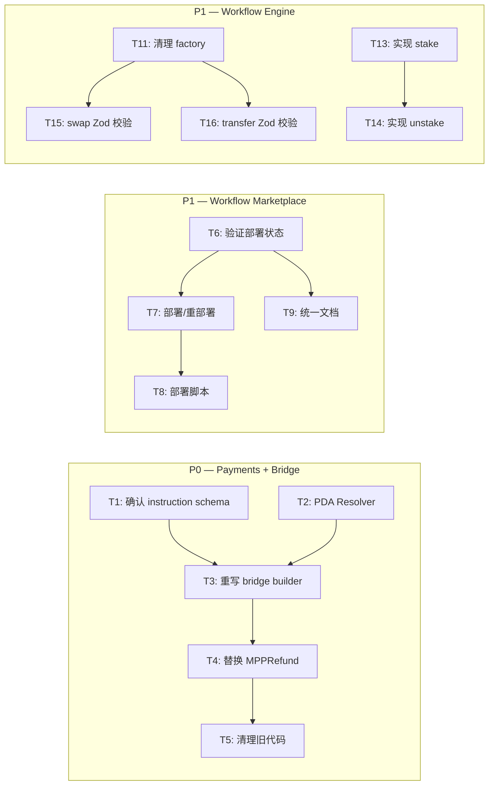

# Phase 4: Task Breakdown — 统一修复方案索引

> **目标**: 汇总 daemon payments + bridge、workflow-marketplace、workflow-engine trading handlers 三个高优先级 gap 的修复方案与任务拆解
> **更新时间**: 2026-04-06

---

## 1. 背景

基于对代码库的深度审查（`ARCHITECTURE.md` vs 真实代码），识别出三个最危险的实现 gap：

1. **Daemon Payments + Bridge** — 本地内存 escrow + 伪造链上 instruction，经济闭环未真正打通
2. **Workflow Marketplace Program** — 代码完整但部署状态存疑，文档互相矛盾
3. **Workflow Engine Trading Handlers** — 8 个 handlers 中 5 个是 stub，factory 却全部注册为可用

---

## 2. 方案总览

| Gap | 推荐方案 | 核心动作 | 预计总工期 |
|-----|---------|---------|-----------|
| **Payments + Bridge** | 方案 A：桥接 `agent-arena` program | 废弃 MPP 内存 escrow，重写 `settlement-bridge.ts` 为正确的 `judge_and_pay` ix builder | 2-3 天 |
| **Workflow Marketplace** | 验证 + 部署 + 文档对齐 | `solana program show` 验证现状，补齐部署脚本，统一文档状态 | 1-2 天 |
| **Workflow Engine Trading** | 清理 + 补齐 native stake | 从 factory 移除 stub，实现 `StakeProgram` stake/unstake，swap/transfer 加 Zod 校验 | 2-3 天 |

---

## 3. 文档导航

| 模块 | 详细任务拆解文档 |
|------|-----------------|
| Daemon Payments + Bridge | [04-task-breakdown-payments-bridge.md](./04-task-breakdown-payments-bridge.md) |
| Workflow Marketplace Program | [04-task-breakdown-workflow-marketplace.md](./04-task-breakdown-workflow-marketplace.md) |
| Workflow Engine Trading Handlers | [04-task-breakdown-workflow-engine.md](./04-task-breakdown-workflow-engine.md) |

---

## 4. 推荐的执行顺序

---

## 5. 里程碑

| 里程碑 | 预计完成 | 交付物 | 包含任务 |
|--------|---------|--------|---------|
| **M1: Payments + Bridge 链上闭环** | 2-3 天 | daemon 能正确提交 `judge_and_pay` / `refund_expired` | T1-T5 |
| **M2: Workflow Marketplace 激活** | 1-2 天 | 部署状态验证、脚本可用、文档一致 | T6-T9 |
| **M3: Trading Handlers 清理与补齐** | 2-3 天 | stub 清理、native stake/unstake 可用、类型安全 | T11-T17 |

---

## 6. 关键决策点

1. **MPP 模型是否保留？**
   - 当前推荐：**不保留**。`agent-arena` 的 race model 已经覆盖了 escrow + judge + release。MPP 的多法官加权投票、milestone 等复杂度如果产品上需要，应作为一个独立的 on-chain program 在未来开发。

2. **Workflow Marketplace 若未部署，是否需要在同一天内完成部署？**
   - 建议：**先验证（T6），再决策**。如果确实未部署，T7 部署本身只需要 2 小时，但应确保 deployer wallet 有足够 devnet SOL。

3. **Trading handlers 的 long tail（bridge/borrow/yieldFarm）何时补齐？**
   - 建议：**本次 sprint 不碰**。它们依赖外部 SDK（Wormhole、Solend、Jet），应作为后续 feature 走完整的 7-phase。当前 sprint 只清理并补齐无外部依赖的 native stake/unstake。

---

## 7. 验收标准

- [ ] Payments + Bridge 的 devnet 集成测试跑通（create → fund → judge_and_pay/refund）
- [ ] `solana program show` 能确认 workflow-marketplace 的部署状态
- [ ] Workflow Engine 的 `getSupportedActions()` 只返回真实可用的 handlers
- [ ] 所有新增和修改的代码通过 `build`、`typecheck`、`lint`

---

*文档维护方: Gradience Protocol Team*
