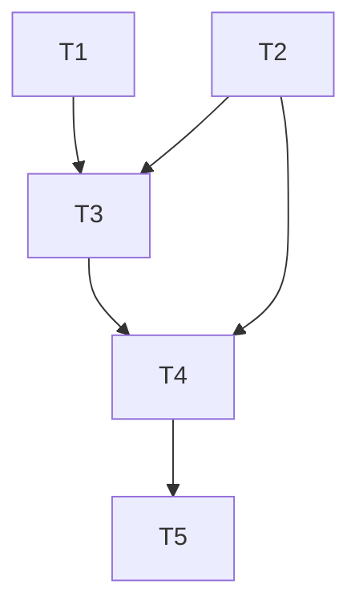

# Phase 4: Task Breakdown — Daemon Payments + Bridge

> **目标**: 修复 daemon payments/bridge 层与经济闭环的链上集成
> **输入**: `apps/agent-daemon/src/payments/`, `apps/agent-daemon/src/bridge/`, `programs/agent-arena/`
> **输出物**: 本任务拆解文档

---

## 4.1 背景与问题摘要

`payments/mpp/` 模块目前是一个**纯内存状态机**（`Map<string, MPPPayment>`），`fundEscrow` 仅构造 `SystemProgram.transfer` 把资金转到一个普通地址，没有任何链上 program 来验证或锁定这笔资金。`refund.ts` 尝试从该地址转出时，因缺少 escrow 的签名而必然失败。

`settlement-bridge.ts` 的问题更严重：它伪造了一个对 `chain-hub` 的 instruction，使用硬编码 discriminator `[1,0,0,0,0,0,0,0]` 和 `JSON.stringify(proof)` 塞进 Buffer，这与 `programs/chain-hub` 的实际 instruction 格式**完全不匹配**。

**修复方案（推荐方案 A）**：弃用本地 MPP 内存 escrow，把资金释放和退款直接桥接到已部署且经过测试的 `agent-arena` program（`judge_and_pay`、`refund_expired`、`cancelTask`）。

---

## 4.2 任务列表

| #   | 任务名称                                           | 描述                                                                                                                                                          | 依赖   | 预估时间 | 优先级 | Done 定义                                                              |
| --- | -------------------------------------------------- | ------------------------------------------------------------------------------------------------------------------------------------------------------------- | ------ | -------- | ------ | ---------------------------------------------------------------------- |
| T1  | 验证 agent-arena `JudgeAndPay` 指令字节格式        | 交叉核对 Rust impl 与 TS SDK，输出包含 discriminator + Borsh schema + accounts 顺序的精确文档                                                                 | 无     | 1.5h     | P0     | 输出 `agent-arena-judge-schema.md`，包含 data layout 和 accounts 列表  |
| T2  | 实现 PDA Resolver                                  | 新增 `src/solana/pda-resolver.ts`，通过 seeds 计算 `judge_and_pay` 所需的全部 PDA（task, escrow, application, submission, reputation, judge_stake, treasury） | 无     | 2h       | P0     | 所有 PDA 计算结果与 Rust 单元测试一致（可用 known seeds 验证）         |
| T3  | 重写 `settlement-bridge.ts` 的 instruction builder | 删除 `buildChainHubInstruction`，实现 `buildAgentArenaJudgeInstruction`，使用 Borsh 序列化 `JudgeAndPayData`，accounts 精确匹配 Rust 侧                       | T1, T2 | 2.5h     | P0     | 生成的 transaction 在 devnet preflight 通过（不上链也可验证格式）      |
| T4  | 修改 `MPPRefund` 调用 agent-arena program          | `releaseFunds()` 调用 `judge_and_pay`；`refund()` 调用 `refund_expired` 或 `cancelTask`；移除直接操作 `SystemProgram.transfer` 的旧逻辑                       | T2, T3 | 2h       | P0     | devnet 上跑通一轮 create task → fund → judge_and_pay/refund 的集成测试 |
| T5  | 清理 deprecated `mpp-handler.ts` 和旧测试          | 彻底删除 `mpp-handler.ts` 及其 e2e 测试文件，更新 `payments/` README，确保无残留引用                                                                          | T4     | 1h       | P0     | `pnpm run build` + `pnpm run test` + `pnpm run lint` 全绿              |

---

## 4.3 任务依赖图

---

## 4.4 里程碑

### Milestone 1: Payments + Bridge 链上闭环

**预计完成**: 2-3 天  
**交付物**: daemon 能通过 `agent-arena` program 正确提交 `judge_and_pay` 和 `refund_expired`，旧的 MPP 伪造指令和内存 escrow 代码已清理。  
**包含任务**: T1, T2, T3, T4, T5

---

## 4.5 风险识别

| 风险                                                                                    | 概率 | 影响 | 缓解措施                                                                         |
| --------------------------------------------------------------------------------------- | ---- | ---- | -------------------------------------------------------------------------------- |
| `agent-arena` 的 `judge_and_pay` accounts 结构复杂（13-21个账户），遗漏一个导致 tx 失败 | 中   | 高   | T1 必须输出详细 schema 文档；T3 用 preflight/simulation 逐账户验证               |
| `agent-arena` program 的 Borsh 数据格式与 TS 侧实现版本不匹配                           | 低   | 高   | 使用 `@coral-xyz/anchor` 或 `borsh` 包严格序列化，并与 Rust 测试用例交叉比对字节 |
| 团队成员仍在引用旧 `mpp-handler.ts`                                                     | 低   | 中   | 删除前用 `grep` 全仓库扫描引用；T5 中包含一份迁移说明                            |

---

## 4.6 关键引用

- `programs/agent-arena/src/instructions/judge_and_pay/` — Rust 侧 accounts + data 定义
- `programs/agent-arena/src/instructions/refund_expired/` — 退款路径
- `apps/agent-daemon/src/bridge/settlement-bridge.ts` — 需重写的桥接层
- `apps/agent-daemon/src/payments/mpp/refund.ts` — 需替换为 program 调用的释放逻辑
