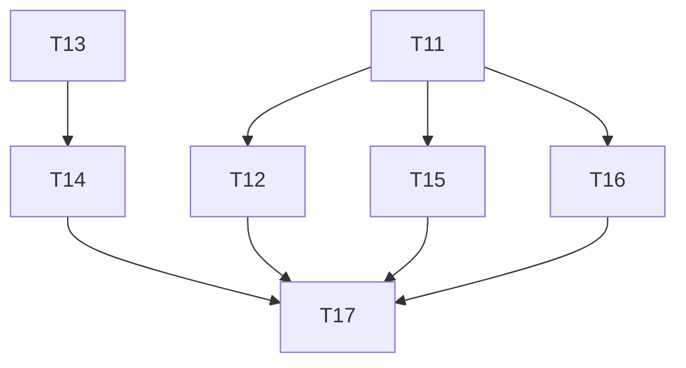

# Phase 4: Task Breakdown — Workflow Engine Trading Handlers

> **目标**: 清理 workflow-engine 中的 stub trading handlers，补齐核心实现，并强化类型安全
> **输入**: `packages/workflow-engine/src/handlers/trading/`
> **输出物**: 本任务拆解文档

---

## 4.1 背景与问题摘要

`packages/workflow-engine/src/handlers/trading/` 注册了 8 个 trading handlers，但真实实现比例很低：

- **✅ Real**: `swap.ts` (Jupiter API), `transfer.ts` (SOL/SPL transfer)
- **⚠️ Stub**: `stake.ts` (直接 throw)，`unstake.ts` (推测 stub), `bridge.ts`, `yield-farm.ts`, `borrow.ts`, `repay.ts`

`factory.ts` 把所有 8 个 handler 平等注册到 `Map<string, ActionHandler>`，容易让上层误以为全部可用。运行时如果 workflow 中包含 `borrow` 或 `bridge`，会直接 crash。

**修复方案**：
1. 清理 factory，移除未实现的 handlers，暴露 `getSupportedActions()` API。
2. 补齐高频核心 handler：`stake` / `unstake`（使用 `@solana/web3.js` 原生 `StakeProgram`，无外部 SDK 依赖）。
3. 给 `swap` 和 `transfer` 加上 Zod 运行时校验，避免 `Record<string, unknown>` 强转风险。

---

## 4.2 任务列表

| # | 任务名称 | 描述 | 依赖 | 预估时间 | 优先级 | Done 定义 |
|---|---------|------|------|---------|--------|----------|
| T11 | 清理 `factory.ts` 并暴露 `getSupportedActions()` | 移除 `stake/unstake/bridge/yieldFarm/borrow/repay` 的默认注册，新增 `getSupportedActions()` API | 无 | 1h | P1 | 调用 `getSupportedActions()` 仅返回 `['swap', 'transfer']` + 任何已实现的 handler |
| T12 | 更新 `factory.ts` 的类型签名 | 确保 `Map<string, ActionHandler>` 支持 optional/experimental handler 标记 | T11 | 0.5h | P1 | TypeScript `build` 和 `typecheck` 全绿 |
| T13 | 实现 native `stake` handler | 使用 `@solana/web3.js` 的 `StakeProgram.createAccount` + `delegate`，支持 validator 指定 | 无 | 3h | P1 | devnet 上能成功创建 stake account 并委托给指定 validator |
| T14 | 实现 native `unstake` handler | 使用 `StakeProgram.deactivate` + `withdraw`，完整支持 unstake 流程 | T13 | 2h | P1 | devnet 上能成功 deactivate 并 withdraw 到原始账户 |
| T15 | 给 `swap.ts` 增加 Zod 运行时校验 | 定义 `SwapParamsSchema`，在 `execute()` 开头校验 `params`，失败时抛 `ValidationError` | T11 | 1.5h | P1 | 传入错误参数（如 `from === to`）时返回明确的 `ValidationError` |
| T16 | 给 `transfer.ts` 增加 Zod 运行时校验 | 定义 `TransferParamsSchema`，覆盖 `token`, `to`, `amount`, `signer` 字段 | T11 | 1h | P1 | 传入非法地址或负数 amount 时返回明确的 `ValidationError` |
| T17 | 更新 `workflow-engine` README | 列出支持的 chains 和 actions，明确标注 experimental/stub 状态的 handlers | T11, T13, T14, T15, T16 | 1h | P2 | README 与代码实现 100% 一致 |

---

## 4.3 任务依赖图

---

## 4.4 里程碑

### Milestone 3: Workflow Engine Trading 清理与核心补齐
**预计完成**: 2-3 天  
**交付物**: stub handlers 被清理，native stake/unstake 可用，swap/transfer 有运行时类型安全，文档同步。  
**包含任务**: T11, T12, T13, T14, T15, T16, T17

---

## 4.5 风险识别

| 风险 | 概率 | 影响 | 缓解措施 |
|------|------|------|---------|
| native stake handler 需要正确处理 rent exemption 和 stake account keypair 持久化 | 中 | 中 | 参考 Solana 官方 staking guide，用 devnet 小额测试 |
| Jupiter API 在 devnet 环境下的 quote 可能不稳定，影响 swap 测试 | 中 | 低 | swap handler 的 Zod 校验和 Jupiter 调用分离测试：先测校验逻辑，再测真实 API 调用 |
| 其他模块引用了被移除的 stub handler 名称 | 低 | 中 | T11 后用 `grep` 全仓库扫描 handler 名称引用 |

---

## 4.6 关键引用

- `packages/workflow-engine/src/handlers/trading/factory.ts` — 需清理的注册入口
- `packages/workflow-engine/src/handlers/trading/swap.ts` — 需加 Zod 校验
- `packages/workflow-engine/src/handlers/trading/transfer.ts` — 需加 Zod 校验
- `@solana/web3.js` `StakeProgram` — native staking 实现参考
