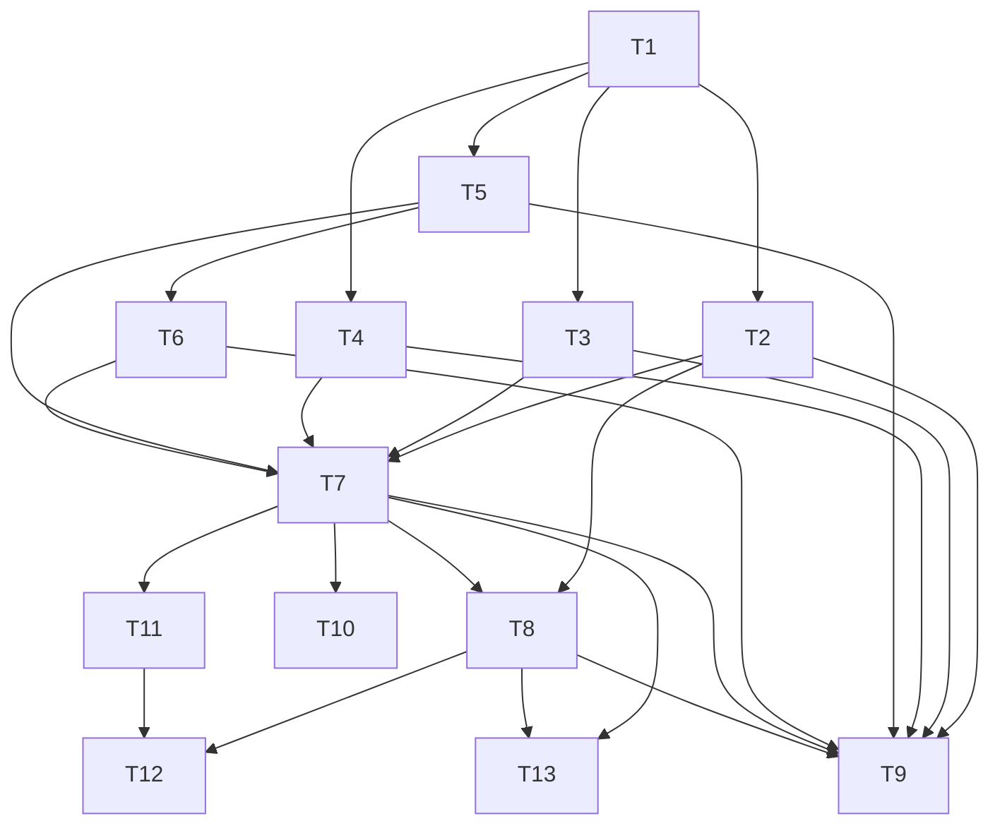

# Phase 4: Task Breakdown — Workflow Execution Gateway

> **输入**: `docs/03-technical-spec-workflow-execution-gateway.md`  
> **日期**: 2026-04-07

---

## 4.1 拆解原则

1. **每个任务 ≤ 4 小时**
2. **每个任务有明确的 Done 定义**
3. **先基础层（store/state/types）→ 核心编排 → API/E2E**
4. **依赖关系明确，无循环依赖**

---

## 4.2 任务列表

| #   | 任务名称                                           | 描述                                                                              | 依赖           | 预估 | 优先级 | Done 定义                                         |
| --- | -------------------------------------------------- | --------------------------------------------------------------------------------- | -------------- | ---- | ------ | ------------------------------------------------- |
| T1  | 创建 Gateway 类型与错误码                          | `src/gateway/types.ts` + `errors.ts`，包含所有接口、错误类、常量                  | 无             | 1.5h | P0     | `tsc` 无报错，Vitest 能 import 所有类型           |
| T2  | 实现 `GatewayStore` (SQLite)                       | `src/gateway/store.ts`：建表、insert、update、查询、listByStatus                  | T1             | 2.5h | P0     | store 单测通过，能正确 CRUD 并处理唯一约束冲突    |
| T3  | 实现 `PurchaseStateMachine`                        | `src/gateway/state-machine.ts`：精确定义所有合法/非法状态转换                     | T1             | 2h   | P0     | 状态机单测覆盖所有 10 个边界条件转换              |
| T4  | 实现 `MarketplaceEventListener`                    | `src/gateway/event-listener.ts`：`logSubscribe` 或 transaction polling 逻辑       | T1             | 3h   | P0     | 能正确解析 mock 的 purchase event 数据            |
| T5  | 实现 `ArenaTaskFactory`                            | `src/gateway/arena-factory.ts`：从 purchase record 构造 post_task 参数            | T1             | 1.5h | P0     | 单元测试：给定 record 返回正确的 `PostTaskParams` |
| T6  | 实现 `AgentAutoApplicant`                          | `src/gateway/auto-applicant.ts`：监听 task 创建并自动 apply                       | T5             | 2h   | P1     | mock 测试：taskId 传入后调用 `sdk.task.apply`     |
| T7  | 实现 `WorkflowExecutionGateway`                    | `src/gateway/gateway.ts`：`processPurchase()`、`retry()`、`getStatus()`           | T2, T3, T4, T5 | 3.5h | P0     | mock 测试：完整跑通 PENDING → SETTLED 状态流      |
| T8  | 实现 Gateway REST API 路由                         | `src/api/routes/gateway.ts`：`GET /gateway/purchases/:id` + `POST /retry`         | T2, T7         | 2h   | P0     | API 单测通过（带 auth middleware mock）           |
| T9  | 编写 Gateway 单元测试套件                          | `src/gateway/__tests__/`：store、state-machine、listener、gateway 的单测          | T2-T8          | 3h   | P0     | 覆盖率 ≥ 80%，全部通过                            |
| T10 | 编写 Integration 测试                              | `src/gateway/__tests__/integration.test.ts`：完整 happy path + 超时失败路径       | T7             | 2h   | P0     | 2 个场景通过                                      |
| T11 | 编写 Devnet E2E 脚本                               | `scripts/e2e-gateway-devnet.mjs`：真实 marketplace purchase → arena task → settle | T7             | 3h   | P0     | devnet 上至少 1 笔成功 end-to-end tx              |
| T12 | 编写 `GATEWAY_INTEGRATION.md`                      | 开发者指南：启动 gateway、查看状态、排查问题                                      | T8, T11        | 1.5h | P1     | 另一位开发者能按文档跑通本地测试                  |
| T13 | 清理 `src/gateway/index.ts` 导出 + daemon 入口集成 | 让 daemon 启动时自动初始化 gateway（若配置启用）                                  | T7, T8         | 1.5h | P1     | `pnpm run typecheck` 全绿，无循环依赖             |

---

## 4.3 任务依赖图

---

## 4.4 里程碑划分

### Milestone 1: Gateway Core Infrastructure

**预计完成**: 2026-04-08  
**交付物**: `src/gateway/` 目录完整，Store + StateMachine + EventListener + Gateway 全部实现并通过单测。

包含任务: **T1, T2, T3, T4, T5, T7, T9**

### Milestone 2: Auto-Apply + API + E2E

**预计完成**: 2026-04-09  
**交付物**: Agent auto-applicant 工作，REST API 可查询，devnet 上跑通完整的 `purchase → task → execute → settle` 流程。

包含任务: **T6, T8, T10, T11, T12, T13**

---

## 4.5 风险识别

| 风险                                                                 | 概率 | 影响 | 缓解措施                                                                                |
| -------------------------------------------------------------------- | ---- | ---- | --------------------------------------------------------------------------------------- |
| Marketplace Program 的 `purchase` 日志格式/ discriminator 与预期不符 | 中   | 高   | 先通过 `getTransaction` 手动抓取一个真实 purchase tx，确认 discriminator 和 data layout |
| `logSubscribe` 在 devnet 上不稳定或延迟高                            | 中   | 中   | 实现 fallback：支持 webSocket 断线重连 + 指数退避轮询                                   |
| Arena taskId 冲突（并发创建）                                        | 低   | 高   | Gateway 在 `post_task` 失败时自动重读 `config.taskCount` 并重试                         |
| VEL mock provider 在 Gateway 集成时路径/环境问题                     | 低   | 中   | 复用 VEL 已有的 `findPackageRoot()` 逻辑，E2E 前先做 integration test                   |

---

## ✅ Phase 4 验收标准

- [x] 每个任务 ≤ 4 小时
- [x] 每个任务有 Done 定义
- [x] 依赖关系已标明，无循环依赖
- [x] 至少划分为 2 个里程碑
- [x] 风险已识别

**验收通过后，进入 Phase 5: Test Spec →**
