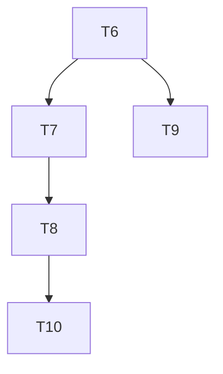

# Phase 4: Task Breakdown — Workflow Marketplace Program

> **目标**: 验证并补全 workflow-marketplace program 的部署状态与文档一致性
> **输入**: `programs/workflow-marketplace/`, `ARCHITECTURE.md`, `deploy/`
> **输出物**: 本任务拆解文档

---

## 4.1 背景与问题摘要

`programs/workflow-marketplace/` 的 Rust 代码完整（12 个 instructions，5 个 PDA），但**部署状态在文档中存在严重矛盾**：

- `ARCHITECTURE.md` 和 `docs/PROJECT_REVIEW_REPORT.md` 声称 Program ID `3QRayGY5SHYnD5cb2qegEoNx7dPXJJyHJD3shzAQ75UW` 已部署
- `programs/README.md` 标记为 `📐 Designed`
- `deploy/` 目录中**没有任何** workflow-marketplace 的部署脚本或 CI 配置

本组任务的目标是**验证真实状态**，消除矛盾，并补齐部署自动化。

---

## 4.2 任务列表

| #   | 任务名称                         | 描述                                                                                                                          | 依赖 | 预估时间 | 优先级 | Done 定义                                                                            |
| --- | -------------------------------- | ----------------------------------------------------------------------------------------------------------------------------- | ---- | -------- | ------ | ------------------------------------------------------------------------------------ |
| T6  | 验证 devnet 部署状态             | 运行 `solana program show 3QRayGY5SHYnD5cb2qegEoNx7dPXJJyHJD3shzAQ75UW --url devnet` 并记录结果；同时在链上尝试一个只读 query | 无   | 0.5h     | P1     | 输出 `workflow-marketplace-deployment-status.md`，明确状态：已部署/未部署/程序不匹配 |
| T7  | 部署或重部署 program（如需要）   | 若 T6 显示未部署，执行 `cargo build-sbf` + `solana program deploy`；记录最终 Program ID 和 tx signature                       | T6   | 2h       | P1     | devnet 上 `program show` 能返回正确的部署信息                                        |
| T8  | 编写自动化部署脚本               | 在 `deploy/` 下新建 `deploy-workflow-marketplace.sh`；加入 `.env.prod.example` 所需的变量                                     | T7   | 1h       | P1     | 任意团队成员可以在有 `.env` 的情况下一键运行脚本完成部署                             |
| T9  | 统一文档状态描述                 | 修正 `ARCHITECTURE.md`、`programs/README.md`、`docs/PROJECT_REVIEW_REPORT.md` 中的状态和 Program ID，确保全部一致             | T6   | 1h       | P1     | 所有文档中 workflow-marketplace 的状态和 Program ID 完全一致                         |
| T10 | 添加 CI build/deploy job（可选） | 在 GitHub Actions 中添加 workflow-marketplace 的 build + deploy 步骤                                                          | T8   | 2h       | P2     | CI 能成功编译 `programs/workflow-marketplace` 并在 nightly/手动触发时部署            |

---

## 4.3 任务依赖图

---

## 4.4 里程碑

### Milestone 2: Workflow Marketplace 激活与文档对齐

**预计完成**: 1-2 天  
**交付物**: workflow-marketplace 的部署状态被验证并记录，文档矛盾消除，部署脚本可用。  
**包含任务**: T6, T7, T8, T9  
**可选扩展**: T10

---

## 4.5 风险识别

| 风险                                              | 概率 | 影响 | 缓解措施                                                                                                             |
| ------------------------------------------------- | ---- | ---- | -------------------------------------------------------------------------------------------------------------------- |
| devnet 上该 Program ID 已被他人占用或字节码不匹配 | 中   | 中   | T6 先验证 bytecode hash；若不一致，用当前源码重新部署并更新所有文档和 SDK 配置                                       |
| 部署所需 SOL 不足                                 | 低   | 高   | 提前从 faucet 领取 devnet SOL，确保 deployer wallet 余额 > 5 SOL                                                     |
| 文档引用散落在 archive/ 目录中难以全部对齐        | 中   | 低   | 仅修正 `ARCHITECTURE.md`、`programs/README.md`、`PROJECT_REVIEW_REPORT.md` 三个权威来源；archive/ 中的历史文档不修改 |

---

## 4.6 关键引用

- `programs/workflow-marketplace/DEPLOYMENT.md` — 现有手动部署说明
- `programs/workflow-marketplace/Cargo.toml` — program 构建设置
- `ARCHITECTURE.md` — Program ID 声明来源
- `deploy/` — 缺少自动化脚本的位置
