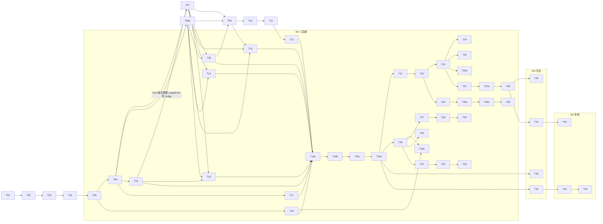

# Phase 4: Task Breakdown — Agent Layer v2

> **目的**: 将技术规格拆解为可执行、可分配、可验收的独立任务
> **输入**: `docs/03-technical-spec.md`
> **输出物**: 本文档

---

## 4.1 拆解原则

1. **每个任务 ≤ 4 小时**（如果超过，继续拆）
2. **每个任务有明确的 Done 定义**（可验证）
3. **任务之间的依赖关系必须标明**
4. **先基础后上层**（按依赖顺序排列）

---

## 4.2 任务列表

### 🔴 W1（2026-04-01 ~ 04-14，2 周）— Solana 核心 Program

> **W1 容量说明**：2 周 × ~4h/天（含 AI 辅助）≈ 56h 可用；本节任务合计 **38h**，留 18h 调试和迭代缓冲。
> T17/T18（Program 附属指令）和 T19a-T19d（集成测试）移至 W2，与工具链联调统一执行。

| # | 任务名称 | 描述 | 依赖 | 时间 | 优先级 | Done 定义 |
|---|---------|------|------|------|--------|----------|
| T01 | Pinocchio 工作区脚手架 | 以 `npx create-solana-dapp -t solana-foundation/templates/pinocchio/pinocchio-counter` 初始化仓库骨架；workspace 依赖版本（来自官方模板 2026-03）：pinocchio ^0.10.1、pinocchio-system ^0.5.0、pinocchio-token ^0.6、pinocchio-token-2022 ^0.5、pinocchio-associated-token-account ^0.3、pinocchio-log ^0.5.1、codama ^0.7.2、const-crypto ^0.3.0、thiserror ^2.0、borsh ^1.6、solana-security-txt ^1；保留模板的 `justfile` / `traits/` / `utils/` 目录结构；替换 program ID 和模块名为 Gradience | 无 | 1h | P0 | `just build` 通过；`just unit-test` 绿；目录结构与 §3.8 一致；CI 配置可触发构建 |
| T02 | 常量 + 错误码模块 | `constants.rs` 所有 **15 个**不可变常量（JUDGE_FEE_BPS/PROTOCOL_FEE_BPS/AGENT_FEE_BPS/CANCEL_FEE_BPS/FORCE_REFUND_DELAY/UNSTAKE_COOLDOWN/MAX_JUDGES_PER_POOL/MAX_CATEGORIES/MIN_SCORE/MAX_SCORE/MAX_REF_LEN/MAX_PROVIDER_LEN/MAX_MODEL_LEN/MAX_RUNTIME_LEN/MAX_VERSION_LEN）+ 1 个可配置常量（min_judge_stake）；`errors.rs` **30 个命名错误码**，编号分布在 6000-6041 范围内（组间有意留间隔）：状态组 6000-6006（7个，含 DeadlineNotPassed 6006），权限组 6010-6014（5个），质押组 6020-6025（6个），验证组 6030-6039（10个），算术 6040（1个），Token 6041（1个） | T01 | 1h | P0 | 编译通过；15 个不可变常量类型正确；30 个错误码名称与规格 100% 一致 |
| T03 | 账户结构体 — Task / Escrow / Application | `Task`（315B）、`Escrow`（49B）、`Application`（57B）；`#[derive(BorshSerialize, BorshDeserialize)]`；无 Anchor discriminator；Pinocchio 手动分配空间 | T02 | 2h | P0 | `const TASK_SIZE: usize = 315` 等常量正确；字段类型与规格 100% 一致；Borsh 序列化/反序列化单元测试通过 |
| T04 | 账户结构体 — Submission / RuntimeEnv | `Submission`（497B）嵌套 `RuntimeEnv`（176B，MAX_VERSION_LEN=32）；所有字段、String 最大长度注解；`#[derive(BorshSerialize, BorshDeserialize)]` | T02 | 2h | P0 | `const SUBMISSION_SIZE: usize = 497` 正确；RuntimeEnv 4 字段 Borsh 总和 = 36+68+36+36=176 |
| T05 | 账户结构体 — Reputation / Stake / JudgePool / Treasury / ProgramConfig | `Reputation`（109B）、`Stake`（66B）、`JudgePool`（7210B）、`Treasury`（1B）、`ProgramConfig`（81B）；枚举 `TaskState` / `JudgeMode` / `Category`（`#[repr(u8)] + BorshSerialize/BorshDeserialize`） | T02 | 2h | P0 | 各结构体大小常量与规格一致；所有枚举 `repr(u8)` 正确；Borsh 单元测试通过 |
| T06 | `initialize` 指令 | 初始化 `ProgramConfig`（upgrade_authority、min_judge_stake）和 `Treasury` PDA；一次性调用；Pinocchio 手动检查 config account data_len == 0 防止重复初始化 | T05 | 2h | P0 | 测试：`initialize` → ProgramConfig 字段值正确；二次调用因 data_len > 0 而失败（`ProgramError::AccountAlreadyInUse`，非自定义码） |
| T07 | `post_task` — SOL 路径 | Task PDA 创建，SOL reward 转入 Escrow，`config.task_count++`；Pool 模式链上加权随机（sha256 seed）抽 Judge；**sol_log_data TaskCreated 事件** | T06, T16 | 3h | P0 | 测试：发 SOL 任务 → `Task.state=Open`，Escrow 余额 = reward；Pool 模式 judge 字段被协议填写；reward=0 → `ZeroReward`；TaskCreated 事件通过 parseEvents 验证 |
| T08a | SPL Token ATA 工具函数 | 封装 `create_associated_token_account` 工具函数；验证 ATA owner（authority = escrow PDA）；统一处理 Poster / Agent / Judge / Treasury 的 ATA 初始化逻辑；供 T08 / T09 / T11 / T13-T15 复用 | T06 | 2h | P0 | 工具函数编译通过；单元测试：创建 ATA → owner 正确；已存在 ATA 时幂等不报错 |
| T08 | `post_task` — SPL / Token-2022 路径 | SPL Token / Token-2022 版本：ATA 初始化，`token::transfer` 锁入 escrow_ata；检查 mint 是否启用 Transfer Hook / Confidential Transfer，有则返回 `UnsupportedMintExtension` | T07, T08a | 3h | P0 | 测试：SPL 任务 → escrow_ata 余额 = reward；带 Transfer Hook 的 Token-2022 mint → `UnsupportedMintExtension` |
| T09 | `apply_for_task` — SOL + SPL 路径 | Application PDA 手动创建，Reputation PDA 按需创建（data_len==0 检查），SOL / SPL 质押转入 Escrow（调用 T08a 工具函数）；**`rep.global.total_applied++`**（win_rate 分母）；前置条件：state=Open，deadline 未过，未重复申请；**sol_log_data TaskApplied 事件** | T08a, T07, T08 | 3h | P0 | 测试：apply → Application created，stake 锁入 Escrow，**`reputation.global.total_applied` 递增**；重复申请 → `AlreadyApplied`；`min_stake=0` 无需质押；TaskApplied 事件通过 parseEvents 验证 |
| T10 | `submit_result` | Submission PDA 创建（或覆盖更新），RuntimeEnv 四字段长度手动验证；前置条件：agent 已申请、deadline 未过；**sol_log_data SubmissionReceived 事件** | T09 | 2h | P0 | 测试：submit → Submission 字段正确；二次 submit → 覆盖；model 超长 → `InvalidRuntimeEnv`；未申请 → `AgentNotApplied`；SubmissionReceived 事件通过 parseEvents 验证 |
| T11 | `judge_and_pay` — SOL 路径 + 分账 | 分数验证（≥ MIN_SCORE）；赢家选取（highest score ≥ 60，tie→earliest slot）；整数除法费用计算（95/3/2 BPS）；三路 lamport 转账；`Task.state=Completed`；winner stake 走固定账户 `winner_application`；**落败者 stake 通过 `remaining_accounts` 批量退回**（同 cancel/refund 机制） | T10 | 3h | P0 | 测试：2 Agent 竞争 → 赢家得 95%，Judge 得 3%，Treasury 得 2%；**落败者 stake 原路退回**（remaining_accounts 验证）；余额精确到 lamport；非 Judge 调用 → `NotTaskJudge` |
| T12 | `judge_and_pay` — SPL + 信誉更新 | SPL Token 三路 CPI 转账（手动构建 InstructionView）；`Reputation` 全局统计更新（avg_score 滚动平均、win_rate）；`CategoryStats[category]` 更新；**sol_log_data TaskJudged 事件** | T11 | 3h | P0 | 测试：SPL 任务评判 → token 余额正确；全局 + category 信誉均更新；score < MIN_SCORE → TaskRefunded emit；TaskJudged 含 winner/payout/fees |
| T13 | `cancel_task` | 仅 Poster 可调用；前置条件：state=Open、**submission_count = 0**（已有提交不可取消）；2% 取消费到 Treasury，98% 退还 Poster；通过 `remaining_accounts` 批量退回 Agent 质押；`Task.state=Refunded`；**sol_log_data TaskCancelled 事件** | T08a, T07, T09 | 2h | P0 | 测试：cancel（无申请）→ Poster 得 98%，Treasury 得 2%；**已有提交时 cancel → `HasSubmissions`**；非 Poster → `NotTaskPoster`；TaskCancelled 事件通过 parseEvents 验证；"cancel 有申请时 stakes 退回" 场景在 T19c 集成测试验证 |
| T14 | `refund_expired` | 任何人调用；前置条件：state=Open、**clock > task.deadline**（提交截止，非 judge_deadline）；通过 `remaining_accounts` 批量退回 Agent 质押；全额退还 Poster；`Task.state=Refunded`；**sol_log_data TaskRefunded（reason=Expired）事件** | T08a, T07 | 2h | P0 | 测试：设时钟过期 → `refund_expired` 成功；**截止时间未到 → `DeadlineNotPassed`**（6006，非 JudgeDeadlineNotPassed）；TaskRefunded 事件携带 reason=Expired |
| T15 | `force_refund` + Slash 逻辑 | **T16 完成并通过测试后方可开始**；任何人调用；clock > judge_deadline + FORCE_REFUND_DELAY；Slash 三步；**资金分配：95% → Poster，3% → 提交数最多的 Agent，2% → Treasury**（非全额退款）；所有申请者 stakes 退回；**sol_log_data TaskRefunded（reason=ForceRefund）事件** | T08a, T07, T16 | 3h | P0 | 测试：force_refund → Poster 得 95%，最活跃 Agent 得 3%，Treasury 得 2%；Judge stake 扣减；stake 不足时从 Pool 移除；延迟未过 → `ForceRefundDelayNotPassed` |
| T16 | `register_judge` + `unstake_judge` | `register_judge`：质押 ≥ min_judge_stake，声明 category，首次调用手动检查 JudgePool data_len==0 并创建 PDA（7210B），计算初始权重；**sol_log_data JudgeRegistered 事件**；`unstake_judge`：冷却期检查，从 JudgePool 移除，退还质押；**sol_log_data JudgeUnstaked 事件** | T06 | 2h | P0 | 测试：首次 register → JudgePool 创建，JudgeRegistered 事件通过 parseEvents 验证；200 人后注册 → `JudgePoolFull`；unstake → Stake PDA 关闭，JudgeUnstaked 事件验证；冷却前 unstake → `CooldownNotExpired` |

---

### 🟠 W2（2026-04-15 ~ 04-21）— Program 完结 + 工具链

> **W2 前置**：T17/T18 完成 Program 剩余指令；T19a-T19d 为集成测试（依赖 devnet 部署）；工具链并行开发。

| # | 任务名称 | 描述 | 依赖 | 时间 | 优先级 | Done 定义 |
|---|---------|------|------|------|--------|----------|
| T17 | `upgrade_config` 指令 | 仅 upgrade_authority 可调用；更新 `treasury` 地址和 `min_judge_stake` | T06 | 1h | P1 | 测试：upgrade_config 更新两字段后值正确；非 authority 调用 → `NotUpgradeAuthority` |
| T18 | IJudge 三层评判接口定义 | 定义 `IJudge` trait 和 CPI 接口；三层架构：① `TestCasesEvaluator`（C-1/C-2，测试用例 + 哈希对比，存根返回固定分数 80）；② `LLMScoreEvaluator` 接口存根（Type B，DSPy 实现在 T35）；③ `OnChainEvaluator` 接口存根（C-3/C-4，W4 实现）；接口注释文档 | T05 | 2h | P1 | 编译通过；三层接口均可被外部 Program 实现；`evaluationCID` JSON schema 与 §3.11 定义一致 |
| T18a | SAS 协议凭证 + Schema 初始化 | **一次性链上初始化**（devnet + mainnet 各执行一次）：① 用 `sas-lib` 调用 `getCreateCredentialInstruction` 创建 `"Gradience Protocol"` Credential（authority = upgrade_authority，signers = [judge_daemon_keypair]）；② 调用 `getCreateSchemaInstruction` 创建 `TaskCompletion` Schema（fieldNames / layout 与 §3.12.2 精确一致）；③ 将两个 PDA 地址写入 SDK 常量 `GRADIENCE_CREDENTIAL_PDA` / `TASK_COMPLETION_SCHEMA_PDA`；④ Judge Daemon T35 集成 `sas-lib` 颁发逻辑（`judge_and_pay` 确认后自动颁发）；⑤ SDK 新增 `getAgentAttestations(agentAddress)` 查询方法 | T18, T26 | 2h | P1 | devnet 上 Credential + Schema 账户可 fetch；测试场景：T35 E2E 任务完成后 `fetchAllAttestation` 返回含正确 taskId + score 的 Attestation；`decodeTaskCompletionAttestation` 解码正确 |
| T19a | 集成测试 — initialize + post_task | devnet 部署后：`initialize` → `post_task`（SOL Designated 模式）→ `post_task`（SOL Pool 模式）→ `post_task`（SPL）→ `post_task`（Token-2022 带 Hook → 拒绝）；升级路径：`upgrade_config` | T12, T13, T14, T15, T16, T17, T18, T08 | 3h | P0 | litesvm + `@solana/web3.js` 5 个 post_task 场景全绿；Pool 模式 judge 字段由协议填写；TaskCreated 事件通过 parseEvents 验证 |
| T19b | 集成测试 — apply + submit | `apply_for_task`（SOL stake、SPL stake、min_stake=0）→ `submit_result`（首次、覆盖）；RuntimeEnv 字段验证；重复申请；**验证 `total_applied` 每次 apply 递增** | T19a | 3h | P0 | 申请 + 提交 6 个场景全绿；`AlreadyApplied`、`InvalidRuntimeEnv` 错误码正确触发；total_applied 计数正确 |
| T19c | 集成测试 — judge_and_pay + cancel + refund | `judge_and_pay`（SOL + SPL，正常赢家；tie-break by slot；score < MIN_SCORE 退款）；`cancel_task`（**无申请 + 有申请两路径，验证 remaining_accounts 质押退回**）；`refund_expired`；`HasSubmissions` 错误验证 | T19b | 3h | P0 | 分账精度逐 lamport 验证；3 条退款路径全绿；cancel 有申请时 remaining_accounts 质押退回正确；信誉 global + category 更新验证 |
| T19d | 集成测试 — force_refund/slash + 安全测试 | `force_refund`（slash 充足 / slash 不足两路径）；JudgePoolFull（200 人）；重入攻击模拟；CU 消耗验证（`post_task` ≤ 200k、`judge_and_pay` ≤ 200k） | T19c | 3h | P0 | 15 个边界用例全绿；分支覆盖率 ≥ 95%；0 Critical 漏洞；CU 未超限 |
| T21 | Indexer — PostgreSQL Schema | 4 张表（tasks / submissions / reputations / reputation_by_category）+ 5 个索引；migration 文件 | T19d | 2h | P0 | `psql` 运行 migration 无报错；schema 与规格完全一致 |
| T22 | Indexer — Helius Webhook + 事件解析 | HTTP 端点接收 Helius 推送；解析 **8 个 Program 事件**（TaskCreated, TaskApplied, SubmissionReceived, TaskJudged, TaskCancelled, TaskRefunded, JudgeRegistered, JudgeUnstaked）；upsert 到 DB；**内置 mock 模式**（`MOCK_WEBHOOK=true` 时用本地文件模拟推送，无需真实 Helius 连接） | T21 | 3h | P0 | Mock 模式：8 类事件 JSON → DB 行正确创建；真实模式：延迟 < 200ms |
| T23 | Indexer — REST API 端点 | `GET /api/tasks?state=&category=&page=`；`GET /api/tasks/:id`；`GET /api/tasks/:id/submissions?sort=score`；`GET /api/reputation/:agent`；`GET /api/judge-pool/:category` | T22 | 3h | P0 | curl 每个端点 → 正确 JSON；分页正确；无效参数 → 4xx；未找到 → 404 |
| T24 | Indexer — WebSocket 服务器 | WS 连接 ws://indexer/ws；事件广播：TaskCreated / SubmissionReceived / TaskJudged；客户端可 filter by task_id | T22 | 2h | P1 | WS 客户端订阅 → 收到 DB upsert 触发的事件；连接断开自动清理；重连不丢事件 |
| T25 | Indexer — Cloudflare Workers + D1 适配层 | CF Workers wrapper；D1 SQLite schema（与 PG schema 对齐）；`wrangler deploy` 到 CF；REST API 路径与 Self-hosted 完全一致 | T23 | 3h | P1 | Managed 模式 CF 部署成功；相同 curl 命令返回相同格式 |
| T25a | Indexer — Docker 镜像 + compose 文件 | `Dockerfile`（Self-hosted Rust 二进制）；`docker-compose.yml`（Indexer + PostgreSQL）；`README.md` 一键启动说明 | T23 | 2h | P1 | `docker compose up` → 服务启动；`curl localhost:3001/api/tasks` → 正确响应；镜像大小 < 100MB |
| T26 | SDK — Codama IDL 生成 + TypeScript 客户端 | `@gradience/sdk` 包初始化；在 Rust 账户/指令结构体上添加 `#[derive(CodamaAccount)]` / `#[derive(CodamaInstruction)]` 注解；运行 `cargo codama --output sdk/src/generated` 生成 IDL JSON 和 TypeScript 客户端代码；`GradienceSDK` class 包装生成代码；`SDK_README.md` 快速开始文档 | T19d | 2h | P0 | `cargo codama` 运行成功，生成 IDL JSON + 9 个账户 TS 类型 + 11 个指令 builder；`import { GradienceSDK } from '@gradience/sdk'` 编译通过；README 3 行代码示例可运行 |
| T27 | SDK — task.post / apply / submit | 三个核心方法；SOL + SPL 双路径；wallet adapter 调用 sign/sendTx | T26 | 3h | P0 | 单元测试（mock Program）：3 方法返回 tx signature；devnet 端测通过 |
| T28 | SDK — task.judge / cancel / refund / forceRefund | 4 个方法包装剩余指令；`remaining_accounts` 自动组装落败者 Application PDA 列表；**ALT 自动处理**：`pnpm add @solana-program/address-lookup-table`，当 remaining_accounts > 20 时自动查找/创建 ALT（seeds: [task_id]），批量扩展地址，构建 v0 VersionedTransaction（每地址节省 31 字节，保障大参与者数任务的交易不超 1232 字节限制）；≤ 20 时走普通 Legacy Transaction | T27 | 2h | P0 | 单元测试通过；devnet 端到端可用；权限错误（`NotTaskJudge` / `NotTaskPoster` / `NotUpgradeAuthority` 等）时抛出含 Gradience 错误码的异常；**额外验证**：mock 50 个落败者时 `task.judge()` 使用 v0 tx 且成功上链；10 个落败者时使用 Legacy tx |
| T29 | SDK — reputation / JudgePool 查询 | `reputation.get(agent)`（读链上 PDA）；`judgePool.list(category)`；`task.submissions(taskId, {sort})`（查 Indexer） | T26 | 2h | P1 | 查询返回带类型的响应；未找到时返回 null 而非抛出；JSDoc 注释完整 |
| T30 | SDK — 钱包适配器（5 种） | `WalletAdapter` 接口（sign/sendTx）；`KeypairAdapter`（开发测试用）**完整实现**；`OpenWalletAdapter` / `OKXAdapter` / `PrivyAdapter` / `KiteAdapter` **接口存根（interface only）**，完整实现留 W3+；存根实现 `sign()` 时抛出 `NotImplemented` | T26 | 3h | P1 | KeypairAdapter devnet 端测通过；4 个存根接口通过 TypeScript 类型检查；调用存根 `sign()` → 清晰的 `NotImplemented` 错误提示 |
| T31 | CLI — 脚手架 + config 命令 | `gradience` binary（Bun）；`config set rpc <url>`；`config set keypair <path>`；`--help` 所有子命令；CLI 帮助文本内联文档；**`NO_DNA` 支持**（`no-dna.org` 标准）：顶层检测 `!!process.env.NO_DNA`，为真时全局切换 Agent 模式（JSON 输出、无交互提示、绝对时间戳、stderr 机器可解析错误）；与 Anchor / Surfpool 等工具链统一约定 | T26 | 1h | P0 | `gradience --help` 显示所有子命令和说明；config 写入 `~/.gradience/config.json`；无效参数 → 清晰错误提示；**`NO_DNA=1 gradience config set rpc http://...`** → 无提示直接写入，stdout 输出 `{"ok":true}`；`NO_DNA=1 gradience --help` → 输出 JSON schema |
| T32 | CLI — task post / apply / submit / status | `gradience task post --eval-ref <cid> --reward <lamports> ...`；`apply`；`submit`；`status <task_id>`；**`NO_DNA` 模式**：所有命令输出 `{"signature":"...","taskId":N}` 等结构化 JSON，`status` 返回 `{"taskId":N,"state":"Open","submissionCount":N}` | T31, T28 | 3h | P0 | 每条命令在 devnet 创建正确的链上交易；`status` 显示当前状态和提交数；`NO_DNA=1 gradience task status 1` → 纯 JSON 无装饰输出 |
| T33 | CLI — task judge / cancel / refund + judge register | `gradience task judge`；`cancel`；`refund`；`gradience judge register --category defi`；`gradience judge unstake`；**`NO_DNA` 模式**：judge 命令输出 `{"signature":"...","winner":"...","score":N}` | T32 | 2h | P0 | 命令在 devnet 正确执行；judge register 后 JudgePool 有记录；help 文本覆盖所有参数；`NO_DNA=1` 时 judge 命令不等待用户确认直接执行 |
| T34 | Judge Daemon — Absurd 工作流 + LaserStream 监听 | Absurd（PostgreSQL 持久化 workflow engine）初始化；Helius LaserStream gRPC 连接（fallback: polling 5s）；监听 TaskCreated / SubmissionReceived → 触发 evaluate workflow；崩溃可续；MCP 集成参考：`gh:solana-foundation/templates/community/solana-chatgpt-kit`（AI Agent + x402 + MCP 调用模式） | T22 | 3h | P1 | Daemon 启动；mock TaskCreated → workflow 触发，延迟 < 200ms；LaserStream 断连时自动降级为 polling |
| T35a | Judge Daemon — Type A（人工存根）+ DSPy Python 微服务 | **Type A**：等待 CLI 手动打分输入（存根模式）；**DSPy 微服务**：Python 进程，`dspy.configure(lm=...)` + `LLMScoreEvaluator` 实例，HTTP `/evaluate` 端点；接受 `{task_desc, criteria, result, trace}` → 返回 `{score, reasoning, dimension_scores, confidence}` | T34 | 2h | P1 | DSPy 微服务启动；`POST /evaluate` 返回正确 JSON；Type A 存根可手动输入打分 |
| T35b | Judge Daemon — Type B（DSPy LLMScoreEvaluator）TS 集成 + E2E | ① 下载 `result_ref` + `trace_ref` + `evaluationCID`；② HTTP RPC 调用 T35a 微服务；③ `confidence < 0.7` 时降级 Type A（人工复核）；④ 指数退避重试（Rate Limit）；⑤ 调用 SDK `task.judge()` 上链，`reasonRef` = 评判结果 CID（上传 Arweave）；x402 外部 API 调用参考：`gh:solana-foundation/templates/community/kit-node-solanax402` | T35a | 3h | P1 | Type B E2E：测试任务经 DSPy 自动评判并上链；dimension_scores 包含所有维度；confidence < 0.7 时正确触发人工复核；judge_and_pay 被触发；Rate Limit 时排队重试而非丢失 |
| T36 | Judge Daemon — Type C-1（test_cases oracle） | IJudge wasm_exec：下载 evaluationCID 内 WASM 字节码，沙箱执行（wasm32-wasi deterministic subset），解析分数，调用 `task.judge()` | T35 | 3h | P1 | 示例 WASM 模块被正确沙箱执行并给分；浮点运算禁用验证通过 |
| T37 | 前端 — 任务列表 + 发任务表单 | 以 `gh:solana-foundation/templates/kit/nextjs` 初始化（Next.js + Tailwind + @solana/kit，与 Codama 生成客户端天然匹配）；任务列表（调 Indexer REST API）；发任务表单（钱包连接 + SDK `task.post()`） | T23, T28 | 4h | P0 | `localhost:3000` 显示任务列表；表单提交在 devnet 创建任务；无钱包时提示连接 |
| T38 | 前端 — 任务详情 + 提交列表 + 评判 | 任务详情页（状态、deadline、Judge 地址）；提交列表（按 score 排序）；Judge 触发按钮（仅 Task.judge == 当前钱包） | T37 | 4h | P0 | 完整生命周期（发→申请→提交→评判）可在浏览器操作；非 Judge 不显示评判按钮 |
| T37a | 前端 — Kora Gasless 集成 | 集成 `@solana/kora`（`pnpm add @solana/kora`）；用 `createKitKoraClient` 替换默认 fee payer，**使用 Kora paymaster 让用户用 USDC 支付 Gas，无需持有 SOL**；本地开发用 `docker run` 启动 Kora 节点（`cargo install kora-cli`）；生产环境配置公共 Kora 端点；为 Poster 发任务、Agent 申请/提交两个核心流程启用 gasless；Fee token 默认 USDC（`EPjFWdd5AufqSSqeM2qN1xzybapC8G4wEGGkZwyTDt1v`） | T37 | 2h | P2 | 本地 Kora 节点启动；发任务流程钱包无 SOL 时仍可成功提交（用 USDC 付 Gas）；Kora 端点不可用时自动降级为标准 fee payer（不影响核心功能） |

---

### 🟡 W3（2026-04-22 ~ 04-26）— 生态扩展

| # | 任务名称 | 描述 | 依赖 | 时间 | 优先级 | Done 定义 |
|---|---------|------|------|------|--------|----------|
| T39 | Chain Hub MVP | Delegation Task **Pinocchio** program 骨架（与 Agent Layer 主程序技术栈一致，no_std，无 Anchor）；Skill 市场注册表；与 Agent Layer JudgePool 集成（选人 → 授权）；**代码参考**：`gh:solana-program/multi-delegator`（官方 Pinocchio + Codama + LiteSVM 实现，固定授权 / 循环授权 / 订阅计划三种委托模型，与 Delegation Task 场景直接对齐，参考其 PDA 设计、指令结构、版本迁移框架 ADR-003） | T19d | 4h | P1 | Chain Hub program 可初始化；delegation_task 指令可调用（不含完整执行逻辑）；PDA 设计参照 multi-delegator ADR-001 |
| T40 | Agent Me MVP | 用户个人 Agent 界面：OpenWallet 钱包管理，Reputation PDA 展示，任务历史；Tauri / Next.js | T38 | 4h | P1 | 页面显示当前钱包的全局 + category 信誉；任务历史可查 |
| T41 | Agent Social MVP | Agent 发现 + 匹配页：按 category 搜索 Agent，展示信誉排名，发送合作邀请（链下消息） | T38 | 4h | P1 | 可搜索 Agent，点击查看其 Reputation PDA；消息功能 stub |
| T42 | GRAD Token + 链上治理 | SPL Token 发行（GRAD），Squads v4 多签 DAO 设置（3/5），转移 upgrade_authority 给多签 | T19d | 4h | P1 | GRAD mint 创建；upgrade_authority = Squads PDA；多签测试可执行 `upgrade_config` |

---

### 🔵 W4（2026-04-27 ~ 04-30）— 全链扩展（Stretch Goals）

> ⚠️ **W4 为 Stretch Goals**：不影响 W1-W3 验收。优先级 T43 > T44 > T45。
> Solidity 语义差异常导致低估工时，T43 若超时则 T44/T45 自动顺延至 5 月。

| # | 任务名称 | 描述 | 依赖 | 时间 | 优先级 | Done 定义 |
|---|---------|------|------|------|--------|----------|
| T43 | EVM Agent Layer Solidity 合约 | 将核心 Race Task 逻辑移植到 Solidity ^0.8.20；post_task / apply / submit / judge_and_pay；部署到 Base Sepolia | T19d | 4h | P1 | `npx hardhat test` 通过；合约部署到 Base Sepolia testnet；核心 4 条指令可调用 |
| T44 | 跨链信誉证明（签名 + 验证） | Squads upgrade_authority 离线签名 Agent 信誉（agent_pubkey, score, chain=solana）；`ReputationVerifier` EVM 合约验证 ed25519 签名 | T42, T43 | 4h | P1 | E2E：Solana 信誉 → 多签签名 → EVM `verifyReputation()` 返回 true |
| T45 | A2A 协议 MVP（MagicBlock） | Agent Social 底层 MagicBlock 实时通道；Agent 发现广播；微支付通道 stub | T41 | 4h | P2 | 两个 Agent 进程通过 MagicBlock 互发消息；延迟 < 500ms |

---

## 4.3 任务依赖图

---

## 4.4 里程碑划分

### Milestone 1：协议内核可用（2026-04-14）
**交付物**：Solana Program 全量部署到 devnet；所有指令可调用；测试覆盖率 ≥ 95%

包含任务：T01 ~ T16, T08a

**验收条件**：
- `cargo test-sbf` + litesvm 全绿（含边界条件）
- `solana program deploy target/deploy/agent_layer.so --url devnet` 成功
- 手动调用 `post_task → apply → submit → judge_and_pay` 全流程链上验证
- Slash、force_refund、Pool 随机、Token-2022 拒绝均测试通过

---

### Milestone 2：开发者工具链可用（2026-04-21）
**交付物**：SDK + CLI + Indexer + Judge Daemon + 前端产品 MVP，所有工具联通 devnet

包含任务：T17, T18, T18a, T19a ~ T19d, T21 ~ T25a, T26 ~ T35a, T35b, T36 ~ T37, T37a, T38

**验收条件**：
- `npm install @gradience/sdk` → 3 行代码发任务成功
- `gradience task post ...` 在 devnet 创建任务
- Judge Daemon Type B（Claude API）自动评判一个测试任务并上链
- 前端可完整操作任务生命周期

---

### Milestone 3：生态模块 MVP（2026-04-26）
**交付物**：Chain Hub / Agent Me / Agent Social / GRAD Token / Squads 多签治理

包含任务：T39 ~ T42

**验收条件**：
- GRAD mint 创建，upgrade_authority 转交 Squads v4（3/5 多签）
- Chain Hub delegation_task 指令可调用
- Agent Me 页面可展示信誉
- Agent Social 可搜索 Agent

---

### Milestone 4：全链扩展（2026-04-30，best effort）
**交付物**：EVM 合约 + 跨链信誉 + A2A 通道 MVP

包含任务：T43 ~ T45

**验收条件**：
- EVM 合约部署到 Base Sepolia，核心指令通过
- Solana 信誉证明在 EVM 可验证
- MagicBlock 两 Agent 互通消息

---

## 4.5 风险识别

| 风险 | 概率 | 影响 | 缓解措施 |
|------|------|------|---------|
| W1 实际工时超出估算（当前 38h，缓冲 18h） | 中 | 中 | 若调试超时，优先保障 T01-T12（核心结算路径）；T13-T16 可推入 W2 前两天完成 |
| `remaining_accounts` 质押退回在 CU 预算超限（申请者数量多时） | 中 | 中 | T13/T14 阶段测试 20+ 申请者场景的 CU 消耗；超限时拆分为多笔 tx |
| `judge_and_pay` SOL + SPL 分账计算有 off-by-one 整数精度 bug | 高 | 高 | T11/T12 专项精度测试（验证每笔转账余额精确到 lamport） |
| Token-2022 扩展检测在 Pinocchio 中需手动解析 mint account data | 中 | 高 | T08 阶段手动解析 mint account 的 extension 字节，验证 TransferHook / ConfidentialTransfer 检测正确性 |
| JudgePool 加权随机在 Solana CU 预算内超限 | 中 | 中 | T07 测量 `post_task` CU 消耗（≤ 200k），若超限改为 VRF 异步方案 |
| Helius LaserStream gRPC 延迟不稳定或 API 变更 | 中 | 中 | T34 实现 fallback：LaserStream 不可用时降级为 polling（5s 轮询 RPC） |
| DSPy LLMScoreEvaluator 评分置信度偏低（< 0.7），触发大量人工复核 | 中 | 中 | T35 阶段收集评分样本，积累 50+ 条后用 MIPROv2 优化 prompt；短期内提高 min_confidence 阈值至 0.6 可减少人工干预 |
| Claude API Rate Limit 影响 Type B Judge 自动评判 | 低 | 中 | T35 实现指数退避重试 + 本地 queue，限速时排队而非丢失任务 |
| W4 时间窗口（4 天）不足以完成 EVM + 跨链 + A2A | 高 | 低 | W4 标记为 best effort；T43→T44 优先，T45 可延后；不影响 W1-W3 验收 |
| Squads v4 多签与 Pinocchio program 交互兼容性 | 低 | 中 | T42 提前验证 `@sqds-multisig` npm 包可正常与 Pinocchio program 交互，必要时用 CLI 手工签名替代 |

---

## ✅ Phase 4 验收标准

- [x] 每个任务 ≤ 4 小时
- [x] 每个任务有 Done 定义
- [x] 依赖关系已标明，无循环依赖
- [x] 划分为 4 个里程碑，每个均有可演示交付物
- [x] 风险已识别（10 项）

**验收通过后，进入 Phase 5: Test Spec →**
