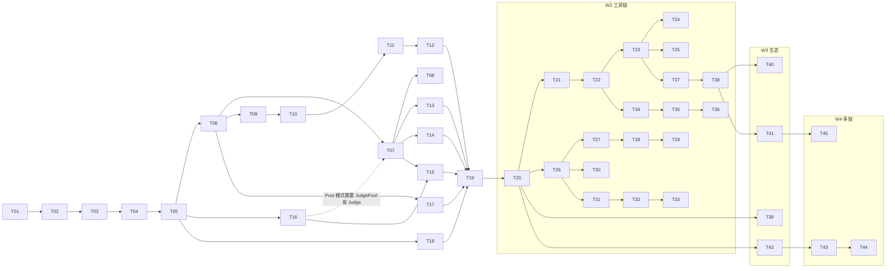

# Phase 4: Task Breakdown — Agent Layer v2

> **目的**: 将技术规格拆解为可执行、可分配、可验收的独立任务
> **输入**: `docs/03-technical-spec.md`
> **输出物**: 本文档

---

## 4.1 拆解原则

1. **每个任务 ≤ 4 小时**（如果超过，继续拆）
2. **每个任务有明确的 Done 定义**（可验证）
3. **任务之间的依赖关系必须标明**
4. **先基础后上层**（按依赖顺序排列）

---

## 4.2 任务列表

### 🔴 W1（2026-04-01 ~ 04-14）— Solana 核心 Program

| # | 任务名称 | 描述 | 依赖 | 时间 | 优先级 | Done 定义 |
|---|---------|------|------|------|--------|----------|
| T01 | Anchor 工作区脚手架 | `anchor init`，配置 Cargo.toml workspace，设置 program ID，`.github/ci.yml` | 无 | 1h | P0 | `anchor build` 通过，目录结构符合规范 |
| T02 | 常量 + 错误码模块 | `constants.rs` 所有 14 个常量，`errors.rs` 42 个错误码（6000-6040 共 41 个 + 6041 UnsupportedMintExtension） | T01 | 1h | P0 | 编译通过，所有常量类型正确，42 个错误码已定义 |
| T03 | 账户结构体 — Task / Escrow / Application | `Task`（323B）、`Escrow` PDA（SOL 原生账户）、`Application` struct；所有 `#[account]` 宏 | T02 | 2h | P0 | `assert_eq!(Task::SIZE, 323)` 编译通过；字段类型与规格 100% 一致 |
| T04 | 账户结构体 — Submission / RuntimeEnv | `Submission`（总 505B：discriminator 8B + data 497B）嵌套 `RuntimeEnv`（176B，MAX_VERSION_LEN=32）；所有字段、String 最大长度注解 | T02 | 2h | P0 | `assert_eq!(Submission::SIZE, 505)` 通过；RuntimeEnv 4 字段字节和 = 36+68+36+36=176 |
| T05 | 账户结构体 — Reputation / Stake / JudgePool / Treasury / ProgramConfig | `Reputation`（总 117B：data 109B = agent32+global20+by_category56+bump1），`Stake`（74B），`JudgePool`（总 7218B：data 7210B = category1+total_weight4+vec_len4+200×36+bump1），`Treasury`（9B），`ProgramConfig`（89B）；枚举 `TaskState` / `JudgeMode` / `Category`（含 derive 宏） | T02 | 2h | P0 | 所有账户 SIZE assert 通过；JudgePool 7218B = 8+7210 验证正确 |
| T06 | `initialize` 指令 | 初始化 `ProgramConfig`（upgrade_authority、min_judge_stake）和 `Treasury` PDA；一次性调用 | T05 | 2h | P0 | 测试：`initialize` → ProgramConfig 字段值正确；二次调用返回 `AlreadyInitialized` |
| T07 | `post_task` — SOL 路径 | Task PDA 创建，SOL reward 转入 Escrow，`config.task_count++`；Pool 模式链上加权随机（sha256 seed）抽 Judge | T06 | 3h | P0 | 测试：发 SOL 任务 → `Task.state=Open`，Escrow 余额 = reward；Pool 模式 judge 字段被协议填写 |
| T08 | `post_task` — SPL / Token-2022 路径 | SPL Token / Token-2022 版本：ATA 初始化，`token::transfer` 锁入 escrow_ata；检查 mint 是否启用 Transfer Hook / Confidential Transfer，有则返回 `UnsupportedMintExtension` | T07 | 3h | P0 | 测试：SPL 任务 → escrow_ata 余额 = reward；带 Transfer Hook 的 Token-2022 mint → `UnsupportedMintExtension` |
| T09 | `apply_for_task` — SOL + SPL 路径 | Application PDA init，Reputation PDA `init_if_needed`，SOL / SPL 质押转入 Escrow；前置条件：state=Open，deadline 未过，未重复申请 | T07 | 3h | P0 | 测试：apply → Application created，stake 锁入 Escrow；重复申请 → `AlreadyApplied`；`min_stake=0` 无需质押 |
| T10 | `submit_result` | Submission PDA 创建（或覆盖更新），RuntimeEnv 四字段长度 `require!` 验证；前置条件：agent 已申请、deadline 未过 | T09 | 2h | P0 | 测试：submit → Submission 字段正确；二次 submit → 覆盖；model 超长 → `InvalidRuntimeEnv` |
| T11 | `judge_and_pay` — SOL 路径 + 分账 | 分数验证（≥ MIN_SCORE）；赢家选取（highest score ≥ 60，tie→earliest slot）；整数除法费用计算（95/3/2 BPS）；三路 lamport 转账（Agent/Judge/Treasury）；`Task.state=Completed`；所有申请者 stake 退回 | T10 | 3h | P0 | 测试：2 Agent 竞争 → 赢家得 95%，Judge 得 3%，Treasury 得 2%；余额精确；所有 stake 退回 |
| T12 | `judge_and_pay` — SPL + 信誉更新 | SPL Token 三路 CPI 转账；`Reputation` 全局统计更新（avg_score 滚动平均、win_rate）；`CategoryStats[category]` 更新（per-domain avg + completed） | T11 | 3h | P0 | 测试：SPL 任务评判 → token 余额正确；全局 + category 信誉均更新 |
| T13 | `cancel_task` | 仅 Poster 可调用；state=Open 验证；2% 取消费到 Treasury，98% 退还 Poster；所有 Agent 质押退回；`Task.state=Refunded` | T07 | 2h | P0 | 测试：cancel → Poster 得 98%，Treasury 得 2%；已有申请时 stakes 退回；非 Poster 调用 → `Unauthorized` |
| T14 | `refund_expired` | 任何人调用；clock > task.deadline 且 state=Open；全额退还 Poster；Agent stakes 退回；`Task.state=Refunded` | T07 | 2h | P0 | 测试：设时钟过期 → `refund_expired` 成功；未过期 → `DeadlineNotPassed` |
| T15 | `force_refund` + Slash 逻辑 | 任何人调用；clock > judge_deadline + FORCE_REFUND_DELAY；Slash：从 Stake 扣 `min_judge_stake`；若剩余 < `min_judge_stake` → 从 JudgePool 移除 + 关闭 Stake PDA；否则更新权重；全额退还 Poster；Agent stakes 退回 | T07, T16 | 3h | P0 | 测试：force_refund → Poster 退款；Judge stake 扣减；stake 不足时从 Pool 移除 |
| T16 | `register_judge` + `unstake_judge` | `register_judge`：质押 ≥ min_judge_stake，声明 category，**首次调用通过 `init_if_needed` 创建 JudgePool PDA（预分配 7218B，无需单独 initialize_judge_pool 指令）**，添加 entry（pool 满 200 → `JudgePoolFull`），计算初始权重；`unstake_judge`：冷却期 7 天检查，从 JudgePool 移除，退还质押 | T06 | 2h | P0 | 测试：首次 register → JudgePool 自动创建且 SIZE=7218；已有 pool 时 register 添加 entry；200 人后注册 → `JudgePoolFull`；unstake 冷却前 → `CooldownNotExpired` |
| T17 | `upgrade_config` | 仅 upgrade_authority 可调用；更新 `treasury` 地址和 `min_judge_stake` | T06 | 1h | P1 | 测试：upgrade_config 更新两字段；非 authority 调用 → `Unauthorized` |
| T18 | IJudge CPI 接口定义 | 定义 `IJudge` trait 和 CPI 接口；实现 `test_cases` evaluator 存根（Type C-1）；接口注释文档 | T05 | 2h | P1 | 编译通过；CPI 接口可被外部 Program 实现 |
| T19 | 测试套件 Part 1 — Happy Path | 完整 E2E：initialize → post(SOL) → apply → submit → judge_and_pay；所有 P0 状态转换验证；SOL / SPL 双路径 | T12, T13, T14, T15, T16, T17, T18 | 4h | P0 | `anchor test` 全绿；所有 P0 用户故事对应测试通过 |
| T20 | 测试套件 Part 2 — 边界条件 + 安全 | score < MIN_SCORE（rejected）；并列 tie-break by slot；Token-2022 扩展拒绝；Pool 随机分布验证；Slash 边界；JudgePoolFull；force_refund 时间窗口；重入攻击模拟 | T19 | 4h | P0 | 15 个边界测试全绿；分支覆盖率 ≥ 95%；0 Critical 安全漏洞 |

---

### 🟠 W2（2026-04-15 ~ 04-21）— 工具链

| # | 任务名称 | 描述 | 依赖 | 时间 | 优先级 | Done 定义 |
|---|---------|------|------|------|--------|----------|
| T21 | Indexer — PostgreSQL Schema | 4 张表（tasks / submissions / reputations / reputation_by_category）+ 5 个索引；migration 文件 | T20 | 2h | P0 | `psql` 运行 migration 无报错；schema 与规格完全一致 |
| T22 | Indexer — Helius Webhook 接收 + 事件解析 | HTTP 端点接收 Helius 推送；解析 5 个 Program 事件（**TaskCreated, SubmissionReceived, TaskJudged, TaskRefunded, JudgeRegistered**）；upsert 到 DB | T21 | 3h | P0 | Mock webhook POST → DB 行创建 / 更新正确；延迟 < 200ms |
| T23 | Indexer — REST API 端点 | `GET /api/tasks?state=&category=&page=`；`GET /api/tasks/:id`；`GET /api/tasks/:id/submissions?sort=score`；`GET /api/reputation/:agent`；`GET /api/reputation/:agent/category/:cat` | T22 | 3h | P0 | curl 每个端点 → 正确 JSON；分页正确；无效参数 → 4xx |
| T24 | Indexer — WebSocket 服务器 | WS 连接 ws://indexer/ws；事件广播：TaskCreated / ResultSubmitted / TaskJudged；客户端可 filter by task_id | T22 | 2h | P1 | WS 客户端订阅 → 收到 DB upsert 触发的事件；连接断开自动清理 |
| T25 | Indexer — Cloudflare Workers + D1 适配层 | CF Workers wrapper；D1 SQLite schema（与 PG schema 对齐）；`wrangler deploy` 到 CF；REST API 路径一致 | T23 | 3h | P1 | Managed 模式 CF 部署成功；相同 curl 命令返回相同格式 |
| T26 | SDK — TypeScript 类型 + IDL 绑定 | `@gradience/sdk` 包初始化；从 Anchor IDL 生成类型；`GradienceSDK` class + 配置接口；发布到 npm 干跑 | T20 | 2h | P0 | `import { GradienceSDK } from '@gradience/sdk'` 编译通过；所有 IDL 类型正确导出 |
| T27 | SDK — task.post / apply / submit | 三个核心方法；SOL + SPL 双路径；wallet adapter 调用 sign/sendTx | T26 | 3h | P0 | 单元测试（mock Program）：3 方法返回 tx signature；3 行代码示例可运行 |
| T28 | SDK — task.judge / cancel / refund / forceRefund | 4 个方法包装剩余指令；正确传递账户列表 | T27 | 2h | P0 | 单元测试通过；devnet 端到端可用 |
| T29 | SDK — reputation / JudgePool 查询 | `reputation.get(agent)`（读链上 PDA）；`judgePool.list(category)`；`task.submissions(taskId, {sort})`（查 Indexer） | T26 | 2h | P1 | 查询返回带类型的响应；未找到时返回 null 而非抛出 |
| T30 | SDK — 钱包适配器（5 种） | `WalletAdapter` 接口；`KeypairAdapter`（dev）完整实现；`OpenWalletAdapter` / `OKXAdapter` / `PrivyAdapter` / `KiteAdapter` 接口存根（sign/sendTx 签名） | T26 | 3h | P1 | KeypairAdapter devnet 端测通过；4 个存根接口符合类型签名 |
| T31 | CLI — 脚手架 + config 命令 | `gradience` binary（Node.js / Bun）；`config set rpc <url>`；`config set keypair <path>`；`--help` 所有子命令 | T26 | 1h | P0 | `gradience --help` 显示所有子命令；config 写入 `~/.gradience/config.json` |
| T32 | CLI — task post / apply / submit / status | `gradience task post --eval-ref <cid> --reward <lamports> --deadline <ts> ...`；`apply`；`submit --result-ref <cid> --trace-ref <cid> ...`；`status <task_id>` | T31, T28 | 3h | P0 | 每条命令在 devnet 创建正确的链上交易 |
| T33 | CLI — task judge / cancel / refund + judge register | `gradience task judge <task_id> <agent> <score>`；`cancel`；`refund`；`gradience judge register --category defi` | T32 | 2h | P0 | 命令在 devnet 正确执行；judge register 后 JudgePool 有记录 |
| T34 | Judge Daemon — Absurd 工作流 + LaserStream 监听 | Absurd（PostgreSQL 持久化 workflow engine）初始化；Helius LaserStream gRPC 连接；监听 **TaskCreated / SubmissionReceived** 事件 → 触发 evaluate workflow；崩溃可续（**Judge 评测类型说明**：Type A=人工打分，Type B=AI 白盒 trace replay，Type C-1=test_cases oracle，对应架构 doc 3 类评测方法） | T22 | 3h | P1 | Daemon 启动，模拟 TaskCreated 事件 → workflow 触发，延迟 < 200ms |
| T35 | Judge Daemon — Type A（人工存根）+ Type B（AI Claude API） | **Type A**：等待 CLI 手动打分输入（人工评判）；**Type B**：下载 result_ref + trace_ref，构造 prompt 发给 Claude API（对照 evaluationCID 评判标准），解析 0-100 分，调用 SDK `task.judge()` 上链 | T34 | 4h | P1 | Type B：测试任务 E2E 经 Claude API 自动评判并上链；judge_and_pay 被触发；score ≥ 60 |
| T36 | Judge Daemon — Type C-1（test_cases oracle） | IJudge wasm_exec：下载 evaluationCID 内 WASM 字节码，沙箱执行，解析分数，调用 `task.judge()` | T35 | 3h | P1 | 示例 WASM 模块（Rust→wasm32-wasi）被正确执行并给分 |
| T37 | 前端 — 任务列表 + 发任务表单 | Next.js 14 App Router；任务列表（调 Indexer REST API）；发任务表单（钱包连接 + SDK `task.post()`） | T23, T28 | 4h | P0 | `localhost:3000` 显示任务列表；表单提交在 devnet 创建任务 |
| T38 | 前端 — 任务详情 + 提交列表 + 评判 | 任务详情页（状态、deadline、Judge 地址）；提交列表（按 score 排序）；Judge 触发按钮（仅 Task.judge == 当前钱包时显示） | T37 | 4h | P0 | 完整生命周期（发→申请→提交→评判）可在浏览器操作 |

---

### 🟡 W3（2026-04-22 ~ 04-26）— 生态扩展

| # | 任务名称 | 描述 | 依赖 | 时间 | 优先级 | Done 定义 |
|---|---------|------|------|------|--------|----------|
| T39 | Chain Hub MVP | Delegation Task Anchor program 骨架；Skill 市场注册表；与 Agent Layer JudgePool 集成（选人 → 授权） | T20 | 4h | P1 | Chain Hub program 可初始化；delegation_task 指令可调用（不含完整执行逻辑） |
| T40 | Agent Me MVP | 用户个人 Agent 界面：OpenWallet 钱包管理，Reputation PDA 展示，任务历史；Tauri / Next.js | T38 | 4h | P1 | 页面显示当前钱包的全局 + category 信誉；任务历史可查 |
| T41 | Agent Social MVP | Agent 发现 + 匹配页：按 category 搜索 Agent，展示信誉排名，发送合作邀请（链下消息） | T38 | 4h | P1 | 可搜索 Agent，点击查看其 Reputation PDA；消息功能 stub |
| T42 | GRAD Token + 链上治理 | SPL Token 发行（GRAD），Squads v4 多签 DAO 设置（3/5），转移 upgrade_authority 给多签 | T20 | 4h | P1 | GRAD mint 创建；upgrade_authority = Squads PDA；多签测试可执行 `upgrade_config` |

---

### 🔵 W4（2026-04-27 ~ 04-30，best effort）— 全链扩展

| # | 任务名称 | 描述 | 依赖 | 时间 | 优先级 | Done 定义 |
|---|---------|------|------|------|--------|----------|
| T43 | EVM Agent Layer Solidity 合约 | 将核心 Race Task 逻辑移植到 Solidity ^0.8.20；post_task / apply / submit / judge_and_pay；部署到 Base Sepolia | T20 | 4h | P1 | `npx hardhat test` 通过；合约部署到 Base Sepolia |
| T44 | 跨链信誉证明（签名 + 验证） | Squads upgrade_authority 离线签名 Agent 信誉（agent_pubkey, score, chain=solana）；`ReputationVerifier` EVM 合约验证 ed25519 签名 | T42, T43 | 4h | P1 | E2E：Solana 信誉 → 多签签名 → EVM `verifyReputation()` 返回 true |
| T45 | A2A 协议 MVP（MagicBlock） | Agent Social 底层 MagicBlock 实时通道；Agent 发现广播；微支付通道 stub | T41 | 4h | P2 | 两个 Agent 进程通过 MagicBlock 互发消息；延迟 < 500ms |

---

## 4.3 任务依赖图

---

## 4.4 里程碑划分

### Milestone 1：协议内核可用（2026-04-14）
**交付物**：Solana Program 全量部署到 devnet；所有指令可调用；测试覆盖率 ≥ 95%

包含任务：T01 ~ T20

**验收条件**：
- `anchor test` 全绿（含边界条件）
- `anchor deploy --provider.cluster devnet` 成功
- 手动调用 `post_task → apply → submit → judge_and_pay` 全流程链上验证
- Slash、force_refund、Pool 随机、Token-2022 拒绝均测试通过

---

### Milestone 2：开发者工具链可用（2026-04-21）
**交付物**：SDK + CLI + Indexer + Judge Daemon + 前端产品 MVP，所有工具联通 devnet

包含任务：T21 ~ T38

**验收条件**：
- `npm install @gradience/sdk` → 3 行代码发任务成功
- `gradience task post ...` 在 devnet 创建任务
- Judge Daemon Type B（Claude API）自动评判一个测试任务并上链
- 前端可完整操作任务生命周期

---

### Milestone 3：生态模块 MVP（2026-04-26）
**交付物**：Chain Hub / Agent Me / Agent Social / GRAD Token / Squads 多签治理

包含任务：T39 ~ T42

**验收条件**：
- GRAD mint 创建，upgrade_authority 转交 Squads v4（3/5 多签）
- Chain Hub delegation_task 指令可调用
- Agent Me 页面可展示信誉
- Agent Social 可搜索 Agent

---

### Milestone 4：全链扩展（2026-04-30，best effort）
**交付物**：EVM 合约 + 跨链信誉 + A2A 通道 MVP

包含任务：T43 ~ T45

**验收条件**：
- EVM 合约部署到 Base Sepolia，核心指令通过
- Solana 信誉证明在 EVM 可验证
- MagicBlock 两 Agent 互通消息

---

## 4.5 风险识别

| 风险 | 概率 | 影响 | 缓解措施 |
|------|------|------|---------|
| `judge_and_pay` SOL + SPL 分账计算有 off-by-one 整数精度 bug | 高 | 高 | T11/T12 专项精度测试（验证每笔转账余额精确到 lamport） |
| Token-2022 扩展检测 API 在 Anchor 版本中不稳定 | 中 | 高 | T08 阶段提前验证 Anchor 的 `ExtensionType` API，必要时手动解析 mint account data |
| JudgePool 加权随机在 Solana CU 预算内超限 | 中 | 中 | T07 测量 `post_task` CU 消耗（≤ 200k），若超限改为 VRF 异步方案 |
| Helius LaserStream gRPC 延迟不稳定或 API 变更 | 中 | 中 | T34 实现 fallback：LaserStream 不可用时降级为 polling（5s 轮询 RPC） |
| Claude API Rate Limit 影响 Type B Judge 自动评判 | 低 | 中 | T35 实现指数退避重试 + 本地 queue，限速时排队而非丢失任务 |
| W4 时间窗口（4 天）不足以完成 EVM + 跨链 + A2A | 高 | 低 | W4 标记为 best effort；T43→T44 优先，T45 可延后；不影响 W1-W3 验收 |
| Squads v4 API 与当前 Anchor 版本不兼容 | 低 | 中 | T42 提前验证 `@sqds-multisig` npm 包版本，必要时锁定兼容版本 |

---

## ✅ Phase 4 验收标准

- [x] 每个任务 ≤ 4 小时
- [x] 每个任务有 Done 定义
- [x] 依赖关系已标明，无循环依赖
- [x] 划分为 4 个里程碑，每个均有可演示交付物
- [x] 风险已识别（7 项）

**验收通过后，进入 Phase 5: Test Spec →**
