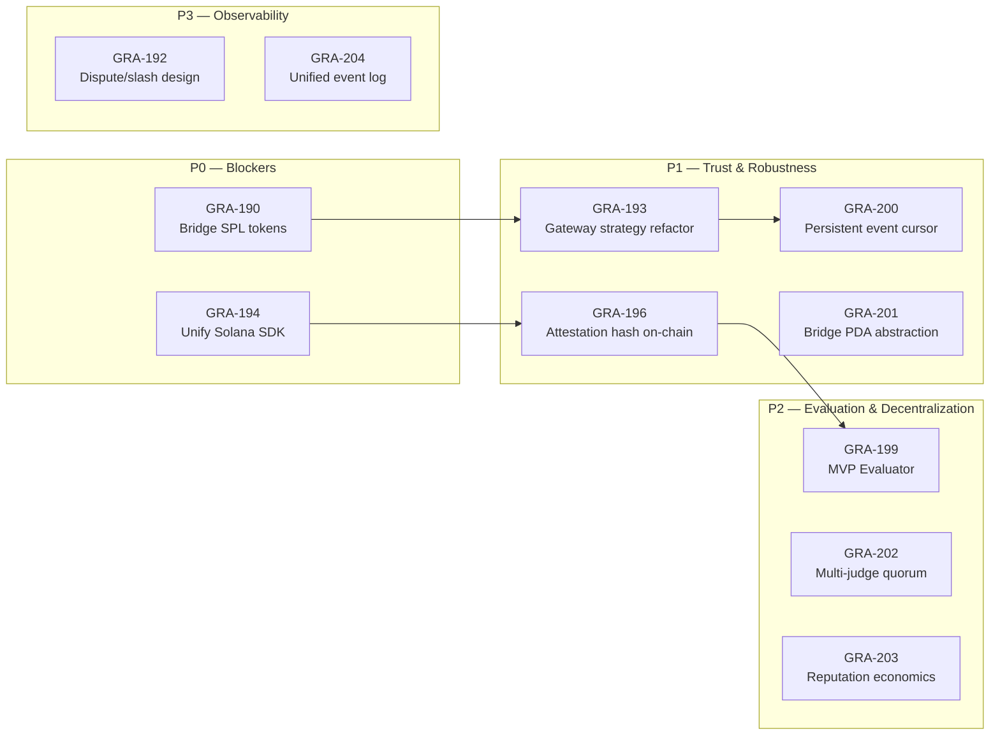

# First-Principles Architecture Review

> **Date**: 2026-04-07  
> **Scope**: Gradience protocol — on-chain programs, off-chain SDKs, daemons, and cross-layer trust model  
> **Reviewer**: Droid (factory-droid[bot])

---

## 1. Executive Summary

Gradience is a **Solana-first, agent-centric coordination protocol** built around three first-principles:

1. **No single trusted agent** — solved by Agent Arena (race + judge + escrow).
2. **Execution verifiability** — solved by VEL (TEE-based attestation + proof bundles).
3. **Composable agent capabilities** — solved by Workflow Marketplace + Chain-Hub skill registry.

**Verdict**: The protocol's _structural_ design is sound, but there are **five critical abstraction leaks** that will compound into operational and security debt if left unaddressed. This document records each finding as a concrete, trackable task.

---

## 2. Scorecard

| Dimension                     | Grade  | Rationale                                                                                                                |
| ----------------------------- | ------ | ------------------------------------------------------------------------------------------------------------------------ |
| On-chain programs             | **B+** | Clean Pinocchio state machines, but TEE attestation is not consumed on-chain and upgrade governance is undocumented.     |
| SDK consistency               | **C**  | Dual Solana client libraries (`@solana/kit` vs `@solana/web3.js`) create type / builder fragmentation.                   |
| Daemon architecture           | **B**  | Good modularity (VEL, bridge, gateway), but Gateway `drive()` is a big ball of mud and EvaluatorRuntime is a mock shell. |
| End-to-end trust model        | **C+** | VEL produces trustworthy proofs, yet the chain does not enforce them. A compromised judge can still override TEE output. |
| Observability / debuggability | **C**  | State is scattered across 3+ on-chain programs + local SQLite + filesystem. No unified event log or indexing contract.   |

---

## 3. Detailed Findings → Tasks

### Finding 1: Dual Solana Client Libraries (Highest Technical Debt)

**What**:

- `arena-sdk` and `packages/sdk` use **@solana/kit** (v5/v6).
- `workflow-engine`, `agent-daemon/bridge`, and `agent-daemon/solana-routes` use **@solana/web3.js** (v1.98).
- `agent-daemon` depends on **both**.

**Why it matters (first principles)**:
A protocol SDK should present _one_ model of the chain to developers. Having two incompatible `PublicKey`, `Transaction`, and `Signer` types forces users to learn two mental models and prevents code reuse. The settlement bridge currently _manually rebuilds_ `TransactionInstruction` bytes instead of reusing the instruction builders already present in `arena-sdk`.

**Impact**:

- Any account-ordering change in `agent-arena` requires edits in both `arena-sdk` _and_ `settlement-bridge.ts`.
- Higher bundle size, duplicated connection logic, type-casting boilerplate.

**Recommendation**:
Migrate `workflow-engine` and `agent-daemon` bridge code to `@solana/kit`. Since `workflow-engine`'s Solana surface is small (`solana-sdk.ts`), this is lower cost than migrating `arena-sdk` backward.

**Task**: [[GRA-194]]

---

### Finding 2: Settlement Bridge Hard-Codes SOL-Only JudgeAndPay

**What**:

- `agent-arena` program natively supports SPL-token judge_and_pay (8 optional accounts).
- `settlement-bridge.ts` contains a literal `TODO` and drops those 8 accounts, building a SOL-only instruction.

**Why it matters**:
The bridge negates a core protocol capability. If the frontend or SDK encourages SPL-token tasks, the automated settlement path will silently fail or underfund participants.

**Recommendation**:
Detect the task's payment mint in the bridge. If it is not native SOL, include the 8 SPL-token accounts in the built instruction.

**Task**: [[GRA-190]]

---

### Finding 3: VEL Attestation Is Not Enforced On-Chain (Trust Break)

**What**:

- VEL produces a SHA256-bound attestation bundle + proof hash.
- The bridge passes this as `reasonRef` to `judge_and_pay`.
- `agent-arena` program stores/judges based _only_ on the judge's signature, never verifying the attestation hash.

**Why it matters**:
This creates a "trust-but-don't-verify" gap. A compromised bridge key or malicious judge can ignore the TEE result and settle arbitrarily. The economic security of the protocol does not increase with the strength of the TEE.

**Recommendation — phased**:

1. **Short term**: Store the attestation hash in a new field on the `Task` or `Submission` PDA (or at least in `SubmitResult`).
2. **Medium term**: Restrict the registered "evaluator judge" so it can only judge tasks whose on-chain stored hash matches the provided `reasonRef`.
3. **Long term**: Add a dispute window + challenger bond so stakeholders can contest a mismatched judgment.

**Tasks**:

- On-chain attestation hash storage: [[GRA-196]]
- Dispute/slash mechanism design: [[GRA-192]]

---

### Finding 4: Gateway Orchestrator (`drive()`) Is a Big Ball of Mud

**What**:

- `gateway.ts` `drive()` is a ~170-line `while(true)` with nested `if` blocks for every state transition.
- It mixes I/O (arena client calls), DB writes, state machine transitions, and error handling.

**Why it matters**:
This is brittle to retry semantics and race conditions. A failure inside `runAndSettle()` conflates _execution_ failure with _settlement_ failure. The gateway cannot partially recover (e.g., re-execute without re-posting the arena task).

**Recommendation**:
Split `drive()` into **per-state strategy handlers** (`TaskCreatingHandler`, `SubmittingHandler`, `ExecutingHandler`, etc.). Each handler implements a common interface and returns the next action/error. The state machine becomes a router, not an imperative script.

**Task**: [[GRA-193]]

---

### Finding 5: EvaluatorRuntime Is a Production Shell with No Real Sandbox

**What**:

- `evaluator/runtime.ts` exposes a rich interface (budgets, drift detection, Playwright harness).
- `createSandbox()` returns a **MockSandbox**.
- `evaluateContent` and `evaluateComposite` are empty TODOs.

**Why it matters**:
The entire "judge" role's intelligent assessment is currently a mock. Even though WEG automates the settlement, the _evaluation_ that decides the score is missing. This means the protocol can settle tasks, but cannot yet **objectively verify** whether the result was correct.

**Recommendation**:
Introduce a **minimum viable evaluator** that can score a structured task against a rubric. A pragmatic v0 is: LLM structured-output scoring with deterministic regex/snapshot assertions for deterministic steps.

**Task**: [[GRA-199]]

---

### Finding 6: Polling Event Listener Uses a Memory-Only Deduplication Cursor

**What**:

- `PollingMarketplaceEventListener` relies on an in-memory `Set<string>` (`processedSignatures`).
- On daemon restart, this set is lost, causing duplicate event processing or missed events.

**Why it matters**:
Gateway idempotency (insert-then-ignore) prevents duplicates from corrupting state, but it also means valid _new_ events that happen near a restart boundary could be skipped if the cursor resets backward.

**Recommendation**:
Use the SQLite `GatewayStore` to persist `max(blockTime)` and `max(signature)` as the polling cursor. On startup, read this cursor and begin polling from there.

**Task**: [[GRA-200]]

---

### Finding 7: Bridge Forces Callers to Know PDA Derivation Logic

**What**:

- `settleWithReasonRef` requires 10+ fields: `taskAccount`, `escrowAccount`, `poster`, etc.
- The caller (VEL orchestrator) must import `resolveJudgeAndPayPdas` and compute PDAs itself.

**Why it matters**:
This is a leaky abstraction. The bridge should _own_ the on-chain addressing model. Callers should only need semantic identifiers (`taskId`, `winner`, `score`, `reasonRef`).

**Recommendation**:
Move PDA resolution inside `SettlementBridge`. Expose a thin API: `bridge.settle(taskId, winner, score, reasonRef)`.

**Task**: [[GRA-201]]

---

### Finding 8: Single-Judge Model Retains Centralized Discretion

**What**:

- `agent-arena` tasks designate a single `judge` address.
- Even with TEE, that judge has ultimate discretion to ignore the proof and settle differently.

**Why it matters**:
This reintroduces a centralized trust assumption at the most critical economic step (fund release).

**Recommendation**:
Support a **multi-judge quorum** mode (e.g., 3 judges, majority wins) or a **programmatic judge pool** where only attestation-verified evaluators can settle.

**Task**: [[GRA-202]]

---

### Finding 9: Reputation Model Lacks Economic Security Depth

**What**:

- Reputation in `agent-arena` is updated as a side effect of `judge_and_pay`.
- There is no documented slash mechanism, stake lockup, or reputation-weighted reward curve.

**Why it matters**:
Without economic skin in the game, a low-reputation agent can simply create a new wallet and re-enter the arena. Reputation becomes a cosmetic score rather than a security parameter.

**Recommendation**:
Design a reputation-to-stake mapping: higher reputation unlocks lower minimum stakes or higher task rewards. Conversely, repeated failures trigger a mandatory cooling period or increased stake requirement.

**Task**: [[GRA-203]]

---

### Finding 10: No Unified Observable Event Log Across the Journey

**What**:

- A workflow purchase creates state in `workflow-marketplace`.
- Gateway creates state in local SQLite.
- Arena creates state on-chain.
- VEL creates attestations in `/tmp/` or local files.
- There is no single query that can reconstruct the full `purchase → task → settle` journey.

**Why it matters**:
Debugging user support tickets and protocol analytics becomes an exercise in manual joins across 3+ data sources.

**Recommendation**:
Emit a canonical `GradienceEvent` stream from Gateway (and eventually from programs via indexer/webhooks). Minimum viable: Gateway appends structured JSON lines to a rotating log file that includes `purchaseId`, `taskId`, `txSignatures`, and `status`.

**Task**: [[GRA-204]]

---

## 4. Priority Roadmap

| Phase               | Tasks                              | Success Criteria                                                                                             |
| ------------------- | ---------------------------------- | ------------------------------------------------------------------------------------------------------------ |
| **M1 Cleanup**      | GRA-194, GRA-190                   | `agent-daemon` depends on only one Solana lib; bridge passes SPL-token E2E.                                  |
| **M2 Hardening**    | GRA-196, GRA-193, GRA-200, GRA-201 | Attestation hash stored on-chain; Gateway `drive()` has per-state handlers; event listener survives restart. |
| **M3 Intelligence** | GRA-199, GRA-202, GRA-203          | Real evaluator scores a task end-to-end; multi-judge path is architected.                                    |
| **M4 Maturity**     | GRA-192, GRA-204                   | Dispute spec merged; unified event log queryable.                                                            |

---

## 5. Related Commits

- WEG Phase 1-6: `5c9d29a75`
- VEL Phase 1-6 + E2E: `012f231d2`, `b01338ecd`

## 6. On-Chain Program IDs (Devnet)

| Program              | Address                                        |
| -------------------- | ---------------------------------------------- |
| agent-arena          | `5CUY2V1odYZghA54WH7YQRPzh3JaKhe1S84CRbeKfVYs` |
| chain-hub            | `6G39W7JGQz7A6L5dAvotFuRP9UbFdCJg2BqDuj6WJWec` |
| a2a-protocol         | `FPaeaqQCziLidnwTtQndUB1SiaqBuBUad6UCnshfMd3H` |
| workflow-marketplace | `3QRayGY5SHYnD5cb2qegEoNx7dPXJJyHJD3shzAQ75UW` |
| agentm-core          | `2stkfkFaFLUvSR9yydmfQ7pZReo2M38zcVtL1QffCyDA` |
