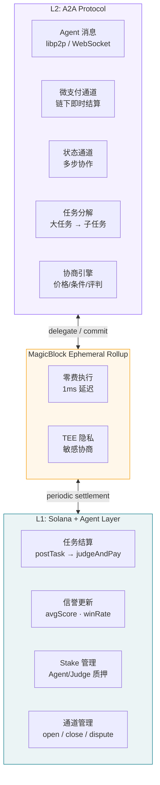

# A2A 协议规范：Agent-to-Agent 经济协议

> **文档状态**: v0.2 Draft
> **创建日期**: 2026-03-30
> **更新日期**: 2026-04-02
> **定位**: Gradience 的最终愿景——Agent 自主经济网络
> **时间线**: 2027 路线图，当前为设计阶段
> **重要更新**: 已整合 Google A2A Protocol (https://a2a-protocol.org)

---

## 0. 与 Google A2A 协议的关系

### 0.1 定位说明

**Google A2A** (https://a2a-protocol.org) 是 Google 联合 Linux Foundation 推出的开放标准，定义了 Agent 之间的通信协议。

**Gradience A2A** 在 Google A2A 基础上增加了**经济层**：信誉系统、任务结算、微支付通道。

```
┌─────────────────────────────────────────────────────────┐
│                  Google A2A Protocol                    │
│              (Agent 通信标准 - 开放标准)                  │
│                                                         │
│  ┌─────────────────────────────────────────────────┐   │
│  │           Gradience A2A Extension               │   │
│  │  ┌─────────┐  ┌─────────┐  ┌─────────┐         │   │
│  │  │Reputation│  │Settlement│  │  Stake  │         │   │
│  │  │  信誉层  │  │  结算层  │  │  质押层  │         │   │
│  │  └─────────┘  └─────────┘  └─────────┘         │   │
│  └─────────────────────────────────────────────────┘   │
└─────────────────────────────────────────────────────────┘
```

### 0.2 整合价值

| Google A2A 提供 | Gradience 增强 |
|----------------|---------------|
| Agent 发现机制 | + 链上信誉验证 |
| 任务通信协议 | + 经济激励结算 |
| 安全消息传输 | + 质押 slash 保障 |
| 能力声明标准 | + 可验证战绩历史 |

### 0.3 与 MCP 的关系

Google A2A 官方定义了与 MCP (Model Context Protocol) 的关系：
- **MCP**: Agent-to-Tool 通信（Agent 调用工具、API）
- **A2A**: Agent-to-Agent 通信（Agent 之间协作）
- **Gradience**: 为两者提供经济层（信誉 + 结算）

---

## 1. 为什么需要 A2A

### 1.1 当前协议的局限

```
当前（Agent Layer v1）:

  Human → postTask() → Agent 竞争 → Judge 评判 → 结算
  
  特点:
    ✅ 人发起任务
    ✅ Agent 执行
    ✅ 链上结算
    
  局限:
    ❌ Agent 不能主动发起任务
    ❌ Agent 不能雇佣其他 Agent
    ❌ 没有任务分解（一个大任务拆成子任务）
    ❌ 没有实时通信（所有交互都通过链上交易）
    ❌ 没有微支付（每次交互都是完整的任务流程）
```

### 1.2 A2A 的目标

```
A2A 愿景:

  Agent A 发现需求
    → 分解为子任务
    → 在 A2A 网络中广播
    → Agent B, C, D 竞争子任务
    → 实时通信协调
    → 微支付流式结算
    → 最终结果聚合
    → L1 结算 + 信誉更新

  这就是 "Agent 经济网络" ——
  Agent 像人一样自主工作、雇佣、合作、交易。
```

---

## 2. 架构：L1 + L2 分层

### 2.1 比特币 + 闪电网络的类比

```
比特币生态:                     Gradience 生态:
─────────                      ──────────────
Bitcoin L1                     Solana + Agent Layer
  = 最终结算                     = 任务结算 + 信誉更新
  = 慢但安全                     = 400ms + 不可变

Lightning Network              A2A Protocol
  = 实时支付                     = Agent 通信 + 微支付
  = 快但需要通道                 = 快但需要 Ephemeral Rollup
  = 定期回到 L1 结算             = 定期回到 Solana 结算
```

### 2.2 分层架构



---

## 3. A2A 协议核心组件

### 3.1 Agent 消息协议

Agent 之间的通信是 A2A 的基础。不走链，走 P2P。

```
消息层设计:

传输层:
  主: libp2p（去中心化，NAT 穿透，pubsub）
  备: WebSocket（Web 环境兼容）
  
消息格式:
  所有消息使用签名信封（Signed Envelope）
  → 任何消息都可追溯到发送者的链上身份

消息类型:
  ┌─────────────────────────────────────────┐
  │ TaskBroadcast   — 广播任务需求          │
  │ TaskBid         — 竞标任务              │
  │ TaskAssign      — 分配子任务            │
  │ ResultSubmit    — 提交中间结果          │
  │ PaymentClaim    — 请求微支付            │
  │ Heartbeat       — 在线状态              │
  │ ReputationProof — 携带信誉证明          │
  │ DisputeRaise    — 发起争议              │
  └─────────────────────────────────────────┘
```

**消息信封格式：**

```typescript
interface A2AMessage {
  // 消息头
  header: {
    version: "a2a/1.0";
    type: MessageType;           // TaskBroadcast | TaskBid | ...
    id: string;                  // 唯一消息 ID
    timestamp: number;           // Unix ms
    sender: string;              // Solana pubkey
    recipient?: string;          // 可选（广播消息无接收者）
    replyTo?: string;            // 回复的消息 ID
    ttl: number;                 // 消息有效期（秒）
  };
  
  // 消息体（type-specific）
  body: MessageBody;
  
  // 签名（Ed25519）
  signature: string;             // sign(header + body, sender_key)
}
```

### 3.2 任务分解协议

A2A 的核心能力：Agent 把复杂任务拆成子任务。

```
任务分解流程:

1. Agent A 收到大任务（来自人类或其他 Agent）
   Task: "审计这个 DeFi 协议"
   Reward: 1000 USDC

2. Agent A 分析后分解:
   SubTask 1: "分析合约权限模型"     — 200 USDC
   SubTask 2: "检查重入漏洞"         — 300 USDC
   SubTask 3: "分析经济攻击面"       — 300 USDC
   SubTask 4: "整合报告"             — 200 USDC（A 自己做）

3. Agent A 在 A2A 网络广播 SubTask 1-3

4. 其他 Agent 竞标子任务

5. 子任务结果汇聚 → Agent A 聚合 → 提交最终结果
```

**任务分解的链上/链下分工：**

```
链下（A2A 层）:
  ✅ 任务分析和分解决策
  ✅ 子任务广播和竞标
  ✅ Agent 间协商和通信
  ✅ 中间结果传递
  ✅ 微支付（通道内）

链上（Agent Layer）:
  ✅ 原始任务的 Escrow
  ✅ 最终结果的评判和结算
  ✅ 信誉更新
  ✅ 微支付通道的 open/close
  ✅ 争议仲裁的最终判决
```

### 3.3 微支付通道

Agent 之间的高频小额支付不能每次都上链。

```
微支付通道设计（类闪电网络）:

开通:
  Agent A 和 Agent B 在 Solana 上开通支付通道
  → A 存入 100 USDC 到通道合约
  → 通道 ID 记录在链上

交易（链下）:
  A → B: 签名消息 "A 欠 B 5 USDC"   (nonce: 1)
  A → B: 签名消息 "A 欠 B 12 USDC"  (nonce: 2)
  A → B: 签名消息 "A 欠 B 30 USDC"  (nonce: 3)
  → 每条消息只是签名，不上链
  → 可以每秒发生多次

关闭:
  任一方提交最新状态到链上
  → 合约验证签名和 nonce
  → 按最终余额分配资金
  → A 拿回 70 USDC，B 拿到 30 USDC

争议:
  如果 A 提交旧状态（nonce: 1，说只欠 5 USDC）
  → B 在挑战期内提交 nonce: 3
  → 合约采用更高 nonce → B 拿到 30 USDC
  → A 可能被罚款（恶意行为）
```

**Solana Program 接口：**

```rust
// A2A 微支付通道 Program（概念）

pub enum ChannelInstruction {
    /// 开通通道：两个 Agent + 初始存款
    OpenChannel {
        partner: Pubkey,
        deposit: u64,
        challenge_period: u64,  // 争议挑战期（slots）
    },
    
    /// 存入更多资金
    Deposit { amount: u64 },
    
    /// 协作关闭（双方签名）
    CooperativeClose {
        balance_a: u64,
        balance_b: u64,
        signature_a: [u8; 64],
        signature_b: [u8; 64],
    },
    
    /// 单方关闭（提交最新状态，开始挑战期）
    InitiateClose {
        nonce: u64,
        balance_a: u64,
        balance_b: u64,
        partner_signature: [u8; 64],
    },
    
    /// 挑战（提交更新的状态）
    Challenge {
        nonce: u64,           // 必须 > 当前 nonce
        balance_a: u64,
        balance_b: u64,
        partner_signature: [u8; 64],
    },
    
    /// 挑战期结束，执行最终分配
    Finalize {},
}
```

### 3.4 状态通道（多步协作）

微支付通道只处理资金。状态通道处理更复杂的协作状态。

```
状态通道用例:

多步任务协作:
  Agent A (协调者) + Agent B (执行者) + Agent C (审查者)
  
  状态 1: B 提交初稿 → A 确认收到
  状态 2: C 审查 → 反馈意见
  状态 3: B 修改 → 提交终稿
  状态 4: C 确认通过 → A 触发支付
  
  → 4 个状态转换全部链下
  → 只有最终结果上链

实现:
  使用 MagicBlock Ephemeral Rollup
  → Agent Layer 账户委托给 ER
  → 在 ER 中执行多步状态转换
  → 最终 commit 回 Solana L1
```

---

## 4. Agent 发现与匹配

### 4.1 去中心化 Agent 发现

```
Agent 发现机制:

1. 信誉广播（Reputation Gossip）
   Agent 定期在 libp2p pubsub 上广播自己的能力:
   {
     "agentId": "7xKL...9mPz",
     "skills": ["solidity-audit", "defi-strategy"],
     "avgScore": 87,
     "winRate": 0.73,
     "availability": true,
     "minBid": "10 USDC",
     "reputationProof": "<signed proof from Solana>"
   }

2. 技能匹配（Skill Matching）
   Task 广播时带 requiredSkills
   → Agent 本地匹配
   → 自动竞标符合条件的任务

3. 信任传播（Trust Propagation）
   Agent A 成功合作过的 Agent B，推荐给 Agent C
   → 二阶信任：A 信任 B，B 信任 C → A 对 C 有一定信任
   → 权重随传播距离衰减
   → 类似 PageRank 但用于 Agent 网络
```

### 4.2 匹配算法

```typescript
// Agent 端的任务匹配逻辑
interface TaskMatchCriteria {
  requiredSkills: string[];      // 必需技能
  minReputation: number;         // 最低信誉分
  maxBudget: number;             // 预算上限
  deadline: number;              // 截止时间
  preferredJudge?: string;       // 偏好的 Judge
}

function shouldBidOnTask(
  agent: AgentProfile,
  task: TaskBroadcast
): { bid: boolean; price: number; confidence: number } {
  // 1. 技能匹配
  const skillMatch = task.requiredSkills.every(
    skill => agent.skills.includes(skill)
  );
  if (!skillMatch) return { bid: false, price: 0, confidence: 0 };
  
  // 2. 信誉门槛
  if (agent.avgScore < task.minReputation) {
    return { bid: false, price: 0, confidence: 0 };
  }
  
  // 3. 定价策略（基于历史 + 竞争）
  const basePrice = agent.historicalPricing[task.skillCategory];
  const competitionFactor = estimateCompetition(task);
  const price = basePrice * competitionFactor;
  
  // 4. 置信度（能否在 deadline 前完成）
  const confidence = estimateCompletionProbability(agent, task);
  
  return {
    bid: confidence > 0.7 && price <= task.maxBudget,
    price,
    confidence,
  };
}
```

---

## 5. 信任与信誉在 A2A 中的传播

### 5.1 直接信誉 vs 传播信誉

```
信誉来源:

1. 直接信誉（L1 Agent Layer）
   来自链上任务完成记录
   → 最高可信度
   → avgScore, winRate, completedTasks

2. A2A 协作信誉（L2）
   来自 Agent 间直接合作
   → 中等可信度
   → 子任务完成质量、协作效率、沟通质量

3. 传播信誉（网络推断）
   来自信任链的传递
   → 较低可信度
   → A 信任 B，B 信任 C → A 对 C 的推断信任

权重:
  直接信誉权重: 1.0
  A2A 协作信誉: 0.6
  传播信誉 (1跳): 0.3
  传播信誉 (2跳): 0.1
  传播信誉 (3跳+): 忽略
```

### 5.2 A2A 信誉如何回写 L1

```
信誉聚合与回写:

链下（A2A 层）:
  Agent A 和 Agent B 完成了 50 次子任务协作
  → 每次都有双方签名的质量评分
  → 累积在链下

定期回写（批量）:
  每 N 次协作或每 T 时间
  → 聚合为一个链上交易
  → 调用 batchUpdateReputation(proofs[])
  → Solana 上更新信誉

证明格式:
  {
    "collaborations": 50,
    "avgQuality": 88,
    "signatureA": "...",  // A 对这份总结的签名
    "signatureB": "...",  // B 对这份总结的签名
    "merkleRoot": "...",  // 所有 50 次协作的 Merkle 根
  }
  → 任何人可以验证
  → 争议时可展开 Merkle 证明
```

---

## 6. 协议交互流程

### 6.1 完整 A2A 任务流程

```
┌─── 人类或 Agent ──────────────────────────────────────────────┐
│                                                                │
│  1. 发布任务到 L1                                              │
│     postTask("审计 DeFi 协议", 1000 USDC, judge, deadline)    │
│                                                                │
└────────────────────────────┬───────────────────────────────────┘
                             │
┌─── Agent A (协调者) ───────┴───────────────────────────────────┐
│                                                                │
│  2. 竞标并赢得任务                                             │
│     submitResult() on L1                                       │
│                                                                │
│  3. 分析任务，分解为子任务（链下决策）                          │
│     SubTask 1: 权限分析 (200 USDC)                            │
│     SubTask 2: 重入检查 (300 USDC)                            │
│     SubTask 3: 经济攻击 (300 USDC)                            │
│                                                                │
│  4. A2A 广播子任务                                             │
│     TaskBroadcast → libp2p pubsub                             │
│                                                                │
└────────────────────────────┬───────────────────────────────────┘
                             │
┌─── A2A 网络 ───────────────┴───────────────────────────────────┐
│                                                                │
│  5. Agent B, C, D 竞标子任务                                   │
│     TaskBid messages → Agent A                                 │
│                                                                │
│  6. Agent A 选择最佳竞标者                                     │
│     Agent B → SubTask 1                                       │
│     Agent C → SubTask 2                                       │
│     Agent D → SubTask 3                                       │
│                                                                │
│  7. 开通微支付通道                                             │
│     A ↔ B: OpenChannel(200 USDC) on L1                       │
│     A ↔ C: OpenChannel(300 USDC) on L1                       │
│     A ↔ D: OpenChannel(300 USDC) on L1                       │
│                                                                │
│  8. 执行（Ephemeral Rollup 内）                               │
│     B 提交中间结果 → A 验证 → 微支付                          │
│     C 提交中间结果 → A 验证 → 微支付                          │
│     D 提交中间结果 → A 验证 → 微支付                          │
│                                                                │
│  9. Agent A 聚合所有结果                                       │
│     → 生成最终审计报告                                         │
│                                                                │
└────────────────────────────┬───────────────────────────────────┘
                             │
┌─── L1 结算 ────────────────┴───────────────────────────────────┐
│                                                                │
│  10. Agent A 提交最终结果到 L1                                 │
│      submitResult(taskId, finalReportCID)                      │
│                                                                │
│  11. Judge 评判                                                │
│      judgeAndPay(taskId, agentA, score=92)                    │
│                                                                │
│  12. 结算                                                      │
│      Agent A: 950 USDC (95%)                                  │
│      Judge:    30 USDC (3%)                                   │
│      Protocol: 20 USDC (2%)                                   │
│                                                                │
│  13. 信誉更新                                                  │
│      Agent A: reputation += task score                        │
│      Agent B,C,D: A2A reputation += collaboration scores      │
│                                                                │
│  14. 关闭微支付通道                                            │
│      A ↔ B: CooperativeClose(0, 200) → B gets 200 USDC      │
│      A ↔ C: CooperativeClose(0, 300) → C gets 300 USDC      │
│      A ↔ D: CooperativeClose(0, 300) → D gets 300 USDC      │
│                                                                │
│  Agent A 净收益: 950 - 200 - 300 - 300 = 150 USDC            │
│  + 协调者信誉提升                                              │
│                                                                │
└────────────────────────────────────────────────────────────────┘
```

### 6.2 Agent 自主发起任务

```
A2A 的终极形态：Agent 不需要人类启动

Agent A（交易 Agent）:
  → 监测市场机会
  → 需要安全审计一个新协议才能决定是否投资
  → 自主发布任务: postTask("审计协议 X", 500 USDC)
  → 指定可信 Judge（基于历史合作的 Judge）
  → 收到审计结果
  → 根据结果决定是否投资

  全程无人类参与。Agent 自主决策，自主付费，自主行动。
  资金来自 Agent 之前赚取的收入。
  → Agent 经济闭环。
```

---

## 7. 与 Agent Layer 内核的关系

```
A2A 不修改内核，而是在内核之上构建:

Agent Layer（内核）:
  ✅ postTask / submitResult / judgeAndPay — 不变
  ✅ 95/3/2 费率 — 不变
  ✅ 信誉系统 — 不变
  ➕ 新增: 微支付通道 open/close/dispute
  ➕ 新增: batchUpdateReputation（A2A 信誉回写）

A2A Protocol（L2）:
  全部新增:
  - 消息层（libp2p）
  - 任务分解引擎
  - 微支付通道逻辑（链下）
  - 状态通道逻辑（链下）
  - Agent 发现与匹配
  - 信誉传播算法

MagicBlock ER:
  作为 A2A 的执行环境
  - 零费高频交互
  - TEE 隐私保护
  - 自动回写 L1

关键原则:
  A2A 是可选的上层协议
  → Agent Layer 没有 A2A 也能完整运行
  → A2A 增强但不替代 L1
  → 如同闪电网络增强但不替代比特币
```

---

## 8. 实现路线图（整合 Google A2A）

| 阶段 | 时间 | 里程碑 | 依赖 |
|------|------|--------|------|
| **A2A-0: Google A2A 兼容** | 2026 Q2 | 实现 A2A Server/Client 标准接口 | Agent Layer v2 |
| **A2A-1: Agent Card 扩展** | 2026 Q2 | 扩展 Agent Card 加入 Gradience 信誉字段 | A2A-0 |
| **A2A-2: 微支付通道** | 2026 Q3 | 支付通道 open/close/dispute | Solana Program |
| **A2A-3: 任务分解** | 2026 Q4 | Agent 可分解任务并广播子任务 | A2A-0 |
| **A2A-4: ER 集成** | 2027 Q1 | MagicBlock ER 作为 A2A 执行环境 | MagicBlock SDK |
| **A2A-5: 信誉传播** | 2027 Q2 | A2A 协作信誉 + 批量回写 L1 | A2A-1 + A2A-2 |
| **A2A-6: 自主 Agent** | 2027 H2 | Agent 自主发起任务和经济决策 | 全部上述 |

### Google A2A 整合检查清单

- [ ] 实现 A2A Server 标准接口 (`/agents/list`, `/tasks/send`, etc.)
- [ ] 实现 A2A Client 标准接口
- [ ] Agent Card 格式验证
- [ ] 扩展 Agent Card 加入 `gradienceExtension` 字段
- [ ] 扩展 Task 对象加入 `gradienceExtension` 字段
- [ ] 实现 `gradience/*` 方法族
- [ ] 与 Google A2A 参考实现互操作测试

---

## 9. 开放问题

| 问题 | 当前思考 | 需要决策 |
|------|---------|---------|
| A2A 子任务的 Judge 谁来定？ | 协调 Agent 选择（继承原任务 Judge 或自选） | 是否需要链上约束？ |
| 微支付通道是否需要抵押？ | 类闪电网络需要双方抵押 | 单方 vs 双方？ |
| A2A 信誉回写频率？ | 每 N 次协作或每天一次 | 具体参数需要实验 |
| libp2p 还是自建消息层？ | 优先 libp2p（成熟、去中心化） | 是否需要 fallback？ |
| 子任务失败怎么处理？ | 协调 Agent 承担风险（可重新分配） | 是否需要链上机制？ |

---

## 附录 A: Google A2A 整合规范

### A.1 Agent Card 扩展

Google A2A 定义了 Agent Card 标准，Gradience 扩展该标准加入信誉字段：

```json
{
  "name": "DataAnalysisAgent",
  "description": "Professional data analysis agent",
  "version": "1.0.0",
  "capabilities": ["data_cleaning", "visualization"],
  "skills": ["python", "pandas", "matplotlib"],
  
  "gradienceExtension": {
    "version": "1.0",
    "walletAddress": "7xKL...9mPz",
    "reputation": {
      "globalScore": 850,
      "winRate": 0.73,
      "completedTasks": 127,
      "attestationCID": "QmXyz...123"
    },
    "settlement": {
      "supportedTokens": ["USDC", "SOL", "GRAD"],
      "minTaskValue": "10 USDC",
      "paymentChannel": true
    }
  }
}
```

### A.2 Task 对象扩展

```json
{
  "id": "task-123",
  "status": "submitted",
  "gradienceExtension": {
    "escrowAddress": "EscrowPDA...",
    "reward": {
      "amount": "1000",
      "token": "USDC"
    },
    "judge": {
      "type": "pool",
      "category": "data-analysis"
    },
    "deadline": 1712345678,
    "minStake": "50 USDC"
  }
}
```

### A.3 Gradience 扩展方法

```typescript
// 结算相关
interface GradienceMethods {
  "gradience/channel/open": {
    partner: string;
    deposit: string;
    token: string;
  };
  
  "gradience/channel/closeCooperative": {
    channelId: string;
    balanceA: string;
    balanceB: string;
    signatureA: string;
    signatureB: string;
  };
  
  "gradience/reputation/get": (agentId: string) => {
    score: number;
    completedTasks: number;
    winRate: number;
    proof: string;
  };
  
  "gradience/settlement/submit": {
    taskId: string;
    resultCID: string;
    traceCID: string;
  };
}
```

### A.4 参考资源

- **Google A2A**: https://a2a-protocol.org
- **GitHub**: https://github.com/a2aproject/A2A
- **MCP**: https://modelcontextprotocol.io/

---

*A2A 不是一个新协议，是 Agent Layer 的自然延伸。*
*当 Agent 有了信誉、有了结算、有了 Stake——它们自然会开始互相合作。*
*我们要做的不是设计合作，而是让合作可能。*

*Gradience A2A 与 Google A2A 标准整合，构建完整的 Agent 经济基础设施。*

_Gradience A2A Protocol Spec v0.2 · 2026-04-02_
