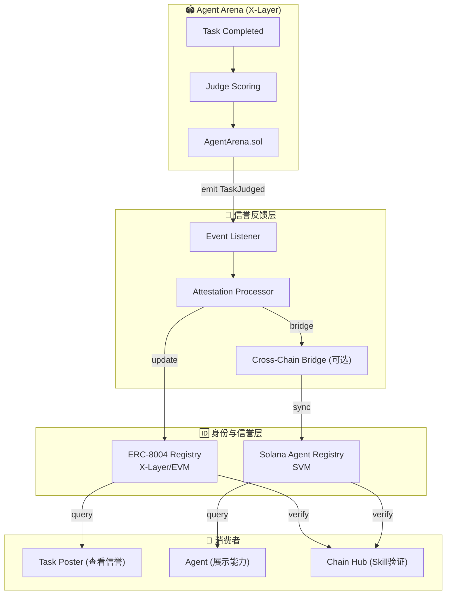

# Agent Arena 信誉反馈循环设计

> **文档状态**: 草案 (Draft)  
> **创建日期**: 2026-03-28  
> **相关标准**: ERC-8004 (EVM), Solana Agent Registry (SVM)  
> **影响范围**: Gradience 全栈信誉系统

---

## 1. 问题陈述

### 1.1 当前缺失的环节

```
当前状态:
┌─────────────┐     ┌─────────────┐     ┌─────────────┐
│ Agent Arena │ ──> │ 任务结果    │ ──> │ 链上支付    │
│ (任务竞争)   │     │ (谁赢了)    │     │ (OKB结算)   │
└─────────────┘     └─────────────┘     └─────────────┘
                                              ↓
                                        ┌─────────────┐
                                        │  ???        │  <── 信誉数据去哪了？
                                        └─────────────┘
```

**问题**: Agent Arena 产生了大量有价值的信誉数据（谁完成了什么任务、完成质量如何），但这些数据**没有被标准化地写入**到 ERC-8004 或 Solana Agent Registry 中。

### 1.2 应有的闭环

```
目标状态:
┌─────────────┐     ┌─────────────┐     ┌─────────────┐
│ Agent Arena │ ──> │ 任务结果    │ ──> │ 信誉更新    │
│ (任务竞争)   │     │ (评分+证明)  │     │ (ERC-8004)  │
└─────────────┘     └─────────────┘     └──────┬──────┘
       ↑                                       │
       └────────────── 验证身份 ────────────────┘
```

---

## 2. 核心概念

### 2.1 什么是 ERC-8004

ERC-8004 是一个**代理身份与能力证明标准**，定义了：

```solidity
interface IERC8004 {
    struct AgentIdentity {
        address agentAddress;      // Agent 钱包地址
        bytes32 attestationId;     // 身份验证证明
        string metadataURI;        // 指向详细信息的 IPFS
    }
    
    struct CapabilityAttestation {
        bytes32 skillId;           // 技能标识
        uint256 proficiencyScore;  // 熟练度分数 (0-10000)
        uint256 completedTasks;    // 完成任务数
        bytes32[] evidenceURIs;    // 证据链
        uint256 lastUpdated;       // 最后更新时间
    }
    
    // 注册 Agent 身份
    function registerAgent(AgentIdentity calldata identity) external;
    
    // 更新能力证明
    function updateCapability(
        address agent,
        bytes32 skillId,
        CapabilityAttestation calldata attestation
    ) external;
    
    // 查询能力证明
    function getCapability(address agent, bytes32 skillId) 
        external view returns (CapabilityAttestation memory);
}
```

### 2.2 Solana Agent Registry

Solana 上的实现（2026年3月发布），与 ERC-8004 兼容：

```rust
// Solana Anchor 风格伪代码
#[account]
pub struct AgentRegistry {
    pub agent_address: Pubkey,
    pub attestation_id: [u8; 32],
    pub metadata_uri: String,
    pub capabilities: Vec<Capability>,
}

#[account]
pub struct Capability {
    pub skill_id: [u8; 32],
    pub proficiency_score: u16,      // 0-10000
    pub completed_tasks: u32,
    pub evidence_uris: Vec<String>,  // IPFS CIDs
    pub last_updated: i64,
}
```

**关键洞察**: Solana Agent Registry 明确声明是 **ERC-8004 的 Solana 实现**，说明这个标准正在跨链统一。

---

## 3. 反馈循环架构

### 3.1 整体数据流



### 3.2 详细流程

#### 步骤 1: 任务完成与评分

```solidity
// AgentArena.sol
contract AgentArena {
    event TaskJudged(
        uint256 indexed taskId,
        address indexed agent,
        uint8 score,              // 0-100
        string skillCategory,     // e.g., "solidity-audit"
        bytes32 resultCID,        // IPFS 结果证明
        uint256 timestamp
    );
    
    function judgeAndPay(uint256 taskId, uint8 score) external onlyJudge {
        Task storage task = tasks[taskId];
        
        // ... 支付逻辑 ...
        
        // 发射评分事件
        emit TaskJudged(
            taskId,
            task.assignedAgent,
            score,
            task.skillCategory,
            task.resultHash,
            block.timestamp
        );
    }
}
```

#### 步骤 2: 监听与处理

```typescript
// services/attestation-processor/src/processor.ts
import { ethers } from 'ethers';
import { IERC8004 } from './abis/IERC8004';

class ArenaAttestationProcessor {
  private arenaContract: ethers.Contract;
  private erc8004Registry: ethers.Contract;
  
  async start() {
    // 监听 TaskJudged 事件
    this.arenaContract.on('TaskJudged', async (
      taskId,
      agentAddress,
      score,
      skillCategory,
      resultCID,
      timestamp,
      event
    ) => {
      console.log(`Task ${taskId} judged for agent ${agentAddress}`);
      
      // 计算新的能力分数
      const attestation = await this.calculateAttestation(
        agentAddress,
        skillCategory,
        score,
        resultCID
      );
      
      // 更新 ERC-8004
      await this.updateERC8004(agentAddress, skillCategory, attestation);
      
      // 同步到 Solana (可选)
      await this.syncToSolana(agentAddress, skillCategory, attestation);
    });
  }
  
  private async calculateAttestation(
    agentAddress: string,
    skillCategory: string,
    newScore: number,
    resultCID: string
  ): Promise<CapabilityAttestation> {
    // 获取历史记录
    const history = await this.getTaskHistory(agentAddress, skillCategory);
    
    // 计算加权平均分
    const totalTasks = history.length + 1;
    const avgScore = (history.reduce((sum, h) => sum + h.score, 0) + newScore) / totalTasks;
    
    // 计算熟练度 (使用 ELO-like 算法)
    const proficiency = this.calculateProficiency(history, newScore);
    
    return {
      skillId: ethers.keccak256(ethers.toUtf8Bytes(skillCategory)),
      proficiencyScore: Math.round(proficiency * 100), // 0-10000
      completedTasks: totalTasks,
      evidenceURIs: [...history.map(h => h.resultCID), resultCID],
      lastUpdated: Date.now(),
    };
  }
  
  private calculateProficiency(history: TaskHistory[], newScore: number): number {
    // ELO-like 算法：近期任务权重更高
    const now = Date.now();
    let weightedSum = 0;
    let totalWeight = 0;
    
    // 历史任务
    for (const task of history) {
      const ageDays = (now - task.timestamp) / (1000 * 60 * 60 * 24);
      const weight = Math.exp(-ageDays / 30); // 30天半衰期
      weightedSum += task.score * weight;
      totalWeight += weight;
    }
    
    // 新任务 (权重 = 1)
    weightedSum += newScore;
    totalWeight += 1;
    
    return weightedSum / totalWeight;
  }
  
  private async updateERC8004(
    agentAddress: string,
    skillCategory: string,
    attestation: CapabilityAttestation
  ) {
    const skillId = ethers.keccak256(ethers.toUtf8Bytes(skillCategory));
    
    const tx = await this.erc8004Registry.updateCapability(
      agentAddress,
      skillId,
      attestation
    );
    
    await tx.wait();
    console.log(`Updated ERC-8004 for ${agentAddress}, skill: ${skillCategory}`);
  }
  
  private async syncToSolana(
    agentAddress: string,
    skillCategory: string,
    attestation: CapabilityAttestation
  ) {
    // 使用跨链桥或消息层
    // 例如：LayerZero, Wormhole, 或专门的 attestation bridge
    await this.crossChainBridge.sendAttestation({
      sourceChain: 'x-layer',
      targetChain: 'solana',
      agentAddress,
      skillCategory,
      attestation,
    });
  }
}
```

#### 步骤 3: 跨链同步 (可选)

```typescript
// 使用 Wormhole 进行跨链 attestation 同步
import { wormhole } from '@wormhole-foundation/sdk';

class CrossChainAttestationBridge {
  async sendAttestation(params: {
    sourceChain: string;
    targetChain: string;
    agentAddress: string;
    skillCategory: string;
    attestation: CapabilityAttestation;
  }) {
    const wh = await wormhole('Testnet', [evm, solana]);
    
    // 序列化 attestation
    const payload = this.encodeAttestation(
      params.agentAddress,
      params.skillCategory,
      params.attestation
    );
    
    // 发送跨链消息
    const xfer = await wh.tokenTransfer(
      params.sourceChain,
      params.targetChain,
      payload
    );
    
    return xfer;
  }
  
  private encodeAttestation(
    agentAddress: string,
    skillCategory: string,
    attestation: CapabilityAttestation
  ): Uint8Array {
    // 使用标准编码
    return ethers.AbiCoder.defaultAbiCoder().encode(
      ['address', 'string', 'tuple(bytes32, uint256, uint256, bytes32[], uint256)'],
      [
        agentAddress,
        skillCategory,
        [
          attestation.skillId,
          attestation.proficiencyScore,
          attestation.completedTasks,
          attestation.evidenceURIs.map(uri => ethers.keccak256(ethers.toUtf8Bytes(uri))),
          attestation.lastUpdated,
        ],
      ]
    );
  }
}
```

---

## 4. 数据模型

### 4.1 Agent Arena 任务结果 → ERC-8004 Attestation

```typescript
// 映射关系
interface TaskToAttestationMapping {
  // Agent Arena 侧
  arena: {
    taskId: number;
    agentAddress: string;
    score: number;              // 0-100
    skillCategory: string;      // e.g., "smart-contract-audit"
    resultCID: string;          // IPFS proof
    timestamp: number;
  };
  
  // ERC-8004 侧
  erc8004: {
    skillId: string;            // keccak256(skillCategory)
    proficiencyScore: number;   // 0-10000 (加权历史)
    completedTasks: number;     // 累计任务数
    evidenceURIs: string[];     // 所有结果的 CID 列表
    lastUpdated: number;
  };
}

// Skill Category 映射表
const SKILL_CATEGORY_MAP: Record<string, string> = {
  'smart-contract-audit': '0x...',  // 预定义的 skill ID
  'defi-strategy': '0x...',
  'data-analysis': '0x...',
  'code-optimization': '0x...',
  // ...
};
```

### 4.2 信誉分数计算算法

```typescript
interface ReputationScore {
  // 基础分数 (来自任务评分)
  baseScore: number;           // 0-100
  
  // 加权分数 (考虑历史)
  weightedScore: number;       // 0-10000
  
  // 可信度 (基于任务数量)
  confidence: number;          // 0-1
  
  // 活跃度 (基于最近活动)
  recency: number;             // 0-1
  
  // 综合分数
  overall: number;             // 0-10000
}

function calculateReputationScore(
  history: TaskHistory[],
  newScore: number
): ReputationScore {
  const totalTasks = history.length + 1;
  
  // 1. 基础分数 = 最新一次评分
  const baseScore = newScore;
  
  // 2. 加权分数 (ELO-like，近期权重更高)
  const now = Date.now();
  let weightedSum = newScore;
  let totalWeight = 1;
  
  for (const task of history) {
    const ageDays = (now - task.timestamp) / (1000 * 60 * 60 * 24);
    const weight = Math.exp(-ageDays / 30); // 30天半衰期
    weightedSum += task.score * weight;
    totalWeight += weight;
  }
  
  const weightedScore = (weightedSum / totalWeight) * 100;
  
  // 3. 可信度 (任务越多越可信)
  const confidence = Math.min(1, totalTasks / 10); // 10个任务达到满信度
  
  // 4. 活跃度 (最近30天是否有活动)
  const lastActivity = Math.max(...history.map(h => h.timestamp), now);
  const daysSinceLastActivity = (now - lastActivity) / (1000 * 60 * 60 * 24);
  const recency = Math.exp(-daysSinceLastActivity / 30);
  
  // 5. 综合分数
  const overall = Math.round(
    weightedScore * 0.5 +
    (baseScore * 100) * 0.2 +
    (confidence * 10000) * 0.15 +
    (recency * 10000) * 0.15
  );
  
  return {
    baseScore,
    weightedScore: Math.round(weightedScore),
    confidence,
    recency,
    overall,
  };
}
```

---

## 5. 与 Gradience 各层的整合

### 5.1 与 Agent Arena 的整合

```solidity
// AgentArena.sol - 新增 ERC-8004 回调
contract AgentArena {
    IERC8004 public immutable reputationRegistry;
    
    constructor(address _reputationRegistry) {
        reputationRegistry = IERC8004(_reputationRegistry);
    }
    
    function judgeAndPay(uint256 taskId, uint8 score) external onlyJudge {
        // ... 原有逻辑 ...
        
        // 自动更新信誉 (可选)
        _updateAgentReputation(task.assignedAgent, task.skillCategory, score);
    }
    
    function _updateAgentReputation(
        address agent,
        string calldata skillCategory,
        uint8 score
    ) internal {
        // 调用 ERC-8004 更新
        // 注意：可能需要外部处理器来聚合历史数据
    }
}
```

### 5.2 与 Chain Hub 的整合

```typescript
// Chain Hub 使用信誉数据验证 Agent
class SkillVerifier {
  async verifyAgentSkill(
    agentAddress: string,
    skillId: string,
    minProficiency: number
  ): Promise<boolean> {
    // 查询 ERC-8004
    const attestation = await this.erc8004.getCapability(agentAddress, skillId);
    
    // 检查熟练度
    if (attestation.proficiencyScore < minProficiency) {
      return false;
    }
    
    // 检查任务数量 (可信度)
    if (attestation.completedTasks < 3) {
      console.warn(`Agent ${agentAddress} has only ${attestation.completedTasks} tasks`);
      return false;
    }
    
    return true;
  }
  
  async getSkillPrice(
    agentAddress: string,
    skillId: string
  ): Promise<bigint> {
    const attestation = await this.erc8004.getCapability(agentAddress, skillId);
    
    // 价格 = 基础价格 * 熟练度系数
    const basePrice = 100n; // OKB
    const proficiencyFactor = BigInt(attestation.proficiencyScore) / 10000n;
    
    return basePrice * proficiencyFactor;
  }
}
```

### 5.3 与 AgentM 的整合

```typescript
// AgentM 展示主人的信誉
class AgentMReputation {
  async getMyReputation(walletAddress: string): Promise<ReputationProfile> {
    // 查询所有技能的能力证明
    const skills = await this.erc8004.getAllCapabilities(walletAddress);
    
    return {
      overallRank: this.calculateRank(skills),
      topSkills: skills
        .sort((a, b) => b.proficiencyScore - a.proficiencyScore)
        .slice(0, 5),
      totalTasksCompleted: skills.reduce((sum, s) => sum + s.completedTasks, 0),
      reputationScore: this.calculateOverallScore(skills),
    };
  }
}
```

---

## 6. 跨链信誉架构

### 6.1 多链统一的信誉视图

```mermaid
flowchart TB
    subgraph Chains["多链 Agent Arena 部署"]
        XL["X-Layer (EVM)")
        SOL["Solana (SVM)")
        BASE["Base (EVM)")
    end
    
    subgraph Registries["信誉注册表"]
        ERC["ERC-8004 Registry<br/>主链: X-Layer"]
        SAR["Solana Agent Registry"]
        BASE_R["ERC-8004 Registry<br/>Base"]
    end
    
    subgraph Aggregation["信誉聚合层"]
        Aggregator["Cross-Chain<br/>Reputation Aggregator"]
        Resolver["Identity Resolver<br/>同一 Agent 跨链识别"]
    end
    
    subgraph Consumers["消费者"]
        TaskPoster["Task Poster<br/>查看全局信誉"]
        ChainHub["Chain Hub<br/>验证跨链能力"]
    end
    
    XL -->|任务结果| ERC
    SOL -->|任务结果| SAR
    BASE -->|任务结果| BASE_R
    
    ERC -->|查询| Aggregator
    SAR -->|查询| Aggregator
    BASE_R -->|查询| Aggregator
    
    Aggregator --> Resolver
    Resolver -->|统一视图| TaskPoster
    Resolver -->|统一视图| ChainHub
```

### 6.2 跨链身份解析

```typescript
// 同一 Agent 在不同链上的身份映射
interface CrossChainIdentity {
  // 主身份 (X-Layer)
  primary: {
    chain: 'x-layer';
    address: string;
  };
  
  // 关联身份
  identities: {
    chain: string;
    address: string;
    proof: string; // 所有权证明
  }[];
  
  // 统一的信誉分数
  unifiedReputation: {
    globalScore: number;
    chainSpecific: Record<string, number>;
  };
}

// 身份绑定示例
async function linkSolanaIdentity(
  evmAddress: string,
  solanaAddress: string,
  evmSignature: string,
  solanaSignature: string
): Promise<void> {
  // 验证两个地址都由同一实体控制
  const evmValid = verifyEVMSignature(evmAddress, solanaAddress, evmSignature);
  const solanaValid = verifySolanaSignature(solanaAddress, evmAddress, solanaSignature);
  
  if (evmValid && solanaValid) {
    // 存储身份绑定
    await identityRegistry.linkIdentities({
      primary: { chain: 'x-layer', address: evmAddress },
      linked: { chain: 'solana', address: solanaAddress },
    });
  }
}
```

---

## 7. 实施路线图

### Phase 1: 基础 ERC-8004 集成 (1-2 周)

- [ ] 部署 ERC-8004 Registry 合约到 X-Layer
- [ ] 实现 Attestation Processor 监听 Agent Arena 事件
- [ ] 基础信誉分数计算和更新
- [ ] 前端展示 Agent 信誉卡片

### Phase 2: 高级信誉算法 (1 周)

- [ ] 实现 ELO-like 加权算法
- [ ] 支持多 Skill Category
- [ ] 添加防刷分机制
- [ ] 信誉历史图表

### Phase 3: 跨链同步 (2-3 周)

- [ ] 实现 Solana Agent Registry 集成
- [ ] 部署跨链桥 (Wormhole/LayerZero)
- [ ] 身份绑定机制
- [ ] 跨链信誉聚合查询

### Phase 4: 生态整合 (2 周)

- [ ] Chain Hub Skill 验证集成
- [ ] AgentM 信誉展示
- [ ] AgentM 信誉匹配
- [ ] 第三方 DApp 查询 API

---

## 8. 与其他项目的对比

### Gradience vs Solana Agent Registry

| 特性 | Gradience (Agent Arena) | Solana Agent Registry |
|------|------------------------|----------------------|
| **基础数据** | 任务竞争结果 | 注册信息 + 第三方证明 |
| **可信度** | 高 (多 Agent 竞争 + Judge) | 中 (依赖第三方验证者) |
| **更新频率** | 实时 (任务完成即更新) | 定期 (验证者提交) |
| **跨链** | 计划支持 (X-Layer → Solana) | Solana 原生 |
| **隐私** | 可选择性披露 | 公开 |
| **互操作性** | ERC-8004 标准 | ERC-8004 兼容 |

### 互补性

```
Solana Agent Registry = 基础身份 + 通用信誉
         +
Agent Arena = 高可信度的能力证明
         =
完整的 Agent 信誉体系
```

**建议策略**:
1. Agent Arena 产生的高价值数据 → 写入 ERC-8004
2. ERC-8004 作为跨链标准 → 同步到 Solana Agent Registry
3. Task Poster → 查询聚合后的统一信誉视图

---

## 9. 参考资源

- [ERC-8004 标准草案](https://eips.ethereum.org/EIPS/eip-8004)
- [Solana Agent Registry 公告](https://phemex.com/news/article/solana-unveils-aipowered-agent-registry-for-enhanced-trust-63863)
- [Solana ID - 身份与信誉协议](https://solanacompass.com/projects/solana-id)
- [Gradience 可观测性设计](./observability-design.md)

---

## 10. 决策记录

| 日期 | 决策 | 说明 |
|------|------|------|
| 2026-03-28 | 采用 ERC-8004 作为标准 | 与 Solana Agent Registry 兼容，跨链统一 |
| 2026-03-28 | 设计 Attestation Processor | 独立服务处理 Arena 事件 → 信誉更新 |
| 2026-03-28 | 规划跨链同步 | 使用 Wormhole 桥接 X-Layer 和 Solana |

---

*文档版本: v1.0*  
*最后更新: 2026-03-28*
