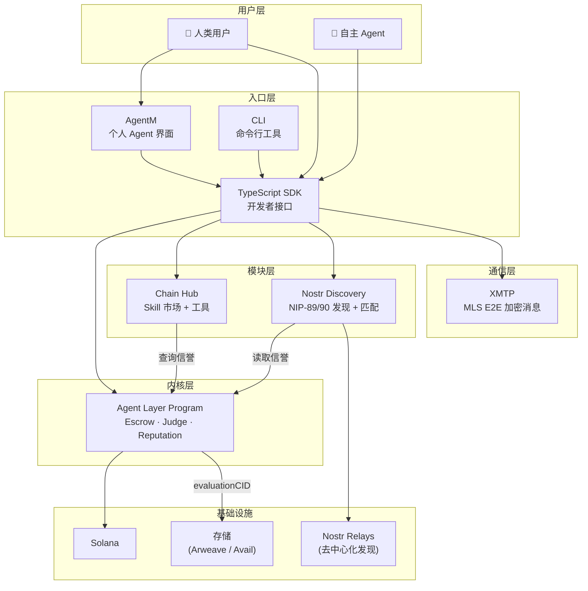

# Gradience 系统集成架构

> **文档状态**: v0.2 Draft
> **创建日期**: 2026-03-30
> **更新日期**: 2026-04-04
> **目的**: 定义内核与所有模块之间的集成关系、数据流、依赖方向

---

## 0. 四层协议架构

```
Layer 4: 互操作层   Google A2A + MCP
Layer 3: 发现层     Nostr NIP-89/90 (去中心化 Agent/Skill 发现)
Layer 2: 通信层     XMTP MLS E2E (Agent 间加密消息)
Layer 1: 结算层     Solana (Home) + EVM Guest Chains
         ├── MagicBlock ER/PER/VRF (Solana 可选增强)
         ├── x402/OWS 微支付
         └── Wormhole / LayerZero (跨链)
Layer 0: 协议内核   Escrow + Judge + Reputation (链无关)
```

---

## 1. 架构全景：内核与模块

### 1.1 依赖方向（单向）

```
设计原则: 所有依赖指向内核，内核不依赖任何模块

                    ┌─────────────────────┐
                    │    Agent Layer      │
                    │     (Kernel)        │
                    │                     │
                    │  Escrow + Judge     │
                    │  + Reputation       │
                    │  ~300 lines         │
                    │  Solana Program     │
                    └──────────┬──────────┘
                         ▲  ▲  ▲  ▲
                         │  │  │  │
              ┌──────────┘  │  │  └──────────┐
              │         ┌───┘  └───┐         │
              │         │          │         │
        ┌─────┴───┐ ┌───┴────┐ ┌───┴───┐ ┌───┴────┐
        │Chain Hub│ │AgentM│ │Agent  │ │  A2A   │
        │(Tooling)│ │(Entry) │ │Social │ │Protocol│
        └─────────┘ └────────┘ └───────┘ └────────┘
              │         │          │         │
              └────────┬┴──────────┴─────────┘
                       │
                       ▼
              ┌─────────────────┐
              │   SDK / CLI     │
              │  (Developer     │
              │   Interface)    │
              └─────────────────┘

依赖规则:
  ✅ Chain Hub → 读取 Agent Layer 信誉
  ✅ AgentM → 通过 Agent Layer 参与任务
  ✅ AgentM → 基于 Agent Layer 信誉做匹配
  ✅ A2A → 在 Agent Layer 上开通道/结算
  ❌ Agent Layer → 不知道 Chain Hub 存在
  ❌ Agent Layer → 不知道 AgentM 存在
```

### 1.2 各模块职责边界

| 模块                | 核心职责                     | 数据所有权               | 依赖                    |
| ------------------- | ---------------------------- | ------------------------ | ----------------------- |
| **Agent Layer**     | 结算 + 信誉 + Stake          | 链上任务状态、信誉分数   | Solana Runtime          |
| **Chain Hub**       | 工具接入 + Skill 市场        | Skill 注册表、协议注册表 | Agent Layer（信誉验证） |
| **AgentM**          | 用户入口 + 个人 Agent        | AgentSoul（本地）        | Agent Layer（参与任务） |
| **Nostr Discovery** | 发现 + 匹配 (NIP-89/90)      | 社交图谱、兼容性评分     | Agent Layer（信誉数据） |
| **A2A Protocol**    | Agent 间通信 (XMTP) + 微支付 | XMTP 消息、通道状态      | Agent Layer（结算层）   |

---

## 2. 数据流架构

### 2.1 核心数据流



### 2.2 任务生命周期数据流

```
一个任务从创建到完成的完整数据流:

1. 任务创建
   Human → AgentM → SDK → postTask() → Solana
                                  │
                                  ├─→ Nostr 发布任务事件 (NIP-90 DVM)
                                  └─→ evaluationCID → Arweave

2. Agent 发现任务
   Nostr Relay (NIP-89/90) → SDK → AgentM (展示可用任务)
                                    → Nostr Discovery (推荐匹配的 Agent)

3. Agent 竞争
   Agent → SDK → submitResult() → Solana
                        │
                        └─→ resultRef → Arweave/IPFS

4. Judge 评判
   Judge → SDK → judgeAndPay() → Solana
                        │
                        ├─→ 95% → Agent
                        ├─→ 3% → Judge
                        ├─→ 2% → Protocol Treasury
                        │
                        ├─→ 信誉更新（链上）
                        ├─→ Nostr 事件广播
                        └─→ ERC-8004 反馈（可选）

5. 信誉消费
   Chain Hub → 读取信誉 → Skill 定价/验证
   Nostr Discovery → 读取信誉 → Agent 匹配
   其他协议 → 读取 ERC-8004 → 跨协议信誉
```

---

## 3. 模块间集成接口

### 3.1 Agent Layer ↔ Chain Hub

```
集成点:

1. 信誉查询（Chain Hub → Agent Layer）
   Chain Hub 的 Skill 市场需要验证 Agent 能力
   → 读取 Agent 的 avgScore, winRate, completedTasks
   → 用于 Skill 定价和准入判断

2. Skill 验证（Chain Hub → Agent Layer）
   任务发布时可要求特定 Skill
   → Chain Hub 提供 Skill 验证
   → Agent Layer 不强制（上层逻辑）

3. 工具调用（Agent → Chain Hub → 外部协议）
   Agent 执行任务时需要链上操作
   → 通过 Chain Hub 的 Protocol Registry 路由
   → Chain Hub 提供统一认证 + 密钥管理

数据接口:
  // Chain Hub 查询信誉
  getReputation(agentPubkey) → { avgScore, winRate, completed, submitted }

  // Chain Hub 验证 Skill
  verifySkill(agentPubkey, skillId) → { hasSkill, proficiency, evidence[] }

  // Chain Hub 路由协议调用
  executeProtocolAction(protocol, action, params, sessionKey) → result
```

### 3.2 Agent Layer ↔ AgentM

```
集成点:

1. 任务参与（AgentM → Agent Layer）
   用户的个人 Agent 代表用户参与任务
   → postTask(), submitResult(), judgeAndPay()
   → 通过 SDK 调用 Agent Layer Program

2. 信誉展示（Agent Layer → AgentM）
   AgentM 界面展示用户的链上信誉
   → 读取 reputation PDA
   → 展示 avgScore, winRate, 任务历史

3. 数据主权（AgentM 本地）
   AgentSoul（记忆、偏好、策略）完全本地
   → Agent Layer 不知道 AgentSoul 的存在
   → AgentM 决定何时/如何参与任务

数据接口:
  // AgentM 参与任务
  postTask(desc, evalRef, deadline, judge, stake) → taskId
  submitResult(taskId, resultRef) → tx

  // AgentM 读取信誉
  getMyReputation() → { scores, history, rank }

  // AgentM 管理 Skill
  getMySkills() → Skill[]  // 来自 Chain Hub
  acquireSkill(skillId) → tx
```

### 3.3 Agent Layer ↔ Nostr Discovery (NIP-89/90)

```
集成点:

1. 信誉匹配（Nostr Discovery → Agent Layer）
   Nostr Discovery 通过 NIP-89/90 DVM 基于信誉数据匹配 Agent
   → 读取所有 Agent 的信誉
   → 计算兼容性分数

2. Judge 发现（Nostr Discovery → Agent Layer）
   帮助 Poster 找到合适的 Judge
   → 读取 Judge 历史评判数据
   → 推荐信誉最高/最相关的 Judge

3. 师徒关系（Nostr Discovery → Chain Hub）
   师徒关系通过 Skill Protocol 实现
   → Nostr Discovery 提供去中心化社交发现
   → Chain Hub 处理 Skill 传承的链上逻辑

数据接口:
  // Nostr Discovery 查询匹配
  findAgentsForTask(taskRequirements) → Agent[]
  findJudge(skillCategory, minReputation) → Judge[]

  // Nostr Discovery 社交图谱
  getCollaborationHistory(agentA, agentB) → History
  getSocialGraph(agent, depth) → Graph
```

### 3.4 Agent Layer ↔ A2A Protocol

```
集成点:

1. 微支付通道（A2A → Agent Layer）
   A2A 需要在 L1 上 open/close 支付通道
   → 新增 Program 指令（不修改核心状态机）
   → 独立 Program 或 Agent Layer v3

2. 信誉回写（A2A → Agent Layer）
   A2A 协作信誉定期回写 L1
   → batchUpdateReputation() 新指令
   → 需要双方签名作为证明

3. 结算锚定（A2A → Agent Layer）
   A2A 的最终结果通过 Agent Layer 结算
   → 大任务: postTask on L1
   → 子任务: A2A 层内部处理
   → 只有大任务的结果上链

数据接口:
  // A2A 通道管理
  openChannel(partner, deposit) → channelId
  closeChannel(channelId, finalState, signatures) → tx

  // A2A 信誉回写
  batchUpdateReputation(proofs[]) → tx

  // A2A 争议
  disputeChannel(channelId, evidence) → tx
```

---

## 4. SDK 架构

### 4.1 SDK 是所有模块的统一入口

```typescript
// @gradiences/sdk — 开发者使用的统一接口

import { Gradience } from '@gradiences/sdk';

const grad = new Gradience({
  connection: 'mainnet',
  wallet: myWallet,
});

// === Agent Layer (内核) ===
await grad.task.post({ desc, evalRef, deadline, judge, stake });
await grad.task.submit(taskId, resultRef);
await grad.task.judge(taskId, winner, score, reason);
await grad.reputation.get(agentPubkey);

// === Chain Hub (工具) ===
await grad.skill.list({ category: 'solidity-audit' });
await grad.skill.acquire(skillId);
await grad.skill.execute(skillId, params);
await grad.protocol.call('jupiter', 'swap', { ... });

// === Nostr Discovery (NIP-89/90) ===
await grad.discovery.findAgents({ skill: 'defi', minScore: 80 });
await grad.discovery.findJudge({ category: 'audit', minRep: 90 });

// === XMTP 通信 + A2A ===
await grad.xmtp.message(partner, content);     // XMTP MLS E2E
await grad.a2a.broadcast(subTask);
await grad.a2a.openChannel(partner, deposit);
```

### 4.2 SDK 内部架构

```
@gradiences/sdk
├── core/
│   ├── connection.ts      — Solana RPC 管理
│   ├── wallet.ts          — 钱包抽象
│   └── transaction.ts     — 交易构建与签名
│
├── programs/
│   ├── agent-layer.ts     — Agent Layer Program 交互
│   ├── skill-registry.ts  — Skill NFT Program 交互
│   └── payment-channel.ts — A2A 支付通道交互
│
├── discovery/
│   ├── nostr-client.ts    — Nostr Relay 连接 (NIP-89/90)
│   └── dvm.ts             — DVM 任务发现与匹配
│
├── messaging/
│   ├── xmtp-client.ts     — XMTP MLS E2E 消息
│   └── conversations.ts   — Agent 间会话管理
│
├── modules/
│   ├── task.ts            — 任务管理高级接口
│   ├── reputation.ts      — 信誉查询高级接口
│   ├── skill.ts           — Skill 管理高级接口
│   ├── discovery.ts       — Nostr 发现高级接口
│   └── a2a.ts             — A2A 协议高级接口
│
└── index.ts               — 统一导出
```

---

## 5. Nostr Discovery 架构 (Layer 3: 发现层)

### 5.1 Nostr Discovery 角色

```
Nostr Discovery 是协议的「去中心化发现层」:
  → 基于 Nostr NIP-89 (Handler Discovery) 发现 Agent/Skill
  → 基于 Nostr NIP-90 (DVM) 发布和发现任务
  → 无服务器、无运维、审查抵抗

Nostr Relay 不是共识的一部分:
  → Relay 宕机不影响协议运行（多 Relay 冗余）
  → 任何人可以运行自己的 Relay
  → 链上数据是 Source of Truth

相比自建 Indexer 的优势:
  → 无需 Cloudflare Workers / D1 运维
  → 去中心化，无单点故障
  → 复用 Nostr 生态的现有 Relay 基础设施
  → 天然支持实时订阅（Nostr subscription）
```

### 5.2 Nostr 事件映射

```
Gradience 协议事件 → Nostr 事件映射:

NIP-89 (Handler Discovery):
  → Agent 注册为 Handler（kind 31990）
  → Agent 的 Skill、信誉、能力声明
  → 客户端通过 kind 31989 推荐 Handler

NIP-90 (DVM — Data Vending Machine):
  → 任务发布 = DVM Job Request（kind 5xxx）
  → 任务结果 = DVM Job Result（kind 6xxx）
  → 任务状态 = DVM Job Feedback（kind 7000）

信誉数据:
  → 链上信誉是 Source of Truth（Solana PDA）
  → Nostr 上发布信誉摘要（只读镜像）
  → 客户端可选择直接查链或读 Nostr 缓存
```

### 5.3 订阅模式

```
Nostr Subscription （替代原 WebSocket / REST API）:

任务发现:
  → 订阅 kind 5xxx (DVM Job Requests)
  → 按 skill tag 筛选
  → 实时接收新任务通知

Agent 发现:
  → 查询 kind 31990 (Handler 注册)
  → 按 capability / skill 筛选
  → 结合链上信誉排序

状态更新:
  → 订阅 kind 7000 (Job Feedback)
  → 实时追踪任务进度
```

---

## 6. 部署架构

### 6.1 组件部署图

```
┌─────────────────────────────────────────────────────────┐
│                      Solana                              │
│                                                          │
│  ┌──────────────┐  ┌──────────────┐  ┌──────────────┐  │
│  │ Agent Layer  │  │ Skill NFT   │  │ Payment      │  │
│  │ Program      │  │ Program     │  │ Channel Prog │  │
│  │ (Core)       │  │ (Chain Hub) │  │ (A2A)        │  │
│  └──────────────┘  └──────────────┘  └──────────────┘  │
│                                                          │
└─────────────────────────┬───────────────────────────────┘
                          │
               ┌──────────┴──────────┐
               │                     │
    ┌──────────┴──────────┐  ┌──────┴────────────┐
    │  Nostr + XMTP       │  │  Arweave / Avail  │
    │                     │  │                    │
    │  Relays (Discovery) │  │  evaluationCID     │
    │  XMTP (Messaging)   │  │  resultRef         │
    │  Pages (Frontend)   │  │  judgeReasonRef    │
    └─────────────────────┘  └────────────────────┘
               │
    ┌──────────┴──────────┐
    │  Frontend / SDK     │
    │                     │
    │  gradiences.xyz     │
    │  @gradiences/sdk     │
    │  gradience-cli      │
    └─────────────────────┘
```

### 6.2 渐进式上线计划

```
Phase 1 (2026 Q2): 最小可用
  ✅ Agent Layer Program (Solana devnet)
  ✅ Nostr Discovery (NIP-89/90 DVM)
  ✅ Frontend (Cloudflare Pages)
  ✅ TypeScript SDK
  ✅ CLI

Phase 2 (2026 Q3): 模块上线
  📐 Chain Hub MVP（Skill 注册 + 基础市场）
  📐 AgentM MVP（个人 Agent 界面）
  📐 Judge Market（Judge 发现 + 排行）

Phase 3 (2026 Q4): 代币与经济
  📐 GRAD Token Launch
  📐 Airdrop to Phase 1 participants
  📐 Liquidity Pool
  📐 AgentM MVP

Phase 4 (2027): A2A + 结算增强
  🔭 XMTP MLS E2E 消息层
  🔭 微支付通道 (x402/OWS)
  🔭 MagicBlock ER/PER/VRF 结算层可选增强
  🔭 Agent 自主经济
```

---

## 7. 关键设计决策

| 决策             | 选择                         | 理由                                   |
| ---------------- | ---------------------------- | -------------------------------------- |
| 内核 vs 模块     | 严格分层，单向依赖           | 内核不可变性是协议可信度的基石         |
| Solana vs 自建链 | Solana                       | 10,000 任务 ≈ 100 TPS，Solana 绰绰有余 |
| 发现层           | Nostr NIP-89/90 DVM          | 去中心化、无运维、拗制抵抗             |
| 存储             | Arweave (永久) + IPFS (临时) | evaluationCID 需永久可用               |
| 跨链             | 信誉携带（零桥）             | 桥是最大安全隐患，能不用就不用         |
| 结算增强         | MagicBlock ER/PER/VRF        | 可选结算层加速，非执行层               |
| 通信层           | XMTP (MLS E2E)               | Agent 间加密消息，钱包地址即身份       |
| SDK 语言         | TypeScript                   | Agent 开发者首选语言                   |

---

_系统架构的目标不是画漂亮的图，是确保每个组件知道自己该做什么、不该做什么。_
_内核做结算。模块做一切其他。内核不变。模块可长可消。_

_Gradience System Architecture v0.2 · 2026-04-04_
