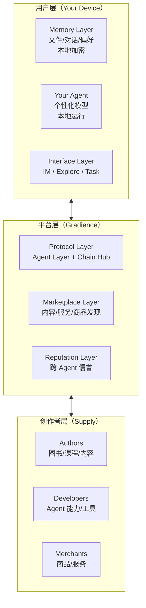

# Gradience 战略研究：从协议到平台

> **研究主题**: Agent Native 平台的机会与路径  
> **日期**: 2026-04-03  
> **状态**: 🟡 进行中  
> **相关文档**: [竞品分析](./competitor-analysis-positioning.md), [贪心算法哲学](./greedy-algorithm-design-philosophy.md)

---

## 目录

1. [Synthesis 黑客松竞品深度分析](#1-synthesis-黑客松竞品深度分析)
2. [感性创业哲学](#2-感性创业哲学)
3. [Agent.im 的"抖音化"愿景](#3-agentim-的抖音化愿景)
4. [Agent Native 平台架构](#4-agent-native-平台架构)
5. [Memory 基础设施与商业模式](#5-memory-基础设施与商业模式)
6. [实施路线图](#6-实施路线图)

---

## 1. Synthesis 黑客松竞品深度分析

### 1.1 核心发现

通过对 [Synthesis 黑客松](https://synthesis.md) 获奖项目的深度调研，识别出声誉协议赛道的关键竞争者。

#### 🏆 主要竞争对手

| 项目                | 链           | 核心机制          | 规模              | 与 Gradience 关系 |
| ------------------- | ------------ | ----------------- | ----------------- | ----------------- |
| **Universal Trust** | LUKSO        | 社交背书网络      | 主网上线          | ⚠️ 直接竞争       |
| **Helixa**          | Base         | 多维度算法评估    | 69K+ Agent 已评分 | 🔴 最强对手       |
| **SentinelNet**     | Base         | 5维贝叶斯监控评级 | 585 个分数        | ⚠️ 部分重叠       |
| **Maiat**           | Base         | 交易场景信用      | 开发中            | 🟡 场景不同       |
| **TrustAgent**      | Base Sepolia | 背书+委托         | 测试网            | 🟡 机制相似       |

#### 1.2 Helixa 深度分析（最强对手）

**核心机制:**

- **Cred Score**: 0-100 多维声誉评分（5 个等级 Junk→Preferred）
- **信任评估管道**: 单 API 返回 6 个系统数据聚合
- **Soul Vault**: 版本化灵魂锁定（git commits for the soul）
- **双代币支付**: USDC 全价 / $CRED 代币 8 折

**与 Gradience 的差异化:**

| 维度     | Helixa                           | Gradience              |
| -------- | -------------------------------- | ---------------------- |
| 声誉来源 | 算法聚合（交易历史+社交+AI评估） | 市场对战（Battle结果） |
| 评估方式 | 中心化算法                       | 去中心化市场自动评判   |
| 经济模型 | 支付折扣激励                     | 声誉借贷+gUSD          |
| 跨链     | ✅ 已支持 Solana                 | 计划中 (W4)            |
| 规模     | 69K+ Agent                       | 未上线                 |

**关键洞察:**

> Helixa 是"算出来的"声誉（算法评估），Gradience 是"挣来的"声誉（市场验证）。

#### 1.3 竞争格局总结

```
声誉协议赛道
├── 社交背书模式（Universal Trust）— 可刷分，弱防女巫
├── 算法评估模式（Helixa）— 中心化，黑盒算法 ⭐ 主流
├── 监控评级模式（SentinelNet）— 被动，防御性
└── 市场验证模式（Gradience）— 主动对战，客观结果 ⭐ 差异化
```

**我们的机会:**

- 背书模式 = 主观社交图谱
- 算法模式 = 黑盒计算
- 监控模式 = 事后评级
- **对战模式 = 实战证明**（最客观，最难操纵）

---

## 2. 感性创业哲学

### 2.1 理性 vs 感性创业

**字节跳动（理性创业巅峰）:**

```
算法驱动 + 数据验证 + A/B测试
├── 推荐算法：数学最优解
├── 增长黑客：可量化留存/转化
└── 结果：效率极致，但"没有灵魂"
```

**Gradience（感性创业机会）:**

```
牵念 + 关系 + 涌现
├── 不是算法推荐，而是"我想念这个 Agent"
├── 不是数据最优，而是"我和它有故事"
└── 目标：成为新时代的"情感基础设施"
```

### 2.2 "贪心算法"作为产品哲学

**核心洞察:**

> 用"贪心算法"的后台效率（立即满足），叠加"关系成长"的情感设计。

**用户体验公式:**

```
先理性：用得爽（立即满足）
    ↓
后感性：离不开（情感连接）
```

**对比竞品:**

| 维度            | 竞品            | Gradience              |
| --------------- | --------------- | ---------------------- |
| Universal Trust | 复杂 LUKSO 流程 | 立即发任务，立即有结果 |
| Helixa          | 理解 Cred Score | Agent 成长可见         |
| 本质            | 工具属性        | **陪伴属性**           |

---

## 3. Agent.im 的"抖音化"愿景

### 3.1 从工具到伴侣到平台

```
阶段一：工具（现在）
Agent Me = 帮你做任务
关系：雇佣关系

阶段二：伴侣（6-12个月）
Agent Me = 懂你的助手
关系：伙伴关系

阶段三：平台（1-2年）
Agent Me = 你的数字镜像 + 内容入口
关系：自我延伸
```

### 3.2 文件即灵魂

**用户 OpenCloud 空间的内容 = 完整的"数字灵魂画像":**

```typescript
interface DigitalSoul {
    // 思考方式
    notes: Topic[]; // 关注领域
    sentiment: number; // 情感倾向
    complexity: number; // 思维复杂度

    // 职业轨迹
    code: Skill[]; // 技术栈
    projects: Experience[]; // 能力边界

    // 兴趣图谱
    bookmarks: Interest[]; // 兴趣领域
    collections: Taste[]; // 审美偏好

    // 情感状态
    journals: Emotion[]; // 价值观
    patterns: Behavior; // 行为模式
}
```

### 3.3 三种模式设计

| 模式            | 特点                   | 用户体验               | 技术实现                   |
| --------------- | ---------------------- | ---------------------- | -------------------------- |
| **隐私模式** 🔒 | 不分析文件，仅执行任务 | "我只是偶尔用你"       | 关闭文件索引，仅会话上下文 |
| **精准模式** 🎯 | 深度分析，个性化推荐   | "你比我更懂我想看什么" | 本地向量化，边缘计算       |
| **随机模式** 🎲 | 可控随机性，意外发现   | "经常有意外收获"       | ε-greedy (90%精准+10%随机) |

### 3.4 内容矩阵

```typescript
interface ContentLayers {
    // Layer 1: 轻消费（抖音模式）
    shortForm: {
        formats: ['video', 'article', 'code', 'design', 'music'];
        agentRole: 'curator'; // 帮你筛选
        duration: '< 3 min';
    };

    // Layer 2: 深阅读（图书模式）
    longForm: {
        formats: ['book', 'course', 'paper', 'doc'];
        agentRole: 'companion'; // 陪你读，做笔记，答疑
        duration: '1-4 hours';
    };

    // Layer 3: 交互体验
    interactive: {
        formats: ['simulation', 'sandbox', 'story', 'challenge'];
        agentRole: 'co-player'; // 一起玩，一起学
        duration: 'ongoing';
    };

    // Layer 4: 实体连接（购物）
    physical: {
        formats: ['product', 'service', 'experience'];
        agentRole: 'buyer'; // 基于真实需求帮你买
        duration: 'transactional';
    };
}
```

---

## 4. Agent Native 平台架构

### 4.1 三层模型



### 4.2 与 Web2 平台的本质区别

| 维度     | Web2 平台          | Gradience (Agent Native) |
| -------- | ------------------ | ------------------------ |
| 中心     | 人（账号）         | Agent（替你行动）        |
| 数据     | 锁定在平台         | 用户拥有，可迁移         |
| 推荐逻辑 | 最大化停留时间     | 帮你完成任务             |
| 商业模式 | 广告（用户是产品） | 服务付费（用户是客户）   |
| 关系     | 你与平台           | 你与 Agent               |

---

## 5. Memory 基础设施与商业模式

### 5.1 为什么 Memory 迁移是关键

```
现状痛点：
- 换手机 = 失去记忆
- 换平台 = 从零开始
- 数据在云端 = 被平台锁定

Agent 原生解决：
- Memory 属于你，可导出/导入
- 跨设备无缝同步
- 换 Agent 框架 = 迁移 Memory，不丢失关系

= 真正的"数字主权"
```

### 5.2 技术设计

```typescript
interface AgentMemory {
    // 核心身份
    identity: {
        did: string; // 去中心化身份
        publicKey: string; // 验证用
        derivationPath: string; // 恢复路径
    };

    // 知识图谱（可压缩，存 IPFS/Arweave）
    knowledgeGraph: {
        version: number;
        cid: string; // 内容寻址
        checksum: string;
    };

    // 交互历史（增量同步）
    conversations: {
        threadId: string;
        summary: string; // LLM 摘要
        keyInsights: string[]; // 关键信息
        emotionalTone: string; // 关系基调
    }[];

    // 偏好画像（结构化）
    preferences: {
        contentTypes: WeightedPreference[];
        interactionStyle: 'proactive' | 'reactive' | 'silent';
        privacyLevel: 'minimal' | 'balanced' | 'full';
    };
}
```

### 5.3 Memory as a Service 商业模式

| 层级       | 功能                                     | 价格     |
| ---------- | ---------------------------------------- | -------- |
| **免费层** | 本地备份、手动导出/导入                  | $0       |
| **付费层** | 自动云备份（加密）、跨设备同步、版本历史 | $5-10/月 |
| **企业层** | 团队 Memory 共享、企业级安全、自定义策略 | 定制     |

### 5.4 竞争壁垒：基于信任

```
传统平台：数据锁定（你离不开是因为数据在那里）
Gradience：数据便携（随时可带走，反而更放心留下）

关键洞察：
"当我们让用户可以轻松离开时，他们反而更愿意留下。"

= 基于信任的竞争壁垒，而非锁定
```

---

## 6. 实施路线图

### Phase 1: 内核验证（现在-6月）

- [ ] Agent Arena 主网上线
- [ ] Agent.im MVP（任务+基础对话）
- [ ] 目标：证明"Agent 能完成任务"

### Phase 2: 个性化（6-12月）

- [ ] 本地文件分析
- [ ] 性格画像系统
- [ ] 基础推荐功能
- [ ] 目标：证明"Agent 懂用户"

### Phase 3: 平台化（12-18月）

- [ ] Explore Feed（短视频/文章）
- [ ] 创作者入驻系统
- [ ] 基础购物功能
- [ ] 目标：证明"Agent 能发现"

### Phase 4: 生态（18-24月）

- [ ] 图书出版平台
- [ ] 完整购物体验
- [ ] Memory 备份服务
- [ ] 目标：证明"Agent 原生平台可行"

### Phase 5: 协议化（24月+）

- [ ] 开放 Memory 标准
- [ ] 第三方 Agent 框架兼容
- [ ] 成为"Agent 互联网"的基础设施

---

## 7. 关键洞察总结

1. **差异化定位**: 市场验证（对战）vs 算法评估（Helixa）vs 社交背书（Universal Trust）

2. **感性创业路径**: 先用"贪心算法"的理性效率留住用户，再用关系成长建立情感连接

3. **平台愿景**: 从"帮你做任务"到"懂你所想"再到"为你发现世界"

4. **核心资产**: 用户的 OpenCloud 文件 = 数字灵魂 = 个性化基础

5. **竞争壁垒**: 数据可迁移带来的信任，而非锁定

6. **终局形态**: Agent Native 世界的入口，不是"你花时间的地方"，而是"你通过 Agent 行动的地方"

---

## 参考链接

- [Synthesis Hackathon 官网](https://synthesis.md)
- [Universal Trust 合约](https://explorer.lukso.network/address/0x16505FeC789F4553Ea88d812711A0E913D926ADD)
- [Helixa 文档](https://helixa.app)
- [Gradience 白皮书](../protocol/whitepaper/gradience-en.pdf)

---

_最后更新: 2026-04-03_
