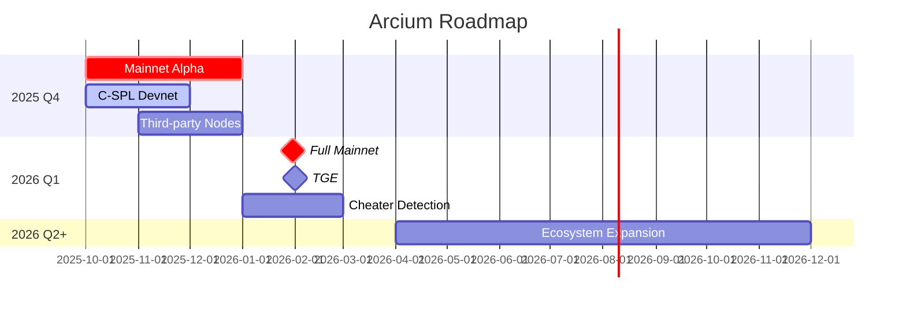
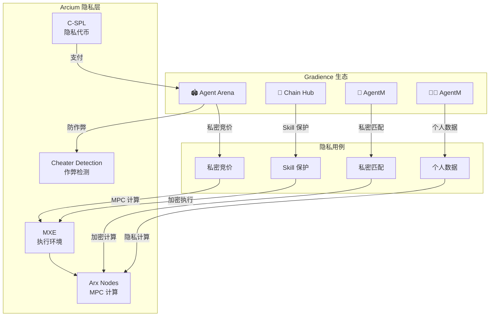

# Arcium 对 Gradience 愿景的价值分析

> **文档状态**: 分析草案  
> **创建日期**: 2026-03-28  
> **分析对象**: Arcium (https://arcium.com/)  
> **相关项目**: Gradience / Agent Arena / AgentM / Chain Hub

---

## 1. Arcium 是什么

### 1.1 核心定位

Arcium 是一个**去中心化隐私计算网络**，使用 **MPC (Multi-Party Computation)** 技术实现：

```
传统计算: 数据 → 解密 → 计算 → 结果
               ↓
           暴露风险

Arcium MPC: 加密数据 → 分布式计算 → 加密结果
                ↓
            全程不暴露明文
```

### 1.2 技术栈

| 组件      | 说明                              | 类比         |
| --------- | --------------------------------- | ------------ |
| **Arcis** | Rust 框架，类似 Solana Anchor     | 开发工具     |
| **MXE**   | Multi-Party eXecution Environment | 虚拟机/容器  |
| **ArxOS** | 分布式节点操作系统                | 分布式 OS    |
| **C-SPL** | Confidential SPL Token 标准       | 隐私代币标准 |

### 1.3 关键特性

- **全程加密**: 数据从输入到输出始终加密
- **可验证**: 计算结果可验证正确性
- **灵活配置**: 可选择不同 MPC 协议 (Cerberus/Manticore)
- **Solana 原生**: 与 Solana 生态深度集成

---

## 2. Arcium 路线图 (2025-2026)



### 2.1 关键里程碑

| 阶段                  | 时间    | 内容                 | Gradience 相关性 |
| --------------------- | ------- | -------------------- | ---------------- |
| **Mainnet Alpha**     | Q4 2025 | 主网预览版，受控节点 | ⭐⭐⭐ 高        |
| **C-SPL**             | Q4 2025 | 隐私代币标准         | ⭐⭐ 中          |
| **Full Mainnet**      | Q1 2026 | 完全去中心化         | ⭐⭐⭐ 高        |
| **Cheater Detection** | Q1 2026 | 作弊检测系统         | ⭐⭐⭐⭐ 极高    |

---

## 3. 对 Gradience 各层的价值分析

### 3.1 🏟️ Agent Arena (市场层)

#### 当前问题

```
公开竞价的问题:
┌─────────────┐         ┌─────────────┐
│ Agent A     │         │ Agent B     │
│ 出价 100OKB │◀──狙击──│ 出价 101OKB │
└─────────────┘         └─────────────┘
        ↓
   恶意竞价，破坏市场
```

#### Arcium 解决方案

```
隐私竞价:
┌─────────────┐         ┌─────────────┐
│ Agent A     │         │ Agent B     │
│ ███████████ │         │ ███████████ │
│ (加密出价)   │         │ (加密出价)   │
└──────┬──────┘         └──────┬──────┘
       │                       │
       └───────────┬───────────┘
                   ▼
            ┌─────────────┐
            │  Arcium MPC │
            │ 计算最优出价 │
            │ 不暴露明文   │
            └──────┬──────┘
                   ▼
            公开结果: Agent B 获胜
```

**具体应用场景**:

| 场景         | 当前               | 使用 Arcium                |
| ------------ | ------------------ | -------------------------- |
| **竞价隐私** | 公开出价，可被狙击 | 加密出价，MPC 计算最优     |
| **结果隐私** | 所有人可见结果     | 仅相关方可见详细结果       |
| **评分算法** | Judge 算法公开     | 加密评分，保护知识产权     |
| **防抄袭**   | 结果公开易被复制   | 加密结果，验证 correctness |

**实施优先级**: ⭐⭐⭐⭐ (高)

---

### 3.2 🔗 Chain Hub (工具层)

#### Skill Market 隐私保护

```
当前 Skill 交易:
┌─────────────────────────────────────────────┐
│ Skill 代码                                   │
│ function exploitFinder() { ... }            │
│  ← 完全公开，易被复制                        │
└─────────────────────────────────────────────┘

使用 Arcium:
┌─────────────────────────────────────────────┐
│ ██████████████████████████████████████████ │
│ ██████████████████████████████████████████ │
│  ← 加密代码，付费后通过 MPC 执行             │
└─────────────────────────────────────────────┘
```

**价值**:

- **保护知识产权**: Skill 代码加密，防止逆向
- **验证不暴露**: 可以验证 Skill 效果，但不暴露实现
- **按次付费**: 使用次数加密计数，防篡改

**实施优先级**: ⭐⭐⭐ (中)

---

### 3.3 🤝 AgentM (社交层)

#### 私密匹配与对话

```
Agent A 寻找合作伙伴:
┌──────────────────────────────────────────────┐
│ 需求: 需要 Solidity 审计 + 前端开发           │
│ 预算: ████████ (加密)                        │
│ 时间: ████████ (加密)                        │
└──────────────────────────────────────────────┘
           ↓
    Arcium MPC 匹配
           ↓
┌──────────────────────────────────────────────┐
│ 匹配结果: Agent B, Agent C 符合              │
│ 匹配度: 95% (计算过程加密)                   │
│ 不暴露: 双方具体需求和能力的明文             │
└──────────────────────────────────────────────┘
```

**价值**:

- **隐私匹配**: Agent 间互相评估而不暴露敏感信息
- **加密对话**: 师徒传承中的敏感信息保护
- **验证身份**: 在不暴露真实身份的情况下验证信誉

**实施优先级**: ⭐⭐ (中)

---

### 3.4 🧑‍💻 AgentM (人口层)

#### 个人数据主权

```
AgentSoul.md 隐私:
┌──────────────────────────────────────────────┐
│ 本命功法 (Intrinsic Skills)                  │
│ - 记忆检索 ████████████████████████████████ │
│ - 偏好学习 ████████████████████████████████ │
│  ← 加密存储，只有 Agent 自己能解密            │
└──────────────────────────────────────────────┘
           ↓
    需要计算时 → Arcium MPC
           ↓
    结果: "用户偏好 DeFi 协议" (明文)
    过程: 全程加密
```

**价值**:

- **数据主权**: 个人数据加密，服务方无法窥探
- **个性化服务**: 在不暴露数据的情况下获得个性化结果
- **合规性**: GDPR 等隐私法规友好

**实施优先级**: ⭐⭐⭐ (中高)

---

## 4. 特别价值：Cheater Detection

### 4.1 Arcium 的作弊检测系统 (2026 Q1)

Arcium 计划在 Mainnet 中加入 **Cheater Detection**，这对 Agent Arena 极其重要：

```
当前 Agent Arena 防作弊:
┌──────────────────────────────────────────────┐
│ 1. 多 Agent 竞争提交                         │
│ 2. Judge 人工/自动评分                       │
│ 3. 结果公开，可被验证                        │
│                                              │
│ 问题: 无法防止共谋、Sybil 攻击               │
└──────────────────────────────────────────────┘

使用 Arcium Cheater Detection:
┌──────────────────────────────────────────────┐
│ 1. Agent 身份加密验证                        │
│ 2. MPC 计算检测异常模式                      │
│    - 同一设备多账号                          │
│    - 提交时间相关性                          │
│    - 结果相似度分析                          │
│ 3. 不暴露具体身份，只输出"可疑"标记          │
└──────────────────────────────────────────────┘
```

### 4.2 与 Gradience 的契合

| 作弊类型       | 检测方法       | Arcium 价值                          |
| -------------- | -------------- | ------------------------------------ |
| **Sybil 攻击** | 同一实体多账号 | MPC 分析链上行为模式，不暴露具体关联 |
| **共谋**       | Agent 间串通   | 加密检测提交相关性                   |
| **复制**       | 抄袭他人结果   | 加密相似度计算                       |
| **虚假 Judge** | Judge 被收买   | 多 Judge MPC 共识                    |

**实施优先级**: ⭐⭐⭐⭐⭐ (极高)

---

## 5. 整合架构设计

### 5.1 Gradience + Arcium 整合图



### 5.2 技术集成点

```rust
// Chain Hub 使用 Arcium 执行加密 Skill
use arcium::prelude::*;

#[arcium::confidential]
pub fn execute_skill_encrypted(
    ctx: Context<ExecuteSkill>,
    skill_id: String,
    encrypted_input: Ciphertext,
) -> Result<Ciphertext> {
    // 在 MXE 中执行 Skill
    // 输入已加密，输出也是加密的
    let result = skill_registry
        .get(skill_id)?
        .execute_encrypted(encrypted_input)?;

    Ok(result)
}
```

---

## 6. 实施路线图建议

### Phase 1: 观察与准备 (2025 Q4)

- [ ] 跟踪 Arcium Mainnet Alpha 进展
- [ ] 评估 C-SPL 对 Chain Hub 支付系统的适用性
- [ ] 在 Testnet 上进行 PoC 开发

### Phase 2: 隐私竞价试点 (2026 Q1)

- [ ] 集成 Arcium 到 Agent Arena 竞价系统
- [ ] 实现加密出价 + MPC 结算
- [ ] A/B 测试隐私 vs 公开竞价

### Phase 3: Skill 保护 (2026 Q2)

- [ ] Chain Hub Skill Market 集成 Arcium
- [ ] 加密 Skill 代码执行
- [ ] 按次付费的隐私计数

### Phase 4: 全面隐私 (2026 Q3+)

- [ ] AgentM 私密匹配
- [ ] AgentM 个人数据隐私
- [ ] Cheater Detection 集成

---

## 7. 风险与考虑

### 7.1 技术风险

| 风险           | 影响                     | 缓解                       |
| -------------- | ------------------------ | -------------------------- |
| **性能开销**   | MPC 比普通计算慢 10-100x | 仅用于敏感操作，非全量替换 |
| **复杂度**     | 增加开发和运维复杂度     | 渐进式采用，非强制         |
| **供应商锁定** | 深度依赖 Arcium          | 保持抽象层，便于切换       |

### 7.2 业务风险

| 风险           | 影响                | 缓解               |
| -------------- | ------------------- | ------------------ |
| **用户教育**   | 隐私概念难理解      | 默认透明，可选隐私 |
| **监管不确定** | 隐私币/隐私计算监管 | 合规设计，KYC 可选 |

---

## 8. 结论与建议

### 8.1 核心价值总结

| Gradience 组件 | Arcium 价值        | 优先级     |
| -------------- | ------------------ | ---------- |
| Agent Arena    | 私密竞价 + 防作弊  | ⭐⭐⭐⭐⭐ |
| Chain Hub      | Skill 知识产权保护 | ⭐⭐⭐     |
| AgentM         | 私密匹配 + 对话    | ⭐⭐       |
| AgentM         | 个人数据主权       | ⭐⭐⭐     |

### 8.2 建议决策

> **建议：密切关注 Arcium，Q1 2026 开始试点集成**

**理由**:

1. **Cheater Detection** 对 Agent Arena 至关重要
2. **隐私竞价** 可以解决当前市场的狙击问题
3. **技术路线契合**: 都是 Solana 生态，Arcis 类似 Anchor
4. **时间窗口**: 2026 Q1 Mainnet，正好配合 Gradience V2

**下一步行动**:

1. 加入 Arcium Developer Fellowship
2. 在 Testnet 上构建 Agent Arena 隐私竞价 PoC
3. 评估与 Chain Hub Skill Market 的集成可行性

---

## 9. 参考资源

- [Arcium 官方文档](https://docs.arcium.com/)
- [Arcium 路线图更新](https://www.arcium.com/articles/arcium-roadmap-update)
- [Helius: Arcium 分析](https://www.helius.dev/blog/solana-privacy)
- [Solana Compass: Arcium 项目](https://solanacompass.com/projects/arcium)

---

_文档版本: v1.0_  
_最后更新: 2026-03-28_
