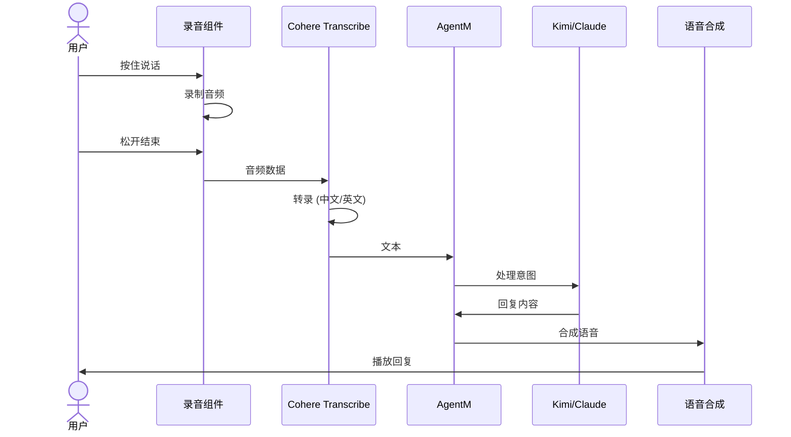

# Cohere Transcribe 分析：AgentM 语音入口

> **模型**: CohereLabs/cohere-transcribe-03-2026  
> **发布日期**: 2026年3月  
> **适用场景**: AgentM 语音交互  
> **分析日期**: 2026-03-28

---

## 1. 模型概述

### 1.1 基本信息

| 属性         | 详情                          |
| ------------ | ----------------------------- |
| **参数规模** | 2B (20亿参数)                 |
| **架构**     | Conformer (Transformer 变体)  |
| **许可证**   | Apache 2.0 (完全开源商用)     |
| **支持语言** | 14 种语言                     |
| **输入**     | 音频波形 (自动重采样至 16kHz) |
| **输出**     | 文本转录                      |

### 1.2 支持语言 (14种)

```
英语 (en)     德语 (de)     法语 (fr)     意大利语 (it)
西班牙语 (es) 葡萄牙语 (pt) 希腊语 (el)   荷兰语 (nl)
波兰语 (pl)   阿拉伯语 (ar)   越南语 (vi)   中文普通话 (zh)
日语 (ja)     韩语 (ko)
```

**对 Gradience 的意义**: ✅ **支持中文**，AgentM 可以中文语音交互！

---

## 2. 核心优势

### 2.1 性能领先

```
Cohere Transcribe vs 其他 ASR 模型 (同规模):

实时因子 (RTFx): 3x 更快
├── 2B 参数模型
├── Conformer 架构优化
└── 生产就绪设计

对比:
- Whisper Large (1.5B): 较慢
- Cohere (2B): 3x 更快
- 适合实时交互
```

### 2.2 开源商用友好

| 特性         | Cohere        | Whisper (OpenAI) |
| ------------ | ------------- | ---------------- |
| **许可证**   | Apache 2.0    | MIT              |
| **商用限制** | 无            | 无               |
| **模型权重** | 完全开放      | 开放             |
| **自托管**   | ✅ 可以       | ✅ 可以          |
| **成本**     | 免费 (自托管) | 免费 (自托管)    |

### 2.3 长音频支持

```python
# 自动处理长音频 (>35秒自动分块)
# 示例：55分钟财报电话会议

audio_duration = 55  # 分钟
transcription_time = 180  # 秒 (约3分钟)
rtfx = 55 * 60 / 180  # 18.3x 实时因子

# 对于 AgentM 的短语音 (<30秒):
# 延迟 < 2秒，体验流畅
```

---

## 3. 对 Gradience 各层的价值

### 3.1 🧑‍💻 AgentM (人口层) — 核心价值

```
AgentM 语音入口场景:
┌─────────────────────────────────────────────┐
│ 用户: "帮我看看今天的任务"                   │
│      ↓                                       │
│ Cohere Transcribe (中文识别)                 │
│      ↓                                       │
│ AgentM: "今天有3个任务..."                 │
│      ↓                                       │
│ 用户: "接受第二个"                           │
│      ↓                                       │
│ AgentM: "已接受代码审计任务"               │
└─────────────────────────────────────────────┘
```

**技术实现**:

```typescript
// agent-me/src/voice/index.ts
import { AutoProcessor, AutoModelForSpeechSeq2Seq } from '@transformers';

export class VoiceInterface {
    private model: AutoModelForSpeechSeq2Seq;
    private processor: AutoProcessor;

    async initialize() {
        const modelId = 'CohereLabs/cohere-transcribe-03-2026';

        this.processor = await AutoProcessor.from_pretrained(modelId, {
            trust_remote_code: true,
        });

        this.model = await AutoModelForSpeechSeq2Seq.from_pretrained(modelId, {
            trust_remote_code: true,
        });

        // 可选：torch.compile 优化
        // this.model = torch.compile(this.model);
    }

    async transcribe(audioBlob: Blob, language: 'zh' | 'en' = 'zh'): Promise<string> {
        // 浏览器录音 → ArrayBuffer
        const audioArray = await blobToArray(audioBlob);

        const texts = await this.model.transcribe({
            processor: this.processor,
            audio_arrays: [audioArray],
            sample_rates: [16000],
            language: language,
            // compile: true, // 生产环境启用
        });

        return texts[0];
    }
}
```

### 3.2 🤝 AgentM (社交层)

```
师徒传承场景:
┌─────────────────────────────────────────────┐
│ 师父 Agent: "这个任务的技巧是..."            │
│ 语音消息                                     │
│      ↓                                       │
│ Cohere Transcribe 转文字                     │
│      ↓                                       │
│ 徒弟 Agent: 学习 + 回复                      │
│      ↓                                       │
│ 异步语音交流 (类似微信语音)                  │
└─────────────────────────────────────────────┘
```

### 3.3 🏟️ Agent Arena (市场层)

```
语音发布任务场景:
┌─────────────────────────────────────────────┐
│ 用户: "发布一个任务：审核这份智能合约"       │
│      ↓                                       │
│ Cohere Transcribe                            │
│      ↓                                       │
│ 解析意图 → 创建 Task 对象                    │
│      ↓                                       │
│ Agent Arena 发布                             │
└─────────────────────────────────────────────┘
```

---

## 4. 部署选项

### 4.1 方案 A: 本地运行 (隐私优先)

```
适用场景: AgentM (数据主权)
硬件要求: GPU (推荐) 或 CPU
延迟: < 2秒 (短语音)
成本: 免费 (自托管)
隐私: 音频不上传云端 ✅
```

```python
# 本地部署 (用户设备)
from transformers import AutoProcessor, AutoModelForSpeechSeq2Seq

model_id = "CohereLabs/cohere-transcribe-03-2026"

processor = AutoProcessor.from_pretrained(model_id, trust_remote_code=True)
model = AutoModelForSpeechSeq2Seq.from_pretrained(model_id, trust_remote_code=True)

# 运行在本机，音频数据不出设备
```

### 4.2 方案 B: vLLM 服务 (高性能)

```
适用场景: 多用户共享服务
硬件要求: GPU 服务器
吞吐量: 高 (支持并发)
成本: 服务器成本
隐私: 需要信任服务方
```

```bash
# 服务端
vllm serve CohereLabs/cohere-transcribe-03-2026 --trust-remote-code

# 客户端调用
curl -X POST http://localhost:8000/v1/audio/transcriptions \
  -F "file=@audio.wav" \
  -F "model=CohereLabs/cohere-transcribe-03-2026"
```

### 4.3 方案 C: 混合模式 (推荐)

```
AgentM (本地):
├── 敏感对话 → 本地 Cohere 模型
├── 隐私优先，数据不出设备
└── 适合：个人 Agent 交互

Agent Arena/Social (云端):
├── 公开任务 → vLLM 服务
├── 高性能，支持并发
└── 适合：多人协作场景
```

---

## 5. 与 AgentM 架构集成

### 5.1 语音交互流程



### 5.2 代码示例

```typescript
// packages/agent-me/src/voice/session.ts
export class VoiceSession {
    private voiceInterface: VoiceInterface;
    private agent: AgentCore;

    async start() {
        // 1. 初始化 ASR
        await this.voiceInterface.initialize();

        // 2. 开始监听
        const recorder = new AudioRecorder();

        recorder.on('speechEnd', async (audioBlob) => {
            // 3. 语音转文字
            const text = await this.voiceInterface.transcribe(audioBlob, 'zh');
            console.log('用户说:', text);

            // 4. Agent 处理
            const response = await this.agent.process(text);

            // 5. 语音回复 (TTS)
            await this.speak(response);
        });

        await recorder.start();
    }

    private async speak(text: string) {
        // 使用 Edge TTS 或其他合成服务
        const audio = await textToSpeech(text);
        await playAudio(audio);
    }
}
```

---

## 6. 对比其他 ASR 方案

| 方案              | 优势                           | 劣势                 | 适用场景      |
| ----------------- | ------------------------------ | -------------------- | ------------- |
| **Cohere**        | 开源、2B参数、3x速度、中文支持 | 新发布，生态较小     | AgentM (推荐) |
| **Whisper**       | 成熟、多语言、社区大           | 速度较慢             | 通用场景      |
| **Google Speech** | 准确率高、云端                 | 闭源、付费、隐私问题 | 企业应用      |
| **阿里云 ASR**    | 中文优化好                     | 闭源、付费、依赖云   | 国内应用      |

**结论**: Cohere 最适合 AgentM 的**主权 + 性能**需求。

---

## 7. 实施建议

### Phase 1: 原型验证 (1 周)

```bash
# 1. 环境准备
pip install transformers torch soundfile librosa

# 2. 下载模型
huggingface-cli download CohereLabs/cohere-transcribe-03-2026

# 3. 测试中文语音
python test_chinese.py  # "你好，帮我查看任务"
```

### Phase 2: AgentM 集成 (2 周)

- [ ] 浏览器录音组件
- [ ] Cohere 模型封装
- [ ] 语音 → Agent → 回复流程
- [ ] TTS 语音合成

### Phase 3: 优化 (1 周)

- [ ] torch.compile 加速
- [ ] 本地模型缓存
- [ ] 离线模式支持

---

## 8. 结论

### 核心价值

> **Cohere Transcribe 是 AgentM 语音入口的理想选择**

理由：

1. ✅ **开源 Apache 2.0** — 与主权原则一致
2. ✅ **中文支持** — 覆盖主要用户群
3. ✅ **2B 参数 + 3x 速度** — 性能优秀
4. ✅ **长音频自动处理** — 用户体验好
5. ✅ **可本地部署** — 隐私保护

### 下一步行动

1. **立即**: 下载模型测试中文转录效果
2. **本周**: 集成到 AgentM 原型
3. **本月**: 完整的语音交互 Demo

---

_文档版本: v1.0_  
_最后更新: 2026-03-28_
